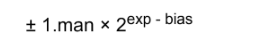

## 참고

- [컴퓨터사이언스...양태환](http://www.yes24.com/Product/goods/58552941)


## 목표

- 기본적인 컴퓨터의 구조,원리를 습득한다.
- 객체지향, 운영체제, 자료구조, 알고리즘에 대해 이해한다.
- Python, C에 대해 알아본다.


## 목록

[1. 변수](#1.-변수)

[2. 정수](#2.-정수)

[3. 실수](#3.-실수)

[4. 문자](#4.-문자와-문자열)


### 1. 변수

- 컴퓨터는 0,1로 이루어진 데이터를 처리. 

  0,1을 표현할 수 있는 데이터의 단위를 `비트(bit)` 

  bit가 8개 모이면? `byte` 

  1byte = 8 bit

#### 1.1 32비트, 64비트 컴퓨터?

- 데이터를 *한 번에 몇 개 보낼 수 있는 지* 에 대한 지표.

  즉 32비트는 비트가 이동하는 통로가 32개 32차선의 느낌

#### 1.2 우편번호

- 메모리 주소 한 개는 메모리에서 1바이트를 가리킴

  즉 우편 번호를 생각해보면 각 동을 가리키는 번호가 있듯이,

  1byte를 가르키는 **메모리 주소** 가 있음.

- 32비트 컴퓨터가 나타낼 수 있는 주소는 2^32(=4,294,967,296)개 =(4x1024x1024x1024 byte)

  1,024 = 1KB... 1024X1024X1024? 1GB

  즉 32비트로는 4GB까지 메모리를 가리킬 수 있다. 다시 말하면 32비트 컴퓨터에서는 4GB 보다 큰 메모리가 무용지물이다.


#### 1.3 변수의 의미

- 변수는 데이터를 저장할 수 있는 메모리 **공간**

  변수는 이름이 아니다. 메모리 공간 자체를 의미한다.

- `int num =5;`

  num이라는 변수에 5라는 값이 담겨있다.	


#### 1.4 파이썬에서 변수 : 이름,값 객체

- 일반적인 변수와는 조금 다르다(C...)

- 파이썬에서 쓰는 변수는 이름, 값 객체로 나뉘어짐.

- `num=5`

  이름? `num` 값? `5`

  num이라는 **이름** 은 5라는 **값 객체** 를 가리킴

  num은 5라는 값을 담고 있는 메모리 공간을 의미하지 않음(일반적인 변수)

  값 객체는 다른 메모리 공간에 있다.

  

### 2. 정수

#### 2.1 컴퓨터와 수

- 10진수 : 0,1,2,3,4,5,6,7,8,9
- 2진수 : 0,1
- 16진수 : 열개의 숫자( 0,1,2,3,4,5,6,7,8,9) + 6개 문자(a,b,c,d,e,f)


#### 2.2 10진수 to 2진수

- 해당 수를 **2의 거듭제곱의 합**으로 쪼개자

  25?

  16+8+1 = 2^4 + 2^3+ 2^0

  중간에 빈 지수는 0을 이용해 표현 : 1 x 2^4 + 1x 2^3 + 0 x 2^2 + 0 x 2^1 + 1 x 2^0

  11001

- `bin(25)` =0b11001 ..python

  0b는 2진수를 의미하는 binary


#### 2.3 2진수 to 10진수

- 11001 ? 43210 이 수를 지수로 바꿔 계산

#### 2.4 16진수 to 2진수

- 16진수는 0부터 15까지 표현할 수 있다.

  a,b,c,d,e,f 는 차례대로 10,11,12,13,14,15를 나타낸다.

- 16진수 한자리는 2진수 4자리까지 표현할 수 있음

  16진수 9 -> 2진수?

  1. 2^3 + 2^0
  2. 1 x  2^3 + 0 x 2^2 + 0 x 2^1 + 1 x 2^0
  3. 0b1001
  
- 2진수 0010 1101 을 16진수로 바꾸면 0x2d이다

- 8비트는 2진수로 표현하면 8자리수가 필요하지만, 16진수로 표현하면 2자리수 간단함

  그래서 메모리 주소를 나타낼 때는 **16진수**를 사용함

#### 2.5 양의 정수

- 컴퓨터는 정수를 1바이트,2바이트,4바이트, 8바이트등 다양한 크기로 저장함.

  <u>아래 설명은 1바이트 기준으로 설명됨</u>

- 양수 음수 부호를 나타내는 데 1비트 사용

- 맨 앞 비트 0이면? **양수**

  1이면? **음수**

- 즉 25를 메모리에 저장할 때, 양수이니까 맨 앞 비트가 0

  00011001

  8bit에 맨앞 0은 양수, 11001은 25를 2진수로 표현한 것, 그 앞 나머지 2자리는 비었으니 0으로 표시

- 1 바이트로 표현 할 수 있는 수의 크기는?

  -128~127

#### 2.6 음의 정수

- 컴퓨터는 음수를 보수 현태로 저장한다.

- **보수(complement)**

  보충해주는 수

  10진수에서 9의 보수를 구한다고 가정하자.

  3의 9의 보수는? 6

  26의 9의 보수는? 73

  

  10의 보수도 구해볼까?

  3의 10의 보수는? 7 (6+1)

  26의 10의 보수는? 74 (73+1)


​		123의 9의 보수는? 876

​		123의 10의 보수는? 877


- 2진수 1010의 1의 보수는?

  0101

  자세히 보면 각 자리 수의 1, 0을 반전한 결과

  1010의 2의 보수는?

  1010의 1의 보수가 0101이므로 여기에서 1을 더하면 됨. 즉 0110


- 음수의 표현

  -4는 어떻게 표현될까?

  1. 우선 2진수로 변환

     0000 0100 (1byte기준)

  2. 1의 보수를 우선 구한다.

     1111 1011

  3. 위의 수에 1을 더하면 2의 보수를 구할 수 있다.

     1111 1100

  즉 컴퓨터는 -4를 1111 1100이라 표현한다.

  이를 메모리에는 16진수로 저장하니, **0xFC**로 저장됨을 알 수 있다


- 그럼 왜? 컴퓨터는 음수를 2의 보수로 저장할까?

  0000 0000 -> +0

  1000 0000 -> - 0

  1. 0을 표현하는 방법이 두가지. 즉 비트 하나를 낭비하는 셈

  2. 컴퓨터는 정수의 뺄셈에서 2의 보수 개념을 활용함.

     0000 1001 - +9

     1111 1100 - -4

     더하면

     10000 0101

     맨 앞 1은 받아올림수이니까 없앰

     0000 0101 - +5

     잘 계산되었음

     즉 컴퓨터 연산의 원활함을 위하여? 인듯함

  

### 3. 실수

```PYTHON
a = 0.01
result = 0.0
for i in range(100):
    result += a
```

- 100 나오길 기대하지만 실제로 계산하면..
- 1.0000000000000007
- 1의 가까운 수지만 1은 확실히 아님.


```python
a = 0.015625
result = 0.0
for i in range(100):
    result += a
```

- 반면 이 과정은 1.5625가 나온다

- 왜?

  

#### 3.1 부동소수점

- 실수는 ANSI/IEEE 754-1985라는 표준에 따라 표현된다.

- 이 표현법을 `부동소수점(floating-point)` 라 부른다.

- 부?는 붕붕 떠다닌다는 뜻

  왜?

  123.456은

  1.23456 x 10^2 

  12.3456 x 10

  1234.56 x 10^-1

  소수점이 *떠다니는* 것 같다. 앞,뒤로 있으니까.


- 단정도, 배정도

  부동소수점의 종류

  **단정도**는 실수를 <u>32비트(4바이트)</u>로 표현하며, **부호 1비트, 지수부 8비트, 가수부 32비트**로 구성

  **배정도**는 실수를 <u>64비트(8바이트)</u>로 표현하며 **부호 1비트, 지수부 11비트, 가수부 52비트**로 구성

  실수를 포현하는데 배정도는 단정보보다 2배 많은 만큼, **정밀도** 가 높다.

  파이썬은 **배정도**를 사용

```python
import sys
sys.float info

sys.float_info(max=1.7976931348623157e+308, max_exp=1024, max_10_exp=308, min=2.2250738585072014e-308, min_exp=-1021, min_10_exp=-307, dig=15, mant_dig=53, epsilon=2.220446049250313e-16, radix=2, rounds=1)
```


- 7.75를 1바이트 부동소수점으로 표현해보자

  

  1. 10진수 실수를 2진수 실수로 바꾸자

     **111.11**

  2. 정규화(normalization)

     소수점 왼쪽에 위치한 가수 부분을, 밑수보다 작은 자연수가 되도록 만드는 것.

     예를 들면 10진수 567.89 - 정규화 - 밑수(10)이므로, 5.6789 x 10^2

     즉 2진수의 밑수는 2.. 2보다 작은 자연수는 1

     **1.1111 x 2^2**

  3. 메모리 구조

      1바이트 부동소수점

     0 | 0000 |  000

     부호 | 지수부 | 가수부

     부호 : 0이면 양수, 1이면 음수

     지수부 : exp값 

     가수부 : man값

     bias : 지수의 부호를 결정하는 데 사용 2^n-1 - 1, n에는 지수부의 비트(4)를 넣는다 = 7

     1.1111 x 2^2  지수 2 = exp-bias . exp=9

     0 | 1001 | 111 = 0x4f

     (가수부는 3비트이니까, 마지막 1생략.. ㅠㅠ)
     
     **실수 7.75는 1바이트 부동소수점으로 나타내면 0x4f이다**

- 1바이트 부동소수점의 표현범위

  지수부가 0001일때

  *cf 지수부 비트가 모두 0일때(2^-7) , 모두 1일때(2^8)은 0.0 정규화 불가능, 무한대 , NaN*

  가장 작은 수 = 1.000 x 2^-6 = 0.015625

  가장 큰 수 = 1.111 x 2^7 = 240

  
  
- 1바이트 부동소수점의 정밀도

  가수부 담을 공간 부족했음.

  즉 0x4f는 7.75를 완벽하게 표현하지 못함


#### 3.2 정밀도에 대한 고찰

- 엡실론

  1.0과 그 다음으로 표현 가능 수 사이의 차이

```python
sys.float_info.epsilon
#2.220446049250313e-16
```


- 엡실론과 정밀도

  어떤 실수가 있을 때, 엡실론을 이용하면 그 실수 다음에 표현할 수 있는 수를 알아낼 수 있다.

  배정도 실수 9.25는 부동소수점으로 1.00101 x 2^3

  지수 부분만 떼어, 엡실론을 곱하면 이 실수와 다음 표현 가능 수 사이의 차이를 구할 수 있음.

  ```python
  ep = sys.float_info.epsilon
  a = 9.25
  diff = (2**3)*ep
  diff #1.7763568394002505e-15
  b = a + diff
  b # 9.250000000000002
  ```

  1. 1.7763568394002505e-15는 지수부분 2^3과 엡실론을 곱한 값, 9.25 와 그 다음 표현 가능 수 사이의 차이
  2. b는 9.25다음에 표현 가능한 수


- 9.25에 `diff` 보다 작은 수를 더하면?

  ```python
  half_diff = diff/2 
  half_diff # 8.881784197001252e-16
  c = a+ half_diff
  a == c # true
  ```

  `diff` 보다 작은 수는 부동소수점 방식에서 표현할 수 없음. 즉 정밀도가 떨어짐 왜? 무언가를 더하긴 했지만 코드 상으로 `true` 로 찍히니까

  다른 예를 들어 얘기하면

  2^53 다음에 표현 가능한 수의 차이는 2^53 *ep = 2.0

  <u>a에 1.0을 더한 값과 a를 비교해도 그 차이를 못 알아차릴 것을 알 수 있음</u>

  

- 다시 생각해보자면

  0.01을 100번 반복해서 더했는데 1이 나오지 않는 이유는?

  수학적으로 실수는 무한대, 이 실수를 표현하기 위해 근사값으로 표현하고,

  1.0 vs 0.01을 100번 반복해서 더한 값의 차이가 엡실론 보다 큰 것이고 그래서 같지 않은것이고

  엡실론보다 작으면 python에서는 같은 값이라 생각할 것이겠지

  즉 **실수를 비교할 때는 조심해야겠다**

### 4. 문자와 문자열

#### 4.1 아스키코드


- 0~127까지 총 128개 코드 포인트에 128 문자가 **매핑** 되어있음

- 최대 7비트가 필요. 왜? 2^7 = 128

- `int` 자료형은 32비트(4바이트)

  `short` 자료형은 16비트(2바이트) 

  이 둘의 자료형으로 아스키 코드를 표현하면 낭비임. 왜? 아스키 코드는 7비트만 가지고 표현 할 수 있으니까.

  그래서 `char` 자료형을 만듬. 작은 수를 표현하기 위해


#### 4.2 유니코드


- 아스키코드(7비트) 한계를 뛰어넘기 위해, **16비트**(유니코드)로 확장
- 16비트를 통해 65,536개 문자를 표현
- 가? AC00


- **유니코드 인코딩 방식**

  옥텟(octet) : 데이터 단위 , 8비트를 의미

  유니코드는 2바이트로 숫자 하나에 문자 하나를 대응하여 문자를 표현

  ```python
  ch = '가'
  ch.encode()
  #b'\xea\xb0\x80'
  ch.encode('utf-8')
  #b'\xea\xb0\x80'
  ch.encode('utf-16')
  #b'\xff\xfe\x00\xac'
  ch.encode('utf-32')
  #b'\xff\xfe\x00\x00\x00\xac\x00\x00'
  ```

  파이썬 기본 encode값은 utf-8임.


#### 4.3 UTF-8

- 유니코드 문자 하나를 1바이트 ~ 4바이트 사이에서 표현

- 가변 길이 인코딩 방식

  왜? 문자에 따라 바이트 수가 달라지니까

  유니코드 포인트 범위에 따라 저장 범위가 달라짐

  U+0000~U+007F 1바이트

  U+0080~U+07FF 2바이트

  U+0800~U+FFFF 3바이트

  나머지 4바이트로 표현됨

  1. 코드 포인트를 2진수로 변환
  2. 포멧에 맞게 재배치
  3. 포멧에 채움


#### 4.4 UTF-16

- 문자 하나를 2바이트 단위로 표현
- 기본 다국어이면 **2바이트**로 인코딩, 그렇지 않으면 **4바이트**로 인코팅


#### 4.5 UTF-32

- 모든 문자를 4바이트로 표현
- 기본 다국어 평면의 문자 뿐만 아니라, 모든 평면에 있는 문자를 한 개 단위로 담을 수 있음.


#### 4.6 파이썬 문자열의 특징

- 파이썬의 문자열은 요소를 변경할 수 없음

  ```PYTHON
  string = "abcde"
  string[2] = "a"
  #변경 불가
  ```

- 변경하려면? 내장함수 `replace()` 를 사용

  ```python
  new_string = string.replace('c','x')
  #string은 변경되지 않았음
  ```

  

### 5. 함수

#### 5.1 전역,지역변수

- 전역변수 : 전체 영역에서 접근할 수 있는 변수

- 지역변수 : 전역 변수와 반대 개념. 즉 특정 지역에서만 접근할 수 있는 변수. 여기서 특정 지역은 함수 내부를 의미함.

  **따라서 함수 안에서 선언한 변수가 지역 변수**

- 지역 변수는 *함수 바깥에서는 접근할 수 없고*, 함수가 호출 될 때, 생성되었다가 *호출이 끝나면 사라짐*.

- 그러면 함수 안에서 전역변수를 변경시키려면 어떻게 해야할까?

  `global` 선언해줘야함.

  ```python
  g_var = 10
  def func():
      global g_var #여기서 전역 변수를 함수 안에서 사용하겠다고 명시함
      g_var = 20 #지역 변수를 선언한 것이 아닌, 전역변수를 변경하는 것을 의미
      
  if __name__=="__main__":
      print("g_var : {} before".format(g_var))
      func()
      print("g_var : {} after".format(g_var))
  ```

#### 5.2 nonlocal

```python
a = 1

def outer():
    b=2
    c=3
    print(a,b,c) #123
    def inner():
        d=4
        e=5
        print(a,b,c,d,e) #12345
    inner()

if__name__="__main__":
    outer()
```

- inner()함수 에서는 전역 변수 뿐만 아니라, outer() 함수 안에 있는 **지역** 변수에게도 접근할 수 있음 
- 그런데 inner()함수 안에서 b,c를 바꾸려 하면, outer()함수 안에 있는 지역 변수를 바꾸는 것이 아닌, 새로운 지역 변수를 생성함. 어떻게 바꿀까?


- **nonlocal 키워드 사용**

```python
def outer():
    a=2
    b=3
    
    def inner():
        nonlocal a
        a = 100        
    inner()
```

- 지역변수가 아님을 선언해서, a는 2에서 100으로 바뀜


#### 5.3 값에 의한 전달(Call by value)

- 함수가 호출 될 때, 메모리에 **'스택 프레임'** 이 생김. 

  스택과 같은 역할 FILO

  스택 프레임은 함수의 메모리 공간. 즉 지역 변수가 존재하는 영역

- 인자를 전달 할때, 값을 복사해 전달하는 경우 = **Call by Value**

- 어느 메모리 공간에 있는지 중요하다.


#### 5.4 참조에 의한 전달(Call by reference)

- 데이터를 저장하고 있는 공간 중 주소값을 전달하는 것
- *인자로 변수의 참조를 전달하는 방식*


#### 5.4 객체 참조(파이썬) 변경 불가능한 객체를 전달할때

```python
def change_value(x, value):
    x =value
	print("x: {} in change_value".format(x)) 
if__name__="__main__":
    x =10
    change_value(x,20) #20
    print("x: {} in main".format(x)) #10
```


- 파이썬 변수는 C 언어 처럼 변수라는 메모리 공간에 값을 직접 저장하지 않는다.

- 상수 객체는 변경 불가능한 객체.

  즉 변수 이름이 가리키는 메모리 공간 값을 바꾸는 것이 나리, 바꾸고자 하는 상수 객체를 참조하게 만드는 것이 핵심


- **레퍼런스 카운트**

  파이썬은 카운팅으로 garbage collection을 구현함

  a라는 변수가 10이라는 상수 객체를 가리키면, 10의 레퍼런스 **카운트는 1**

  b라는 변수도 가리키면, **카운트는 2**

  a,b가 다른 상수 객체를 가리키도록 수정하면,

  상수 객체 10은 **레퍼런스 카운트가 0이 되고** 메모리(heap)에서 해제됨

  `getrefcount()`함수를 이용해 레퍼런스 카운트를 확인할 수 있음.

  하지만 함수 실행에 의한 카운팅을 빼야하므로, 출력값에 1을 빼면 실제 레퍼런스 값이 나올 것.


#### 5.5 객체 참조(파이썬) 변경 가능한 객체를 전달 할때

```python
def fun(li):
    li[0] = ['hi']
    
if__name__="__main__":
    li = [1,2,3,4]
    func(li)
    print(li) #['hi',2,3,4] 바뀜
    
def fun(li):
    li = ['hi',2,3,4]
    
if__name__="__main__":
    li = [1,2,3,4]
    func(li)
    print(li) #[1,2,3,4] 안바뀜
```

- 첫번째 것은 참조된 리스트에 접근해서 변경을 시도했다는 것

  즉 모두 같은 메모리 공간 [, , , ,]을 참조하고 있음
  
- 두번째 것은 다른 메모리 공간에 새로운 리스트를 서로 만들었음

  함수 호출이 끝나면 새로 만들어진 리스트는 삭제됨.


### 6. 객체 지향 프로그래밍

### 7. 클래스

### 8. CPU

### 9. 메모리

### 10. 프로세스와 스레드

### 11. 프로그래밍 언어

### 12. 자료구조1

### 13. 자료구조2

### 14. 이진 탐색 트리

### 15. 알고리즘

