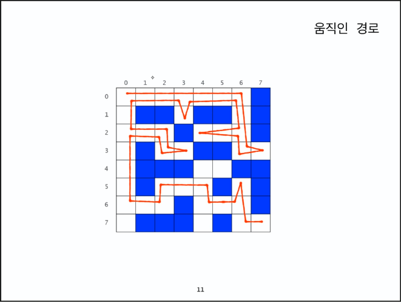
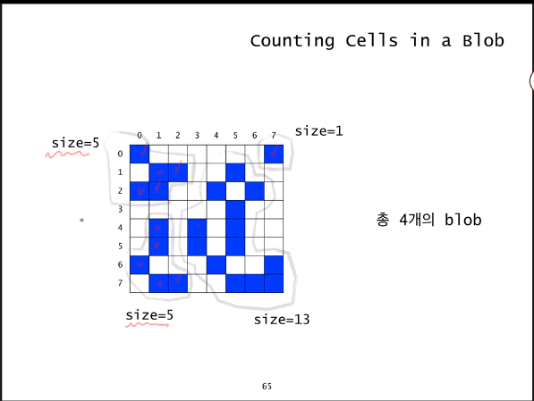

# Recursion

- 참고
  - Java로
  - [Youtube_강의](<https://www.youtube.com/watch?v=ln7AfppN7mY&list=PL52K_8WQO5oUuH06MLOrah4h05TZ4n38l&index=2&t=85s>)
  - 하루 1강씩..


### 1.1 Recursion 순환

- 항상 무한루프에 빠지진 않는다.
  - 왜? 적절한 제한문을 주면 됨.

```java
public static void func(int k){
    if(k<=0)//base case
        return;
    else{
        System.out.println("Hello!");
        func(k-1);// Recursive case
    }
}
```

- 어떤 적절한 제한문을 줘야할까?
  1. **Base Case** : 적어도 하나의 recursion에 빠지지 않는 경우가 있어야하고,
  2. **Recursive case**: 진행되면 진행될수록 **Base Case**에 가까워져야함


```java
public staic int Main(String [] args){
    int result = func(4);
    
}
public static int func(int n){
    if(n==0)//base case
        return 0;
    else{
        return n+func(k-1);// Recursive case 4+f(3)=3+f(2)=2+f(1)=1+f(0)=0 전체 10도출
    }
}

//즉 n =4를 넣어줬다는 의미는 0~4까지의 합을 구한 것이라 볼수 있음
//다시 생각하면 0~n까지의 합을 구할 수 있겠네? 순환을 이용해서?
```

- 이건 *수학적 귀납법* 과 완전히 동일하다?
  - 왜?
    1. basecase가 성립하고
    2. 임의의 양의 정수 k가 n<k인 경우에, 0~n까지 합은 올바르게 계산하여 반환한다고 가정하면
    3. n=k인 경우에도 성립한다.
- `func(n)` 함수는 음이아는 정수 n에 대해서, 0~n까지 합을 계산하는 함수이다.


#### **Q1) Factorial을 recursion을 통해서 만들어보자.**

1. 0! =1 -- basecase
2. n! = n*(n-1)! 단! n>0일떄 -- 2번 조건식이 성립한다면
3. n=k 인경우에도 성립함.


```java
public static int Main(String [] args){
    int result = factorial(10);
}
public static int factorial(int n){
    if(n==0) //basecase
        return 1;
	else
    	return n*factorial(n-1);//recursive case
}
```

- 수학적 귀납법

  1. n=0이면 1을반환하고 이건 맞지

  2. 임의의 양의 정수 k에 대해서, n <K 에 대해 n!을 올바르게 계산한다면

  3. n=k인 경우에, `factorial(k-1)`을 먼저 호출하는데, 이게 올바르게 계산됨. 따라서 메서드인 `factorial(k)`는 `k*(k-1)!`를 반환하게됨.

     

#### **Q2) X^n을 계산하는 함수를 만들어보자**

1. X^0 = 1
2. X^n = x*x^n-1 (n은 음이아닌 정수)
3. n=k일때도 성립함.


```java
public static double Main(String [] args){
    int result = power(5);
}
public static dobule power(double n, int k){
    if(n==0) //basecase
        return 1;
	else
    	return n*power(k-1);//recursive case
}

```


#### **Q3) fibonacci Number을 계산하는함수는??**

1. f0 = 0
2. f1 = 1
3. fn = fn-1 + fn-2


```java
public static int Main(String [] args){
    int result = fibonacci(5);
}
public static int fibonacci(int k){
//    if(k==0) 
//        return 0;
//    if(k==1)
//        return 1; 안써도 되네,..ㅠㅠ
    if(k<2)
        return n; //basecase
	else
    	return fibonacci(k-1)+fibonacci(k-2);//recursive case
}
```


**Q4) 최대공약수 : Euclid method**

- 바로 감이 안왔음 어떻게? 순환을 이용해서?

```
m>=n인 두 양수 m과 n에 대해서 m이 n이 배수라면 gcd(m,n)=n이고,
그렇지 않으면 gcd(m,n) = gcd(n,m%n) 이다..
```

```java
public static int gcd(int m , int n){
    if(m<n){
        int tmp = m; m =n; n =temp; //swap m and n 왜? 저 공식 자체가 m>=n이므로
    }
    if(m%n==0) //즉 m을 n으로 나눠서 나머지가 없다면, m이 n의 배수라면
        return n;
    else
        return gcd(n,m%n);
}
```

- 좀 더 단순히...

```
gcd(p,g) =..
if q =0 //둘중하나가 0이면, 최대공약수는 p이고 그렇지 않다면
gcd(q,p%q)
이 정리에서는 p가 반드시 q보다 클 필요는 없다!
```

```java
public static int gcd(int m , int n){
    if(q==0) 
        return p;
    else
        return gcd(q,p%q); //무한루프에 빠지지 않을까?
}
```


### 1.2 Recursive thinking

- `for`, `while` 문으로 해결해야할것은 **순환** 을 통해서.. 해결해보자


#### **Q1 문자열 길이계산**

1. 일반적으로는 세면 되겠음.  앞에서 하나씩 카운트해 나간다.
2. 첫번째 문자열을 뺀 나머지 문자열의 길이를 구한 다음에, 1을 더하면 된다.

```JAVA
public static int length(String str){
    if(str.equals(""))
        return 0;
    else
        return 1+length(str.substring(1));
}
```

- 정의된 2번 방식을 `java` 코드를 통해 표현한것.


#### **Q2 문자열을 차례대로 출력**

```java
public static void printChars(String str){
    if(str.length() == 0)
        return;
    else{
        System.out.print(str.charAt(0));
        printChars(str.substring(1)); //substring(1) 첫글자를 제외한 나머지 문자 recursion으로 다시 돌아가고 있음 문자열 하나하나씩 출력되겠네?
    }
}
```


#### **Q3 문자열을 뒤집어서 출력**

1. 먼저 첫번째 문자열을 제외한 나머지를 뒤집어서 프린트 한후에,
2. 첫번째 문자열을 프린트하면 되겠네
3. 어떻게 순환을 통해서??

```java
public static void printCharsReverse(String str){
    if(str.length() == 0)
        return;
    else{ // 문자열의 길이가 1이상이라면
        printCharsReverse(str.substring(1));
        System.out.print(str.charAt(0));
    }
}
```


#### **Q4 정수를 2진수로 출력하는 방법**

- 이진수에서 마지막비트가 0이라는 것은 짝수
  - 1이라는 것은 홀수.

- 맨마지막 비트를 제외한 나머지 앞에 부분은 **2로 나눈 몫**과 같다.

```java
public void printInBinary(int n){
    if(n<2)
        System.out.print(n);
    else{
        printInBinary(n/2);
        System.out.print(n%2);
    }
}
```

- 와우 대단히 신기 :)


####  Q5) 배열의 합 구하기

- 일반적으로는 `for` 문을 돌려서 구함.

- n개의 배열이 들어올때, 배열의 합 구하기
- *data[0] 에서 data[n-1]까지 합을 구하여 변환*

```java
public static int sum(int n, int[] data){
    if(n<=0) //base case
        return 0;
    else{
        return sum(n-1, data) + data[n-1];
            //n-2까지 합을 구한다음에, n-1값을 더하면 0~n-1까지의 합
    }
    
}
```

​	1. 우선 `data[0] + data[n-1]` 까지의 합을 구한 후 마지막 데이터를 더해주면 된다.

​	2. 배열의 index는 0부터 시작함


#### 06) 데이터 파일로부터 n개의 정수 읽어오기

- Scanner in이 참조하는 파일로 부터 n개의 정수를 입력받아서, 배열 data에 저장함
- data[0] ~ data[n-1]까지 저장

```java
public void readFrom(int n, int[] data, Scanner in){
    if(n==0)
        return;
    else{
        return readFrom(n-1, data, in);//0~n-2까지 받아오고
        data[n-1] = in.nextInt(); //n-1번째는 여기서 받아오고        
    }
}
```


#### 07) Recursion vs Iteration

- 모든 순환함수는 반복문으로 변경가능하고
- 그 역인 *모든 반복문은 순환함수로 변경가능*


### 1.3 Designing Recursion

* 적어도 하나의 `base case` 가 있어야함. 즉 순환되지 않고 직접적으로 종료되는 케이스가 있어야함. 

  없으면? 무한루프!

* 모든 case는 결국 `base case` 에 수렴되어야함.

- Implicit 암시적 -> explicit 명시적인 매개변수를 사용해라

#### 순차검색을 순환으로

- 데이터들이 정렬되어 있지 않는다, 
- 데이터들에 대해서 특별한 조건이 없다.
- 그 배열안에 원하는 조건이 있는지 없는지 찾는 것은 하나하나 보는 수밖에 없음.
- <u>즉 순차적으로 보다가, 있으면 ok 없으면 원래 없는 것으로 판단하는 것</u>

```java
int search(int []data, int n, int target){
    for(int i =0; i < n; i++)
       	if(data[i] == target)
            return i;
    return -1;
}
```

- data[0] ~ data[n-1] 사이에서 target변수가 있는지 확인함.
- 명시적으로 표현되었는 가?
  - `int n` 을 통해서 [0, n-1]까지 data배열에서 찾는 다는 점에서 명시적으로 표현되었다고 보여지지만
  - 인덱스 0은? 아마 시작지점이 0부터 겠지 라고 생각함. 암시적인 매개변수
  - 그렇지만 `recursion` 으로 프로그래밍할 떄는 일반적으로 **위와 같이** 하면 안좋음

```java
int search(int []data, int begin,int end, int target){
	if(begin > end)
        return -1;
    else if(taget ==data[begin])
        return begin;
    else
        return search(data, begin+1, end, target);
}

int search(int []data, int begin,int end, int target){
	if(begin > end)
        return -1;
    else if(taget ==data[end])
        return begin;
    else
        return search(data, begin, end-1, target);
}
```

- **시작점, 끝날 지점을 명시적으로 표현되었음**
- 자기자신이 자기자신을 호출할때 어떻게 될 것인지의 매개변수까지 생각해야함
  - 만약` search(data, 0, n-1, target)`  으로 순환함수를 만들어 호출한다면, 위의 `for`  문과 똑같은 역할을 함.

```java
int search(int []data, int begin,int end, int target){
	if(begin > end)
        return -1;
    else{
        int middle = (begin+end)/2;
        if(data[middle] = target)
            return middle;
        int index = search(data, begin, middle-1,target);
        if(index 1= 1)
            return index;
        else
            return search(data,middle+1, end,target);
    }

}
```

- 반으로 나눠서 좌즉은 작아지면서, 우측은 커지면서 찾는 것.


#### Q)1 배열의 최대값 찾기(매개변수 명시화)

- 첫번째 배열을 제외한 나머지 배열들 중에서의 최대값과, 첫번재 배열의 값과 비교해서 더 큰 값이 그 배열의 최대값이다 라는 컨셉을 이용

```JAVA
int findMax(int [] data, int begin, int end){
	if(begin==end) //데이터 갯수가 1개일때, base case
        return data[begin];
    else
        return Math.max(data[begin], findMax(data, begin+1, end));
    //데이터 구간이 계속 바뀜. begin이 계속 +1씩 증가하니까.
}
```

```java
int findMax(int [] data, int begin, int end){
	if(begin==end) 
        return data[begin];
    else
        int middle = (beign+end)/2;
    	int max1 = findMax(data,begin, middle);
    	int max2 = findMax(data,middle, end);
        return Math.max(max1, max2);

}
```


#### Binaray Search 이진검색

- 이진검색을 순환으로.
- 이진검색?
  - 데이터가 크기 순으로 정리되어서 배열로 저장되어있을 때 사용할 수 있는 방법


```java
public static int binarySearch(String[] items, String target, int begin, int end){
    if(begin > end ) //데이터의 갯수가 0인 경우 정의
        return -1;
    else{
        int middle = (begin+end)/2;
        int comResult = target.compareTo(items[middle]); //중간값과 비교하자
        if(compareTo == 0) //딱 맞다면
            return middle;
        else if(compareTo <0)// middle의 왼쪽에 target이 있다는 말이니까
            return binarySearch(data,target,begin,middle-1);//중간값에서 하나씩 줄여가면서 찾고
        else//그게 아니라면 middle값 오른쪽에 있다는 말이니까.
            return binarySearch(data,target,middle+1,end); //중간값에서 하나씩늘려가면서 찾으면 되겠네
    }
}
```

- `String` 이 사용할 수 있는 `compareTo` 에 대해서 알아보자


### 2.1 미로찾기

현재에서 출구까지 경로가 있으려면?

	1. 현재 내가 있는 위치가 출구거나 혹은 //base case
 	2. 동서남북 이웃한 셀들중 하나에서 현재 위치를 지나지 않고, 출구까지 가는 경로가 있거나 //recursive case

#### Q) Decision problem

- 출구까지 가는 경로가 있느냐? 없느냐? true or false

```java
boolean findPath(x,y){
    if(x,y) is the exit
        return true;
    else
         mark (x,y) as a visited cell; //방문한 위치 표시
         for each neighbouring cell (x`,y`) of (x,y) do
             if(x`,y`) is on the pathway and not visited //방문한 위치는 다시 방문하지 않는다.
                 if findPath(x`,y`)
                     return true;
    	return false
}
//recursion은 더 많아지지만, 코드는 간단해짐
boolean findPath(x,y){
    if(x,y) is either on the wall or visited cell
        return false;
    elseif (x,y) is the exit
        return true;
    else
         mark (x,y) as a visited cell; 
         for each neighbouring cell (x`,y`) of (x,y) do            
                 if findPath(x`,y`) //최대 4번 호출
                     return true;
    
}
```

- 반드시 무한루프에 빠지지 않는지 확인하라.	
  - 두 셀을 무한히 왔다갔다하는 일이 벌어질 수 있음.

```java
// N*N 메이즈에서
//변수 설정
private static final int PATHWAY_COLOR =0;
private static final int WALL_COLOR = 1;
private static final int BLOCKED_COLOR = 2;
private static final int PATH_COLOR = 3;

public static boolean findMazePath(int x, int y){
    if(x<0 || y<0 || x>=N || y>=N)
        return false; //유효범위 체크 0~N-1
    else if(maze[x][y] != PATHWAY_COLOR)
        return false;
    else if(x==N-1 && y==N-1){
        maze[x][y] = PATH_COLOR;
    	return true;
    }
    else {
        maze[x][y] =PATH_COLOR;
        if(findMazePath(x-1,y) || findMazePath(x,y+1) || findMazePath(x+1,y) || findMazePath(x,y-1)){ //복동남서
            return true;
        }
        maze[x][y] = BLOCKED_COLOR;
        return false;
    }
}
```




### 2.2 Counting Cells in a Blob

- Binary 이미지
- 서로 연결된 image pixel(파란색)들의 집합을 blob이라 부름
- 상하좌우, 대각방향도 연결된 것이라 생각함



- 입력?

  N X N 2차원 그리다

  하나의 좌표(X,Y)

- 결과?

  입력이 속한 blob의 크기를 카운트하려면?


1. 현재 픽셀이 image color가 아니라면 return 0 //base case

2. 현재 픽셀이 image color라면

   2.1 현재 픽셀을 카운트하고 (count = 1)

   2.2 현재 픽셀이 중복카운트 하는 것을 방지하기 위해서 다른 색으로 칠하고

   2.3 현재 픽셀에서 인접한 모든 픽셀(8개) 에 대해서 

   ​		그 픽셀이 속한 blob의 크기를 카운트 해서 count에 더해주고

   ​		count를 반환한다.

   

#### sudo

```java
if the pixel (x,y) is outside the grid
	the result is 0;
else if pixel (x,y) is not an image pixee or already counted
	the result is 0;
else
    set the colour of the pixel (x,y) to a red colour; //카운트 되었음을 표시
	the result is 1 plus the number of cells in each piece of the blob that
	includes a nearest neighbour;
```


#### java

```java
private static final int BACKGROUND_COLOR =0;
private static final int IMAGE_COLOR = 1;
private static final int ALREADY_COUNTED = 2;

public int countCells(int x, int y){
    if(x<0 || y<0 || x>=N || y>=N) //유효성 체크
        return 0;
    else if(grid[x][y] != IMAGE_COLOR)
        return 0;
    else{
        grid[x][y] = ALREADY_COUNT;
        return 1 + countCells(x-1)(y+1) + countCells(x,y+1)+ countCells(x+1,y+1) + countCells(x-1,y)  + countCells(x+1,y) + CountCells(x-1,y-1) + CountCells(x,y-1) + countCells(x+1,y-1);//인접한 8개의 좌표
    }
}
```


#### quiz

```java
public class CountCells {
 public static int N = 8;
 public static int grid[][] = {
  {1, 0, 0, 0, 0, 0, 0, 1},
  {0, 1, 1, 0, 0, 1, 0, 0},
  {1, 1, 0, 0, 1, 0, 1, 0},
  {0, 0, 0, 0, 0, 1, 0, 0},
  {0, 1, 0, 1, 0, 1, 0, 0},
  {0, 1, 0, 1, 0, 1, 0, 0},
  {1, 0, 0, 0, 1, 0, 0, 1},
  {0, 1, 1, 0, 0, 1, 1, 1}   
 };
 
 private static int BACKGROUND_COLOR=0;
 private static int IMAGE_COLOR =1;
 private static int ALREADY_COUNTED =2;
 
 public static int countCells(int x, int y){
  if(x<0 || x>=N || y<0 || y>=N){
   return 0;
  }else if (grid[x][y] != IMAGE_COLOR){
   return 0;
  }else{ //grid[x][y] = IMAGE_COLOR
   grid[x][y] = ALREADY_COUNTED;
   return (1 + countCells(x-1, y+1) + countCells (x, y+1) +
      countCells(x+1, y+1) + countCells(x-1, y)+
     countCells(x+1, y) + countCells(x+1, y-1) +
     countCells(x, y-1) + countCells(x-1, y-1));
  }
 }
 
 public static void printGrid(int n, int[][]grid){
  for(int i=0; i<n; i++){
   for(int j=0; j<n; j++){
    System.out.print(grid[i][j]);
   }
   System.out.println("");
  }
 }
 
 public static void main(String[] args){
  
  System.out.println("처음 그리드!");
  printGrid(N, grid);
  int a = countCells(3, 5);
  System.out.println("그리드 문제 해결!");
  printGrid(N, grid);
  System.out.println(a);  
```


### 2.3 N-Queens

- N*N 체스보드가 주어짐
- 하나의 말은 하나의 행에만 놓여질 수 있음