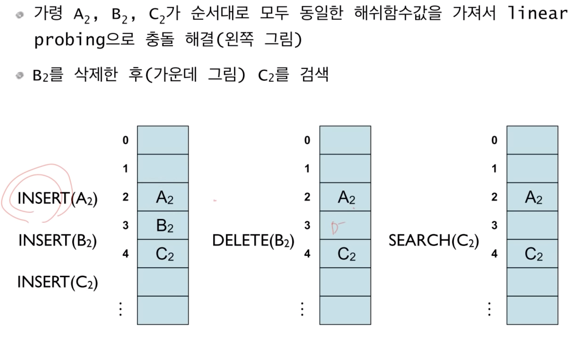

# 영리한 프로그래밍을 위한 알고리즘 

### 참고

- Java로
- [인프런강의]([https://www.inflearn.com/course/%EC%95%8C%EA%B3%A0%EB%A6%AC%EC%A6%98-%EA%B0%95%EC%A2%8C/dashboard](https://www.inflearn.com/course/알고리즘-강좌/dashboard))
- 일주일 3강씩

### 목록

1. [Recursion](#1.-Recursion)


-----------------

## 1. Recursion

### 1.1 Recursion 순환

- 항상 무한루프에 빠지진 않는다.
  - 왜? 적절한 제한문을 주면 됨.

```java
public static void func(int k){
    if(k<=0)//base case
        return;
    else{
        System.out.println("Hello!");
        func(k-1);// Recursive case
    }
}
```

- 어떤 적절한 제한문을 줘야할까?
  1. **Base Case** : 적어도 하나의 recursion에 빠지지 않는 경우가 있어야하고,
  2. **Recursive case**: 진행되면 진행될수록 **Base Case**에 가까워져야함


```java
public staic int Main(String [] args){
    int result = func(4);
    
}
public static int func(int n){
    if(n==0)//base case
        return 0;
    else{
        return n+func(k-1);// Recursive case 4+f(3)=3+f(2)=2+f(1)=1+f(0)=0 전체 10도출
    }
}

//즉 n =4를 넣어줬다는 의미는 0~4까지의 합을 구한 것이라 볼수 있음
//다시 생각하면 0~n까지의 합을 구할 수 있겠네? 순환을 이용해서?
```

- 이건 *수학적 귀납법* 과 완전히 동일하다?
  - 왜?
    1. basecase가 성립하고
    2. 임의의 양의 정수 k가 n<k인 경우에, 0~n까지 합은 올바르게 계산하여 반환한다고 가정하면
    3. n=k인 경우에도 성립한다.
- `func(n)` 함수는 음이아는 정수 n에 대해서, 0~n까지 합을 계산하는 함수이다.


#### **Q1) Factorial을 recursion을 통해서 만들어보자.**

1. 0! =1 -- basecase
2. n! = n*(n-1)! 단! n>0일떄 -- 2번 조건식이 성립한다면
3. n=k 인경우에도 성립함.


```java
public static int Main(String [] args){
    int result = factorial(10);
}
public static int factorial(int n){
    if(n==0) //basecase
        return 1;
	else
    	return n*factorial(n-1);//recursive case
}
```

- 수학적 귀납법

  1. n=0이면 1을반환하고 이건 맞지

  2. 임의의 양의 정수 k에 대해서, n <K 에 대해 n!을 올바르게 계산한다면

  3. n=k인 경우에, `factorial(k-1)`을 먼저 호출하는데, 이게 올바르게 계산됨. 따라서 메서드인 `factorial(k)`는 `k*(k-1)!`를 반환하게됨.

     

#### **Q2) X^n을 계산하는 함수를 만들어보자**

1. X^0 = 1
2. X^n = x*x^n-1 (n은 음이아닌 정수)
3. n=k일때도 성립함.


```java
public static double Main(String [] args){
    int result = power(5);
}
public static dobule power(double n, int k){
    if(n==0) //basecase
        return 1;
	else
    	return n*power(k-1);//recursive case
}

```


#### **Q3) fibonacci Number을 계산하는함수는??**

1. f0 = 0
2. f1 = 1
3. fn = fn-1 + fn-2


```java
public static int Main(String [] args){
    int result = fibonacci(5);
}
public static int fibonacci(int k){
//    if(k==0) 
//        return 0;
//    if(k==1)
//        return 1; 안써도 되네,..ㅠㅠ
    if(k<2)
        return n; //basecase
	else
    	return fibonacci(k-1)+fibonacci(k-2);//recursive case
}
```


**Q4) 최대공약수 : Euclid method**

- 바로 감이 안왔음 어떻게? 순환을 이용해서?

```
m>=n인 두 양수 m과 n에 대해서 m이 n이 배수라면 gcd(m,n)=n이고,
그렇지 않으면 gcd(m,n) = gcd(n,m%n) 이다..
```

```java
public static int gcd(int m , int n){
    if(m<n){
        int tmp = m; m =n; n =temp; //swap m and n 왜? 저 공식 자체가 m>=n이므로
    }
    if(m%n==0) //즉 m을 n으로 나눠서 나머지가 없다면, m이 n의 배수라면
        return n;
    else
        return gcd(n,m%n);
}
```

- 좀 더 단순히...

```
gcd(p,g) =..
if q =0 //둘중하나가 0이면, 최대공약수는 p이고 그렇지 않다면
gcd(q,p%q)
이 정리에서는 p가 반드시 q보다 클 필요는 없다!
```

```java
public static int gcd(int m , int n){
    if(q==0) 
        return p;
    else
        return gcd(q,p%q); //무한루프에 빠지지 않을까?
}
```


### 1.2 Recursive thinking

- `for`, `while` 문으로 해결해야할것은 **순환** 을 통해서.. 해결해보자


#### **Q1 문자열 길이계산**

1. 일반적으로는 세면 되겠음.  앞에서 하나씩 카운트해 나간다.
2. 첫번째 문자열을 뺀 나머지 문자열의 길이를 구한 다음에, 1을 더하면 된다.

```JAVA
public static int length(String str){
    if(str.equals(""))
        return 0;
    else
        return 1+length(str.substring(1));
}
```

- 정의된 2번 방식을 `java` 코드를 통해 표현한것.


#### **Q2 문자열을 차례대로 출력**

```java
public static void printChars(String str){
    if(str.length() == 0)
        return;
    else{
        System.out.print(str.charAt(0));
        printChars(str.substring(1)); //substring(1) 첫글자를 제외한 나머지 문자 recursion으로 다시 돌아가고 있음 문자열 하나하나씩 출력되겠네?
    }
}
```


#### **Q3 문자열을 뒤집어서 출력**

1. 먼저 첫번째 문자열을 제외한 나머지를 뒤집어서 프린트 한후에,
2. 첫번째 문자열을 프린트하면 되겠네
3. 어떻게 순환을 통해서??

```java
public static void printCharsReverse(String str){
    if(str.length() == 0)
        return;
    else{ // 문자열의 길이가 1이상이라면
        printCharsReverse(str.substring(1));
        System.out.print(str.charAt(0));
    }
}
```


#### **Q4 정수를 2진수로 출력하는 방법**

- 이진수에서 마지막비트가 0이라는 것은 짝수
  - 1이라는 것은 홀수.

- 맨마지막 비트를 제외한 나머지 앞에 부분은 **2로 나눈 몫**과 같다.

```java
public void printInBinary(int n){
    if(n<2)
        System.out.print(n);
    else{
        printInBinary(n/2);
        System.out.print(n%2);
    }
}
```

- 와우 대단히 신기 :)


####  Q5) 배열의 합 구하기

- 일반적으로는 `for` 문을 돌려서 구함.

- n개의 배열이 들어올때, 배열의 합 구하기
- *data[0] 에서 data[n-1]까지 합을 구하여 변환*

```java
public static int sum(int n, int[] data){
    if(n<=0) //base case
        return 0;
    else{
        return sum(n-1, data) + data[n-1];
            //n-2까지 합을 구한다음에, n-1값을 더하면 0~n-1까지의 합
    }
    
}
```

​	1. 우선 `data[0] + data[n-1]` 까지의 합을 구한 후 마지막 데이터를 더해주면 된다.

​	2. 배열의 index는 0부터 시작함


#### 06) 데이터 파일로부터 n개의 정수 읽어오기

- Scanner in이 참조하는 파일로 부터 n개의 정수를 입력받아서, 배열 data에 저장함
- data[0] ~ data[n-1]까지 저장

```java
public void readFrom(int n, int[] data, Scanner in){
    if(n==0)
        return;
    else{
        return readFrom(n-1, data, in);//0~n-2까지 받아오고
        data[n-1] = in.nextInt(); //n-1번째는 여기서 받아오고        
    }
}
```


#### 07) Recursion vs Iteration

- 모든 순환함수는 반복문으로 변경가능하고
- 그 역인 *모든 반복문은 순환함수로 변경가능*


### 1.3 Designing Recursion

* 적어도 하나의 `base case` 가 있어야함. 즉 순환되지 않고 직접적으로 종료되는 케이스가 있어야함. 

  없으면? 무한루프!

* 모든 case는 결국 `base case` 에 수렴되어야함.

- Implicit 암시적 -> explicit 명시적인 매개변수를 사용해라

#### 순차검색을 순환으로

- 데이터들이 정렬되어 있지 않는다, 
- 데이터들에 대해서 특별한 조건이 없다.
- 그 배열안에 원하는 조건이 있는지 없는지 찾는 것은 하나하나 보는 수밖에 없음.
- <u>즉 순차적으로 보다가, 있으면 ok 없으면 원래 없는 것으로 판단하는 것</u>

```java
int search(int []data, int n, int target){
    for(int i =0; i < n; i++)
       	if(data[i] == target)
            return i;
    return -1;
}
```

- data[0] ~ data[n-1] 사이에서 target변수가 있는지 확인함.
- 명시적으로 표현되었는 가?
  - `int n` 을 통해서 [0, n-1]까지 data배열에서 찾는 다는 점에서 명시적으로 표현되었다고 보여지지만
  - 인덱스 0은? 아마 시작지점이 0부터 겠지 라고 생각함. 암시적인 매개변수
  - 그렇지만 `recursion` 으로 프로그래밍할 떄는 일반적으로 **위와 같이** 하면 안좋음

```java
int search(int []data, int begin,int end, int target){
	if(begin > end)
        return -1;
    else if(taget ==data[begin])
        return begin;
    else
        return search(data, begin+1, end, target);
}

int search(int []data, int begin,int end, int target){
	if(begin > end)
        return -1;
    else if(taget ==data[end])
        return begin;
    else
        return search(data, begin, end-1, target);
}
```

- **시작점, 끝날 지점을 명시적으로 표현되었음**
- 자기자신이 자기자신을 호출할때 어떻게 될 것인지의 매개변수까지 생각해야함
  - 만약` search(data, 0, n-1, target)`  으로 순환함수를 만들어 호출한다면, 위의 `for`  문과 똑같은 역할을 함.

```java
int search(int []data, int begin,int end, int target){
	if(begin > end)
        return -1;
    else{
        int middle = (begin+end)/2;
        if(data[middle] = target)
            return middle;
        int index = search(data, begin, middle-1,target);
        if(index 1= 1)
            return index;
        else
            return search(data,middle+1, end,target);
    }

}
```

- 반으로 나눠서 좌즉은 작아지면서, 우측은 커지면서 찾는 것.


#### Q)1 배열의 최대값 찾기(매개변수 명시화)

- 첫번째 배열을 제외한 나머지 배열들 중에서의 최대값과, 첫번재 배열의 값과 비교해서 더 큰 값이 그 배열의 최대값이다 라는 컨셉을 이용

```JAVA
int findMax(int [] data, int begin, int end){
	if(begin==end) //데이터 갯수가 1개일때, base case
        return data[begin];
    else
        return Math.max(data[begin], findMax(data, begin+1, end));
    //데이터 구간이 계속 바뀜. begin이 계속 +1씩 증가하니까.
}
```

```java
int findMax(int [] data, int begin, int end){
	if(begin==end) 
        return data[begin];
    else
        int middle = (beign+end)/2;
    	int max1 = findMax(data,begin, middle);
    	int max2 = findMax(data,middle, end);
        return Math.max(max1, max2);

}
```


#### Binaray Search 이진검색

- 이진검색을 순환으로.
- 이진검색?
  - 데이터가 크기 순으로 정리되어서 배열로 저장되어있을 때 사용할 수 있는 방법


```java
public static int binarySearch(String[] items, String target, int begin, int end){
    if(begin > end ) //데이터의 갯수가 0인 경우 정의
        return -1;
    else{
        int middle = (begin+end)/2;
        int comResult = target.compareTo(items[middle]); //중간값과 비교하자
        if(compareTo == 0) //딱 맞다면
            return middle;
        else if(compareTo <0)// middle의 왼쪽에 target이 있다는 말이니까
            return binarySearch(data,target,begin,middle-1);//중간값에서 하나씩 줄여가면서 찾고
        else//그게 아니라면 middle값 오른쪽에 있다는 말이니까.
            return binarySearch(data,target,middle+1,end); //중간값에서 하나씩늘려가면서 찾으면 되겠네
    }
}
```

- `String` 이 사용할 수 있는 `compareTo` 에 대해서 알아보자


### 2.1 미로찾기

현재에서 출구까지 경로가 있으려면?

	1. 현재 내가 있는 위치가 출구거나 혹은 //base case
 	2. 동서남북 이웃한 셀들중 하나에서 현재 위치를 지나지 않고, 출구까지 가는 경로가 있거나 //recursive case

#### Q) Decision problem

- 출구까지 가는 경로가 있느냐? 없느냐? true or false

```java
boolean findPath(x,y){
    if(x,y) is the exit
        return true;
    else
         mark (x,y) as a visited cell; //방문한 위치 표시
         for each neighbouring cell (x`,y`) of (x,y) do
             if(x`,y`) is on the pathway and not visited //방문한 위치는 다시 방문하지 않는다.
                 if findPath(x`,y`)
                     return true;
    	return false
}
//recursion은 더 많아지지만, 코드는 간단해짐
boolean findPath(x,y){
    if(x,y) is either on the wall or visited cell
        return false;
    elseif (x,y) is the exit
        return true;
    else
         mark (x,y) as a visited cell; 
         for each neighbouring cell (x`,y`) of (x,y) do            
                 if findPath(x`,y`) //최대 4번 호출
                     return true;
    
}
```

- 반드시 무한루프에 빠지지 않는지 확인하라.	
  - 두 셀을 무한히 왔다갔다하는 일이 벌어질 수 있음.

```java
// N*N 메이즈에서
//변수 설정
private static final int PATHWAY_COLOR =0;
private static final int WALL_COLOR = 1;
private static final int BLOCKED_COLOR = 2;
private static final int PATH_COLOR = 3;

public static boolean findMazePath(int x, int y){
    if(x<0 || y<0 || x>=N || y>=N)
        return false; //유효범위 체크 0~N-1
    else if(maze[x][y] != PATHWAY_COLOR)
        return false;
    else if(x==N-1 && y==N-1){
        maze[x][y] = PATH_COLOR;
    	return true;
    }
    else {
        maze[x][y] =PATH_COLOR;
        if(findMazePath(x-1,y) || findMazePath(x,y+1) || findMazePath(x+1,y) || findMazePath(x,y-1)){ //복동남서
            return true;
        }
        maze[x][y] = BLOCKED_COLOR;
        return false;
    }
}
```


### 2.2 Counting Cells in a Blob

- Binary 이미지
- 서로 연결된 image pixel(파란색)들의 집합을 blob이라 부름
- 상하좌우, 대각방향도 연결된 것이라 생각함


- 입력?

  N X N 2차원 그리다

  하나의 좌표(X,Y)

- 결과?

  입력이 속한 blob의 크기를 카운트하려면?


1. 현재 픽셀이 image color가 아니라면 return 0 //base case

2. 현재 픽셀이 image color라면

   2.1 현재 픽셀을 카운트하고 (count = 1)

   2.2 현재 픽셀이 중복카운트 하는 것을 방지하기 위해서 다른 색으로 칠하고

   2.3 현재 픽셀에서 인접한 모든 픽셀(8개) 에 대해서 

   ​		그 픽셀이 속한 blob의 크기를 카운트 해서 count에 더해주고

   ​		count를 반환한다.

   

#### sudo

```java
if the pixel (x,y) is outside the grid
	the result is 0;
else if pixel (x,y) is not an image pixee or already counted
	the result is 0;
else
    set the colour of the pixel (x,y) to a red colour; //카운트 되었음을 표시
	the result is 1 plus the number of cells in each piece of the blob that
	includes a nearest neighbour;
```


#### java

```java
private static final int BACKGROUND_COLOR =0;
private static final int IMAGE_COLOR = 1;
private static final int ALREADY_COUNTED = 2;

public int countCells(int x, int y){
    if(x<0 || y<0 || x>=N || y>=N) //유효성 체크
        return 0;
    else if(grid[x][y] != IMAGE_COLOR)
        return 0;
    else{
        grid[x][y] = ALREADY_COUNT;
        return 1 + countCells(x-1)(y+1) + countCells(x,y+1)+ countCells(x+1,y+1) + countCells(x-1,y)  + countCells(x+1,y) + CountCells(x-1,y-1) + CountCells(x,y-1) + countCells(x+1,y-1);//인접한 8개의 좌표
    }
}
```


#### quiz

```java
public class CountCells {
 public static int N = 8;
 public static int grid[][] = {
  {1, 0, 0, 0, 0, 0, 0, 1},
  {0, 1, 1, 0, 0, 1, 0, 0},
  {1, 1, 0, 0, 1, 0, 1, 0},
  {0, 0, 0, 0, 0, 1, 0, 0},
  {0, 1, 0, 1, 0, 1, 0, 0},
  {0, 1, 0, 1, 0, 1, 0, 0},
  {1, 0, 0, 0, 1, 0, 0, 1},
  {0, 1, 1, 0, 0, 1, 1, 1}   
 };
 
 private static int BACKGROUND_COLOR=0;
 private static int IMAGE_COLOR =1;
 private static int ALREADY_COUNTED =2;
 
 public static int countCells(int x, int y){
  if(x<0 || x>=N || y<0 || y>=N){
   return 0;
  }else if (grid[x][y] != IMAGE_COLOR){
   return 0;
  }else{ //grid[x][y] = IMAGE_COLOR
   grid[x][y] = ALREADY_COUNTED;
   return (1 + countCells(x-1, y+1) + countCells (x, y+1) +
      countCells(x+1, y+1) + countCells(x-1, y)+
     countCells(x+1, y) + countCells(x+1, y-1) +
     countCells(x, y-1) + countCells(x-1, y-1));
  }
 }
 
 public static void printGrid(int n, int[][]grid){
  for(int i=0; i<n; i++){
   for(int j=0; j<n; j++){
    System.out.print(grid[i][j]);
   }
   System.out.println("");
  }
 }
 
 public static void main(String[] args){
  
  System.out.println("처음 그리드!");
  printGrid(N, grid);
  int a = countCells(3, 5);
  System.out.println("그리드 문제 해결!");
  printGrid(N, grid);
  System.out.println(a);  
```


### 2.3 N-Queens

- N*N 체스보드가 주어짐
- 하나의 말은 하나의 행에만 놓여질 수 있음

- *BackTracking*  [되추적 기법]방식을 이용하여 문제를 푼다

  문제를 풀기 위해서 최근에 내렸던 결정을 번복하는 


#### 2.31 상태공간트리

- 찾는 해를 포함하는 트리. 즉 해가 존재하면, 반드시 이 트리의 한 노드에 해당한다는 것. 따라서 이 트리를 탐색하면 <u>원하는 해</u>를 구할 수 있음.
- 이 트리를 탐색할 코드를 만드는 것이 목표
- 그런데 모든 노드를 탐색해야 하는 것은 아니지. `해`만 발견하면 되니까


## 2. 정렬

- simple and slow
  - bubble sort
  - insertion sort
  - selection sort 
- fast
  - quicksort
  - merge sort
  - heap sort
  - radix sort


### 2.1 기본적인 정렬

1. **Selection Sort**

   *선택 정렬*

   해당 순서에 원소를 넣은 위치는 정해져 있고, 어떤 원소를 넣어지 선택한다는 의미

   1. 최대 값을 찾고,
   2. 그 값과 맨 오른쪽 원소를 교환하고
   3. 그러고 이제 맨 오른쪽 원소는 제외하고 다시 시작

   ```java
   selectionSort(A[], n){
   	for last <- down to 2{
           A[1...last] 중 가장 큰 수 A[k]를 찾고
           A[k] <-> A[last]; 교환한다
       }
   }
   ```

   - 시간 복잡도 O(n^2)

     **T(n) = (n-1) + (n-2) + … + 2 + 1 = n(n-1)/2 = O(n^2)**


2. **Bubble Sort**

   선택정렬과 비슷한 개념. 다만 선택정렬과는 다르게 최대값을 찾진 않는다.

   ```java
   bubbleSort(A[], n){
       for last <- downto 2{
           for i <- 1 to last - 1
               if(A[i]>A[i+1]) then A[i] <-> A[i+1] // 교환
       }
   }
   ```

   - 시간 복잡도 O(n^2)

     **T(n) = (n-1) + (n-2) + … + 2 + 1 = n(n-1)/2 = O(n^2)**
     
     

3. **Insertion Sort**

   *삽입 정렬*

   매 순서마다, 해당 원소를 삽입할 수 있는 위치를 찾아서 그 위치에 넣는 정렬

   ```java
   insertionSort(A[], n){
       for i<- 2 to n{
           A[1...i]의 적당한 자리에 A[i]를 삽입한다.
       }
   }
   ```

   - 시간 복잡도 O(n^2)

     최선? 1번만에

     최악? **T(n) = (n-1) + (n-2) + … + 2 + 1 = n(n-1)/2 = O(n^2)**

   

- 정렬 알고리즘 시간 복잡도 비교
  


참고

- [https://gmlwjd9405.github.io/2018/05/06/algorithm-insertion-sort.html](https://gmlwjd9405.github.io/2018/05/06/algorithm-insertion-sort.html)

- https://jongmin92.github.io/2017/11/06/Algorithm/Concept/basic-sort/


### 2.2 merge sort (합병 정렬)

1. **분할**하고 : 해결하고하는 문제를 <u>작은 크기</u>의 동일한 문제들로 분할
   - 데이터가 저장된 배열을 <u>절반</u>으로 나누고

2. **정복**하고 : 각각의 작은 문제를 순환적으로 해결
   - 각각을 순환적으로 정렬하고

3. **합병하여 해결**한다 : 작은 문제의 해를 합하여, 원래 문제에 대한 해를 구함
   - 정렬된 두 개의 배열을 합쳐, 전체를 정렬한다.

- **기본적으로 recursion**이다

```java
mergeSort(A[], p, r) //A[p...r] 정렬하는
{
    //p>=r 이라면, 정렬알고리즘이 할 필요가 없겠음
    if (p < r) then{
        q = (p+q)/2;
        mergeSort(A,p,q); //전반부 정렬
       	mergeSort(A,q+1, r); //후반부 정렬
        merge(A,p,q,r); //합병       
    }
}

merge(A[], p,q,r)
{
    //정렬되어있는 두배열A[p..q], A[q+1...r] 을 합하여,
    //정렬된 하나의 배열 A[p...r] 을 만든다
}
```

- 제대로 수행된다면, 합병이 일어나서 정렬이 일어난다.


```java
void merge(int data[], int p, int q, int r){
    int i = p, j =q+1, k=p;
    int tmp[data.length()];
    while(i<=q && j<=r){
        if(data[i] <=data[j])
            tmp[k++] =data[i++];
        else
            tmp[k++] = data[j++];
    }
    while(i<=q) //앞쪽 데이터가 남아있다면
        tmp[k++] =data[i++];
    while(j<=r) //뒤쪽 데이터가 남아있다면
        tmp[k++] = data[j++];
    for(int i=p; i<=r; i++)
        data[i] =tmp[i]; //원래배열에 복사하기
}
```

- 합병정렬에서는 합병하기 위해서는 추가배열이 있어야함.
- 나뉘어진 정렬을 하나씩 비교하면서, tmp배열에 제일 작은 값부터 채워나간다.
- 시간복잡도는 ? O(nlongn)


### 2.3 quick sort(빠른 정렬)

1. 분할
   - 기준 값(pivot)을 선택하여, 이보다 낮은, 높은 두 부분으로 분할한다.
   - 어떤 것을 pivot으로 선택하는가?
     - `pivot` 은 랜덤. 운											
2. 정복
   - 각 부분은 recursion으로 정렬한다.
3. 합병
   - 각 부분이 제대로 정렬이 되었다면, 합병은 해주지 않아도됨. 왜? 이미 차례대로 정렬이 되었을 거니까
4.  예)


- 중요한 것은 ? **분할** 
  - 어떻게 주어진 데이터를 pivot 기준으로 분할을 할 것인가?


```java
quickSort(A[], p, r) //A[p...r] 을 정렬한다
{
    if(p<r) then {
        q = partition(A,p,r); //분할 q =pivot위치
        quickSort(A, p, q-1); //왼쪽 부분 정렬
        quickSort(A, q+1, r); //오른쪽 부분 정렬         }
}
partition(A[], p, r){
    //pivot값을 기준으로 작은 쪽, 큰쪽으로 분할해주는
    //하고 pivot의 위치를 return 해주는 함수
    //피벗보다 작은애 | 피벗 | 피벗보다 큰 애
    //피벗의 위치는 그대로 두고, 나머지 요소들을 피벗보다 작은 애 | 큰 애로 정렬한다음에,
    //마지막 스텝에서 피벗보다 큰 애들중 첫번째 값 앞에 넣도록
}
```

- 파티션을 어떻게 해야할까?

  

  1. pivot을 설정했으면
  2. 각각의 값을 pivot과 비교해서
  3. 작은지, 큰지 비교해야함
     - 작은값, 큰값모임에서의 정렬은 아직 신경쓰지말자
  4. 피벗보다 크다면?
     - 그대로 둔다.
  5.  피벗보다 작다면?
     - i+1 요소와 바꿔줘야함

  ```
  if A[j] >= x
  	j = j+1;
  else
  	i = i+1;
  	exchange A[i] and A[j];
  	j = j+1;
  ```

  

- 그 예
  - i = 피벗보다 작은 값 중 마지막 값
  - j = 지금 검사하려는 값

```java
Partition(A,p,r)
{
    x = A[r]; //pivot
    i = p-1; //p보다 앞
    for j = p to r - 1
        if A[j] <= x then
            i = i+1;
    		exchange A[i] and A[j];
    
    exchage A[i+1] and A[r];
    return i+1;// pivot위치 반환
}
```


- 시간복잡도

  - O(n) , 정확히는 n-1개의 비교연산이면 충분함
  - 최악의 경우?
    - sorting할 데이터가 이미 sorting이 되어있을 때
    - n- 1 | 0 개 로 분할되는경우
    - O(n^2)
  - 최상의 경우?
    - 항상 절반으로 분한되는 경우 
    - O(nlogn)
  - 최악,최상의 경우 <u>시간복잡도가 꽤 차이난다</u>

- quick sort 이름과 같이 꽤 빠른 정렬

  그런데 최악의 경우 O(n^2) merge sort(nlogn)보다 느림

  quick sort의 성능은 partition에 달려있음.

  분할이 얼마나 잘 되는가?

  그렇게 극단적인 분할 n-1 : 0 , 만 아니라면 시간복잡도는 O(nlogn) 충분히 빠르다


- 평균시간복잡도


- pivot의 n가지 랭크의 경우의 수. 발생할 확률은 모두 1/n으로 동일
- 평균 시간 복잡도를 계산해도 O(nlogn)임.


- Pivot의 선택
  - 첫번째 값이나, 마지막 값을 피봇으로 선택
    - 별로 좋은 아이디어는 아니다.
    - 왜? 이미 정렬된 데이터, 거꾸로 정렬된 데이터가 최악의 경우가됨.
    - 현실의 데이터는 랜덤하지 않으므로 정렬되지 않은 혹은 거꾸로된 데이터가 입력으로 올 가능성이 높다.
    - 정렬된 데이터를 다시 정렬하는 경우는 자주 일어나는 일
  - 그래서 중간(median) 값을 선택
    - 첫번째, 마지막 값, 가운데 값 중에서 중간값을 선택
    - 이 방법은 최악의 경우를 예방
  - 혹은 피벗을 랜덤하게 선택한다.
    - 특정한 위치, 규칙이 아닌 랜덤으로 선택
    - 평균 시간복잡도 O(nlogn)

### 2.4 heap sort

- 최악의 경우 시간복잡도 O(nlogn)
- merge sort에서는 추가배열이 필요했지만, heap sort에서는 추가배열이 필요하지 않음. (추가 메모리가 필요없다)


- heap 자료구조는

  1. **complete binary tree** 이어야 하고

  2. **heap property**를 만족해야함

     max heap property = 부모는 자식보다 크거나 같다.

     or

     min heap property = 부모는 자식보다 작거나 같아

     max heap, min heap은 대칭함.


- 맨위 root 노드 부모가 없는 노드, 유일함
- 그 아래 부모 노드 2개
- 그 아래 4개, 자식 노드 4개... 이런식으로
- 자식이 없는 노드는 leaf 노드

- binary tree 이진 트린
  - 각각의 노드가 **최대** 2개의 자식 노드를 가지는 트리

- full binary tree 는 그 자체로 complete binary tree.
  - 그 반대는 항상 성립하지 않음


- heap or no heap


- b 
  - 1번 조건은 만족하지만
  - 2번 조건을 만족하지 않는다.
- c
  - 1번 조건을 만족하지 않는다. (왼쪽 자식노드가 빠져있다)


- heap을 배열로 표현하기


- 값 뿐만 아니라, 부모-자식 관계인지 알 수 있어야함.
- 어떤 노드가 j라면, 이 노드의 부모노드는 j/2번째 노드일 것임을 알 수 있음.
- 일차원 배열에 저장하더라도, 인덱스만 보더라도 부모-자식 관계를 알 수 있음.


- max - heapify 

  1. 트리 전체 모양은 complete binary tree
  2. 왼쪽, 오른쪽 노드만 봤을 때도 heap tree
  3. 그런데 root노드만 heap 전제조건을 만족하지 않을 때

  이럴때 해당 트리를 heap 전제조건에 맞도록 바꿔주는 방법이 `heapify` 

  max가 붙은 것은, 현재 이 강의에서 max-heap에 대해서 다루고 있기 때문

  - 루트에 있는 값이, 자신의 자식 값과 바꾸어서 heap 전제조건을 만족하거나
  - 혹은 leaf노드까지 내려오게 되면 종료하게 됨.

  - recursive 한 특징을 가지고 있음

  ```java
  MAX-HEAPIFY(A,i)
  {
      if there is no child of A[i]
          return;
      k = index of the biggest child of i;
      if A[i] >= A[k]
          return;
      exchange A[i] and A[k];
      MAX-HEAPIFY(A,i);
  }
  ```

  - iterative 하게

  ```java
  MAX-HEAPIFY(A,i)
  {
  	while A[i] has a child do
          k = index of the biggest child of i;
          if A[i] >= A[k]
              return;
          exchange A[i] and A[k];
          i = k;
      end
  }
  ```

  - 시간복잡도
    - O(logn) 
    - n은 데이터의 갯수


- 일차원 배열은 complete binary tree 로 생각하자

  - 이 tree가 heap property를 만족하지 않으므로 heap은 아닐것
  - 그러면 이 tree를 heap이 되도록 만들어줘야함
    1. level 별로 오른쪽에서 부터 시작해서 봄, leaf노드가 아닌 노드 계층 부터 heapify 시작함
    2. 그 계층 부터 차근차근.
    3. 마지막 root 노드 대상으로 heapify를 함
  - 개념적으로 위와 같이 생각하는 것이지, 시스템 상에서 배열상에서 자리를 바꾸는 것으로 진행된다.

  

  

  - [2,8,6,1,10,15,3,12,11] 힙으로 만들어보자
    1. 9/2 = 4. 4번 노드에서 시작 1과 12를 자리 바꿈
    2. 6에 대해 heapify 15,6이 자리를 바꿈
    3. 8에 대해
    4. root 노드에 대해

- **힙 정렬 하는 방법**

  1. 주어진 데이터로 힙을 만든다.
     - 루트는 최대값이다.
  2. root와 마지막 값을 자리를 바꾼다.
     - 정렬 결과 가야할 자리에 간것. 그리고 heap의 크기가 1이 줄었다고 생각한다
  3. 루트 노드에 대해 HEAPIFY(1) 을 한다
     - 모든 노드가 HEAP형식으로 정렬된다.
  4. 그리고 2~3번을 반복한다.

  

  

#### priority queue

- 우선순위 큐
- 일반적인 큐는 FIFO 큐라 부름
- 우선 순위 큐는 각각의 값에 순위가 매져겨 있어, 우선순위인 값만 뺄 수 있는 자료구조를 의미함

- 최대 우선 순위 큐
  - INSERT(X) : 새로운 원소 X를 구입
  - EXTRACT_MAX() : 최대값을 삭제하고 반환
    - 최소 우선 순위 큐는 여기서 EXTRACT_MIN()을 지원

- INSERT()

  1. 마지막 노드에 새로운 값을 추가함
  2. 새로운 값과 부모값을 비교함으로써 heap property에 맞는지 자리 바꿈.

  

  - 추가되는 값은 heap사이즈에 마지막 자리에 추가됨을 알 수 있음
  - i 문제 노드의 인덱스
  - complete binary tree의 시간 복잡도는 O(logn)

- EXTRACT_MAX()

  - Root에 있는 값을 삭제하고 반환해주면 됨.
  - 줄여도 되는 노드는 마지막 노드 밖에 없음.
    - 왜? complete binary tree 구조를 무너뜨리면 안되니까
  - 그래서 root노드와 마지막 노드를 바꾸고
  - 마지막 노드를 삭제하면서 가져온다.
  - 문제는 heap property가 깨짐
  - **MAX-HEAPIFY 작업을 실행!**

  

### 2.5 comparsion Sort

- merge, heap sort의 시간복잡도가 O(nlogn) 이 것이 최선인가?

- bubble, selection insertion, quicksort(평균 O(nlogn)) 대부분 O(n^2) ..


#### Lower Bount(하한)

- 어떤 comparsion sort 도 시간복잡도가 O(nlogn) 보다 낮을 수 없다.

- Decision Tree

  - 3개의 수를 정렬할 때, 일어날 수 있는 모든 경우의 수를 정리한 것

  

- 어떤 Comparsion sort라도 Decision Tree로 그릴 수 있음
- Descision Tree에서 Leaf노드의 숫자는 **N!** 3 * 2 * 1 = 6...
- 최악의 경우 시간복잡도는 이 Tree의 높이에 비례함
- 트리의 높이는 logn! = O(nlogn) 보다 낮을 수 없음

### 2.6 sorting in linear time

#### 카운팅 정렬(counting sort)

- n개의 정수를 정렬. 단 모든 정수는 0에서 K사이의 정수(사전지식)
  - K가 비교적 작을 경우 생각해봄


- 입력데이터를 쭉 스캔하면서, 각각의 데이터가 얼마나 들어왔는지 스캔하는 것

```java
int A[n];
int C[k] = {0,};
for(int i = 1; i<n; i++)
    C[A[i]]++;
for(int s =1; i=0; i<=k; i++)
    for(int j=0; j<C[i]; j++)
        A[s++] =j;
```

- 보통 실제 데이터는 하나의 타입만 들어오진 않음


1. 각각 요소들을 카운팅 한다음에, 

2. 누적합을 구해서, 그합에 맞게 소팅함

   2,2,4,7,7,8

   1보다 작거나 같은 것은 2개, 2보다 작거나 같은 것은 4개, 3보다 작거나 같은 것은 7개.. 이런식으로 해석한다.

3. 들어온 배열을 뒤에서부터 살펴보면서 새로운 배열 B에  데이터를 저장함


- 시간복잡도 O(n+k) (if n>k)

  선형시간. k가 아주크다면 비실용적

- 카운팅 소팅 알고리즘은 stable하다

  stable: 입력에서 들어오는 순서대로 값이 출력값 순서에도 유지된다.

#### Radix sort

- n개의 d자리 정수들

- 가장 낮은 자리수부터 정렬

  329,456,839..이렇게 있으면 가장 낮은 자리 일의 자리 수를 기반으로 데이터를 정렬

  오름차순으로 정렬이 됨.

  왜?

- 시간복잡도O(d(n+k))
  
  - d 상수 k <n 이면, 성립함


### 2.7 시간복잡도


### 2.8 sorting in Java

#### primitive type 정렬

- Arrays 클래스가 정렬 메서드를 제공한다.

  ```java
  int [] data = new int [capacity];
  Arrays.sort(data);
  Arrays.sort(data,0,size);
  //배열이 꽉차있지 않을때,
  //시작인덱스, 데이터의 갯수
  ```

  - int 이외의 다른 **primitive type(double, char등)** 에 대해서도 제공한다.

- 객체의 정렬 : 문자열
  
- java에서 객체는 semi - primitive type이라 할 수도 있겠음
  
- ArrayList : 문자열

  - collection class
  - 배열이 아니니 Arrays.sort를 쓸 수 는 없음

  ```java
  Collections.sort() //메서드릴 제공함
  ```

  

- 사용자 정의 객체

  - 정렬하고 싶다면, 객체들간의 크기 관계를 정의해줘야함

  1. ` Comparable Interface` 

  ```java
  implements Comparable<Fruit>{
      ...
  	//이름순
      public int compareTo<Fruit other){
          return name.compareTo(other.name)
      }
      //재고량순
          public int compareTo<Fruit other){
          return quantity - other.quantity; //음수 0 , 양수
      }
  
  }
  ```

  2. `comparator` 

     - 이것도 인터페이스

     ```java
     static Comparator<Fruit> nameComparator = new Comparator<Fruit>()//익명의 클래스를 정의{
         //오버라이딩한것
         public int compare(Fruit fruit1, Fruit fruit2){
             return fruit1.name.compareTo(fruit2.name);
         }
     }
     static Comparator<Fruit> quantComparator = new Comparator<Fruit>(){    
         public int compare(Fruit fruit1, Fruit fruit2){
             return fruit1.quantity - fruit2.quantity;
         }
     }
     
     //generic 프로그래밍
     Arrays.sort(fruit, nameComparator);
     Arrays.sort(fruit, quantComparator);
     ```

     - `compare()`라는 멤버 메서드가 있음
     - 인터페이스는 new로 객체를 생성할 수 없는데
     - annoymous class


## 3. 검색트리-이진검색트리

### 3.1 트리와 이진트리

- 노드와 링크로 이루어져있음.
- 맨 위에있는 노드는 루트
  - 루트는 부모노드가 없음
- 자식이 없는 노드 ? **leaf 노드**

- 레벨, 루트는 level1...
- 모든 트리는 노드의 갯수가 n개면 레벨은 n-1개
- 루트에서 노드로 가는 길을 **유일**하다


**이진트리**

- 각 노드가 최대 2개의 자식을 가진다. 0,1,2개의 자식
- 각각의 자식의 대해서, 부모의 왼쪽자식인지 오른쪽 자식인지가 정해져있음.(그게 다르면 서로 다른 이진트리이다)

## 6. 해슁

- 해쉬  테이블은 dynamic set을 구현하는 효과적인 방법
  - 적절한 가정하에 탐색, 삽입, 삭제시간이 O(1)  -- 아주 좋음
- 보통,대부분의 경우 : <u>최악의 경우는 O(n)</u> 

- 해슁은 시간복잡도를 파악하는데 어려움이 있음.

- 해쉬 함수를 이용해서, key를 해쉬테이블(커다란 배열) 에 저장하는 방법


- 키의 해시함수값을 그 키를 저장한 해쉬테이블의 인덱스로 사용하는 방법을 말한다.
  - 키를 데이터의 인덱스 값으로 나눈 것이 가장 간단한 해쉬방법.
- 해쉬함수값은 0~m0-1까지의 값을 가지게 됨


### 6.1 충돌(Collision)

- 해쉬 함수값이 겹칠때? 
  - 1024 % 100 == 24, 2024 %24 ==24??? 겹치는데?
  - k1, k2에 대해서 h(k1) h(k2)값이 같을때
- 충돌이 발생하지 않는 해쉬함수는 가능하지 않는 이야기
  - 그러니까 충돌이 발생했을 때 어떻게 대처해야하는가?
  - `chaining` 과 `open addressing` 을 통해 해결해야함

**chaining을 통한 해결**

- 해쉬테이블에 각각의 칸에, 직접 키를 저장하지 않고 이 칸에 대응되는 모든 키를 연결리스트로 만들어서 충돌을 처리하자

- 키의 **삽입** , 연결리스트의 맨앞에 키를 삽입함. O(1)
  - 중복저장을 허용하지 않는다면, 삽입시에 리스트를 검색해봐야함. 이 시간복잡도는 <u>리스트에 길이에 비례함</u>
- 키의 **검색** , 순차검색, 시간복잡도는 <u>리스트의 길이에 비례</u>
- 키의 **삭제**, 키를 검색하고, O(1)시간에 삭제가능함

- 최악의 경우?
  - 모든키가, 동일한 해쉬함수값을 가져서, 해쉬 테이블 하나 칸에 연결리스트로 모두 저장되는 것
  - 삽입, 삭제, 삭제가 O(n)이 걸리고,
- 평균시간복잡도는 키들이 여러 슬록에 얼마나 잘 분배되는가..에 달려있음.
- 왜? 연산의 시간이 연결리스트의 크기에 비례할 거니까


**SUHA**

- simple uniform hashing assumption
- 각각의 키가 모든 슬록들에 균등한 확률로 독립적으로 해슁된다는 **가정**
- 이 가정이 현실에서는 불가능할 것.
  - 해쉬함수는 랜덤함수가 아니다. 나올 값의 범위가 정해져있음.

### 6.2 Open Addressing

**Linear probing**

- 충돌을 해결하는 방법.
- 해당 해쉬주소값이 차있으면, 차례대로 그 다음부터 찾아봐서, 처음으로 비어있는 공간에 채우는 방법.
- 문제
  - 클러스터가 점점 커진다. 왜 계속 하나하나씩 채워나가니까.
  - 클러스터? 키에 의해서 채워진 연속된 슬롯을 의미.
  - 즉 키로 이루어진 한뭉터기가 계속 커진다는 것.
- 해결방법
  - quadratic probing 차례대로 채워나가는 것이 아니라, 1^2, 2^2이런식으로 채워나감. 그러면 클러스터링이 좀 감소되겠지.
  - double hasing , 위의 방법과 비슷.
- 키의 삭제 시에 문제가 또 발생



- C2를 검색할 때, 2번 장소 다음만 검색해보고, 비어져 있어서 없다고 판단할 수 있음.

- B2를 삭제하고, C2를 옮겨와야함.


### 6.3 Random Key

- 좋은 해쉬함수?
  - 불규칙한 값.
  - 해쉬함수값이 키의 특정부분에 의해 결정되지 않도록 해야.
  - 그렇지만 현실의 키들은 랜덤하게 들어오지 않음. 대부분 비슷한 값이 들어올 확률이 높음.

- Division 기법


- 위의 기법만으로 하진 않고, 해쉬함수를 만드는 마지막 과정에 하는 경우가 많음.


- mutiplication 기법


- `Division` 기법전에 많이 함.


### 6.4 Hasing in java

- 언어 차원에서 `Object ` 클래스에서`hashcode` 메서드를 지원함.
  - 즉 기본적으로 자바에서 모든 객체는 `hashcode` 메서드를 가지고 있음을 알 수 있음.

- 만약에 `x.equals(y)` 가 `true` 이라면 `x.hashcode()` == `y.hashcode()` 이다. 그러나 그 역은 성립하지 않음.
- 필요에 따라서,  `hashcode` 메서드를 `override` 해서 씀.


- hashcode 는 -2^31 에서 2^31사이의 정수
- Hash 함수는 0에서 M-1 까지의 정수(배열 인덱스)
  - M? 테이블 사이즈.
- 자바에서 hash는 search, structure을 위한 hash 좀 더 간단함.
  - 암호학과는 다르다!

#### HashMap in Java

- TreeMap과 비슷한 인터페이스 제공
- 내부적으로 하나의 배열을 해쉬 테이블로 사용
- Chaining으로 충돌 해결하고,
- load factor을 지정할 수 있음. 왜? 해쉬 테이블의 크기를 정해주기 위해서. (0~1사이의 실수)
- 지정된 키의 개수가 <u>load factor을 초과하면, 더 큰 배열을 할당하고,  저장된 키들을 재배치(re-hasing)</u> -- 오버헤드가 크겠지...

- **Hash-set(집합)**


## 7. 그래프 알고리즘

### 7.1 그래프 개념, 표현

- 어떤 것들간의 이진관계. 객체가 있고 두 객체 간에는 관계가 있고, 어떤 두 관계에는 그러한 관계가 성립하지 않는 것.

- 무방향 그래프 G = (V,E)

  - V : 노드, 정점
  - E : 노드 쌍을 연결하는 에지, 링크, 선

  - 정점은 갯수는 n, 에지의 갯수는 m으로

- 방향 그래프 

  - 모든 에지들이 방향을 가지고 있음. 화살표로 그리고 있음.

- 가중치 그래프
  - 에지 마다 가중치가 지정되어 있는 그래프


**그래프의 표현**

1. 인접행렬


- <u>에지의 여부에 따라서</u> 행렬을 채워나가는 방법
- 저장공간 O(n^2)
- 인접한것을 찾으려면, 해당 행을 전체를 읽어볼 수 밖에 없음.
  - 인접한 것은 1로 표현되니까.
  - 그럼 걸리는 시간은 O(n)
- 어떤 두정점 사이에 에지가 있는지, 연결되어있는지
  - 바로 볼 수 있으니 걸리는 시간은 O(1)

2. 인접리스트


- N개의 연결리스트를 하나의 배열에 저장해두는 방식
- 노드의 갯수 2m개, m은 에지의 갯수
  - 왜? 에지하나당 데이터가 2개 달려있을 것이니까.

- 둘 다 무방향 그래프에 대해


- 방향 그래프


- 가중 그래프의 인접행렬 표현
  - 1대신, 에지의 가중치를 저장. 그럼 에지가 없을 때? 
  - 무한대로 표현하는 경우가 있음. 진짜 무한대를 의미하는 것은 아니지만..
  - 즉 확실하게 표현이 정해져있는 것은 아니다.
  - 그래프에 맞게, 용도에 적합하게 모든 경우의 수에 대해 표현하기만 하면 된다.

- 경로와 연결성(무방향 그래프)

  - 경로? 노드 사이의 경로는, 에지들을 따라서 가면 a에서 b까지 가는 **경로** 라고 말한다.

  - 인접? 하나의 에지에 서로 매달려 있음 노드들이

  - 연결되어있다? 에지를 따라 a에서 d까지 노드로 갈 수 있음을 의미.

  - 연결요소?

    

### 7.2 BFS

- 순회 = traversal , 모든 노드들을 방문한다.

- BFS ? breadth-frist search, 너비 우선순회를 의미.
  - 노드들을 **동심원 형태** 로 순회하는 방법을 의미함.

  1. 출발 노드를 결정하고.
  2. 그 다음으로는 출발노드에 인접한 노드들을 모두 방문함(거리1)
  3. 출발노드 노드로 부터 거리가 2인 노드들을 모두 방문

  

- 큐를 이용한 너비우선순회

  

1. 출발 노드를 체크하고(이미 방문한 노드임을 구분)

2. queue에서 뽑은 노드 중에서 인접한 노드들을 체크하고, queue에 넣는다.
3. queue에서 하나 뽑아서, 이에 인접한 노드들을 체크하고, 다시 queue에 넣는다.
4. <u>큐가 비게 되면 종료</u>됨.


- **최단경로를 구할 수 있다!**
  
- 모든 경로를 방문할 뿐만 아니라, 출발 노드로 부터 가장 짦은 경로를 구할 수 있다.
  
- sudo code

  

  - 어떤 노드도 2번 돌진 않을 것.
  - 그러면 O(n)
    - 그렇지만 for문이 돌때, 연결리스트로 구현한 경우 --> O(n^2)

- 그래프가 disconnected이거나, 방향그래프라면, BFS에 의해서 모든 노드가 방문되지 않을 것.


### 7.3 DFS


- 리프 노드에 도달해서, 시작으로 돌아와서 인접한 다른 노드 찾아보고  방문하지 않는 곳을 깊이 우선 탐색으로 ...이런식.

- sudo  code

  

  

  - recursion을 사용

- 그래프가 disconnected이거나, 방향그래프라면, DFS에 의해서 모든 노드가 방문되지 않을 것.

  

  - 에지 하나당, recursion이 한번만 호출 될것.

- 인접행렬로 표현했다면 시간복잡도는 O(n^2)

  - 인접리스트로 표현했다면, 시간복잡도는 O(n+m)


### 7.4 DAG, 위상순서

- Directed Acyclic Graph
  - 방향 사이클이 없는 방향 그래프
  - 어디에서 출발하더라도, 자기 자신으로 돌아올 수 없는 그래프.
- 어떤 용도?
  - 작업들의 우선순위, 한 작업이 어떤 작업 전에 반드시 선행되어야 되는 경우.
  - 반드시 선행되어야 하는 작업이 진행되지 않는 다면, 완성하지 못할 것.

- 위상정렬(topological ordering)
  - 답이 유일하지 않다.
  - 보통 왼쪽에서 오른쪽으로 정렬됨.

- **위상정렬 알고리즘 1**

  ​	

  1. indgree = 0 인 노드를 찾음 (두 개 이상 존재하면 아무나 하나 출력) a,g 중에 출력

  2. a에서 나가는 에지들을 제거하고, 

     2.1 g에서 나가는 에지들을 제거하고

  3. b를 출력하고
     3. 1 b에서 나가는 에지들을 제거하고
  4. e를 출력하고,
     	4. 1 e에서 나가는 에지들을 제거하고
  5. c,f를 출력한다.

  ```java
  topologicalSort1(G){
      for <- 1 to n {
          진입간선이 없는 임의의 정점 u를 선택;
          A[i] <- u;
          정점 u와 u의 진출간설을 모두 제거함.
      }
      배열 A[1...n] 에는 정점들은 위상정렬되어있다.
  }
  ```

  - 수행시간은 `O(n+m)` 
  - Q1) Indgree = 0 인 노드가 존재하지 않으면...?

  

  

- **위상정렬 알고리즘2**


- 사각 박스 친 부분은 DFS와 완전히 동일
  - DFS? 

### 7.5 최소 비용 신장트리(MST)

- 최소의 비용으로 모든 노드들이 서로 연결되도록 하는!

- 무방향 가중치 그래프임.

- 가중치들은 양수임.

  

- 트리?
  - 사이클이 없는 연결된 무방향 그래프
  - 연결, 인접은 다른말.

- Generic MST 알고리즘

