# Data Structure

### 참고

- 언어 : Java
- [생활코딩](https://www.youtube.com/watch?v=bj2F0hTiTtw&list=PLuHgQVnccGMDsWOOn_P0EmAWB8DArS3Fk)

### 목록

[1. 배열](#Array)

[2. 리스트](#List)

[3. Array List](#Array List)

-----------------


## Array

- 배열 이라 부른다.
- 데이터가 많을 때 사용함.
  - 그룹 관리의 필요성이 생김
  - 여러 데이터를 하나의 이름으로 그룹핑해서 관리하기 위한 **데이터 구조**

- 배열에서 가장 중요한 것은 `index` 


### 배열 생성

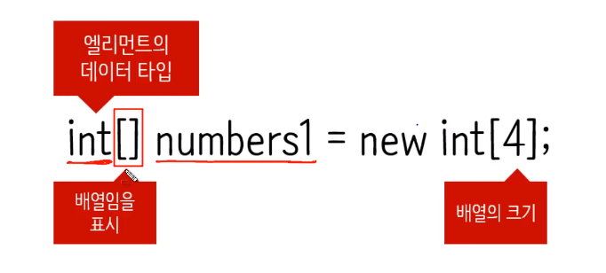

- new 연산자? = <u>배열은 객체</u>

- String[] strings = new String[4]; //문자열에 해당하는 배열 만들기

- **인덱스는 0부터 카운팅 한다**

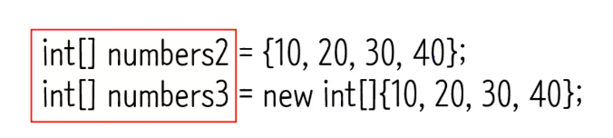

- 배열은 만드는 좀 더 간편한 방법


**Get**

- 인덱스를 통해서 값을 가져올 수 있음

- 아직 값을 설정하지 않은 인덱스로 가져오려고 하면?

  - 배열은 java **숫자는 0**을 , **문자는 null**을 return 

- 배열의 크기를 알고 싶다면?

  -  length() 를 이용하자
  - length() 그 **배열을 구성**하고 있는 **엘리먼트의 값이 몇개** 있는지 출력함

  

**Iteration**

```java
int i = 0;
while(numbers1.lenth > i){
	System.out.println(numbers1[i]);
	i++;
}
```

- `while` 문을 사용했을 때 단점?

  - 핵심적인 기능을 하는 코드들이 떨어지게 되면, 전체 흐름을 파악하게 힘들게 됨

  - 그래서 `for` 문 사용


**배열의 단점**

1. 크기가 정해져 있다.
2. 기능이 없다.

**배열의 장점**

1. 크기가 정해져 있고,
2. 기능이 없다.

- 약간 모순적. 장점과 단점이 같다는 것은 배열을 만든 의도가 무엇인지 봐야겠음.
- 메모리를 작게 차지 하고 있다는 것은 사용자가 원하는 기능에 끼워맞출 수 있는 부품으로 사용될 수 있음을 의미한다.


## List

- 순서가 있다.
- 중복을 허용한다.


### List vs Array

- 상당히 유사
- Array도 순서가 있게, 그리고 중복해서 저장할 수 있음

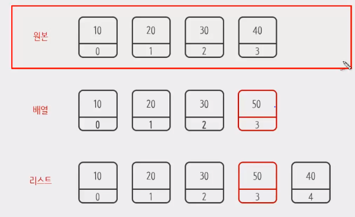

- Array는

  - 인덱스(**위치**)가 중요함

  - a[3] = 50 , 기존에 있던 데이터를 덮어 쓰기 하는 것이 일반적인 배열

  - a[3]을 삭제하는 경우, 해당 틀은 그대로 남아있으면서 값만 없어진다고 보면됨. 

    자세히 보면 메모리값을 차지하고 있음.

    삭제에 대응해서 <u>인덱스값이 변하지 않기 때문에</u> 인덱스는

    유일무일한 식별자느낌

- List는

  - 인덱스도 중요하지만, 데이터가 저장되어 있는 **순서**가 더 중요하게 여겨짐

  - a[3] = 50을 뒤로 미루고, 그 사이에 저장한다.

  - a[3] 을 삭제할 경우, a[4] =40이 앞으로 땡겨지면서 a[3] =40으로 변경

    즉 삭제에 대응해서 <u>인덱스 값이 변함</u>

    리스트에서 인덱스는 몇번째 데이터 정도의 의미


### List 기능

- 처음, 끝, 중간에 <u>엘리먼트를 추가/ 삭제할 수 있음 (가장 중요)</u>

- 데이터가 있는지 없는지 체크 하는 기능
- 모든 데이터에 접근할 수 있는 기능도 있음


### 언어별 차이

**C**

- 리스트 지원 안함
- 그래서 리스트를 만들 수 있어야함


**JavaScript**

- 리스트 지원함
- 배열 = 리스트


**Python**

- 배열을 지원하지 않음. 리스트를 지원함
- 리스트= 배열이라고 생각해도 됨.
- 최근 언어들을 리스트를 **기본적** 으로 지원한다.


**Java**

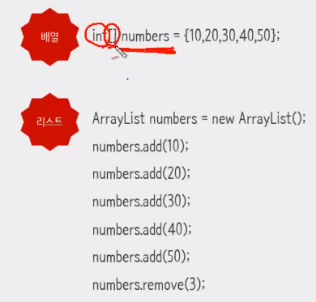

- 배열, 리스트를 완전히 다르게 취급하고 있음
- 리스트, 배열을 모두 지원한다.
- 왜? 배열의 장점이고 리스트의 장점이 있기 때문 직접 선택해라
- Java는 **linked list**와 **Array list**를 지원한다

- 서로 장단점이 크로스, 트레이드오프 형태


## Array List

- List를 만들 때, 그 안에 배열을 사용하는 것


**데이터 추가**

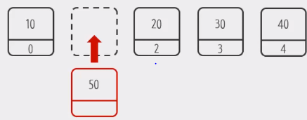

- 빈공간을 만들고, 나머지 데이터를 밀고, 그 안에 데이터를 추가한다.


**데이터 삭제**

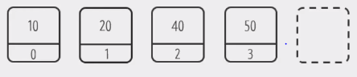

- 해당 데이터를 삭제하고, 나머지 데이터를 땡긴다.

- 이런식으로 하다보면 위치를 조정해야하니까 시간이 오래걸리겠네..


**Get**

- Array List의 가장 중요한 장점 , 데이터를 빠르게 가져올 수 있음
- Linked list는 연결연결연결해서 찾아가는 반면에


### 생성

- Java에서는 collection 으로 제공하고 있음
- `ArrayList<Generic> numbers = new ArrayList();` 


### 추가, 삭제

- `.add()` 추가
  - 빈공간을 만들고, 미루고

- `.remove()` 삭제
  - 삭제하고, 땡기고


### get, size

- `.get(2)` 2번째 인덱스의 값을 가져온다.
- `.size()`  list의 크기


### Iterator

- `Iterator it = numbers.iterator()`
  - iterator 인터페이스

```java
Iterator it = numbers.iterator();
while(it.hasNext()){ // it이 다음 element가 있으면 true 없으면 false;
    int value = it.next();
}

//같은 코드..
for(int value : numbers){
    System.out.println(value);
}

for(int i = 0; i<numbers.size(); i++){
    System.out.println(numbers.get(i));
}
```


### addLast

- 마지막에 데이터를 추가하는 방법

```java
public boolean addLast(Object element){
    element[size] = element;
    size++;
    return true;
}
```


### add

- 중간에 데이터를 추가하는 방법

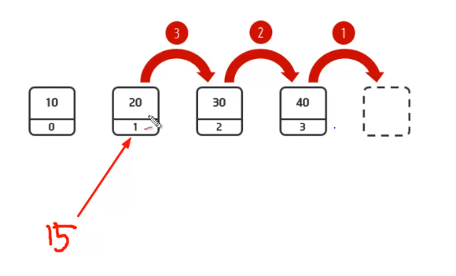

- 엘리먼트를 하나씩 미룬다.

```java
private int size = 0;
private Object[] elementData =new Object[100];

public boolean add(int index, Object element){
    
    for (int i = size-1; i >= index; i--){
        elementData[i+1] = elementData[i];
    }
    elementData[index] = element;
    size++;
    return true;
}

public boolean addFirst(Object element){
    return add(0, element);
    
}
```


### toString

```java
public String toString(){
    String str = "[";
    for(int i=0; i<size; i++){
        str +=elementData[i];
        if(i< size-1){
            str +=",";
        }
    }
    return str +="]";
}
```


### remove

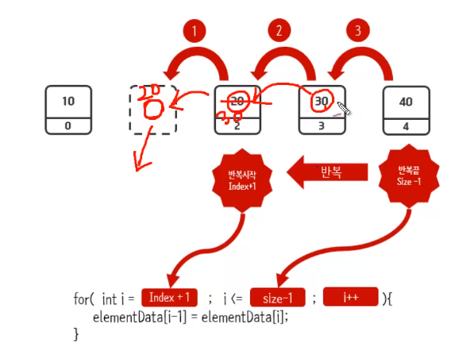

- 리스트는 빈 공간을 허용하지 않음

```java
public Object remove(int index){
    Object removed = elementData[index];
    for(int i = index+1; i <=size-1; i++){
        elementData[i-1] = elementData[i];
    }
    size--;
    elementData[size] = null;
    return removed; //삭제한 값을 알수 있게 해줌
}
```

- collection framwork는 기본적으로 return 값이 있음
- 위치를 재조정하기 때문에 `linked list` 동작속도가 느림을 유추 할 수 있을 것


### removeFirst

```java
public Object removeFirst(){
    return remove(0)
}
public Object removeLast(){
    return remove(size-1)
}
```


### get

```java
public Object get(int index){
    return elementData[index];
}
```

- Array List에서 get을 통해 데이터를 가져오는 경우, 굉장히 빠르게 가져올 수 있다.
- 좋은 점 : 배열에 인덱스로 접근한다. 
- 배열은 메모리에 있음. 메모리에 있을 때, 어느 위치에 있는 데이터를 가져오던 간에 동일한 시간에 데이터를 가져올 수 있음


### size, index of

```java
public int size(){
    return size;
}
public int indexOf(Object o){
    for(int i =0; i<size; i++){
        if(o.equals(elementData[i])){
            return i;
        }
    }
    return -1; //indexof 매개변수를 통해 들어온 찾는 값이 없다.
}
```

- `indexof` 인덱스를 알아보는 메서드


### iterator next hasNext

```java
ArrayList.ListIterator li = numbers.listIterator();
```

- ArrayList 안에, ListIterator라는 클래스이고 numbers에 listIterator()메서드를 실행시킨 결과가 li에 저장됨


```java
public ListIterator listIterator(){
    while(li.hasNext()){
        System.out.println(li.next());
    }
}
class ListIterator{
    private int nextIndex =0;
    
    public boolean hasNext(){
        return nextIndex < size();
    }
    
    public Object next(){
        Object returnData = elementData[nextIndex];
        nextIndex++;
        return returnData;
        //위와 같은 코드
        //return elementData[nextIndex++];
    }
}
```


### Iterator previous hasPrevious

```java
class ListIterator{
    private int nextIndex =0;
    
    public boolean hasNext(){
        return nextIndex < size();
    }
    
    public Object next(){     
        return elementData[nextIndex++];
    }
    public Object previous(){
        return elementData[--nextIndex];
    }
    public boolean hasPrevious(){
		return nextIndex > 0;
    }
}
```


### lterator add remove

```java
public void add(Object element){
    ArrayList.this.add(nextIndex++, element)
}

public void remove(){
    ArrayList.this.remove(nextIndex-1);
    nextIndx--;
}
```


## Linked List

- Link 연결이 무엇인가

- Random Access Memory

  주소를 알고 있으면 데이터를 빠르게 가져올 수 있다.

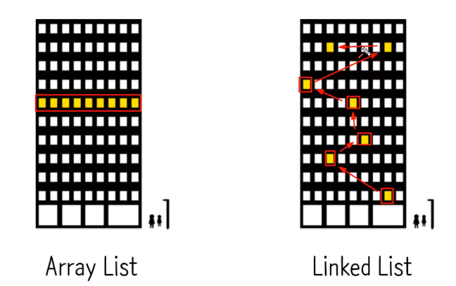

- 두 리스트의 차이는 메모리를 어떻게 쓰느냐


### 구성

- 내부구조

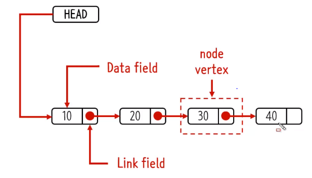

- 노드 : 마디, 교점
- 버텍스 : 정점, 꼭지점

> 참고 하자
>
>  https://visualgo.net/ko

- 추가
  - 객체를 생성하고,
  - 해당 객체.next()를 통해 현재 linked list에 head에 이어주고
  - head 값은 해당객체로 재할당하면
  - 연결 끝!

### Array List vs Linked List

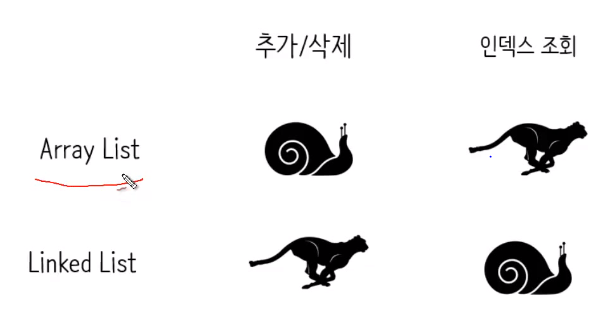

- 인덱스를 통해 조회하면 `Array List` 굉장히 빠르고, 
- Linked는 느림. 왜? 하나하나 연결해가며 찾아야하니까.


### 생성

- Java 

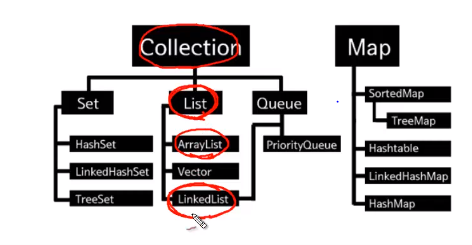

- 객체 생성해서, 서로 연결하는 것이 `Linked List`

```java
public class LinkedList{
    //LinkedList가 가지고 있어야 할것
    private Node head;
    private Node tail;
    private int size = 0;
    
    private class Node {
    //node가 가지고 있어야할것
    	private Object data;
        private Node next;
        public Node(Object input){
            this.data = input;
            this.next = null;
        }
        public String toString(){
            return String.valueOf(this.data)
        }
    }
    
}
```


### addFirst

```java
public void addFirst(Object input){
    // node 객체 생성
    Node newNode = new Node(input);
    newNode.next = head;
    head = newNode;
    size++;
    
    if(head.next =null){
        tail = head;
    }
    
}
```


### addLast

```java
public void addLast(Object input){
    Node newNode = new Node(input);
    if(size ==0){
        addFirst(input);
    }
    else{
        tail.next = newNode;
        tail = newNode;
        size++;
    }
}
```

- 1이상 size를 가지고 있을 때..


```java
Node node(int index){
    //node가 내부적으로 사용자에게 이용되는 지 노출되면 안됨
    Node x = head;	
 	for(int i = 0; i < index;  )  
        x = x.next
}

public void add(int k, Object object){
    if(k==0){
        addFirst(input);
    }else{
        Node temp1 = node(k-1);
        Node temp2 = temp1.next;
        Node newNode = new Node(input);
        temp1.next = newNode;
        newNode.next = temp2;
        size++;
        if(newNode.next == null){
            tail = newNode;
        }
    }
}
```

- 100번째 있는 노드를 가져오려면
- x만 변화시키면 됨.


### toString

- 오버라이드

```java
public String toString(){
    if(head ==null){
        return "[]";
    }
    Node temp = head;
    String str = "[";
    
    while(temp.next !=null){
        str += temp.data +", ";
        temp = temp.next;
    }
    str += temp.data;
    
    return str + "]";
}
```


### removeFirst

- `LinkedList`에서 첫번째 요소가 삭제됨

- 삭제가 되면, 해당 값을 리턴해줘야함

```java
public Object removeFirst(){
    Node temp = head;
    head = head.next;
    Object returnData = temp.data;
    temp = null;
    size--;
    return returnData;
}
```


### remove, removeLast

- 특정 인덱스의 노드를 삭제
- 마지막 노드를 삭제

```java
public Object remove(int k){
    if(k==0){
        return removeFirst();   
    }
    Node temp = node(k-1);
    Node todoDeleted = temp.next;
    temp.next = temp.next.next;
    Object returnData = todoDeleted;
    if(todoDeleted == tail){
        tail = temp;
    }
    todoDeleted = null;
    size--;
    return returnData;
}

public Object removeLast(){
    return remove(size-1);
}
```


### size,get

```java
public int size(){
    return size;
}
public Object get(int k){
    Node temp = node(k);
    return temp.data;
}
```


### indexOf

```java
public int indexOf(Object data){
    Node temp = head;
    int index = 0;
    while(temp.data != data){        
        temp = temp.next;
        index++;
        if(temp = null){
            return -1; //검색 종료 결과없음
        }
    }
    return index;
}
```


### iterator next

```java
public ListIterator listIterator(){
    return new ListIterator();
}
class ListIterator(){
    private Node next;
    
    ListIterator(){
        next = head;
    }
    
    public Object next(){
        lastReturned = next;
        next = next.next;
        nextIndex++;
        return lastReturned.data;
        
    }
}
```


### iterator hasNedt

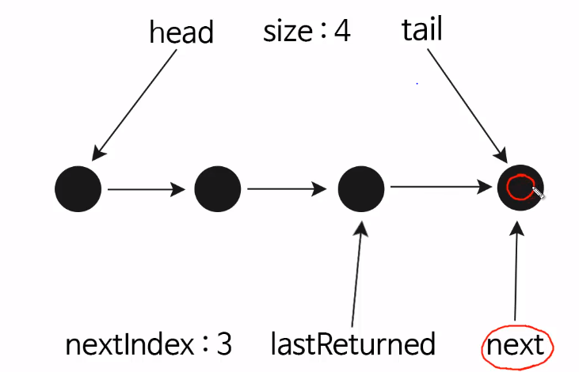

- tail.next? return 값은 있음. 
- `size` > nextIndex 이라면 next 메서드가 작동할 것이고
  - 아니면 더이상 가져올 값이 없을 것이다.

```java
public ListIterator listIterator(){
    return new ListIterator();
}
class ListIterator(){
    private Node next;
    
    ListIterator(){
        next = head;
    }
    
    public Object next(){
        lastReturned = next;
        next = next.next;
        nextIndex++;
        return lastReturned.data;
        
    }
    public boolean hasNext(){
        return nextIndex <size();
    }
}
```

- Double Linked List는 메모리를 더 많이 사용한다..


### iterator add

- `iterator` 를 진행하던 중간에 add를 끼어넣는 메서드
- 첫번째 노드로 추가되도록

```java
public ListIterator listIterator(){
    return new ListIterator();
}
class ListIterator(){
    private Node next;
    
    ListIterator(){
        next = head;
    }
    
    public Object next(){
        lastReturned = next;
        next = next.next;
        nextIndex++;
        return lastReturned.data;
        
    }
    public boolean hasNext(){
        return nextIndex <size();
    }
    
    public void add(Object input){
        Node newNode = new Node(input);
        
        if(lastReturned =null){
        //처음위치에 노드가 추가될때
            head = newNode;
            newNode.next = next;
        }else{
        //중간에 노드가 추가될때
            lastReturned.next = newNode;
            newNode.next = next;       
        }
        lastReturned = newNode;
        nextIndex++;
        size++;
    }
}
```


### iterator remove

- 어떤것이 삭제될것인가?
- lastReturned?

```java
public ListIterator listIterator(){
    return new ListIterator();
}
class ListIterator(){
    private Node next;
    
    ListIterator(){
        next = head;
    }
    
    public Object next(){
        lastReturned = next;
        next = next.next;
        nextIndex++;
        return lastReturned.data;
        
    }
    public boolean hasNext(){
        return nextIndex <size();
    }
    
    public void add(Object input){
        Node newNode = new Node(input);
        
        if(lastReturned =null){
        //처음위치에 노드가 추가될때
            head = newNode;
            newNode.next = next;
        }else{
        //중간에 노드가 추가될때
            lastReturned.next = newNode;
            newNode.next = next;       
        }
        lastReturned = newNode;
        nextIndex++;
        size++;
    }
    public void remove(){
        if(nextIndex ==0){
            throw new IllegarlstateException();
        }
        LinkedList.this.remove(nextIndex-1);
        nextIndex--;
    }
}
```


## Doubly Linked List

- 양방향
  - 이전을 알 수 있도록 해놨음(previous, next..)
- **Previous Link Field가 추가**되었다.

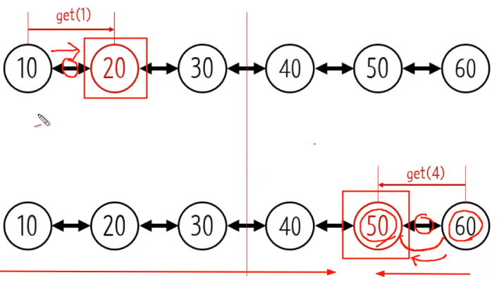

- 조회하는 노드의 숫자에 따라서, next로 할지, 아니면 previous로 할지 고려해볼 수 있을 것이다.

- 단점은?
  - 메모리를 더 많이 사용한다 왜? previous field때문에
  - 좀 더 복잡하다.
    - 그럼에도 불구하고 일반적인 어플리케이션에서 많이 사용한다.

- 단방향 리스트와 추가, 삭제는 컨셉이 거의 비슷. 다만 조금 더 복잡한 몇 과정이 추가되었을 뿐.


### 구성

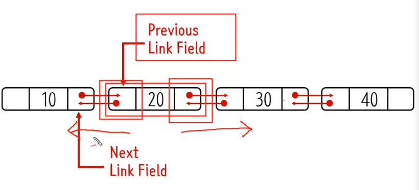

### add

```java
public void (int k,Object input){
    if(k==0){
        addFirst(input);
    }else{
        Node temp1 = node(k-1);
        Node temp2 = temp.next;
        Node newNode = new Node(input);
        temp1.next = temp2;
        if(temp2 != null){
            temp2.prev = newNode;
        }
        newNode.prev = temp1;
        size++;
        if(newNode.next == null){
            tail = newNode;
        }
    }
}
```

- size의 크기에 따라서, index> size/2 이면, tail에서 부터 찾도록 이런방식으로

  

```java
Node node(int index){
    if(index < size/2){
        Node x = head;
        for(int i = 0l i < index; i++){
            x = x.next;
        }
    }else{
        Node x = tail;
        for(int i= size-1; i >index; i--){
            x=x.prev;
        }
    }
}
```


### remove

```java
public Object remove(int k){
    if(k==0){
        return removeFirst();   
    }
    Node temp = node(k-1);
    Node todoDeleted = temp.next;
    temp.next = temp.next.next;
    temp.next.prev = temp;
    Object returnData = todoDeleted;
    if(todoDeleted == tail){
        tail = temp;
    }
    todoDeleted = null;
    size--;
    return returnData;
}
```


### iterator has previous

```java
public boolean hasPrevious(){
    if(nextIndex>0){
        return true;
    }else{
        return false;
    }
}
public Object(){
    if(next == null){
        lastReturned = next = tail;
    } else{
        lastReturned = next = next.prev;
    }
    nextIndex--;
    return lastReturned,data;
}
```


### iterator add

### iterator remove

```java
public void remove(){
    if(nextIndex ==0){
        throw new IllegalStateException();
    }
    Node n = lastReturned.next;
    Node p = lastReturned.prev;
    
    if(p==null){
        head = n;
        head.prev = null;
        lastReturend = null;
    }else{
        p.next = next;
        lastReturned.prev = null;
    }
    
    if(n==null){
        tail = p;
        tail.next =null;
    }else{
        n.prev = p;
    }
    if(next ==null){
        lastReturend =tail;
    }else{
      lastReturned next.prev;  
    }
    
    n.prev = p;
    lastReturned = next.prev;
    size--;
    nextIndex--;
    
}
```

