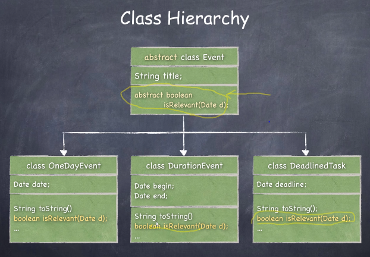
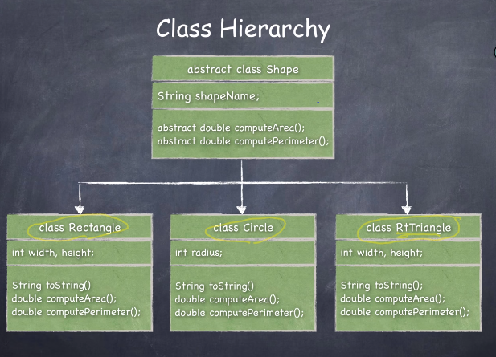

## 3.1 상속(Inheritance)

- 무언가를 부모로 부터 상속 받는다.
- 그래서 코드의 중복을 피한다.

```java
public class Notebook extends Computuer{
 //노트북클래스는 컴퓨터클래스로 확장한다라는 의미.
 //그러면 노트북 클래스는 컴퓨터 클래스를 상속받는다.
    
     public Notebook(String man, String proc, int rom, int disk..){
         super(man, proc, rom, disk..);
     }
   
}
```

- A Notebook **is a** Computer.
  - extends하려면 i**s-a**관계인지 확인
  - 노트북은 일종의 컴퓨터.
  - 컴퓨터 클래스 안에 있는 멤버들은 노트북클래스에도 필요하다.
- Student is a Human..

- `super()` 상위 클래스의 생성자 중에서 매개변수 리스트가 일치하는 생성자를 호출한다. 반드시 생성자 내에서는 첫문장이어야함.


### 상속과 생성자

- 자바에서 클래스는 반드시 생성자를 가진다.
  - 만약에 클래스에 생성자가 없으면, **자동으로 생성자를 만들어줌**
  - 이러한 생성자는 껍질만 있는 생성자. 아무일도 하지 않음
    - 어떤 매개변수도 받지 않고,  무늬만 생성자.


- 모든 서브 클래스의 생성자는, 슈퍼 클래스의 생성자를 먼저 호출한다.
  - 노트북 클래스 생성자는, 컴퓨터 클래스의 생성자를 먼저 호출한다.
    1. `super()`를 통해서 **명시적**으로 호출
    2. 그렇지 않을 경우 no-parameter  슈퍼 생성자를 호출함
       - 노트북클래스생성자 안에서, 컴퓨터 클래스의 no-parameter 생성자를 호출함. 
       - 만약에 컴퓨터 클래스에 파라미터가 없는 생성자가 없다면, 오류!


### Method Overriding

- 부모로 부터 상속 받은 메서드를, 자식에서 다시 작성하는 것**(고치는 것)**
  - 자식 클래스 필요에 맞도록.

- 부모클래스 안에 멤버변수가 `private`이면 <u>자식클래스에서 접근할 수 없음.</u>

- `protected` 멤버는 <u>자식 클래스에서는 접근할 수 있음.</u>

- `super.toString()` 내 부모로부터의 toString 메서드를 쓴다는 의미


### 다형성(Polymorphism)

- 객체지향프로그래밍에서 가장 중요한 의미.

- 수퍼 클래스 타입의 변수가, 서브 클래스타입의 객체를 참고할 수 있음.
  - 그 역은 성립하지 않음

````java
Computer theComputer = new Notebook("Bravo",....);
//만들어진 객체는 노트북객체인데
//theCompter라는 참조변수의 타입을 Computer로 해도, 문법적 오류가 아니다.
````

- <u>만들어진 객체와, 데이터 타입이 달라도 문법적 오류가 아니다</u>

- static binding vs dynamic binding
  - 수퍼클래스와 서브클래스가 동일한 메서드를 가지고 있는 경우 어떤 것이 호출될 것인가?
  - static 컴파일러가 내릴때
  - 실제로 코드를 실행할 때 결정을 내리면, dynamic
- Java에서는 항상 동적 바인딩을 함(dynamic binding)
  - 변수의 타입이 문제가 아니라, 이 변수가 실제로 가리키고 있는 객체의 메서드가 호출됨


## 3.3 클래스 Object, Wrapper 클래스

### Object

- 클래스는 계층적으로 구성되어있음
- Java의 모든 클래스는 `Object` 클래스를 상속받는다
  - 그러면 내가 만들어주지 않아도, `equals` , `toString` 메서드를 가지고 있음.
  - 내가 원하는 대로 작동하기 위해서는 `Override`을 해야함

- `equals(Object)` 
  - 객체들의 주소를 비교하여 같은 주소인지 확인하는 메서드
- `getClass`
  - 동일한 클래스인지 검사


### Wrapper

- Java에서 primitive type 데이터와, non-primitive type데이터가 근본적으로 처리됨.
- Object 타입의 변수에는 어떠한 객체든 참조할 수 있음. 저장할 수 있음.
  - 그렇지만 int,double, char등의 primitive type 데이터는 저장할 수 없음.
  - 그러면 primitive타입의 데이터를 저장하려하면? 이걸 객체로 만들어주면됨.
- 이때 `Wrapper` 클래스를 사용한다.
  - 포장하다.

```java
int a =20;
Integer age = new Integer(a); //객체로 int 20을 만들었음 wrapping
//다형성에 의해서 배열(object)에 저장할 수 있게됨.

//포장한 객체를 다시 int로 풀려면?
int b = age.intValue(); //unwrapping

```

- 데이터 타입간의 변환기능을 제공

```java
String str = "1234";
int c = Integer.parseInt(str);
```


#### Autoboxing, unboxing

```java
int a = 20;
//Integer age = new Integer(a);

array[0] = a; //autoboxing

int b = (Integer) array[0] //autounboxing
```


## 3.4 추상클래스, 인터페이스

### 추상클래스

- `abstract method?`
  
- 선언만 되어있고, 구현되어있지 않을 때
  
- `abstract class?`

  - `abstract method` 하나라도 가지고 있는 `class` 

- <u>추상클래스는 객체를 만들 수 없다</u>

  = new 명령어로, instance를 만들수 없다

  - 그런 클래스가 왜 필요할까?  클래스는 객체를 만들기 위함인데.
  - 따라서 실제로 객체를 만들수는 없고, 클래스를 확장해서 **서브 클래스를 만드는 용도**로 사용됨
  
- 추상클래스는 `extends` 가 되고




### 인터페이스

- 본질적으로 추상클래스와 비슷하지만, 좀 더 극단적인 형태다.
  - 어떤의미에서?
  - **오로지 추상 메서드로만 이루어진 클래스**를 인터페이스라 한다.
- `static final` 테이터 멤버(상수) 를 가질 수 있다
- 인터페이스는 `implements` 됨

```java
public interface Payble{
    public double calcSalary(); //abstract 선언을 할 필요 없음
    public boolean salaried();
    public static final double DEDUCTIONS =25.5;
}

public class Professor implements Payble {
    //추상클래스는 extends 지만, 인터페이스는 implement
    //Payble 인터페이스 안에 정의되어있는 인터페이스를 구현해 줄 것이다.
    
    public double calcSalary(){....}
    public boolean salaried(){...}
}
```


- 예제




- 버블소트

```java
public void bubbleSort(){
    for(int i=n-1; i>0; i--){
        for(int j=0; j<i; j++){
            if(shapes.computeArea() > shapes[j+1].computeArea()){
                Shape tmp = shapes[j];
                shapes[j] = shapes[j+1];
                shapes[j+1] = tmp;
            }
        }
    }
}
```

- 이 버블소트는 generic 하지 않다.
  - 왜? shape데이터만 정렬할 수 있으니까
  - 제네릭하게 만들어주면, 코드 재사용에 편할것


#### Comparable 

```java
public interface Comparable{
    int compareTo(Object o);
}
```

- 이러한 `comparable`은 java API에 정의되어있음


### Inteface vs Abstract Class

- 둘이 완벽하게 같진 않음.
- 가장 중요한 차이점은 **다중 상속** 여부
- 기본적으로 다중상속을 허용하지는 않지만, 경우에 따라서 <u>학생</u>이면서 <u>직장인</u>인 경우가 있으니까..

- 두개이상의 클래스를 extends 하는 것은 허용하지 않음.
- 그렇지만 **두개이상의 인터페이스는 implements 하는 것은 허용**함
- 왜? 인터페이스에는 내용이 없다. 아무 내용이 없이 이름만 있음.
- 이럴 경우 다중상속에서 발생하는 같은 이름의 메소드등이 겹칠경우에 발생하는 문제를 해결


## 3.5  Generic

- 데이터 형식에 의존하지 않고,,, 좀 더 포괄적이거나, 나중에 데이터 타입을 지정할 수 있는 코드, 프로그램을 일컫는 말. (두루뭉실)
- Generic한 자료구조, 하나의 변수에, 서로다른 타입의 객체가 저장될 수 있도록 하는 것..
- Generic한 메서드, 
- Generic 클래스

```java
public class Box<T>{ //가상타입이 T이다
    //실제로 이 클래스의 내용은 특별한 것이 없음.
    private T t;
    public void set(T t) {this.t = t;}
    public T get() {return t;}
}

Box<Integer> integerBox = new Box<Integer>(); //그 T타입을 Integer라고 선언해준다.
integerBox.set(new Integer(10));
Box<Event> eventBox = new Box<Event>();
eventBox.set(new OneDayEvent("dinner", new MyDate(2017,2,10)));
```


```java
public class Pair<K,V>{ //2개 이상의 type parameter를 지정
    private K key;
    private Y value;
    public void set(K key, V value) {this.key= key; this.value =value}
    public K getKey() {return key;}
    ....
}

//객체를 생성하는 시점에서 가상의 타입을 실제 타입으로 지정해줌
Pair<String, Integer> p1 = new Pair<String, Integer>..
```


**Object vs Generic**

```java
public class Box{
    private Object t;
    ....
}
Box box = new Box();
box.set(new Integer(10));
Integer a = (Integer) box.get(); //casting을 통해 generic한 효과를 노릴 수 있음.
```

- 그런데, `type casting` 을 많이하는 프로그램을 좋은 것이 아님.
  - `genetic` 을 이용하는 것이 좀 더 안정적임


####  리스트 클래스

- `LIst` 
  - 여러개의 데이터를 저장
  - 임의의 위치에 데이터를 추가, 삭제, 읽을 수 있고,
  - 용량에 제한이 없음.
  - 인터페이스

- `ArrayList`  LIst계열을 구현한 자료구조중 하나

- `get, set, indexOf, add` 등의 메소드가 있음.


```java
public class MyArrayList<E>{
    private static final int INIT_CAPACITY = 10;
    private E [] theData;
    private int size;
    private int capacity = INIT_CAPACITY;
    
    public MyArrayList(){
        theData = new Object [INIT_CAPACITY]; // E쓰면 오류
      	size = 0;    
    }
    public void add(int index, E anEntr){//지정한 위치
        if(index <0 || index > size)//error, exception
            throw new ArrayIndexOutOfBoundsException(index); //exception handling                    
        if(size >= capacity)
            reallocate();
        
        for(int i = size-1; i>=index; i--){
            theData[i+1] = theData[i];
            theData[index] = anEntry;
        }
    }
    public void add(E enEntry){//맨뒤에
        add(size, enEntry);
    }
    public void reallocate(){
        capacity *= 2;
        theData = Arrays.copyOf(theData, capacity);
        
    }
    public int size(){
        return size;
    }
    public int indexOf(E anEntry){
        for(int i = 0; i <size; i++){
            if(theData[i].equals(anEntry)) //실제로 존재하지 않는 클래스 E를 비교하려면 equals를 사용해야함
                return i;
            return -1;
        }
        
    }
}
```

- `new` 다음에 <u>실제 존재하는 타입이 아닌,</u> 가짜 타입 파라미터는 쓸 수 없음.
  - 그럼 어떻게? `Object`type 으로 만든다. 그럼 아무 타입이나 저장할 수 있으니까

- `vector` 보다 `arrayLIst` 를 사용하는 것이 효과적
  - 단 `vector` 클래스는 다수의 thread 가 충돌없이 vector클래스에 엑세스 할 수 있다는 것이 차이점.
  - 병렬성을 지니고 있음.

## 4. 연결리스트(LinkedList)

- List 
  - 삽입, 삭제, 검색
  - 리스트를 구현하는 대표적인 두가지방법이 배열(ArrayList)과 연결리스트(LinkedList)

- 배열의 단점.
  - 크기가 고정적 즉 `reallocation` 이 필요하다.
  - 리스트의 중간에 원소를 삽입하거나, 삭제할 경우 다수의 데이터를 옮겨야 -> 메모리가 많이 듬.

- 연결리스트
  - 다른 데이터의 이동없이, **중간에!** 삽입, 삭제가 가능.
  - 길이의 제한이 없당.
    - 그러나 랜덤 엑세스가 불가능.,


- 배열은 차례차례 저장되지만,
- 연결리스트는 차례대로 저장되진 않음. 그렇지만 연결되는 다음값도 저장됨.

### 노드

- 데이터(데이터필드), 그 다음 데이터주소값(링크필드)이 한쌍의 값으로 저장됨.
  - 이러한 것은 클래스로 저장되고.
- 첫번째 노드의 주소는 따로 저장해야함. 왜? 이걸 잃어버리면 다른 데이터 들이 어디에 있는 지 찾을 수가 없음.
  - 그래서 `head` 라 지정함.


```java
public class Node <T> {
  public T data;
  public Node<T> next;
  
  //생성자
  public Node(T item){
    data = item;
    next = null;
  }
}
```

```java
public class MySingleLinkedList<T>{
  //첫번째 노드의 주소.
  //모든 Node Class가 저장되는 것은 아닐 것.
  public Node<T> head;
  public int size;
  
  public MysingleLinkedList(){
    head = null;
    size = 0;
  }
  
  public void addFirst(T item){
    //1. 새로운노드를 만들고, 데이터를 저장한다.
    //2. 새로운 노드의 next필드가 현재 head노드를 가르키도록 한다.
    //3. 새로운 노드를 head로 선언한다.
    //순서가 중요하다.
    Node <T> newNode = new Node<T>(item);
    newNode.next = head;
    head = newNode;
    size++;
  }
  
  public void addAfter(Node<T> before, T item){
    //1. 새로운노드를 만들고, 데이터를 저장한다.
    //2. 새로운 노드의 next필드가 before의 다음 노드를 가르키도록 한다.
    //3. 새로운 노드의 before의 다음 노트로 만든다.
    Node<T> temp = new Node<T>(item);
    temp.next = before.next;
    before.next = temp;
    size++;
  }
  
  public T removeFirst(){
    //1. head가 null이 아니라면,
    //2. head.next 노드가 head가 되면 되니까.
    
    if(head == null) {
       return null;
    }else{
      T temp = head.data;
      head = head.next;
      return temp;
      size--;
    }

    
  }
  public T removeAfter(Node<T> before){
    //before이 가리키는 노드의 다음 노드를 삭제한다.
    if(before.next == null){
      return null;
    }
    T temp = before.next.data;
    before.next = temp.next;
    return temp;
    size--;
  }
  
  //삽입
  public void add (int index, T item){ //T type parameter
    Node <T> newNode = new Node<T>(item); //생성가능 , T를 타입패러미터로 가지는 다른 클래스를 생성하는 것은 문제 없음.
    Node <T> [] arr = new Node<T>[100]; //성립하지 않음.
    
    T t = new T(); //성립하지 않음 T타입의 배열, 객체 생성할 수 없음.
    T [] = new T[100];//no ok
  }
  //삭제
  public void remove(int index){
    
  }
  //검색
  public int indexOf(T item){
    
  }
  
  public T get(int index){
    
  }
  
  
  public static void main(String[] args){
    
  }
}
```


- 연결리스트를 다룰 때 가장 중요한 점.
  - 반드시 특수한 경우(head가 null일 경우.., 연결리스트에 노드가 하나도 없을 경우)를 생각한다.