## 출처

- http://www.kocw.net/home/search/kemView.do?kemId=1046323

## 목표

- 운영체제는 컴퓨터 하드웨어 위에, 설치되는 필수적인 소프트웨어 계층
  - 어떻게 컴퓨터 운영에 있어 도움이 될것인가?

## 1. 운영체제란?

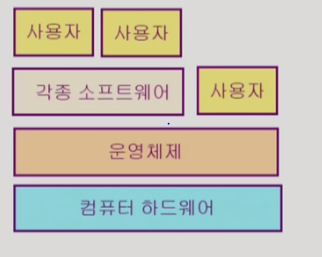

- 기능은 뭐가있을까?

  1. 하드웨어랑 어떻게 교류할까?
  2. 소프트웨어랑, 사용자랑 어떻게 교류할까?

  - 이 두가지가 운영체제 과목을 배우는 목적.

- 즉 운영체제는 컴퓨터 시스템을 편하게 사용할 수 있게하는 목적을 가진다.

  - 컴퓨터자원을 **효율적으로 관리하게 도와주는 역할**을 하는 것이 운영체제

- **협의의 운영체제(커널)**

  - 좁은 의미의 운영체제

  - 항상 메모리에 상주하는 부분

- **광의의 운영체제**

  - 커널뿐만 아니라 각종 주변 시스템 유틸리티 포함

  

- 다수의 프로그램이, 메모리를 요구할 경우 어떻게 운영체제는 <u>자원을 할당</u>할 것인가?

  - 형평성 있는 자원 분배
  - 효율성 있는 자원 관리

- 운영체제는 하드웨어(프로세스, 기억장치) 자원뿐 아니라, 소프트웨어 자원(파일...)도 관리해야함

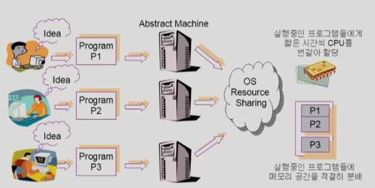

- CPU는 굉장히 빠른 자원.
  - 프로그램마다 하나의 자원을 할당하는 행동을 반복함.
  - 그 행동이 너무 빨라서, 사람들이 이용할 때는 지연을 느끼지 못한다.

### 운영체제 분류

1. 동시 작업 가능 여부

- 단일 작업(과거 운영체제)
  - single tasking
- 다중 작업(현대적인 운영체제)
  - multi tasking
  - 유닉스, 윈도우즈, IOS...

2. 사용자의 수

- 단일 사용자
  - 단일 작업만 지원해주는 과거 운영체제..
  - MS-DOS, 
- 다중 사용자
  - 하나의 서버에서, 다중 계정을 통해 작업을 할 수 있는 운영체제
  - UNIX, NT server

3. 처리방식

- 일괄 처리(batch processing)

  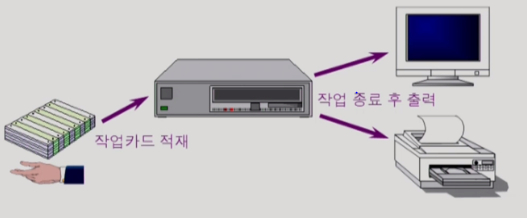

  - 작업을 모아서 처리.
  - 과거 방식 , 이 때는 이게 가장 효율적이였음..

- 시분할(time sharing)

  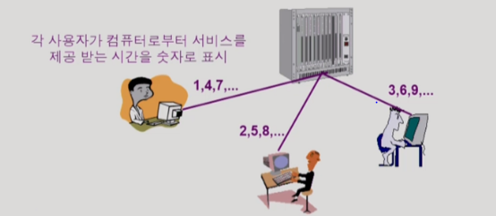

  - 시간 별로 작업을 처리
  - 일괄 처리 보다는 **짦은 응답시간!**
  - 여러 작업을 수행할 떄, 컴퓨터 작업능력을, 일정시간 단위로 분할하여 사용할 때
  - 그러나 사용자가 많아지만, 일정시간이 늘어날 수 있음.
    - 목적은 여러사람이 이용할 수 있게, 자원을 효율적으로 배분하는 것

  

- 실시간(RealTime OS)

  - 실시간 == 시분할?? : Nope
  - deadline이 있어서, 정해진 시간 안에 결과가 나오는 것을 보장해주는 운영체제
  - 즉 특수한 목적을 가진 시스템에서 사용됨 ex) 원자로/ 공장제어, 미사일 제어, 반도체... 로보트 제어등등.
  - Hard realtime system 경성 실시간 시스템 == 무조건 지켜라
  - Soft realtime system 연성 실시간 시스템 == 시간을 지키지않으면, 치명적인 결과를 초래하진 않지만 이용하는 사람이 기분이 나쁠 수 있음..(넷플리스에서 실시간으로 영화를 볼때 )

  

### 생각할점

- 지금 사용하는 운영체제는 **다중 사용, 다중 작업, 시분할** 로 이루어지고 있다는 점.

### 용어

- Multitasking 
- Multiprogramming : 메모리에 여러 프로그램이 동시에 올라가는 것, 멀티태스킹이 되려면, 멀티 프로그래밍이 되어야하지만, 이 용어는 메모리 측면을 강조한 언어
- Time sharing : 멀티태스킹과 유사. 그렇지만 CPU쪽을 강조하는, CPU의 시간을 분할해서 사용한다는 의미.
- Multiprocess : 위와 유사함 

- Multiprocessor : 위 4개와는 조금 다름. 하나의 컴퓨터에 CPU가 여러개 붙어있는 의미.
  - 멀티 프로세서가 지원되고, CPU가 여러개 있음. 병렬적으로 시스템을 실행시킬 수 있음.

### 운영체제의 예

1. UNIX
   - 서버를 위한 운영체제
   - 코드 복잡 만들기 어려움. 왜? 어셈블리 언어(기계어에 가까운 언어)로 되어있어서.. 이 점을 대체하기 위해 C언어(고급 언어, 그러면서 기계어와 상당히 가까운 언어)를 만듬.
   - 다른 컴퓨터에 이식하기 쉬움. 왜? C언어로 작성되어있어서 컴파일 하면 다른 컴퓨터에서도 이해할 수 있게됨
   - 최소한의 커널(항상 메모리에 상주하는)
   - Linux...
2. MS Windows
   - 개인 컴퓨터 목적
   - 단일 작업, 단일 사용자 목적

### 운영체제의 구조

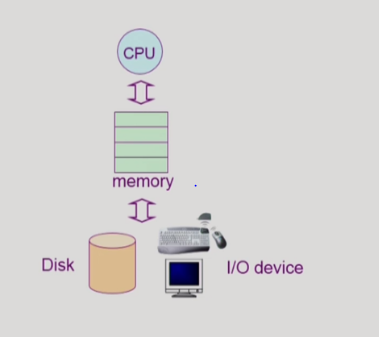

- CPU 스케쥴링 : 누구한테 CPU 시간을 할당할까?... 짦은 시간 간격으로 시간을 줬다 뺐었다함.
- 메모리 관리 : 한정된 메모리를 어떻게 쪼갤까? 공평하게 ? 많이 쓰는 애한테 많이 줘야하나? 

- 파일 관리 : 디스크에 파일을 어떻게 보관할까?, 어떻게 하면은 Disk 헤드의 움직임을 최소화하면서 빠르게 요청을 처리할 수 있을까?

- 입출력 관리 : 각기 다른 입출력 장치와 컴퓨터 간에 정보를 어떻게 주고 받게 할까? 

## 2. System Structure & Program Execution

- 운영체제 설명에 앞서, 컴퓨터 하드웨어의 동작에 대한 강좌.

  

### 컴퓨터 시스템 구조

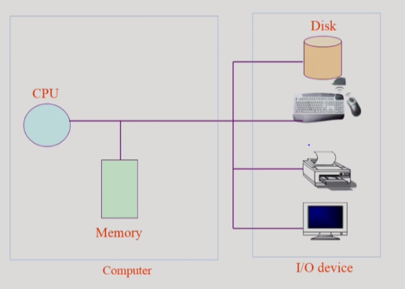

- I/O ? input, output

- Memory : CPU의 작업공간, CPU는 <u>매클럭사이클 마다, 메모리에서 기계어를 읽어서 실행</u>시키게 됨

- DISK : I/O device 

  

  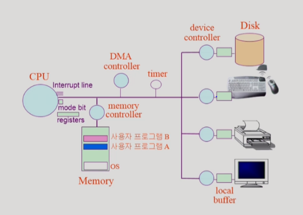

- registers
  
- PC : program conter , cpu가 실행시킬 다음 작업의 메모리 주소를 가지고 있음.
  
- 각 I/O device마다 컨트롤러가 붙어 있어서, 작은 CPU 역할을 하고 있음.

- local buffer? 각 device의 작업공간

- mode bit : cpu에서 실행시키는 것이 운영체제 인지 사용자 프로그램인지 구분

  CPU는 메모리하고만 일하니까.  I/O device에는 접근 안함. 

  - 그러면 Disk에서 읽어오라는 요청은 어떻게 처리함?
  - CPU가 직접 Disk에 접근하지 않고 device controller에게 하라고 시킴
  - 이 작업을 interrupt line을 통해

- timer : 특정 프로그램이 CPU를 독점하는 것을 막기 위함.

  - CPU에 프로그램을 넘겨줄 때, timer를 설정하고 넘겨주기 때문에, 이 제한 시간을 넘기면 cpu에게 interrupt 를 걸음.
  - CPU는 interrupt line을 체크하여, OS에게 권한을 넘겨서 다음 프로그램으로 작업이 넘어감.

- 프로그램일 실행하다가 I/O 요청이 오면?

  - controller가 interrupt를 걸고, CPU는 운영체제에게 넘어가고, 운영체제는 왜 interrupt가 걸렸는 지 확인하고, I/O 프로그램 때문이라는 것을 확인하고 CPU를 할당하고
  - 끝나면, interrupt이전 작업에게 다시 CPU에게 할당하고

- Mode bit
  - **0이면?** 운영체제가 cpu를 가지고 있을 때는, 모든 작업을 실행할 수 있게 되어있음.
  - **1이면?** 사용자 프로그램이 cpu를 가지고 있을 때는, **제한,한정된 작업 실행**
  - interrupt가 들어오면 mode bit은 자동으로 0으로 바뀌게 됨.
  - 왜 필요?
    - 사용자 프로그램의 잘못된 수행으로 다른 프로그램 및 운영체제에 피해가 가지 않도록 하기 위함
  - 모니터 모드?
    - ==커널모드, 시스템 모드
- Timer
  - 하드웨어
  - 특정 프로그램이 cpu를 독점하는 것을 막기 위해.
  - 정해진 시간이 흐른 뒤에 운영체제에게 CPU제어권이 넘어가도록 타이머를 걸어놓은 것

- Device Controller
  - I/O 장치를 관리하는 작은 CPU, 하드웨어 장치
  - local buffer 가짐 

- Device Driver
  - CPU가 실행하는 장치들을 작동시키지 위한 코드를 가지고 있음.

- DMA controller
  - Direct Memory Access Controller
  - 메모리에 접근할 수 있는 컨트롤러. 
    - 원래는 메모리에 접근할 수 있는 것은 CPU 단독이지만,
    - memory controller도 접근할 수 있기에, 중재하는 역할
  - 또한, 중간중간에 들어오는  cpu로 향한 interrupt가 될 작업들을 가지고 있다가 한번에 메모리에 올려 interrupt를 걸고 알려주는 역할

### 인터럽트

- 하드웨어가 거는 interrupt , **timer** , **I/O controller**
  - 일반적인 인터럽트
- 소프트웨어가 거는 interrupt : **trap**
  - System call, Exception...
- 인터럽트 벡터
  - 인터럽트 종류(**번호**)마다 어디에 있는 함수를 실행시켜하는 지 **주소**를 적어놓은 것
- 인터럽트 처리 루틴
  - 인터럽트 종류마다 할일이 다르니까. 이러한 일을 운영체제에 저장해 놨음

### 입출력

- 모든 입출력 명령은 특권 명령

  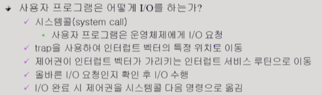

- 요청은 하드웨어 인터럽트를 통해, 요청이 다 끝나면 소프트웨어 인터럽트(트랩)

- 운영체제는 cpu를 사용할 일이 없음. 인터럽트가 들어올 때만 cpu운영권한을 얻지 그렇지 않으면 항상 사용자 프로그램만 돌리고 있음.

### 시스템 콜

- 사용자 프로그램이 운영체제의 서비스를 받기 위해 커널 함수를 호출 하는 것.
- 운영체제 함수를 호출하는 것. CPU제어권이 운영체제에게 넘어가게 하는 것.

### 동기식 입출력, 비동기식 입출력

- synchronous I/O

  - I/O 요청 후, 입출력 작업이 완료 된 후에야 제어가 사용자 프로그램에게 넘어감.

  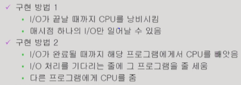

  - I/O요청이 끝났음을 interrupt를 통해 알려줌.
  - 요청이 끝날 때 까지, 기다려야하는 방식
    - 그러면 자원이 낭비되지 않을까?
    - **보통 동기식 입출력을 구현**할 때, 방법 2를 사용함.

- asynchronous I/O
  - I/O가 시작된 후, 입출력 작업이 끝나기를 기다리지 않고 제어가 사용자 프로그램에게 넘어가는 것.
  - 요청이 끝나기 전에도, 다른 일을 시작하는 방식

- 예시

  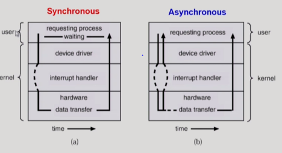
  
  - 동기식 입출력 
    - 프로세스가 입출력 요청을 함 -> 운영체제 -> 컨트롤러
    - 입출력이 끝나는 동안 프로세스는 아무것도 안하면 **동기식 입출력**
  - 비동기식 입출력
    - 입출력이 끝나기 전에, 프로세스가 instruction을 실행하게 되면 비동기식 입출력.

### 서로 다른 입출력 명령어

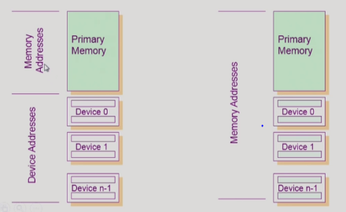

- 왼쪽

1. 메모리 접근하는 명령어
2. I/O device에 접근하는 명령어

- 오른쪽

1. I/O장치도, 메모리 주소에 연장주소를 붙인다음에 메모리 접근하는 명령어를 통해 접근 할 수 있게함.
   - Memory mapped I/O

- 왜 다르게 했을까?

### 저장장치 계층 구조

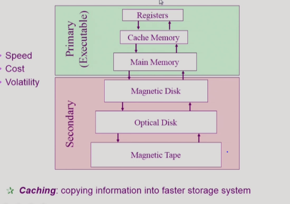

- 특징 : 위로 갈 수록 속도가 빠름. 
  - 그렇지만 가격도 비싸고, 용량이 작음.
- 연두색 : 휘발성 매체
  - 분홍색 : 비휘발성 매체
- byte 단위 접근할 수 있는 Primary, Executable한
  - CPU에 직접 접근하지 못하는 개체 : Secondary

- Caching : 다른 매체를 통해 데이터를 읽어서 사용하는 것.
  - 그렇지만 밑에서 모든 것을 다 읽진 못함. 위로 갈수록 용량이 작아지니까.. 
  - 이것을 어떻게 관리해야 되는지가 포인트.

### 프로그램의 실행 (메모리 load)

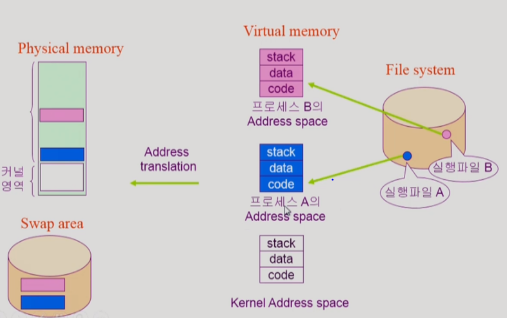

1. 파일시스템 : 실행파일
2. virtual memory
   - code : 기계어
   - data : 자료구조
   - stack : 함수를 호출할 때 데이터를 쌓는 용도
3. 프로세스로

- virtual memory에 있는 것을 모두 다 physical memory에 올리는 것이 아니라 , 필요한 일부분만 올림. 메모리를 효율적으로 사용하기 위해서
- 꼭 필요하지 않은 부분은 Swap area에 내려놓음.
- 즉 그림에 보이는 것처럼 Virtual memeory에 모여있는 것이 아니라, 일부분은 Physical memory에 일부분은 Swap area에 있음.

- Swap area : 휘발성. 메모리 관리를 위한 공간.
- File system : 비휘발성. 파일 관리를 위한 공간.

### 커널 주소 공간 내용

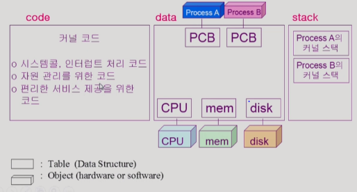

- process controller block
- 사용자 프로그램마다 따로 커널 스택을 가지고 있음.

### 사용자 프로그램이 사용하는 함수

- 함수
  - 사용자 정의함수
  - 라이브러리 함수
  - 커널 함수
    - 운영체제 프로그램의 함수
    - 커널 함수가호출되는 것은 시스템 콜을 의미한다.

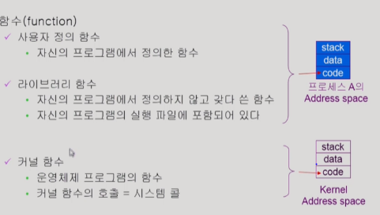

- 프로스세 A의 address space에서 Kenel Address space로 점푸하지는 못함.

### 프로그램의 실행

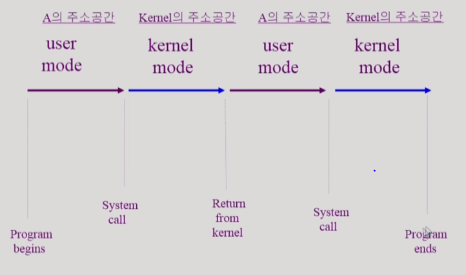

- 유저모드에서 실행이 됨.
- 시스템 콜을 하게 되면, 운영체제 커널 주소 공간에 있는 코드가 실행되고
- 시스템 콜이 끝나게 되면, A라는 프로그램에게 CPU제어권이 넘어가고, 
- 본인 코드 주소에 있는 코드를 실행하게 됨.
- 즉 프로그램의 실행은 유저 <-> 커널 모드 하면서 실행됨을 알 수 있음.

## 3. 프로세스

- program in execution

  - 실행중인 프로그램을 일컫는 말.

- 프로세스의 문맥

  - 특정 시점을 놓고 봤을 때, 어디까지 수행을 했고 어디까지 와있는가?
    - 이게 왜 필요해? 연속되어 실행될 수 있게 하려고...?

  1. 하드웨어 문맥  : 레지스터가 어떤 값을 가지고 있는가?
  2. 프로세스의 주소 공간 : code, data, stack에 어떤 값이 들어가 있는가?
  3. 프로세스 관련 커널 자료 구조 : PCB(Process Control Block)

### Process State 

- 컴퓨터 내부에 CPU는 1개로 정의

1. Running
   
   - CPU를 잡고, instuction을 수행 중인 상태
2. Ready
   - CPU를 잡기 위해 대기하고 있는 상태
   - 다른 모든 준비는 끝나있고, CPU만 얻기를 기다리고 있음. 보통 이 상태에 있는 프로그램들이 CPU를 잡았다 놨다 하면서 실행됨.
3. Blocked
   
   - CPU를 주어도 당장 instruction이 불가능한 상태 (= 시간이 오래걸리는 I/O 작업들)
4. Suspended
   - CPU뿐만 아니라, 외부에서 이 시스템을 강제로 정지해놓은 상태
   - **중기 스케쥴러**와 함께 알아야한 프로세스의 상태

5. etc

   - new : 프로세스가 생성중인 상태

   - terminated : 수행이 끝났음. 그렇지만 정리가 필요한 상태

   

- Blocked 는 자기 자신이 요청한 상태, event가 만족되면 Ready상태로 돌아감
- Suspended는 반면여, 외부에서 요청한 상태로, 외부에서 resume을 해줘야 Active함

6. 프로세스 상태도

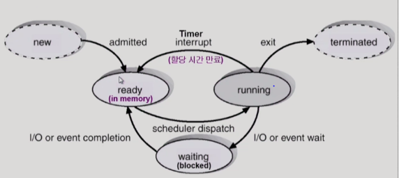

​	

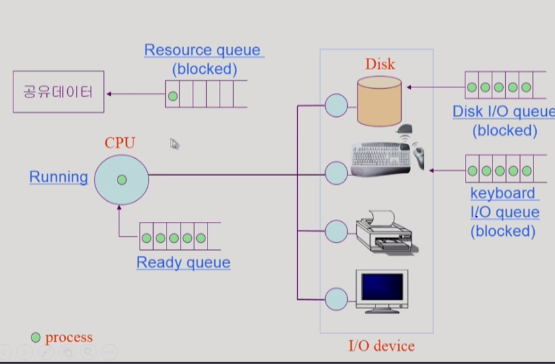

- 프로세스가 디스크에서 무언가 읽어야 한다? Running 상태에서 blocked상태로 변함
  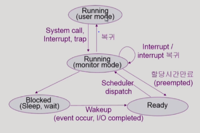

  - 사용자모드에서 코드 실행 중인 상태

  - 프로세스가 자기 코드를 실행하다가, 콜해서 운영체제 코드가 실행 중이면 이 프로세스가 커널모드에서 run하고 있는 상태라고 부름

  - interrupt 해서, 운영체제 코드가 실행 중이면, monitor mode에 들어갔다고 함.

    ​	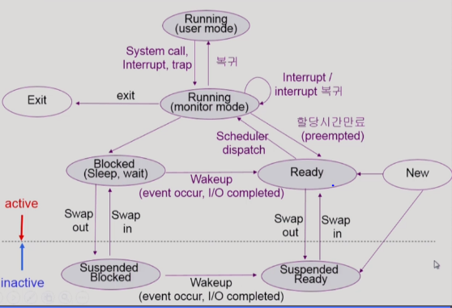

  - 점선 아랫 부분은 inactive한 상태. 외부에서 간섭으로 인해서. 프로세스가 얼어붙어있는 상태

  

### Context Switch

- CPU가 한 프로세스에서 다른 프로세스로 넘겨주는 과정을 일컫는 말.

  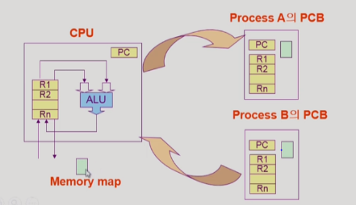

- CPU를 뺐었으면,운영체제가 프로세스가 다시 실행될 때 어디까지 실행되었는 지 기억할 수 있도록 함.
- 어디에다가? 실행되고 있던 프로세스의 **PCB**에다가!

- System call : 운영체제가 CPU에게 요청하는 것

- Interrupt : 하드웨어 , 컨트롤러가 CPU에게 거는 것

  - System call, Interrupt가 발생시 반드시 context switch가 일어나는 것은 아님.

  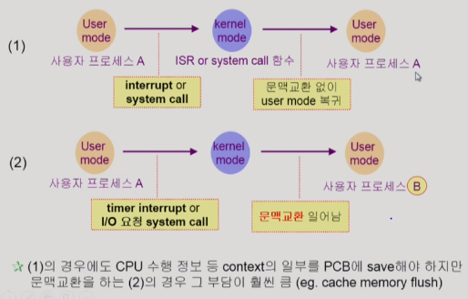

  - 1번 은 문맥교환 아니고, 2번은 문맥교환임.
  - 차이는 중단된 프로세스가 interrupt of system call 이후에 그대로 지속되었는가?
  - 즉 프로세스 자체가 바뀌었는가?

### 프로세스를 스케줄링 하기 위한 큐

- Job queue
- Ready queue
- Device queue
- Resource queue
  - 이러한 큐들이 프로세스 앞에 줄서 있고, 이것을 운영체제가 관리하는 것

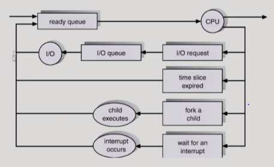

### 스케쥴러

- Long-Term Scheduler
  - 시작 프로세스 중 어떤 것들을 ready queue로 보낼지를 결정함.
  - 프로세스에 메모리(및 각종 자원)을 주는 문제를 결정
  - 우리가 사용하는 시스템(time sharing system)에서는 장기 스케쥴러가 없음....
    - 보통 시스템은 일단 실행되면 ready상태로 메모리에 올라감.

- Short-Term Scheduler
  - 어떤 프로세스를 다음번에 running 시킬지 결정하는 스케줄러
  - 프로세스에 CPU를 주는 문제를 결정

- Medium-Term Scheduler 
  - 중기 스케쥴러
  - 현재 대부분 우리가 사용하는 스케쥴러
  - 일단 프로그램을 메모리에 다 올려놓고, 너무 많은 프로그램이 메모리에 올라가있으면 적절하게 선정하여 쫒아냄.

### Thread

- 프로세스 내부에, **CPU 수행 단위**를 일컫는 말.

  - == lightweight process 

- 보통 프로세스 하나 주어지면, 몇가지 쓰레드가 있게됨.

  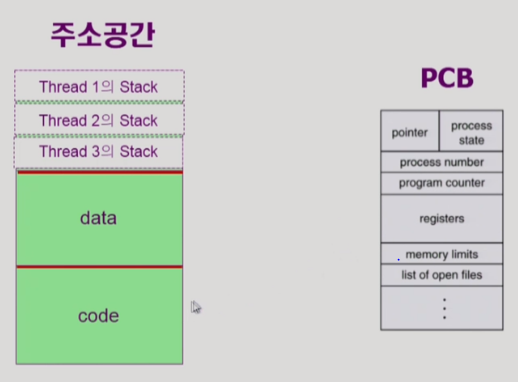

- 같은 일을 하는 프로세스를 여러개 하고 하고 싶으면, 주소공간을 하나, 메모리를 하나만 띄어놓고 PC만 여러개를 둠.

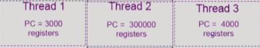

- 레지지터에 위의 쓰레드들이 있음

- 프로세스 하나에서 공유할 수 있는 것은 최대한 공유하고, PC, registers, stack같은 것을 쓰레들간에 별도로 가지고 있는 것.

- 구성

  1. program counter

  2. register set
  3. stack space

- 동료 쓰레들과 공유하는 부분(=task)

  - code section
  - data section
  - OS resource

  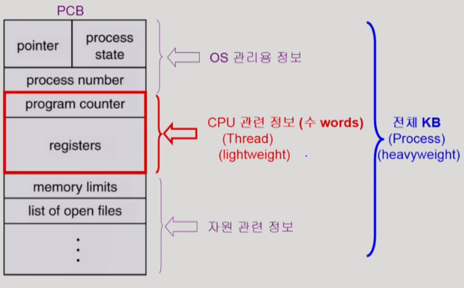

  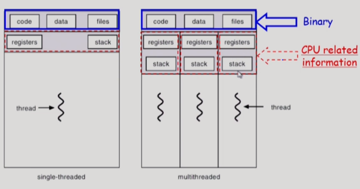

  

- 장점

  - 하나의 프로세스 안에 여러개의 쓰레드를 두게 되면, 하나의 쓰레드가 blocked 상태 일 때, 다른 쓰레드가 CPU를 잡고 Running 할 수 있음. 가볍게
    - 웹페이지를 읽어오는 동안에는 웹브라우저는 blocked 상태. 그렇게 되면 사용자 입장에서는 답답함. 왜 화면에 안보이니까.
    - 그러니까 여러개의 쓰레드를 통해 웹페이지를 읽게 되면 , 하나의 쓰레드가 일부만이라도 화면에 보여준다면 사용자에게 **빠른 응답성** 을 제공할 수 있게함.
  - 동일한 일을 수행하는 다중 쓰레드가 협력하면, **높은 처리율** 과 **성능향상** 을 얻음.

### Benefits of Threads

1. 응답성 Responsiveness
   - muti-threaded Web... 비동기식 입출력

2. 자원 공유 Resource Sharing
   - 하나의 수행을 별도의 프로세스를 통하기 보다는, 하나의 프로세스 안에 쓰레드를 나누는 것이 좀 더 효율적.
3. Economy
   - 프로세스를 하나 만드는 것보다, 하나의 쓰레드를 추가하는 것이 경제적이다(덜 오버헤드함.)
4. Utilization of MP Architectures

### Implementation of Threads

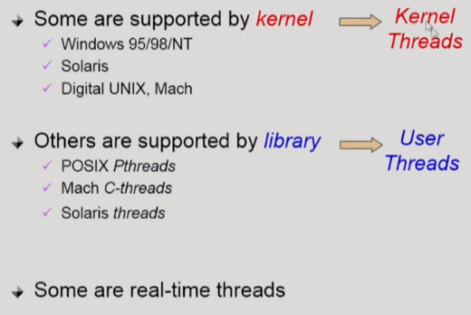

- 커널 쓰레드
  - 운영체제가 여러 쓰레드가 있다는 것을 알고 있음.
  - 운영체제가 쓰레드를 넘기는 것을 도와줌
- 유저 쓰레드
  - 운영체제가 여러 쓰레드가 있다는 것을 모름
  - 사용자 수준에서, 라이브러리 도움을 받아서 쓰레드를 넘겨줌
- 리얼타임 쓰레드.

## 4. Process Management

### 프로세스 생성(Process Creation)

#### **COW** copy-on-write

- 일단 자식프로세스는 부모프로세스의 자원을 공유하다가, 자식 프로세스에서 변경사항이 생기면, 그러면 write하겠다.

- 부모 프로세스가 자식 프로세스를 생성(복제)할 수 있고.
- 프로세스는 운영체제로 부터 필요한 자원을 할당받고
- **기본적**으로는 부모, 자식 프로세스가 자원을 공유하지 않음.
  - 더 많은 자원을 얻기 위해 경쟁하는 형태가 많음.
- 수행(Execution)
  - 부모와 자식이 공존하면서 수행하는 모델
  - 자식이 종료terminate까지 기다리는 부모 모델도 있음.

- 어떻게 생성할까?
  - 복제생성
    - 부모 프로세스의 주소 공간을 자식 프로세스가 그대로 복사함
    - 부모 데이터들도 똑같이 복사.
    - 이렇게 복제된 곳에, 새로운 프로그램을 덮어씌우는 형식으로
  - **fork()** : 시스템 콜, 부모를 그대로 복사하는 과정
    - 시스템콜이면, 운영체제한테 자식을 만들어달라고 부탁하여 복사하는 방식
    - 즉 주체적으로 프로세스가 프로세스를 만드는 것은 아님.
  - **exec() : ** fork 다음에 이어지는 시스템콜로, 새로운 프로그램을 덮어씌우는 단계

1. 일단 복제해놓고,
2. 그래놓고 새로운 것을 덮어씌우는 방식

### 프로세스 종료(Process Termination)

- 프로세스가 마지막 명령을 수행한 후, 운영체제에게 이를 알려줌 **exit**
  - java `;` 는 컴파일시 exit 명령어를 실행하라고 말해주는 것

- 비 자발적으로 프로세스가 종료되는 경우? **abort**

  - 어떨때?

    1. 자식이 주어진 자원의 할당치를 넘어서면, 부모가 강제로 죽이는 것.

    2. 더이상 부모 프로세스가, 자식프로세스에게 실행시킬 일(task)이 없을 때

    3. 부모 프로세스가 종료되는 경우

### fork()

- 시스템 콜이고
- create a new address space that is a duplication of the caller

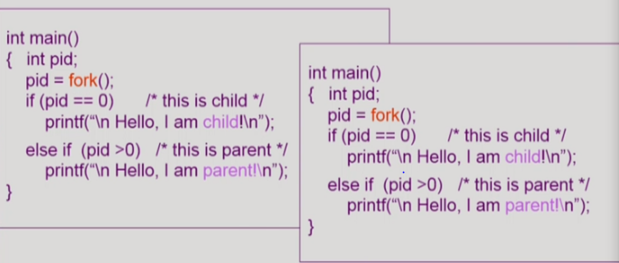

- 좌측 부모, 우측 자식
- fork()가 실행되면 , 자식이 만들어졌을 때 fork()가 한 것 까지 기억을 해놨다가 다음 줄 부터 시작된다.
  - 어떻게 구분할까?
    - 부모 프로세스는 fork() 결과 값이 **양수!**
    - 자식 프로세스는 fork() 결과 값이 **0을** 받음

### exec()

- 시스템 콜

- replace the memory image of the caller with a new program

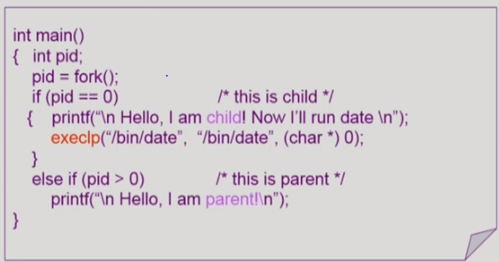

- `execlp` 덮어씌우게 도와주는 명령어

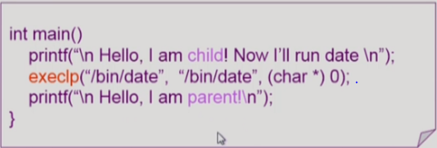

- 즉 `execlp` 이후에 있는 코드인 printf ... i am parent!는 실행이 되지 않는 코드이다. 절대로 돌아올 수 없음

### wait()

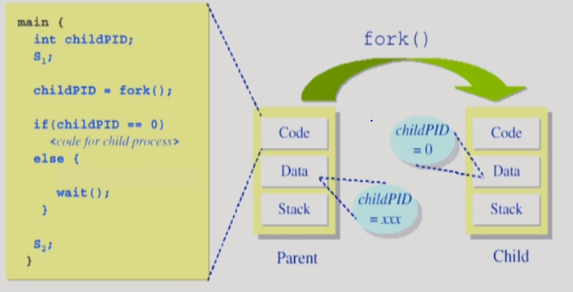

- 프로세스를 잠들게 하는 것.
  - `block` 상태로 보내는 것. 
  - ex) I/O 작업

- 자식 프로세스 만든 다음에 사용하는 시스템 콜로, 자식 프로세스의 종료를 기다리며, 부모프로세스를 잠들게 하는 역할로 사용함.
  - 왜?
  - 자식이 종료될 때 까지 부모가 기다리는 모델을 위해

### exit() 

- 자발적인 종료
  - `}` 
  - `;`
  - 프로그램에 명시적으로 넣어주지 않아도 main함수가 리턴되는 위치에 컴파일러가 넣어줌
- 비자발적인 종료
  - 부모 프로세스가 자식 프로세스를 강제 종료시킴
  - `kill,break` 
  - 외부에서 종료시키는 경우
  - 부모 프로세스가 종료되는 경우
    - 본래 프로세스는 자식이 죽고, 부모프로세스가 종료되어야함
    - 그래서 부모 아래 있는 자식 프로세스를 모두 종료시키고, 부모 프로세스가 종료됨.

### 프로세스 간 협력

- 독립적 프로세스(Independent process)

  - 원칙적으로 하나의 프로세스는 다른 프로세스 수행에 영향을 미치지 못함

- 협력 프로세스(Cooperation process)

- 프로세스 간 협력 메커니즘(IPC : interprocess Commuication)

  1. 메세지를 전달하는 방법 : message passing(커널을 통해 메세지를 전달함)

     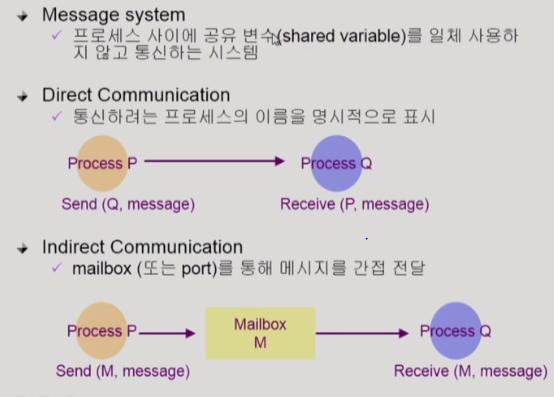

  2. 주소 공간을 공유

     - shared memory

       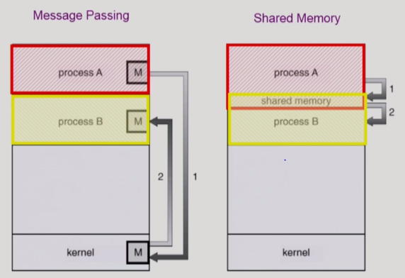

       - 일부 프로세스 공간을 공유함
       - 프로세스 b에다가 적으면, 프로세스 a도 공유된 공간을 통해 파악할 수 있을 것
       - 커널한테, shared memory를 쓴다고 call을 해야 사용할 수 있음

     - thread 

       - 한 프로세스 안에, 여러 thread 활동하는 것
       - 그러면 thread끼리는 완전한 협력이 가능할 것. 주소 공간 자체가 전체적으로 공유되기 때문에

## 5. CPU 스케쥴링

- CPU and I/O Burst in Program Execution

  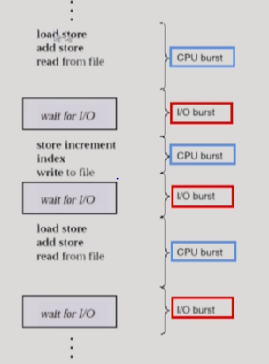

  - 어떤 프로그램이든, CPU Bursts 와 I/O Burst가 반복되면서 실행된다.

### CPU-burst-Time의 분포

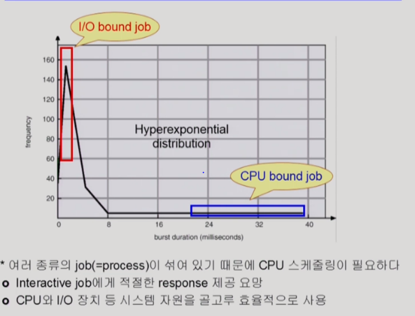

- cpu를 짦게 쓰고, 빈도가 잦으면서, 중간에 I/O가 끼어드는 잡 = I/O bound job
- cpu를 길게 쓰면? = CPU bound job
- **여러 종류의 잡이 있기에**, CPU 스케쥴링이 필요하다.
  - I/O bound job은 interactive job이기 때문에 CPU를 잡아서 사람에게 줘야 이용자가 불편함을 느끼지 않을 것
  - CPU 스케쥴링은 즉 interactive job을 원활하게 하게 위함

### 프로세스의 특성 분류

1. I/O bound job(process)
   - 사람과 작업하는,
   - CPU를 길게 잡고 있기 보다는 짦게, 빈도수를 많이 잡으면서 I/O에 더 많은 시간을 투자하는 잡
2. CPU bound job(process)
   - **계산** 위주의 job

### CPU Scheduler & Dispatcher

- 스케쥴러
  - Ready 상태의 프로세수 중에 CPU를 줄 프로세스를 고르는 역할을 함
  - **운영체제 안**에서 CPU 스케쥴을 하는 기능을 담당

- 디스패쳐
  - 실제로 CPU를 주는 역할
  - Context switch(문맥 교환)을 통해 CPU 제어권을 선택된 프로세스에게 넘김

- 언제 필요할까? CPU 스케쥴링이?

  1. Running -> Blocked (ex) I/O작업으로 넘어간 경우)
  2. Running -> Ready (할당시간 만료 될 경우, timer interrrupt)
  3. Blocked -> Ready (I/O작업이 끝난 경우, 인터럽트를 걸어서 CPU를 넘겨줌)
  4. Terminate

  

## 6. Process synchroniztion

### 프로그램적 해결법의 충족 조건

1. Mutual Exclusion (상호 배제)

- 어떤 프로세스가 critical section에 들어가있으면, 다른 프로세스는 들어가면 안됨.

2. Progress (진행)

- critical section에 아무런 프로세스가 없는 상태에서, 들어가고자 하는 프로세스가 있으면 critical section에 들어가도록 허락해줘야함

3. Bounded Waiting(유한 대기)

- 특정 프로세스가 critical section에 들어가려하는데, 마냥 기다리지 않도록 해야함.

### Algorithm 1

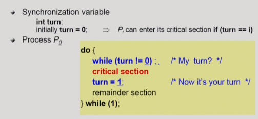

- Process P0, P1이렇게 코드가 두가지 있다고 가정함. (같은 코드로)
- while문을 돌면서 체크함.
  - turn 어떤 프로세스 차례인가? 프로세스 0번,  프로세스 1번???
  - 0번차례가 아니면, while문을 돌면서 계속 기다림
- turn이 0이면, crtical section에 들어갔다나
- 나오면 turn을 1로 바꿔줘서 상대방 차례로 바꿔줌
- if 프로세스마다 critical section에 들어가고자 하는 빈도수가 다를 수 있음.
  - 그럼 상대방이 turn을 바꿔주지 않으면, 들어갈 수가 없음.
  - 즉 **2. Progress** 조건을 만족하지 않음.

### Algorithm2

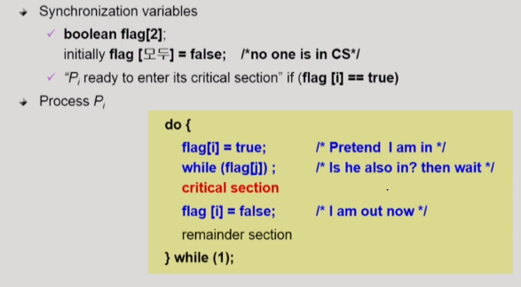

- flag 사용
- flag == true이면 critical section에 들어가고 싶은 의사표시
- 상대방의 플래그를 체크하고
- true이면 기다리고, 아니면 자신이 들어감
- 자신이 들어갔다가 나오면 자신의 플래그를 false로 바꿔줌

- 둘다 깃발만 들고 있지, critical section에 들어가지 않았으면 진행이 되지 않음. 즉 2번 조건을 만족하지 못함

### Algorithm3 (Peterson's Algorithm)

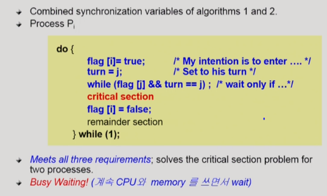

- **flag, turn** 두가지를 사용함
- while문을 돌고있는 프로세스는 계속 flag , turn을 체크함. 상대방이 나올때까지 변할리가 없으니까. 그럼 *비효율적* -> Busy Waiting

### Synchonization Hardware

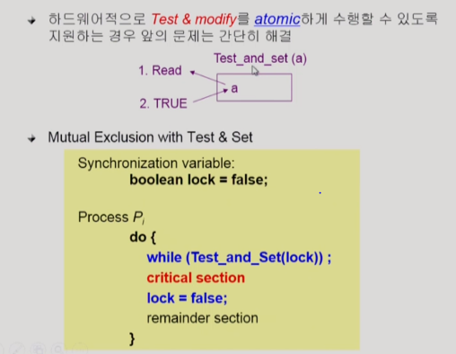

- 문제는 프로세스가 쓰기와 읽기를 동시에 못하는 것. 그래서 이부분을 지원해주면 위의 문제가 해결됨.
- 하드웨어적으로 지원해줌

- 읽어서, 값을 변경해주는 atom하게 인스턱션을 지원해줌
- <u>들어갈 때 lock을 걸고, 빠져 나올 때 lock을 풀어줄 수 있게 코드가 간결</u>하게 바뀐다.

###  Semaphores

- 추상자료형
  - Object와 Operation으로 구성됨
  - 논리적으로 정의하는 거지, 실제로 구현된 것과는 다른 의미

- Semaphore S도 추상자료형

  - P,V연산으로 Operation을 구성함

  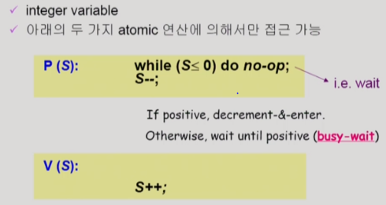

  - 프로그래머가 좀 더 간편하게, Lock을 사용할 수 있도록.
  - 그렇지만...

### Critical Section of n Processes

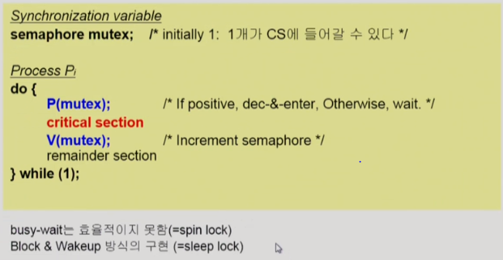

- 세마포어를 획득할 수 없으면, 그 프로세스를 block하고,
- 이제 세마포어를 획득할 수 있으면 잠들어 있는 프로세스를 wakeup 함

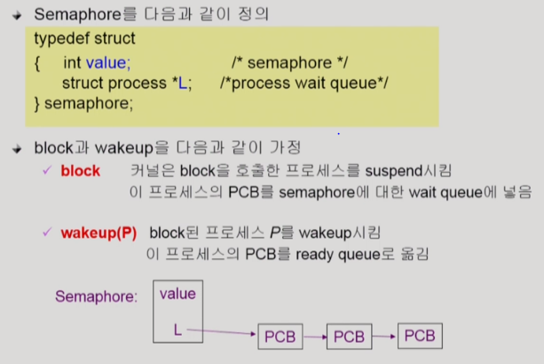

- L? 프로세스를 연결하는 리스트

### Implementation

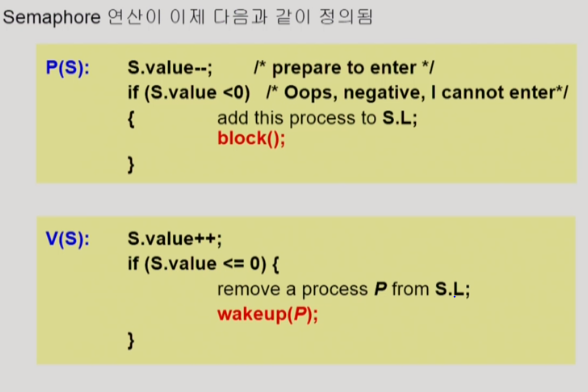

- 어떤 프로세스가 세마포어를 획득하려 하는데  S.value<0이면 즉 자원을 쓰고 있는 프로세스가 있으면, S.L에 이 프로스세를 연결해놓고 해당 프로세스를 block상태로 나둔다.

- 그리고 어떤 프로세스의 자원을 증가시켰는데 s.value <=이라는 것은 P operation에 들어갔었음. 즉 잠들어있을 것 그러면 프로세스를 세마포어 리스트에서 빼고, 그 프로세스를 깨운다.

- S.value < 0 ? 누군가가 세마포어를 획득하기 위해 기다리고 있다.
- 양수면 세마포어를 획득해서 프로세스가 진행중에 있다.
- S.value는 기다리고 있는 프로세스가 있는지 확인하는 용도

### Which is better?

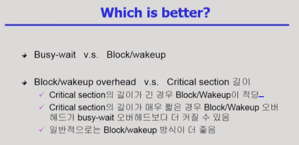

### Semaphore 종류

- 2가지 있음

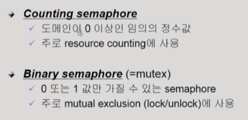

### Deadlock and Starvation

- Semaphore 사용시 주의해야할 점

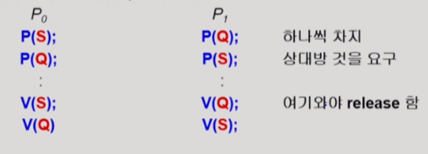

- S,Q를 획득해야함
- 그런데 P0, P1하나씩 쥐고 있으면서 자기것은 내놓지 않고 기다리고 있는 것 : **DeadLock..**
  - 멈춘것.
  - 어떻게 해결할까?
  - Q를 획득하려면 S부터 먼저 획득하도록 만들어주면 됨.

- Starvation
  - 무한히 다른 자원을 얻지 못해서 진행하지 못하는
  - Deadlock도 Starvation의 일종

### Synchronization Problem

1. Bounded-Buffer Problem

2. Reader-Writers Problem
3. Dining-Philosophers Problem

## 7. DeadLock

- 교착상태

- 일련의 프로세스들이 서로가 가진 자원을 기다리면서 Block된 상태
  - 자원(Resource)은 하드웨어일수도, 소프트웨어일수도 있음.

### Deadlock 발생조건 4가지

1. Multual exclusion 상호배제
   - 프로세스가 자원을 얻었으면 독점적으로 사용하고 있음
2. No preemption 비선점
   - 프로세스는 자원을 스스로 내어놓을뿐 강제로 빼앗기지는 않는다.
3. Hold and wait 보유 대기
   - 자원을 가진 프로세스가 다른 자원을 기다릴 때 보유 자원을 놓지않고 잡고 있음
4. Circular wait
   - 자원을 기다리는 프로세스간에 사이클이 형성되어야 함

- 시험문제에 잘나옴ㅎㅎ

### 자원할당 그래프

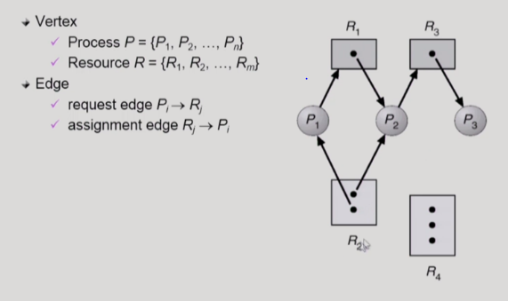

- 프로세스에서 자원으로 가는 화살표 : 자원을 요청. 그러나 얻지는 못한 상태
- 자원에서 프로세스에게 가는 화살표 : 자원이 할당된 상태. 자원안에 점은 인스턴스 수임.
- 이 그래프가 데드락일까?

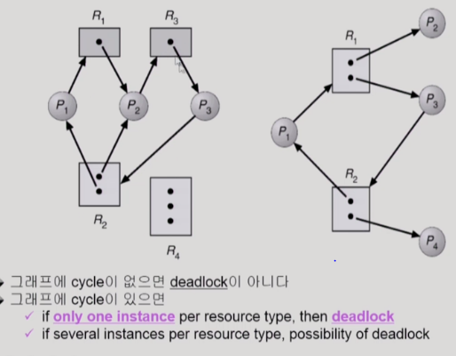

- 좌측 그래프는 Deadlock 상태, 우측 그래프는 Deadlock상태가 아님
- Deadlock은 많이 발생하는 것은 아님.

### Deadlock 처리방법

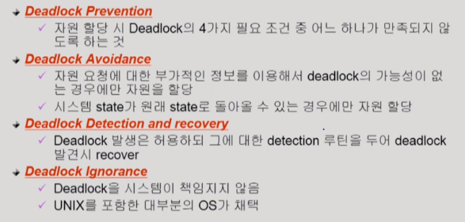

### Deadlock Prevention

- 데드락이 발생하는 4가지 조건의 원인을 원천적으로 차단함.

### Deadlock Avoidance

- 프로세스가 시작될 때, 사용할 최대의 자원을 미리 알고있고 가용자원에 따라 자원할당을 관리함
  - 이를 이용해서 Deadlock을 피해감.
- 자원을 요청한다고해서 자원을 모두 내어주는 것이 아닌, 데드락의 가능성을 파악한 후에 자원을 내어준다.
- 아주 안전하게 가자. 데드락이 절대 발생하지 않도록!

#### Resource Allocation Graph algorithm

- 점선 화살표 : 이 프로세스가 평생에 적어도 한번은 해당 자원을 사용할 가능성이 있음.

- 그래프 3번은 데드락 가능성이 있긴 함.

#### Banker's Algorithm

- 최악의 경우만을 가정. 절대 Deadlock이 생기지 않으려고 함.
- 가용가능한 자원이, 최대요청 자원보다 커야만 프로세스의 자원요청을 받아들임.
  - P0 요청은 받아들이지 않을 것.
  - 그렇지만 P1의 최대 자원은 3 2 2 , 사용가능한 자원은 3 3 2 그러면 추가요청이 허용될것. 안전하게

### Deadlock Detection and Recovery

- 프로세스가 얼마나 자원을 사용할지 알필요는 없음.

- 자원당 인스턴스 하나 일때 , 자원을 포함한 그래프, 자원을 뺀 프로세스만 나와있는 그래프.
  - 우측 그래프는 100% 데드락인 상황
- 데드락을 찾는 오버헤드는?
  - O(n^2)
  - **깊이우선 탐색**을 하면 사이클이 있는지 알아볼 수 있음

- 데드락이 있는지 없는지 확인 할때는, **낙관적인** 접근을한다.

  1. 자원들이 반납된다고 가정(?)

     P0 B1개 반납될것이다, P2 3 0 3 반납될것이다. (더이상 자원 요청이 없는 프로세스들의 할당된 자원을 반납)

  2. 쌓고 쌓고 쌓아서, 자원 요청을 해결할 수 있다면

  3. 데드락이 없다고 말할 수 있음.

  

  - 반납이 가능한 자원은 P0의 B 1개 밖에 없음.
  - 이 반납한 자원으로 프로세스의 요청을 만족시킬 수있는 경우의 수 없음.
  - 그럼 Deadlock

- 이렇게 데드락이 발견되면 Recovery를 해야함

- Recovery
  1. Process termination
     - Deadlock에 연루된 프로세스를 모두 사살
     - Deadlock에 연루된 프로세스를 하나하나 사살해보는 것
       - 하나 죽여보고, 데드락이 풀렸는지 확인해보고, 안 풀렸으면 다른 연루된 프로세스 죽이고.
  2. Resource Preemption
     - 비용을 최소화할 사살대상 선정
     - safte state 로 rollback 하여 process를 restart
     - Stravation 문제
       - 동일한 프로세스가 계속 사살대상으로 선정되면...
       - 어떤 친구가 얼마나 자원을 빼앗겼는지 고려해서 사살대상을 선정.

### Deadlock Ignorance

- Deadlock이 일어나든, 안 일어나든 아무일도하지 않는것.
  - 왜?
  - 데드락은 매우 드물게 발생.
  - 그러므로 데드락에 대한 조치 자체가 더 큰 overhead일수도있음.
  - 그래서 데드락이 발생하면 시스템이 대처하는 것이 아닌, 사용자가 대처하도록
  - 대부분의 Unix, Windows등이 이 방법을 사용하고 있음.

## 8. Memory Management

- 메모리 주소에는 논리적 주소, 물리적 주소가 있음.
- Logical address 
  - 프로세사 마다 독립적으로 가지는 주소 공간
  - 0번지부터 시작
  - CPU가 보는 주소.
- Physical address
  - 메모리에 실제 올라가는 위치.

- Symbolic Address 

### 주소 바인딩(Address Binding)

- 3가지 방법을 통해 바인딩됨.

1. Complie time binding
2. Load time binding
3. Execution time binding(=Run time binding)

- 1번, complie시에 물리적 주소가 결정됨. 이 프로그램은 실행파일을 만들 때, 만든 주소를 반드시 사용되어야 한다. -> 불편하다.

- 2번, 프로그램이 시작되어서 메모리에 올라갈 때 주소가 부여됨. 실행파일을 실행시에 메모리에 비어있는 소에서 부터 시작됨.
- 3번, 2번과 같은 방식이나 주소가 중간에 변경될 수 있음.
  - 지금 컴퓨터 시스템의 주소 바인딩 방식
  - 주소변환을 위해서는 **하드웨어적** 지원이 필요함

- CPU가 바라보는 주소는 **Logical Address**
  - 왜?
  - CPU가 logical address에 있는 주소를 요구할 때, logical address physical로 변환되어 전달되기 때문에 cpu는 logical address를 바라보고 있다고 말할 수 있다.

### MMU

- 주소 변환을 위한 하드웨어

- 기본적인 주소 변환은 레지스터 2개를 가지고 진행함. relocation, limit register

- 기본 위치를 저장해놨다가, logical address 더해서 physical memory에서 찾는다.
- limit register ? 범위 밖에 있는 메모리 주소를 요구할 경우, 오류가 발생하니까 제한해놓는 것.

### Hardware Support for Address Translation

t

- trap을 통해서, 범위 밖 메모리 주소를 요구하는 것을 방지한다.

### Dynamic Loading

- 프로그램을 메모리에 동적으로 올린다. 그때 그때 필요할 때 마다, 메모리에 올리는 방식.

- 운영체제가 지원하는 것이 아니라, 프로그래머가 직접 만드는 것.
  - 모든 부분을 만드는 것이 아니고, 운영체제에서 라이브러리 형태로 지원해줌.

### Overlays

- Dynamic Loading 과 비슷함. 어떤 면에서? 메모리에 세스 부분 중 실제 필요한 정보만을 올린다는 점에서.
- 그렇지만 운영체제의 지원이 없고, 프로그래머가 모두 코드를 통해 짜야함.

### Swapping

- 프로세스를 일시적으로 메모리에서 backing store로 쫒아 내는 것.

  - swap out, swap in

  

- 어떤 프로그램을 쫒아낼까?
  
  - CPU 우선순위가 낮은 프로그램

### Dynamic Linking

- Linking ? 여러군대 컴파일된 실행파일을 연결하는 것.
- static linking
  - 라이브러리가 내 실행코드에 포함이 되는 것
- dynamic linking
  - 라이브러리 코드가 내 코드가 컴파일 될 때, 포함되지 않고 있다가, 내 코드 안에 라이브러리를 찾을 수 있는 stub이라는 작은 코드를 나둠.
  - 이러한 방법으로 내 실행파일이 실행되어 라이브러리가 필요하다면 stub을 통해 라이브러리 주소를읽어옴.
  - 라이브러리가 이미 메모리에 있으면 그 루틴의 주소로 가면 되고, 없으면 디스크에서 읽어올 수 있도록함.

### Allocation of Physical Memory

- 물리적인 메모리를 어떻게 관리할 것인가?

- 사용자 프로세스 영역의 할당 방법은?
  1. Contiguous allocaiotn
     - 각각의 프로세스가 메모리의 연속적인 공간에 적재되도록 하는 것.
  2. Noncontiguous allocation
     - 하나의 프로세스가 메모리의 여러영역에 분산되어 올라갈 수 있도록 함. 
     - 현대 컴퓨터에서 사용 하는 방법

### Contiguous Allocation

- 연속 할당 방법에는 2가지 방식이 있음.

- Hole

  - 가용 메모리 공간
  - 다양한 크기의 hole이 메모리 여러 곳에 있음.
  - 이러한 hole을 운영체제는 관리해야함. 
    - 각각 할당공간, 가용공간이 얼마인지

- Dynamic Storage-Allocation Problem 을 이용하여 가변 분할 방식에서 size n인 요청을 만족하는 가장 적절한 hole을 찾게 도와줌.

  - First -fit : 맨처음 찾는 hole을 할당
  - Best -fit : 요구에 가장 근접한 hole을 할당함. 전체 홀을 다 살펴본다음에 시간이 좀 걸리겠네?

  - Worst - fit : 가장 큰 hole을 할당. 어리석은 선택. 왜? 자원낭비!

- compaction
  - 조각 조각 생기는 홀들을 한 군데로 모아서, 큰 홀로 만들어주는 것.
  - 디스크 조각 모음 느낌.
  - 실행 중인 프로그램에 메모리는 미는 것이기 때문에 생각보다는 자원이 많이 드는 방법.

### Noncontiguous allocation

- 현대 컴퓨터에서 사용하는 방법임
- 그 종류는 3가지 방법이 있고
  1. Paging
  2. Segmentation
  3. Paged Segmentation

### Paging

- Paging Example

- n번째 페이지를 변환하고 싶다? 테이블로 접근한 다음에 frame number를 알게됨.

- Implementation of Page Table

- 메모리접근 하기 위해서는 메모리 접근을 2번 해야된다는 것은 비용이 큰 것.
- 그래서 TLB를 사용. 일종의 캐쉬. 주소 변환을 해주는 객층

- 주소변환을 위한 별도의 캐쉬(Page table에 대한) 두고 있음 = TLB
  - 페이지 테이블에서 빈번하게 접근하는 주소에 대한 캐쉬가 있음.
  - 그래서 처음 시작 할 때는 TLB를 먼저 살펴보고, 있으면 바로 주소변환을 함. 
  - 이러면 메모리에 1번만 접근하면 되겠지?

- 그래서... Associative Register가 있음.

- 페이지 테이블은 각각의 프로세스 마다 존재해야함
- 그러면 TLB도 각각 존재해야함.
  - flush를 통해서 비우는 과정이 필요함.

- 메모리에 접근하는 시간은? (Effective Access Time)

### 

#### Two-Level Page Table

- 왜?
  - 둘중 하나임. 속도를 빠르게 하던지, 공간을 효율적으로 사용하던지
  - 아마 후자가 아닐까?

- 메모리에는 주소가 byte단위로 매겨짐. 
- 주소를 가지고 32비트를 쓰면, 32비트로 표현가능한 서로 다른 정보는 ? 2^32-1 을 표현할 수 있을 것.

- 4GB 공간을 4K바이트로 쪼개면? 전체 몇개지? 100만개보다 좀더 큰 갯수가 page table entry갯수가 필요함.. 
- 낭비로 나아가는 지름길인듯. 그래서..

- Address-Translation Scheme

- p1 outer-page table에서
- p2 page of page table에서
- 이렇게 까지 한다음에 physical memory에 접근함

- Two-Level Paging Example
  - ???? 잘 모르겠ㄷ3ㅏㅇ <u>8-2 30분가량</u>
  - **다시들어야 할듯.**

- 서로 다른 n개를 구분하기 위해 필요한 비트의 수는?
- p2에서는 1k..10비트, d에서는 4k...  12비트

- 페이지 테이블의 공간을 줄일 수 있기에, 2단계 페이지 테이블을 사용한다.
- 왜? 상당수의 안쪽 테이블 공간은 사용되지 않는 공간.이 부분을 줄이고자 2단계 페이지 테이블을 사용

#### Multievel Paging and Performance

- 페이지 테이블을 여러 단계로 나눠서 할 수 있음.
- 4단계 페이지 테이블을 메모리에 한번 접근하려면 4번의 주소 변환 , 1번의 직접 메모리 접근 총 5번이 필요하다.
  - 즉 오버헤드가 너무 크다.
- 그래서 TLB를 사용

#### Memory Protection

- valid-invaild ? 페이지 테이블에 해당 주소가 사용가능한건지 아닌지 확인하는 용도

- Protection bit? 연산 대한 권한을 설정하는 용도
  - 읽기 권한이 있니? 쓰기 권한이 있니?

#### Inverted Page Table

- page table 매우 크다. 공간 오버헤드가 크다. 
  - 왜?
  - 모든 프로세서 별로 그러한 logical address에 대응하는 모든 page에 대해 page table entry가 존재하기 때문
  - 대응하는 page가 메모리에 있든 아니든 (valid, invalid) page table에는 entry로 존재하기 때문

- 이걸 막기위해 나온 페이지 테이블

- page table이 딱 하나 존재
- page table entry가 물리 메모리에 있는 것들만 상대로 존재함.
  - 앞의 page table 존재 여부와 완전 역발상의 느낌.

- 논리적 주소 p 가 page table에 어디에 있는지 모두 찾아본다음에 physical address를 찾을 수 있음.
- 테이블의 묘미는 p가 주어지면, 바로 address에 접근할수 있는 것.
- 그렇지만 inverted page table은 위의 묘미와는 조금 다르다.

#### Shared Page

- 다른 프로세스들하고 공유할수 있는 페이지를 일컫음.

- 프로그램끼리 같은 코드를 쓰면, 같은 프레임으로 맵핑을 시켜서 메모리에 접근 시킬 수 있음. =pure code()
- Re - entrant code 

- 단! Page 들을 Read - Only로 셋팅해야됨. 그렇지 않으면 문제 생길수 있으니까.

- shared code는 동일한 logical address 에 위치해야한다.

### Segementation

- 프로세스를 의미단위로 나눠서 관리하는 방법.
- 공유나 보안에 있어서는 유리함 page관리 보다는.

- 길이.. segement entry의 수

- Segmentation Hardware

- limit? segement의 길이를 나타내는 것.
- s ? segement 번호, d ? segement안에서 얼마나 떨어진 위치인지 구분하는 용도
- 물리적인 주소를 알아보기 위해서 segement table을 검색함.
  - 페이지 수인 경우에는 정해져있음.
  - 그렇지만 세그먼트는 안그렇지.

- 페이징 기법은 페이지 길이가 균등. 그렇지만 세그먼트 기법은 길이는 limit로 표현할 수 있는 bit수 이상은 되지 못함. 즉 길이를 제한함.
  - 이러한 정보를 segement table에 각각 저장하고 있음
  - 만약 offset값이 limit보다 크면 합당하지 않은 메모리 참조.
  - 그렇지 않은 경우 trap을 발생시킴.
- base 세그멘트 시작 위치 ,limit  세그먼트의 길이

- 세그먼테이션은 크기가 균일하지 않기 때문에 문제가 일어날수 있음.

#### Segementation  Architecture

- 의미단위로 하면 세그먼테이션이 유리
- 그렇지만 크기가 균일하지 않다는 점이 확실한 약점

- CPU에서 세그먼트 번호(s) 5번을  요청했는데 STLR이 3이다. 그럼 잘못된 참조. Trap 발생

#### Example Of Sementation

#### Sharing of Segments

- segment 넘버가 같고, 같은 physical memory 주소를 공유한다.

### Segmentation with Paging

- allocation 문제 안생김.
  - 왜?
  - 물리적인 메모리에는 page단위로 올라가니까.
- 그렇지만 의미단위로 해야되는 업무인 공유, 보안은 Segmentation 으로 올라가기 때문에
- 두가지 장점을 모두 차용했다고 말할 수 있음.

> 챕터 정리

- 8 ch 즉 논리적 주소를 바꿔서 물리적 주소를 찾아야 하는 것이 이 챕터의 핵심
- 이 챕터에서 운영체제가 하는 역할? 없음. 
- 전부 다 하드웨어에서 하는 역할
- 왜? 주소 변환이 운영체제가 도와준다고 하면, 메모리에 접근할 때마다 운영체제가 CPU를 가지고 있어야함.
- 만약 I/O 장치에 접근한다고 하면, 운영체제가 도와줘야하지만 메모리 접근할때마다 운영체제가 할 필요는 없겠음.

## 9. Virtual Memory

### Demand Paging

- **요청이 있으면**, 그 페이지를 메모리에 올리겠다.

- 이렇게 하면 좋은점?
  1. I/O 양이 감소
  2. Memory 사용량 감소(메모리 공간은 한정되었으니까)
  3. 응답 빠르게
  4. 그러면 더 많은 사용자를 수용할 수 있음.

- 4번째는 뭐지? swap memory(스왑 영역)

- valid, invalid
  - 페이지가 물리적 테이블에 없는 경우에, 해당 페이지는 스왑 영역에 존재하며, 이러한 내용은 페이지 테이블에서 vaild-invalid 영역에 체크된다.

- 1번 주소를 찾으려 볼려 했는데, 페이지테이블에 없다. 그러면 physical memory에 올라와 있지 않다라는 의미고 이건 I/O 작업이 필요함.

- page fault : 요청한 페이지가 없으면.
  - 이러면 CPU는 자동적으로 운영체제에게 넘어가게 되고(trap) , 운영체제가 CPU를 가지고 fault난 페이지를 메모리에 올리는 작업이 필요하다.

### Page Fault

- <u>위의 내용을 좀 더 자세하게..</u>

- 순서도

  

- Page Fault Rate 0<= p <= 1.0

  - 0이면 노 페이지 Fault
  - 1이면 매번 참조할 때 마다 Page Fault가 발생함.

  - 대부분의 경우는 페이지 폴트가 발생하지 않지만, 발생하면 많은 시간이 필요

### Free frame이 없는 경우

- 빈 페이지가 없는 경우에는 무언가를 쫒아내야함.

- Page replacement

  - 어떤 frame을 빼앗아 올것인가?
  - 알고리즘에 의해 해결됨.

- replacement algorithm

  - 가급적은 page fault rate이 0에 가깝도록 하는 것이 목표.

  - 몇가지 알고리즘 있음.

### Optiman Algorithm

- 가장 좋은 알고리즘.
- <u>실제 사용될수는 없음</u>. 왜? page들이 어떻게 참조 될지 미리 알고 있다는 것을 가정하기 때문에
- 핵심은 가장 먼 미래에 **참조될 page** 를 쫒아내는(대신하는) 것.
- 6번 page faults 가 가장 작은 수
- 그럼 이 알고리즘을 어떻게 사용할까?
  - 실제 시스템에서 사용하는 알고리즘들의 성능을 측정하는 기준이 된다.

### FIFO(First In First Out) Algorithm

- 먼저 들어온 내용을 쫒아내겠다.

- 메모리를 늘렸는데, page faults가 증가하는 현상이 있음. 굉장히 아노미한 상황임.
- 원래는 메모리가 늘었으면, 성능이 더 좋아져야 하는데 , 위 상황은 메모리가 늘었는 데도 성능이 안 좋아보이니까.

### LRU (Least Recently Used) Algorithm

- 제일 오래전에 사용된 페이지를 쫒아내겠다.

- 가장 오래전에 사용된 것이 3번이니까. <u>3번을 쫒아 낸다</u>, 그리고 그자리에 5번을 집어넣었다

### LFU (Least Frequently Used) Algorithm

- 참조횟수가 가장 적은 페이지를 메모리에서 쫒아 낸다.

- 과거에 참조가 많이 되었으면, 미래에 참조될 가능성이 높으니까 쫒아내지말자.
- 동률인 경우에는?
  - 아무거나 쫒아냄. 
  - 참조횟수가 동률인 페이지 중에서, 마지막 참조횟수가 오래된 페이지를 쫒아내는게 나을것

### LRU, LFU 예제

- LRU, 마지막 참조가 언제되었는지만 보지, 얼마나 많이 참조되었는지는 보지 않음.
- LFU는 참조횟수 기준이지만, 마지막 참조가 언제인지를 생각하지는 않는다.

### 구현

- LRU : 참조된 시간을 기준으로 LinkedList 형태로 줄세워져서 구현됨.

  

- LFU : 똑같이 줄세우는데, 참조횟수 별로

  

  - heap을 이용해서 구현함
  - 이진트리, 자식이 두개씩 있는
  - O(logn)정도는 되어야 사용할 수 있을 정도.