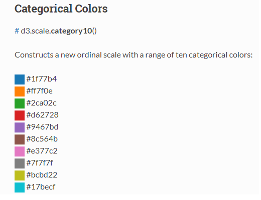

## 참고

- [D3.js in Action](https://www.manning.com/books/d3js-in-action-second-edition)
- https://blog.risingstack.com/d3-js-tutorial-bar-charts-with-javascript/
- <https://github.com/zziuni/d3/wiki/API-Reference>


## 개요

**D3.js  동작순서**

1. 브라우저 메모리로 데이터를 불러온다 (Loading)

2. 필요한 HTML 문서 요소를 새로 만들어서 데이터를 엮는다 (Binding)

3. 각 문서 요소에 엮인 개별 데이터를 토대로 해당 문서요소를 반환시킨다. 즉, 관련 시각적 프로퍼티를 지정한다(Transforming)

4. 사용자 입력에 대한 반응으로 문서요소의 상태를 한 값에서 다른 값으로 전이시킨다(Transitioning)


**SVG**

- 모든 그림을 넣을 요소

- 왼쪽 꼭대기가 0, 0 

- 500px x 500px 넘는 그림은 다 잘림\
1. **rect**

   x,y속성으로 도형의 왼쪽 꼭대기 위치를, height, width속성으로 높이와 너비를 결정함

2. **circle**

   cx,cy속성이 원의 중점을, r속성이 원의 반경을

3. **line**

4. **ellipse**

5. **polygon**

  

**기본좌표**


  

####   0722

#### 세로형 막대그래프에 눈금 표시

ticks() 눈금 간격 지정, 기본값은 10

ticks() 는 모두가 지정한 값과 같은 간격이 됨

ticksValues()는 서로 다른 간격으로 표시함

tickForamt()은 눈금에 표시할 숫자에 서식을 지정


1. html

```html
<!DOCTYPE html>
<html>
<head>
<meta charset="UTF-8">
<title>bar3.html</title>
<style>
svg {width:320px; height:260px; border:1px solid black;}
.bar {fill: orange;}
.barNum {
	font-size:9pt;
	text-anchor : middle;
}
.axis text{
	font-family : sans-serif;
	font-size: 11px;
}
.axis path,
.axis line{
	fill : none;
	stroke : black;
}
</style>
<script src="https://d3js.org/d3.v5.min.js"></script>
<script src="./js/bar3.js"></script>
</head>
<body>
<h3>세로형 막대그래프에 눈금 표시</h3>
<div>
<svg id="myGraph"></svg>

</body>
</html>
```


2. Javascript

```javascript
window.addEventListener("load", function() {
	var svgHeight = 240;
	var offsetX = 30; // x좌표의 오프셋 (오프셋은 어긋남의 정도)
	var offsetY = 10;// y좌표의 오프셋
	var barElements;
	var dataSet = [ 120, 70, 175, 80, 220 ];
	var yScale = d3.scaleLinear().domain([ 0, 300 ]) // 원래 크기
	.range([ 300, 0 ]) // 실제 출력크기
	// 그래프 그리기
	barElements = d3.select("#myGraph").selectAll("rect").data(dataSet)

	// 데이터 추가
	barElements.enter() // 데이터 수만큼 반복
	.append("rect").attr("class", "bar").attr("height", function(d, i) { // 넓이를
																			// 설정하는데
		return d;// 데이터 값을 그대로 높이로 ㅈ지정
	}).attr("width", 20).attr("x", function(d, i) {
		return (i * 25) + offsetX; // x좌표
	}).attr("y", function(d, i) {
		return svgHeight - d - offsetY;
	})

	

	barElements.enter().append("text").attr("class", "barNum").attr("x",
			function(d, i) {
				return (i * 25) + 10 + offsetX;
			}).attr("y", svgHeight - 5 - offsetY).text(function(d, i) {
		return d;
	})

	var axis = d3.axisLeft(yScale).ticks(10).tickValues(
			[ 10, 20, 30, 50, 100, ,150 ,200 ])

	d3.select("#myGraph").append("g").attr("class", "axis").attr("transform",
			"translate(" + offsetX + "," + ((svgHeight - 300) - offsetY) + ")")
			.call(axis)

	// 가로 방향의 선을 표시
	d3.select("#myGraph").append("rect")
	.attr("class", "axis_x")
	.attr("width",320)
	.attr("height", 1)
	.attr("transform","translate(" + offsetX + "," + (svgHeight - offsetY) + ")")

	barElements.enter()
	.append("text")
	.attr("class", "barName")
	.attr("x",function(d, i) { // X 좌표를 지정
				return (i * 25) + 5	 + offsetX; // 막대그래프의 표시 간격을 맞춤
			})
	.attr("y", svgHeight - offsetY + 15).text(function(d, i) {
		return [ "A", "B", "C", "D", "E" ][i]; // 레이블 이름을 반환
	})

});// addEventListener() end
```


### 원 만들기


1. html

```html
<!DOCTYPE html>
<html>
<head>
<meta charset="UTF-8">
<title>pie5.html</title>
<style>
svg {width:320px; height:260px; border:1px solid black;}
.pie {fill: yellow; stroke: black;}
.total {font-size : 9pt; text-anchor:middle; }
.pieNum{font-size: 10pt; text-anchor:middle;}
</style>
<script src="https://d3js.org/d3.v5.min.js"></script>
<script src="./js/pie5.js"></script>
</head>
<body>
<h3>원 그래프 표시 - csv 파일 데이터 표시 </h3>
<div><svg id="myGraph"></svg><br>
<form>
	<select id = "year">
		<option value = "2008">2008년</option>
		<option value = "2009">2009년</option>
		<option value = "2010">2010년</option>
		<option value = "2011">2011년</option>
		<option value = "2012">2012년</option>
		<option value = "2013">2013년</option>
		<option value = "2014">2014년</option>	
	</select>
</form>
</body>
</html>
```


2. pie.js

```javascript
window.addEventListener("load", function(){
	drawPie("./datas/mydata2008.csv");

	
	d3.select("#year").on("change", function(){
		d3.select("#myGraph").selectAll("*").remove();	
		drawPie("./datas/mydata"+this.value+".csv", this.value);	
															
	});

	
	function drawPie(filename){

	d3.csv(filename)
	  .then(function(data){	
		  var dataSet = [ ];	
			for(var i in data[0]){	
				dataSet.push(data[0][i]);	
			}
	   
		
			var svgEle = document.getElementById("myGraph");
			var svgWidth = window.getComputedStyle(svgEle, null).getPropertyValue("width");
			var svgHeight = window.getComputedStyle(svgEle, null).getPropertyValue("height");
			svgWidth = parseFloat(svgWidth);	// 값에는 단위가 붙어 있으므로 단위를 삭제
			svgHeight = parseFloat(svgHeight);	// 값에는 단위가 붙어 있으므로 단위를 삭제
			
	var color = d3.scaleOrdinal(d3.schemeCategory10);

	var pie = d3.pie().value(function(d, i){ return d; })	// 데이터셋의 데이터 반환

	var arc = d3.arc().innerRadius(30).outerRadius(100);

	var pieElements = d3.select("#myGraph")
	  .selectAll("g")	
	  .data(pie(dataSet))	
	  .enter()
	  .append("g")	
	  .attr("transform", "translate("+svgWidth/2+", "+svgHeight/2+")")    
	  
	  
	pieElements.append("path")	// 데이터의 수만큼 path 요소가 추가됨
	  .attr("class", "pie")	// CSS 클래스 설정
	  .style("fill", function(d, i){
		return color(i);	// 표준 10색 중 색을 반환
	})
  
	.transition()
  .duration(500)
  .delay(function(d,i){  
		return i*200;
	})
 	.ease(d3.easeLinear)// 직선적인 움직임으로 변경
 	
  .attrTween("d", function(d, i){
		var interpolate = d3.interpolate(
			{ startAngle : d.startAngle, endAngle : d.startAngle }, 
			{ startAngle : d.startAngle, endAngle : d.endAngle }   
       	 );
		return function(t){
			return arc(interpolate(t)); 
		}
	})
	

	var textElements = d3.select("#myGraph")
	  .append("text")	
	  .attr("class", "total")	
	  .attr("transform", "translate("+svgWidth/2+", "+(svgHeight/2+5)+")")    
																				
	  .text("점유율:" + d3.sum(dataSet))	
  

	pieElements
	  .append("text")	
	  .attr("class", "pieNum")	
	  .attr("transform", function(d, i){
			return "translate("+arc.centroid(d)+")";    
		})
	  .text(function(d, i){
			return d.value;	// 값 표시
		});
   });// then() end
	
	}// drawPie() end
	
});// addEventListener() end

```

- <https://d3-wiki.readthedocs.io/zh_CN/master/Ordinal-Scales/>

- `d3.scaleOrdinal(d3.schemeCategory10)`

  

### 꺽은선 그래프 표시


1.html

```html
<!DOCTYPE html>
<html>
<head>
<meta charset="UTF-8">
<title>line2.html</title>
<style>
svg {width:320px; height:260px; border:1px solid black;}
.line {fill: none; stroke: black;}
.axis text{
	font-family: sans-serif;
	font-size: 11px;
}
.axis path,
.axis line{
	fill: none;
	stroke: black;
}
.axis_x line{
	fil:none;
	stroke:black;
}


</style>
<script src="https://d3js.org/d3.v5.min.js"></script>
<script src="./js/line2.js"></script>
</head>
<body>
<h3>꺽은선 그래프 표시 </h3>
<div><svg id="myGraph"></svg><br>


</body>
</html>
```


2. line.js

```javascript
window.addEventListener("load", function(){
	var svgWidth = 320;
	var svgHeight = 240;
	var dataSet = [10,47,65,8,64,99,75,22,63,80];
	var margin = svgWidth/(dataSet.length - 1); // 꺽은 선 그래프 간격 계산
	var offsetX = 30;	// X 좌표의 오프셋(어긋남의 정도)
	var offsetY = 20;	// Y 좌표의 오프셋(어긋남의 정도)
	var scale = 2.0;
	// 꺽은선 그래프 좌표 계산
	var line = d3.line()
		.x(function(d,i){	
			return (i * margin)+offsetX;
		})
		.y(function(d,i){
			return svgHeight - (d*scale) - offsetY;
		})
		
	var lineElements = d3.select("#myGraph")
		.append("path") // 데이터 수만큼 path요소를 추가하고
		.attr("class","line")
		.attr("d",line(dataSet))
		
	var yScale = d3.scaleLinear()  
	 	.domain([0, 100])   
	 	.range([scale*100, 0]) 

	 var axis = d3.axisLeft(yScale)

	
	d3.select("#myGraph").append("g")
		.attr("class", "axis")
		.attr("transform", "translate("+offsetX+", "+offsetY+")")
		.call(axis)
		
		
	// 가로 방향의 선을 표시
	d3.select("#myGraph")
		.append("rect")
		.attr("class", "axis_x")
		.attr("width", svgWidth)
		.attr("height", 1)
		.attr("transform", "translate("+offsetX+", "+(svgHeight-offsetY-0.5)+")")

});// addEventListener() end

```


### 영역안을 채운 꺽은선 그래프

1.html

```html
<!DOCTYPE html>
<html>
<head>
<meta charset="UTF-8">
<title>line5.html</title>
<style>


</style>
<script src="https://d3js.org/d3.v4.js"></script>
<script src="./js/line5.js"></script>
</head>
<body>
	<h3>영역 안을 칠한 꺽은선 그래프 표시</h3>

		<div id="my_dataviz"></div>
		<br>
</body>
</html>
```


2. javascript

```javascript
window.addEventListener("load", function(){
	
    var margin = {top:10, right:30, bottom:30, left:50},
    width = 460 - margin.left - margin.right,
    height = 400 - margin.top - margin.bottom;

    var svg = d3.select("#my_dataviz")
    .append("svg")
    .attr("width", width + margin.left + margin.right)
    .attr("height", height + margin.top + margin.bottom)
    .append("g")
    .attr("transform","translate("+margin.left + ","+margin.top +")");

    d3.csv("./datas/orders.csv",

    function (d) {
        return {date : d3.timeParse("%Y-%m-%d")(d.date), value : d.value}
        
    },

    function (data) {

        var x = d3.scaleTime()
          .domain(d3.extent(data, function (d) {
              return d.date;
          }))
          .range([0,width]);
          svg.append("g")
          .attr("transform", "translate(0,"+height+")")
          .call(d3.axisBottom(x));

        var y = d3.scaleLinear()
        .domain([0, d3.max(data, function (d) {
            return +d.value;
        })])
        .range([height,0])
        svg.append("g")
        .call(d3.axisLeft(y));

        svg.append("path")
        .datum(data)
        .attr("fill","#cce5df")
        .attr('stroke', "#69b3a2")
        .attr('stroke-width', 1.5)
        .attr('d', d3.area()
         .x(function(d){return x(d.date)})
         .y0(y(0))
         .y1(function(d){return y(d.value)})
        )
    })

}); //addEventListener() end
```


### 산포도 표시 : 애니메이션 + 그리드

1. html

```html
<!DOCTYPE html>
<html>
	<head>
		<meta charset="utf-8">
		<title>Sample</title>
<script src="https://d3js.org/d3.v5.min.js"></script>
 
<script src="./js/plot4.js"></script>
		<style>
		svg { width: 380px; height: 240px; border: 1px solid black; }
			.mark { fill: red; stroke: none; }
			.axis text {
				font-family: sans-serif;
				font-size: 11px;
			}
			.axis path,
			.axis line {
				fill: none;
				stroke: black;
			}
			.grid{
				stroke : gray;
				stroke-dasharray : 4, 2;
				shape-rendering : crispEdges;
			}
			
			.tip{
				position: absolute;
				top : 0px;
				left : 0px;
				z-index : 9999;
				visibility : hidden;
				border : 1px solid black;
				background-color : yellow;
				width: 80px;
				height: 16px;
				overflow : hidden;
				text-align : center;
				font-size: 9pt;
				font-family : Tahoma, Optima, Hevetica;
				color: black;
			}
		</style>
	</head>
	<body>
		<h1>산포도 표시 : 애니메이션+ 그리드</h1>	
		<br>
		<svg id="myGraph"></svg>
		<br>	 
	</body>
</html>

```


2. js

```javascript
window.addEventListener("load", function() {

	var svgWidth = 320; // SVG 요소의 넓이
	var svgHeight = 240; // SVG 요소의 높이
	var offsetX = 30; // X 좌표의 오프셋
	var offsetY = 20; // Y 좌표의 오프셋
	var svg = d3.select("#myGraph")
	// 데이터셋
	var dataSet = [ [ 30, 40 ], [ 120, 115 ], [ 125, 90 ], [ 150, 160 ],
			[ 300, 190 ], [ 60, 40 ], [ 140, 145 ], [ 165, 110 ], [ 200, 170 ],
			[ 250, 190 ] ];
	// 산포도 그리기
	var circleElements = svg.selectAll("circle").data(dataSet)

	circleElements.enter().append("circle") // 데이터의 개수만큼 circle 요소가 추가됨
	.attr("class", "mark") // CSS 클래스 지정
	.attr("cx", function(d, i) {
		return d[0] + offsetX; // 최초 요소를 X 좌표로 함
	}).attr("cy", function(d, i) {
		return svgHeight - d[1] - offsetY; // 2번째의 요소를 Y 좌표로 함
	}).attr("r", 5) // 반지름을 지정

	// 데이터셋 갱신
	function updateData(data) {
		var result = data.map(function(d, i) { // 배열 요소 수만큼 반복
			var x = Math.random() * svgWidth;
			var y = Math.random() * svgHeight;
			return [ x, y ];
		})

		return result;
	}

	// 산포도 갱신
	function updateGraph(dataSet) {
		svg.selectAll("*").remove();
		circleElements = d3.select("#myGraph").selectAll("circle")
				.data(dataSet)
		circleElements.enter().append("circle") // 데이터의 개수만큼 circle 요소가 추가됨
		.attr("class", "mark") // CSS 클래스 지정
		.transition() // cx, cy 애니메이션
		.attr("cx", function(d, i) {
			return d[0] + offsetX; // X 좌표를 설정
		}).attr("cy", function(d, i) {
			return svgHeight - d[1] - offsetY; // Y 좌표를 설정
		}).attr("r", 5) // 반지름을 지정
	}

	// 눈금 표시
	function drawScale() {
		svg.selectAll("g").remove(); // 눈금 요소 삭제 ● 수정
		var maxX = d3.max(dataSet, function(d, i) {
			return d[0]; // X 좌표값
		});
		var maxY = d3.max(dataSet, function(d, i) {
			return d[1]; // Y 좌표값
		});

		// 세로 눈금을 표시하고자 D3 스케일을 설정
		var yScale = d3.scaleLinear() // 스케일 설정
		.domain([ 0, maxY ]) // 원래 데이터 범위
		.range([ maxY, 0 ]) // 실제 표시 크기
		// 눈금의 표시 위치를 왼쪽으로 지정
		var axis = d3.axisLeft(yScale);
		// 눈금 표시
		svg.append("g") // g 요소 추가. 이것이 눈금을 표시하는 요소가 됨
		.attr("class", "axis") // CSS 클래스 지정
		.attr(
				"transform",
				"translate(" + offsetX + ", " + (svgHeight - maxY - offsetY)
						+ ")").call(axis)
		// 가로 눈금을 표시하고자 D3 스케일 설정
		var xScale = d3.scaleLinear() // 스케일 설정
		.domain([ 0, maxX ]) // 원래 데이터 범위
		.range([ 0, maxX ]) // 실제 표시 크기
		var bottomAxis = d3.axisBottom(xScale)
		// 눈금 표시
		svg.append("g") // g 요소 추가. 이것이 눈금을 표시하는 요소가 됨
		.attr("class", "axis") // CSS 클래스 지정
		.attr("transform",
				"translate(" + offsetX + ", " + (svgHeight - offsetY) + ")")
				.call(bottomAxis)

		var grid = svg.append("g")
		var rangeX = d3.range(50, maxX, 50);
		var rangeY = d3.range(20, maxY, 20);

		grid.selectAll("line.y")
		.data(rangeY)
		.enter()
		.append("line")
		.attr("class", "grid")
		.attr("x1", offsetX)
		.attr("y1", function(d, i) {
			return svgHeight - d - offsetY;
		})
		.attr("x2", maxX + offsetX)
		.attr("y2", function(d, i) {
			return svgHeight - d - offsetY;
		})
		grid.selectAll("line.x")
		.data(rangeX)
		.enter()
		.append("line")
		.attr("class", "grid")
		.attr("x1", function (d,i) {
			return d + offsetX;			
		})
		.attr("y1", svgHeight - offsetY)
		.attr("x2", function(d, i) {
			return d + offsetY;
		})
		.attr("y2", svgHeight - offsetY - maxY)

	}// drawScale()
	// 눈금 표시
	drawScale();
	
	var tooltip = d3.select("body")
		.append("div")
		.attr("class","tip")
	
	function showTooltip() {
		circleElements = d3.select("#myGraph")
						.selectAll("circle")
		circleElements.on("mouseover", function(d){
			var x = parseInt(d[0]);
			var y = parseInt(d[1]);
			var data = d3.select(this).datum();
			var dx = parseInt(data[0]);
			var dy = parseInt(data[1]);
			tooltip
				.style("left",offsetX + x + "px")
				.style("top",svgHeight + offsetY - y+ "px")
				.style("visibility", "visible")
				.text(dx+", "+dy)
		})
		circleElements.on("mouseout",function(){
			tooltip.style("visibility","hidden")
		})
		
	}
	showTooltip()

	// 2초마다
	setInterval(function() {
		dataSet = updateData(dataSet); // 데이터 갱신
		updateGraph(dataSet); // 그래프 갱신
		drawScale(); // 눈금 그리기 ● 수정
		showTooltip();
	}, 2000);

}); // addEventListener() end

```


