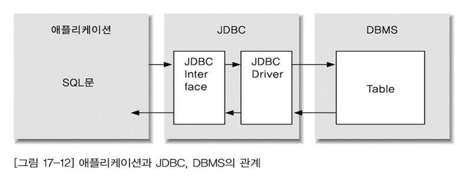

# JDBC

### 0 .참고

- [생활코딩](<https://opentutorials.org/module/3569/21222>)
- 

### 1. 시작

- DBMS는 Oracle을 이용
- C:\app\student\product\11.2.0\dbhome_1\jdbc\lib 에서 `ojdbc6`를 사용
- JDBC는 Java application과 DBMS사이에서의 다리역할을 함.




- 티어(tier) vs 레이어(layer)

  - 티어?

    HOST - HOST - HOST = 3tier 물리적으로 서로 떨어져 있으면 티어라고 함.

  - 레이어?

    HOST(내부에 기능별로 계층으로 나눠져 있는)  = layer

  - 3tier? 클라이언트 / 미들웨어(타입3) / 데이터베이스 서버.

    - 2tier에 비해, 유지보수 비용을 절약할 수 있음. 왜? 데이터베이스를 뭔가 변경하면, 한단계 거쳐 진행되므로 조금 느릴 수 있음.

- 붙어넣기
  - `C:\Program Files\Java\jdk1.8.0_211\jre\lib\ext` 에 `ojdbc6`붙여넣기
  - 안되면? 직접추가해라.
  


#### 1.1 JDBC 단계


1.  `import java.sql.*;` 

2. `DriverClass` 로딩

   ```java
   try{
       Class.forName(" "); //oracle.jdbc.OracleDriver
   }catch(ClassNotFoundException e){
   }
   ```

3. `Connection` 객체 생성.

   로딩된 드라이버 크래스의 static 멤버 객체 `DriverManager.getConnetion(dburl, user,pwd)` 이용해서 DB에 Connection하고,
   
   그러면,  DB에 세션이 생성되고, 세션이 리턴됨. 그럼 이걸 받아야 겠지?
   
   `java.sql.Connection`객체로 받음
   
   `Connection 인터페이스에 주요 메소드는 : close(), createStatement(), prepareStatement(), callableStatement(), setAutoCommit(false), commit(),rollback(), setSavapoint()....`


4. SQL실행 대행 객체 Statement()객체 생성

   Statement - 완전한 sql 문장을 문자열로 전송하므로 매번 hard parsing을 수행해서, 
   
   `PreparedStatementd ` sql문장중에서 변경되는 부분을 (index 파라미터) 로 설정해서 미리 sql을 전송하고, 실행할때마다 값만 전송해서 실행하는 soft parsing이 실행될 확률이 높음. 이걸 사용해야함.
   
   `CallableStatement` DB에 저장되어 있는 procedure, function을 호출해서 결과를 받을때!


5. SQL실행 문장

   `executeQuery()` - select문장, ResultSet 객체를 리턴함

   `executeUpdate()` - DML 문은 int(변경된 행수) 리턴 ,DDL, DCL문으로

   `execute()` - select 문, DML문, boolean 리턴(true일떄는 select수행, false일때는 dml수행)

6. Select 수행 결과 처리

   ```java
   while(rs.next()){
       rs.getInt("컬럼명"or 컬럼순서번호(1부터시작)), rs.getDouble()...
       rs.getString()
       rs.getDate()
   }
   ```

7. 예외처리 (SQLExeption)

8. 사용 자원 반납(Connection, Statement, ResultSet) + 예외처리(IOExeption)

* 소스코드에 db연결정보를 hard coding 하는 것은 보안상..문제가 되므로, 보안폴더에 properties파일에 key=value형태로 저장해야함.

  ```java
  Properties prop = new Properties(); //객체생성하고
  prop.load(new FileInputStream("경로/이름.."));
  String value = prop.getProperty("key"); //key값 넣으면 string값이 리턴됨. 그에 해당하는
  ```

  


### 2. 연결

```JAVA
package lab.java.core;

import java.sql.Connection;
import java.sql.DriverManager;
import java.sql.SQLException;

public class DBTest {

	public static void main(String[] args) {	
		Connection con = null; //db연결된 세션 정보가 저장될 것이고
		String url = "jdbc:oracle:thin:@localhost:1521:orcl";
		try {
			Class.forName("oracle.jdbc.OracleDriver");
			System.out.println("driver loading성공");
			con = DriverManager.getConnection(url,"scott","oracle");
			System.out.println("db connect 성공");
		}catch (ClassNotFoundException e) {
			System.out.println("driver 없음.");
		}catch (SQLException e) {
			System.out.println(e.getMessage());
			//db 연결 실패

		}
	}
}
//driver loading성공
//db connect 성공
```


### 3. 데이터 가져오기

```java
package lab.java.core;

import java.sql.Connection;
import java.sql.DriverManager;
import java.sql.ResultSet;
import java.sql.SQLException;
import java.sql.Statement;

public class DBTest {
	public static void main(String[] args) {
		Connection con = null;
		Statement stat =null;
		ResultSet rs = null;
		String url = "jdbc:oracle:thin:@localhost:1521:orcl";
		String sql = "select * from dept"; //sql문장 준비
		try {
			Class.forName("oracle.jdbc.OracleDriver");
			con = DriverManager.getConnection(url,"scott","oracle");

			stat = con.createStatement(); //stat 객체생성			
			rs = stat.executeQuery(sql); //메서드 실행해서 받음
			while(rs.next()) {
				System.out.print(rs.getInt("deptno"));
				//System.out.print(rs.getInt(1); 첫번째 컬럼을 꺼내오려면?
				System.out.print(rs.getString(2)); //두번째 컬럼 꺼내오기
				//System.out.print(rs.getString("dname"));
				System.out.println(rs.getString(3));
				//System.out.println(rs.getString("loc"));
			}
		}catch (ClassNotFoundException e) {
			System.out.println("driver 없음.");
		}catch (SQLException e) {
			System.out.println(e.getMessage());
			//db 연결 실패
		}finally {
			try {
			if(rs!=null) rs.close();
			if(stat!=null) stat.close();
			if(con!=null) con.close();
			}catch (Exception e) {
				e.printStackTrace();
			}	
		}//finally end
	}
}

```


### 4. from java insert to database

```java
package lab.java.core;

import java.io.FileInputStream;
import java.io.FileNotFoundException;
import java.io.IOException;
import java.sql.Connection;
import java.sql.DriverManager;
import java.sql.PreparedStatement;
import java.sql.SQLException;
import java.util.Properties;

public class InsertTest {

	public static void main(String[] args) {
		// TODO Auto-generated method stub
		Connection con = null; //db연결된 세션 정보가 저장될 것이고
		PreparedStatement stat =null; //왜? sql에 ???3개를 통해 쓸꺼니까
		String sql = "insert into dept values(?,?,?)";
		try {
			Properties prop = new Properties();
			prop.load(new FileInputStream("C:/workplace_rubin/Java13/src/lab/java/core/dbinfo.properties"));
			Class.forName(prop.getProperty("driver"));
			System.out.println("driver loading성공");
			con = DriverManager.getConnection(prop.getProperty("url"),
					prop.getProperty("user"),
					prop.getProperty("pwd")
					);
			System.out.println("db connect 성공");
			stat = con.prepareStatement(sql); //stat 객체생성, sql쿼리문을 보냄		
			stat.setInt(1, 70);
			stat.setString(2, "Bigdata");
			stat.setString(3, "Seoul");
			
			int row = stat.executeUpdate(); //변경된 row수가 리턴됨.
			
			if(row>0) {
				System.out.println("insert 성공");
			}	
			
		}catch (ClassNotFoundException e) {
			System.out.println("driver 없음.");
		}catch (SQLException e) {
			System.out.println(e.getMessage());
			//db 연결 실패
		}catch (IOException e) {
			System.out.println(e.getMessage());//properties파일 오류
		}

		finally {
			try {
			if(stat!=null) stat.close();
			if(con!=null) con.close();
			}catch (Exception e) {
				e.printStackTrace();
			}	
		}//finally end

	}
}

```

- 명령어 복습..
  - 컬럼 추가 ? `alter table ~ add (컬럼, 컬럼타입 [제약조건]);`
  - 컬럼 삭제 `alter table ~ drop column 컬럼명;`
  - 컬럼 이름 변경 `alter table 테이블명 ~ rename column old to new;`
  - 컬럼 타입 또는 사이즈 변경  : `alter table 테이블명 modify (컬럼 컬럼타입(size));`
  - 제약조건을 컬럼 추가 : `alter table 테이블명 add constraint 제약조건이름, 타입;`
  - 컬럼에 정의되어있는 제약조건 삭제 : `alter table 테이블명 drop constraint 이름;`
  - 제약조건을 활성화 : `alter table ~ enable constraint 이름;`
  - 제약조건을 비활성화 `alter table ~ disable constraint 이름;`
  - 테이블 삭제 :` drop table` or `drop table purge`
  - 오라클에서만 사용가능한, 휴지통에 삭제된 테이블 가져오기 `flashback table ~ to before drop;` 


### 5. 트랜잭션 검증

- Java는 connect하면 자동으로 commit이 되므로, autocommit(false) 상태로 설정을 해둬야함.


```
* PreparedStatement 와 Statement의 가장 큰 차이점은 캐시(cache) 사용여부이다.

1) 쿼리 문장 분석
2) 컴파일
3) 실행

Statement를 사용하면 매번 쿼리를 수행할 때마다 1) ~ 3) 단계를 거치게 되고, PreparedStatement는 처음 한 번만 세 단계를 거친 후 캐시에 담아 재사용을 한다는 것이다. 만약 동일한 쿼리를 반복적으로 수행한다면 PreparedStatment가 DB에 훨씬 적은 부하를 주며, 성능도 좋다.


출처: https://devbox.tistory.com/entry/Comporison [장인개발자를 꿈꾸는 :: 기록하는 공간]
```


```java
package lab.java.core;

import java.io.FileInputStream;
import java.io.IOException;
import java.sql.Connection;
import java.sql.DriverManager;
import java.sql.PreparedStatement;
import java.sql.ResultSet;
import java.sql.SQLException;
import java.sql.Savepoint;
import java.sql.Statement;
import java.util.Properties;

public class Transaction {

	public static void main(String[] args) {
		Connection con = null;
		PreparedStatement selectPs = null; //왜? 컴파일을 미리해놔서, 빠르게 검색하기 위해
		PreparedStatement updatePs =null;
		ResultSet rs =null;
		String query = "SELECT id, price FROM product WHERE price > ? ";
		String update = "UPDATE product SET price = ? WHERE id = ?";
		
		try {
			
			Properties prop = new Properties();
			prop.load(new FileInputStream("C:/workplace_rubin/Java13/src/lab/java/core/dbinfo.properties"));
			
			Class.forName(prop.getProperty("driver"));
			System.out.println("driver loading성공");
			
			con = DriverManager.getConnection(prop.getProperty("url"),
					prop.getProperty("user"),
					prop.getProperty("pwd")
					);
			
			System.out.println("db connect 성공");
			
			con.setAutoCommit(false); //명시적으로 트랜잭션 제어를 위해
			
			selectPs = con.prepareStatement(query); //객체생성, 
			updatePs = con.prepareStatement(update);
			
			Savepoint save1 = con.setSavepoint();
			selectPs.setInt(1, 100); //왜?
			rs = selectPs.executeQuery();			

			
			while(rs.next()) {
				String id = rs.getString("id");
				int oldPrice = rs.getInt("price");
				int newPrice = (oldPrice * 2);
				updatePs.setInt(1, newPrice);
				updatePs.setString(2, id);
				updatePs.executeUpdate();
				System.out.println("New Price of "+oldPrice+" is "+ newPrice);
				if(newPrice >= 5000) {
					con.rollback(save1);
				}
			}//while end
			
			System.out.println();
			Savepoint save2 = con.setSavepoint();
			selectPs.setInt(1, 100); //왜?
			rs = selectPs.executeQuery();

			
			while(rs.next()) {
				String id = rs.getString("id");
				int oldPrice = rs.getInt("price");
				int newPrice = (oldPrice * 2);
				updatePs.setInt(1, newPrice);
				updatePs.setString(2, id);
				updatePs.executeUpdate();
				System.out.println("New Price of "+oldPrice+" is "+ newPrice);
				if(newPrice >= 5000) {
					con.rollback(save2);
				}
			}//while end
			
			System.out.println();
			con.commit();					
			
			Statement stmt = con.createStatement();
			rs = stmt.executeQuery("SELECT id, price FROM product");
			
			System.out.println();
			while(rs.next()) { //next()커서를 한방향으로 이동하는 것.
				String id = rs.getString("id");
				int price = rs.getInt("price");
				System.out.println("id : "+ id + ", price: "+ price);
			}
			
			
			}catch (ClassNotFoundException e) {
				System.out.println("driver 없음.");
			}catch (SQLException e) {
				System.out.println(e.getMessage()); //db 연결 실패
			}catch (IOException e) {
				System.out.println(e.getMessage());//properties파일 오류
			}
	
			finally {
				
				try {
					
				if(rs!=null) rs.close();
				if(selectPs!=null) selectPs.close();
				if(updatePs!=null) updatePs.close();				
				if(con!=null) con.close();
				
				}catch (Exception e) {
					e.printStackTrace();
					
				}	
			}//finally end	
		}//main end
}// class end
```


### 6. 메타데이터 받아오기

- SQL에서 확인할 수 있는 메타데이터 받아오기.

```java
package lab.java.core;

import java.io.FileInputStream;
import java.io.IOException;
import java.sql.Connection;
import java.sql.DriverManager;
import java.sql.PreparedStatement;
import java.sql.ResultSet;
import java.sql.ResultSetMetaData;
import java.sql.SQLException;
import java.sql.Savepoint;
import java.sql.Statement;
import java.util.Properties;

public class GetMetaData {

	public static void main(String[] args) {
		Connection con = null;
		PreparedStatement stat = null;
		String sql = "SELECT * FROM emp";
		ResultSet rs =null;
		ResultSetMetaData rsmd = null;
		
		try {			
			Properties prop = new Properties();
			prop.load(new FileInputStream("C:/workplace_rubin/Java13/src/lab/java/core/dbinfo.properties"));
			
			Class.forName(prop.getProperty("driver"));
			System.out.println("driver loading성공");
			
			con = DriverManager.getConnection(prop.getProperty("url"),
					prop.getProperty("user"),
					prop.getProperty("pwd")
					);
			
			System.out.println("db connect 성공");
			
			stat = con.prepareStatement(sql); //stat객체 생성
			rs = stat.executeQuery(); //Resultset으로 받아오는데, 
			rsmd = rs.getMetaData();
			
			System.out.println("컬럼이름\t\t Null허용?\t 컬럼타입");
			System.out.println("-----------------------------------------");
            
			for(int i =0; i<rsmd.getColumnCount(); i++) {
                //열 인덱스 가져오기
				System.out.print(rsmd.getColumnName(i+1)+"\t\t"); 
				if(rsmd.isNullable(i+1)==0){
					System.out.print("Not Null"+"\t");
				}else {
					System.out.print("\t\t");
				}
                //Columntype의 크기 출력하기
				System.out.print(rsmd.getColumnTypeName(i+1));
				if(rsmd.getColumnTypeName(i+1).equals("VARCHAR2")) {
					System.out.print("("+rsmd.getPrecision(i+1)+")");
				}
				if(rsmd.getColumnTypeName(i+1).equals("NUMBER")) {
					if(rsmd.getScale(i+1)>0) {
					System.out.print("("+rsmd.getPrecision(i+1)+","+rsmd.getScale(i+1)+")");
					}else{
						System.out.print("("+rsmd.getPrecision(i+1)+")");
					}
				}					
				System.out.println();				
			}			
			}catch (ClassNotFoundException e) {
				System.out.println("driver 없음.");
			}catch (SQLException e) {
				System.out.println(e.getMessage()); //db 연결 실패
			}catch (IOException e) {
				System.out.println(e.getMessage());//properties파일 오류
			}
	
			finally {				
				try {					
				if(rs!=null) rs.close();
				if(con!=null) con.close();
				
				}catch (Exception e) {
					e.printStackTrace();         
					
				}	
			}//finally end
			}//main end
}// class end
```


### 7. BatchQuery, Scrollable

#### 7.1 BatchQuery

- 한꺼번에 `query` 문을 이용할 경우 사용

```java
package lab.java.core;

import java.io.FileInputStream;
import java.io.IOException;
import java.sql.Connection;
import java.sql.DriverManager;
import java.sql.PreparedStatement;
import java.sql.ResultSet;
import java.sql.ResultSetMetaData;
import java.sql.SQLException;
import java.sql.Savepoint;
import java.sql.Statement;
import java.util.Properties;

public class Book {

	public static void main(String[] args) {
		Connection con = null;
		Statement stat = null;
		ResultSet rs =null;
		String sql = null;
		boolean commit =false;		
		
		try {			
			Properties prop = new Properties();
			prop.load(new FileInputStream("C:/workplace_rubin/Java13/src/lab/java/core/dbinfo.properties"));
			
			Class.forName(prop.getProperty("driver"));
			System.out.println("driver loading성공");
			
			con = DriverManager.getConnection(prop.getProperty("url"),
					prop.getProperty("user"),
					prop.getProperty("pwd")
					);
			
			stat =con.createStatement();
			sql = "create table userinfo(userid varchar2(10), "+"userpwd varchar2(10))";
			stat.executeUpdate(sql);//DDL문장
			
			con.setAutoCommit(false); //트랜잭션을 시작하고
			
			stat.addBatch("INSERT INTO userinfo "+"VALUES('syh1011','1111')");
			stat.addBatch("INSERT INTO userinfo "+"VALUES('syh2022','2222')");
			stat.addBatch("INSERT INTO userinfo "+"VALUES('syh3033','3333')");
			stat.addBatch("INSERT INTO userinfo "+"VALUES('syh4044','4444')");
			
			int[] updateCounts = stat.executeBatch();
			commit = true;
			con.commit();
			con.setAutoCommit(true);
			
			rs = stat.executeQuery("SELECT * FROM userinfo");
			int sum =0;
			for(int i = 0; i < updateCounts.length; i++) {
				sum += updateCounts[i];
			}
			System.out.println("updatecounts : "+sum);
			while(rs.next()) {				
//				System.out.print("id : " + rs.getString(1)+" ");
//				System.out.print("pwd : "+ rs.getString(2)+" ");
//				System.out.println();
				
				String id = rs.getString("userid");
				String pwd = rs.getString("userpwd");
				System.out.println("id: "+id+" pwd: "+pwd);
				
				
			}
			}catch (ClassNotFoundException e) {
				System.out.println("driver 없음.");
			}catch (SQLException e) {
				System.out.println(e.getMessage()); //db 연결 실패
			}catch (IOException e) {
				System.out.println(e.getMessage());//properties파일 오류
			}
	
			finally {
				
				try {
					
				if(stat!=null) stat.close();
				if(rs!=null) rs.close();
				if(con!=null) con.close();
				
				}catch (Exception e) {
					e.printStackTrace();
					
				}	
			}//finally end
	
		}//main end

}// class end
```


- Book. Bookbiz(Controller + DAO(data,Access,Object)) 만들기