## 참고

- [빅데이터 전문가의 하둡관리](http://www.yes24.com/Product/goods/66586271)
- https://www.opentutorials.org/course/2908/17055


## 소개

- 하둡은 엄청난 데이터세트를 다루기 위함이 목적

- 아마존 AWS도 하둡 기반 서비스

- 저렴한 컴퓨터로, 대용량 데이터를 저장..

- Motto : 로직이 데이터로 접근하지말고, 데이터가 있는 곳에 로직을 옮기자

- 하둡의 핵심은 **HDFS, Yarn**

- 왜 하둡?
  1. 대용량 파일을 저장할 수 있는 분산 파일 시스템
  2. 장비를 증가하면 성능이 선형으로 증가
  3. 무료!

- 하둡으로 어떤 데이터를 다루는가?
  
  - 서버 로그, 비정형 데이터, 클릭 스트림, 지리데이터등..
  
- 분산파일 시스템?

  하둡 네트워크에 연결된 기기에 저장하는 분산형 파일 시스템


## 아키텍쳐


- HDFS는 마스터 노드 1개, Slave 역할하는 데이터 노드 여러개


## 하둡 리눅스 설치

- 파일풀기

```
[hadoop@master ~]$ su -
Password: 
Last login: Wed Jul 31 13:04:07 EDT 2019 on pts/0
[root@master ~]# cd /usr/local
[root@master local]# pwd
/usr/local
[root@master local]# tar -xvf /home/hadoop/Downloads/jdk-8u221-linux-x64.tar.gz 
[root@master local]# chown -R hadoop:hadoop /usr/local/jdk1.8.0_221/
[root@master local]# ls -al


[root@master local]# tar -xvf /home/hadoop/Downloads/eclipse-jee-photon-R-linux-gtk-x86_64.tar.gz 
[root@master local]# ls -al
[root@master local]# chown -R hadoop:hadoop /usr/local/eclipse/
[root@master local]# ls –al

[root@master local]# tar -xvf /home/hadoop/Downloads/hadoop-2.7.7.tar.gz 
[root@master local]# chown -R hadoop:hadoop /usr/local/hadoop-2.7.7/
[root@master local]# ls –al

```

- 호스트 네임 변경

```
[root@master ~]# hostnamectl set-hostname  slave1
/bin/hostname -F /etc/hostname //이 명령어를 통해 서버를 재실행하지 않아도, 호스트 네임 변경을 알 수 있음.
```


- .bashrc 환경설정

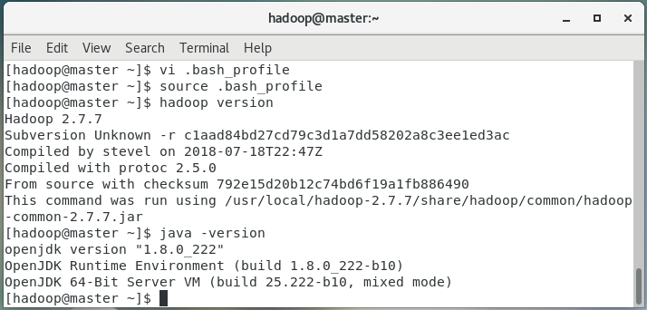

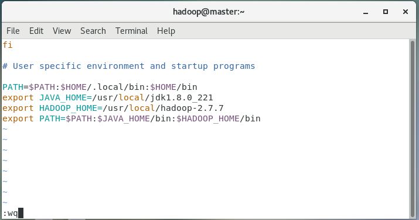

- source.bash_profile을 해야, hadoop version이 작동한다.


- linux에서 ip 확인 = ifconfig

- Master node 와 slave node에서 , 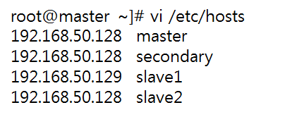

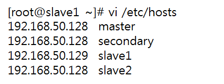

- slave ssh설정

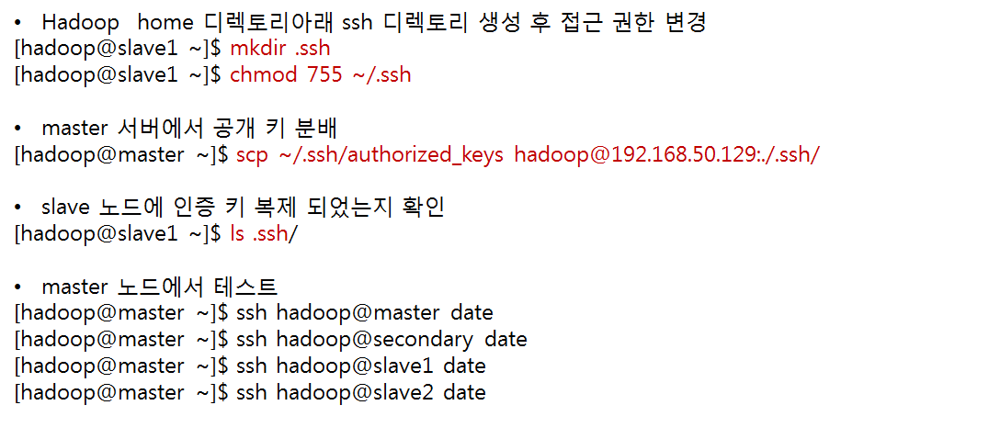

- ssh를 통해 통신한다. 
- 중간에 yes or no 물어보는 확인창이 나오는데 처음 통신하면 확인 차 물어보는 것으로 yes해서 넘어가도록 하자


master : 192.168.153.130
slave1 : 192.168.153.131

192.168.153.130 master
192.168.153.130 secondary
192.168.153.131 slave1
192.168.153.130 slave2


- 결과

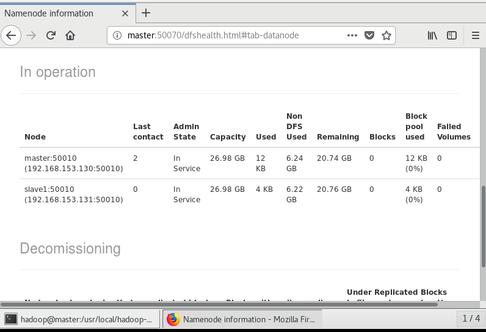

- 데이터 노드가 2개 떠야하고,

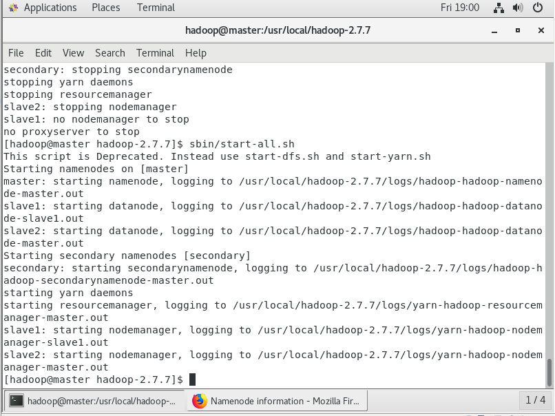

- 로그는 master, secondary, slave1,2가 나와야함. 
- ip가 다른 slave노드에 해당하는 리눅스 파일을 작동시켜야 돌아감


## 하둡 폴더 생성, 파일 복제

105~부터

lab 폴더생성

- `hadoop fs -mkdir /lab` 


로컬 파일에 있는 내용을 하둡HDFS에 복사하기

- `hadoop fs -put ./test.txt /lab`

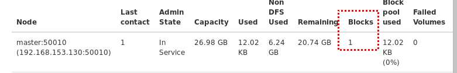

- BLOCKS이 0 에서 1로 바뀌었음


## HDFS 관리

- `hadoop dfsadmin -help` 

  이 중 report를 통해 상태를 알 수 있고,

  balancer 옵션을 통해 데이터 노트간 데이터 밸런스를 설정할 수있음.


## 맵 리듀스

- 단순한, 데이터를 처리해주는 기법.
- 분산 처리를 위함
- 함수형 프로그래밍
- Job Tracker
  - 마스터 노드에서 실행됨
  - task tracker에게 작업을 할당
  - 그리고 그 결과를 마스터 노드에게 전달
  - 이 task가 자바 프로세스로 실행됨
- 동작과정

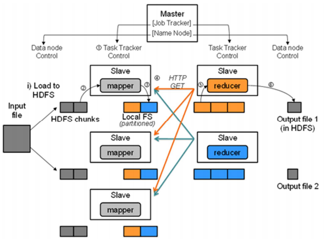

1. 하나의 파일이, 여러개 chuncks 나뉘어서
2. slave에서 mapper처리가 되어 Local FS 형태로 변환되고
3. reducer에게 전달되고, key값으로 나뉘어서, task tracker가 reducer를 실행,
4. 그 결과가 HDFS에 저장됨


## wordcount

1. worcount.java

```java
package lab.hadoop.wordcount;

import org.apache.hadoop.conf.Configuration;
import org.apache.hadoop.fs.FileSystem;
import org.apache.hadoop.fs.Path;
import org.apache.hadoop.io.IntWritable;
import org.apache.hadoop.io.Text;
import org.apache.hadoop.mapreduce.Job;
import org.apache.hadoop.mapreduce.lib.input.FileInputFormat;
import org.apache.hadoop.mapreduce.lib.input.TextInputFormat;
import org.apache.hadoop.mapreduce.lib.output.FileOutputFormat;
import org.apache.hadoop.mapreduce.lib.output.TextOutputFormat;

public class WordCount {

	public static void main(String[] args) throws Exception {
		Configuration conf = new Configuration();
		if(args.length !=2) {
			System.out.println("Usage: WordCount <input> <output>");
			System.exit(2);
		}		
		
		Job job = new Job(conf, "WordCount");
		
		FileSystem fs = FileSystem.get(conf);
		Path inputPath = new Path(args[0]);
		Path outputPath = new Path(args[1]);
		
		if(fs.exists(outputPath)) {
			fs.delete(outputPath, true);
		}
		
		job.setJarByClass(WordCount.class);
		job.setMapperClass(WordCountMapper.class);
		job.setReducerClass(WordCountReducer.class);
		job.setInputFormatClass(TextInputFormat.class);
		job.setOutputFormatClass(TextOutputFormat.class);
		job.setOutputKeyClass(Text.class);
		job.setOutputValueClass(IntWritable.class);
		
		FileInputFormat.addInputPath(job, inputPath);
		FileOutputFormat.setOutputPath(job, outputPath);
		job.waitForCompletion(true);
	}

}
```

2. wordcountmapper

```java
package lab.hadoop.wordcount;

import java.io.*;
import java.util.StringTokenizer;

import org.apache.hadoop.io.IntWritable;
import org.apache.hadoop.io.LongWritable;
import org.apache.hadoop.io.Text;
import org.apache.hadoop.mapreduce.Mapper;

public class WordCountMapper extends Mapper<LongWritable, Text, Text, IntWritable>{
	private final static IntWritable one = new IntWritable(1);
	private Text word = new Text();
	
	
	
	
	public void map(LongWritable key, Text value, Context context) throws IOException,
	InterruptedException {
	StringTokenizer itr = new StringTokenizer(value.toString());
		while (itr.hasMoreTokens()) {
			word.set(itr.nextToken()); 
			context.write(word, one); 
		}
	}

}

```

3.wordcountreducer

```java
package lab.hadoop.wordcount;

import java.io.*;

import org.apache.hadoop.io.IntWritable;
import org.apache.hadoop.io.Text;
import org.apache.hadoop.mapreduce.Reducer;

public class WordCountReducer extends Reducer<Text, IntWritable, Text,IntWritable>{
	private IntWritable result = new IntWritable();
	
	public void reduce(Text key, Iterable<IntWritable> values, Context context) 
			throws IOException, InterruptedException{
		int sum = 0;
		for(IntWritable val : values) {
			sum += val.get();
		}
		result.set(sum);
		context.write(key,result);
	}

}
```

- 결과

  - input.txt

    ```
    하둡 분산 파일 시스템(HDFS, Hadoop distributed file system)은 하둡 프레임워크를 위해 자바 언어로 작성된 분산 확장 파일 시스템이다. HDFS은 여러 기계에 대용량 파일들을 나눠서 저장을 한다. 데이터들을 여러 서버에 중복해서 저장을 함으로써 데이터 안정성을 얻는다. 따라서 호스트에 RAID 저장장치를 사용하지 않아도 된다.
    
    하둡 분산 파일 시스템은 다음과 같은 시스템에서 잘 동작하는 것을 목표로 하고 있다[9].
    
    하드웨어 오동작:하드웨어 수가 많아지면 그중에 일부 하드웨어가 오동작하는 것은 예외 상황이 아니라 항상 발생하는 일이다. 따라서 이런 상황에서 빨리 자동으로 복구하는 것은 HDFS의 중요한 목표다.
    스트리밍 자료 접근: 범용 파일 시스템과 달리 반응 속도보다는 시간당 처리량에 최적화되어 있다.
    큰 자료 집합: 한 파일이 기가바이트나 테라바이트 정도의 크기를 갖는 것을 목적으로 설계되었다. 자료 대역폭 총량이 높고, 하나의 클러스터에 수 백개의 노드를 둘 수 있다. 하나의 인스턴스에서 수천만여 파일을 지원한다.
    간단한 결합 모델: 한번 쓰고 여러번 읽는 모델에 적합한 구조이다. 파일이 한번 작성되고 닫히면 바뀔 필요가 없는 경우를 위한 것이다. 이렇게 함으로써 처리량을 극대화할 수 있다.
    자료를 옮기는 것보다 계산 작업을 옮기는 것이 비용이 적게 든다: 자료를 많이 옮기면 대역폭이 많이 들기 때문에 네트워크 혼잡으로 인하여 전체 처리량이 감소한다. 가까운 곳에 있는 자료를 처리하게 계산 작업을 옮기면 전체적인 처리량이 더 높아진다.
    다른 종류의 하드웨어와 소프트웨어 플랫폼과의 호환성: 서로 다른 하드웨어와 소프트웨어 플랫폼들을 묶어 놓아도 잘 동작한다.
    네임노드와 데이터노드
    HDFS는 마스터/슬레이브(master/slave) 구조를 가진다. HDFS 클러스터는 하나의 네임노드와, 파일 시스템을 관리하고 클라이언트의 접근을 통제하는 마스터 서버로 구성된다. 게다가 클러스터의 각 노드에는 데이터노드가 하나씩 존재하고, 이 데이터 노드는 실행될 때마다 노드에 추가되는 스토리지를 관리한다. HDFS는 네임스페이스를 공개하여서 유저 데이터가 파일에 저장되는 것을 허락한다. 내부적으로 하나의 파일은 하나 이상의 블록으로 나뉘어 있고, 이 블록들은 데이터노드들에 저장되어 있다. 네임노드는 파일과 디렉터리의 읽기(open), 닫기(close), 이름 바꾸기(rename) 등, 파일시스템의 네임스페이스의 여러 기능을 수행한다. 또한, 데이터 노드와 블록들의 맵핑을 결정한다. 데이터 노드는 파일시스템의 클라이언트가 요구하는 읽기(read), 쓰기(write) 기능들을 담당한다. 또한 데이터 노드는 네임노드에서의 생성, 삭제, 복제 등과 같은 기능도 수행한다.
    
    네임노드와 데이터노드는 GNU/Linux OS를 기반으로 하는 상용머신에서 실행하기 위해 디자인된 소프트웨어의 일부이다. HDFS는 자바 언어를 사용하므로 자바가 동작하는 어떠한 컴퓨터에서나 네임노드나 데이터노드 소프트웨어를 실행할 수 있다.
    ```

  - output

    ```
    GNU/Linux	1
    HDFS	1
    HDFS는	3
    HDFS은	1
    HDFS의	1
    Hadoop	1
    OS를	1
    RAID	1
    distributed	1
    file	1
    system)은	1
    가까운	1
    가진다.	1
    각	1
    간단한	1
    감소한다.	1
    갖는	1
    같은	2
    것보다	1
    것은	2
    것을	3
    것이	1
    것이다.	1
    게다가	1
    결정한다.	1
    결합	1
    경우를	1
    계산	2
    곳에	1
    공개하여서	1
    관리하고	1
    관리한다.	1
    구성된다.	1
    구조를	1
    구조이다.	1
    그중에	1
    극대화할	1
    기가바이트나	1
    기계에	1
    기능도	1
    기능들을	1
    기능을	1
    기반으로	1
    나눠서	1
    나뉘어	1
    내부적으로	1
    네임노드나	1
    네임노드는	1
    네임노드에서의	1
    네임노드와	2
    네임노드와,	1
    네임스페이스를	1
    네임스페이스의	1
    네트워크	1
    노드는	3
    노드를	1
    노드에	1
    노드에는	1
    노드와	1
    높고,	1
    높아진다.	1
    놓아도	1
    다른	2
    다음과	1
    닫기(close),	1
    닫히면	1
    달리	1
    담당한다.	1
    대역폭	1
    대역폭이	1
    대용량	1
    더	1
    데이터	5
    데이터가	1
    데이터노드	2
    데이터노드가	1
    데이터노드는	1
    데이터노드들에	1
    데이터들을	1
    동작하는	2
    동작한다.	1
    된다.	1
    둘	1
    든다:	1
    들기	1
    등,	1
    등과	1
    디렉터리의	1
    디자인된	1
    따라서	2
    때마다	1
    때문에	1
    또한	1
    또한,	1
    마스터	1
    마스터/슬레이브(master/slave)	1
    많아지면	1
    많이	2
    맵핑을	1
    모델:	1
    모델에	1
    목적으로	1
    목표다.	1
    목표로	1
    묶어	1
    바꾸기(rename)	1
    바뀔	1
    반응	1
    발생하는	1
    백개의	1
    범용	1
    복구하는	1
    복제	1
    분산	3
    블록들은	1
    블록들의	1
    블록으로	1
    비용이	1
    빨리	1
    사용하므로	1
    사용하지	1
    삭제,	1
    상용머신에서	1
    상황에서	1
    상황이	1
    생성,	1
    서로	1
    서버로	1
    서버에	1
    설계되었다.	1
    소프트웨어	2
    소프트웨어를	1
    소프트웨어의	1
    속도보다는	1
    수	4
    수가	1
    수천만여	1
    수행한다.	2
    스토리지를	1
    스트리밍	1
    시간당	1
    시스템(HDFS,	1
    시스템과	1
    시스템에서	1
    시스템은	1
    시스템을	1
    시스템이다.	1
    실행될	1
    실행하기	1
    실행할	1
    쓰고	1
    쓰기(write)	1
    아니라	1
    안정성을	1
    않아도	1
    어떠한	1
    언어로	1
    언어를	1
    얻는다.	1
    없는	1
    여러	3
    여러번	1
    예외	1
    오동작:하드웨어	1
    오동작하는	1
    옮기는	2
    옮기면	2
    요구하는	1
    위한	1
    위해	2
    유저	1
    이	2
    이런	1
    이렇게	1
    이름	1
    이상의	1
    인스턴스에서	1
    인하여	1
    일부	1
    일부이다.	1
    일이다.	1
    읽기(open),	1
    읽기(read),	1
    읽는	1
    있고,	1
    있는	1
    있다.	5
    있다[9].	1
    자동으로	1
    자료	3
    자료를	3
    자바	2
    자바가	1
    작성되고	1
    작성된	1
    작업을	2
    잘	2
    저장되는	1
    저장되어	1
    저장을	2
    저장장치를	1
    적게	1
    적합한	1
    전체	1
    전체적인	1
    접근:	1
    접근을	1
    정도의	1
    존재하고,	1
    종류의	1
    중복해서	1
    중요한	1
    지원한다.	1
    집합:	1
    처리량에	1
    처리량을	1
    처리량이	2
    처리하게	1
    총량이	1
    최적화되어	1
    추가되는	1
    컴퓨터에서나	1
    크기를	1
    큰	1
    클라이언트가	1
    클라이언트의	1
    클러스터는	1
    클러스터에	1
    클러스터의	1
    테라바이트	1
    통제하는	1
    파일	5
    파일과	1
    파일들을	1
    파일시스템의	2
    파일에	1
    파일은	1
    파일을	1
    파일이	2
    프레임워크를	1
    플랫폼과의	1
    플랫폼들을	1
    필요가	1
    하고	1
    하나	1
    하나씩	1
    하나의	4
    하는	1
    하둡	3
    하드웨어	1
    하드웨어가	1
    하드웨어와	2
    한	1
    한다.	1
    한번	2
    함으로써	2
    항상	1
    허락한다.	1
    호스트에	1
    호환성:	1
    혼잡으로	1
    확장	1
    
    ```

    

## airline

### delayCountReducer

```java
package lab.hadoop.airline;

import java.io.*;

import org.apache.hadoop.io.IntWritable;
import org.apache.hadoop.io.Text;
import org.apache.hadoop.mapreduce.Reducer;

public class DelayCountReducer extends Reducer<Text, IntWritable, Text, IntWritable> {
	private IntWritable result = new IntWritable();

	public void reduce(Text key, Iterable<IntWritable> values, Context context)
			throws IOException, InterruptedException {
		int sum = 0;
		for (IntWritable value : values)
			sum += value.get();
		result.set(sum);
		context.write(key, result);
	}

}
```


### DepartureDelayCount

```java
package lab.hadoop.airline;

import org.apache.hadoop.conf.Configuration;
import org.apache.hadoop.fs.FileSystem;
import org.apache.hadoop.fs.Path;
import org.apache.hadoop.io.IntWritable;
import org.apache.hadoop.io.Text;
import org.apache.hadoop.mapreduce.Job;
import org.apache.hadoop.mapreduce.lib.input.FileInputFormat;
import org.apache.hadoop.mapreduce.lib.input.TextInputFormat;
import org.apache.hadoop.mapreduce.lib.output.FileOutputFormat;
import org.apache.hadoop.mapreduce.lib.output.TextOutputFormat;


public class DepartureDelayCount {
	public static void main(String[] args) throws Exception {
		Configuration conf = new Configuration();
		
		//check inpu, output path
		if(args.length !=2) {
			System.out.println("Usage: DepartureDelay <input> <output>");
			System.exit(2);
		}		
		
		//set job name
		@SuppressWarnings("deprecation")
		Job job = new Job(conf, "DepartureDelayCount");
		
		//create file system control object
		FileSystem fs = FileSystem.get(conf);		
		
		//main input String[] 
		Path inputPath = new Path(args[0]);
		Path outputPath = new Path(args[1]);
		
		//check output path
		if(fs.exists(outputPath)) {
			fs.delete(outputPath, true);
		}
		
		//set job class
		job.setJarByClass(DepartureDelayCount.class);
		//set mapper class
		job.setMapperClass(DepartureDelayCountMapper.class);
		//set reducer class	
		job.setReducerClass(DelayCountReducer.class);
		
		//set input,output format
		job.setInputFormatClass(TextInputFormat.class);
		job.setOutputFormatClass(TextOutputFormat.class);
		
		//set outputkey, outputvalue type  
		job.setOutputKeyClass(Text.class);
		job.setOutputValueClass(IntWritable.class);
		
		//set input,output path
		FileInputFormat.addInputPath(job, inputPath);
		FileOutputFormat.setOutputPath(job, outputPath);
		
		job.waitForCompletion(true);
	}


}

```


### DepartureDelayCountMapper

```java
package lab.hadoop.airline;

import java.io.*;

import org.apache.hadoop.io.IntWritable;
import org.apache.hadoop.io.LongWritable;
import org.apache.hadoop.io.Text;
import org.apache.hadoop.mapreduce.Mapper;

public class DepartureDelayCountMapper extends Mapper<LongWritable, Text, Text, IntWritable> {

	private final static IntWritable outputValue = new IntWritable(1);
	private Text outputKey = new Text();

	public void map(LongWritable key, Text value, Context context) throws IOException, InterruptedException {
		if (key.get() > 0) {
			// 콤마 구분자 분리
			String[] colums = value.toString().split(",");
			if (colums != null && colums.length > 0) {
				try {
					// 출력키 설정
					outputKey.set(colums[0] + "," + colums[1]);
					if (!colums[15].equals("NA")) {
						int depDelayTime = Integer.parseInt(colums[15]);
						if (depDelayTime > 0) {
							// 출력 데이터 생성
							context.write(outputKey, outputValue);
						}
					}
				} catch (Exception e) {
					e.printStackTrace();
				}
			}
		}
	}

}

```


### 결과

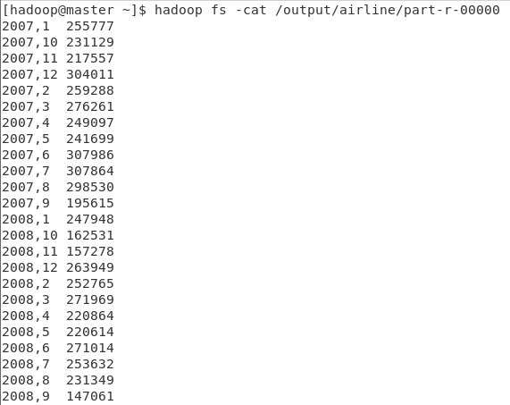

- 2007년 2008년 , 월별로  결과과 도출이 됨.


## delaycount

### delaycount

```java
package lab.hadoop.delaycount;

import org.apache.hadoop.conf.Configuration;
import org.apache.hadoop.conf.Configured;
import org.apache.hadoop.fs.FileSystem;
import org.apache.hadoop.fs.Path;
import org.apache.hadoop.io.IntWritable;
import org.apache.hadoop.io.Text;
import org.apache.hadoop.mapreduce.Job;
import org.apache.hadoop.mapreduce.lib.input.FileInputFormat;
import org.apache.hadoop.mapreduce.lib.input.TextInputFormat;
import org.apache.hadoop.mapreduce.lib.output.FileOutputFormat;
import org.apache.hadoop.mapreduce.lib.output.TextOutputFormat;
import org.apache.hadoop.util.GenericOptionsParser;
import org.apache.hadoop.util.Tool;
import org.apache.hadoop.util.ToolRunner;


public class DelayCount extends Configured implements Tool {

	@Override
	public int run(String[] args) throws Exception {
		String[] otherArgs = new GenericOptionsParser(getConf(), args).getRemainingArgs();
		
		if(args.length !=2) {
			System.out.println("Usage: DelayCount <in> <out>");
			System.exit(2);
		}
		
		//set job name
		@SuppressWarnings("deprecation")
		Job job = new Job(getConf(), "DelayCount");
		
		//create file system control object
		FileSystem fs = FileSystem.get(getConf());		
		
		//check output path
		Path path = new Path(args[1]);
		if(fs.exists(path)) {
			fs.delete(path, true);
		}
		
		//set input,output path
		FileInputFormat.addInputPath(job, new Path(otherArgs[0]));
		FileOutputFormat.setOutputPath(job, new Path(otherArgs[1]));
		
		//set job class
		job.setJarByClass(DelayCount.class);
		//set mapper class
		job.setMapperClass(DelayCountMapper.class);
		//set reducer class	
		job.setReducerClass(DelayCountReducer.class);
		
		//set input,output format
		job.setInputFormatClass(TextInputFormat.class);
		job.setOutputFormatClass(TextOutputFormat.class);
		
		//set outputkey, outputvalue type  
		job.setOutputKeyClass(Text.class);
		job.setOutputValueClass(IntWritable.class);

		job.waitForCompletion(true);
		return 0;
	}
	
	public static void main(String[] args) throws Exception{
		int res = ToolRunner.run(new Configuration(), new DelayCount(), args);
		System.out.println("## RESULT : "+res);
		
	}
		
}
```

### DelayCountMapper

```java
package lab.hadoop.delaycount;

import java.io.IOException;

import org.apache.hadoop.io.IntWritable;
import org.apache.hadoop.io.LongWritable;
import org.apache.hadoop.io.Text;
import org.apache.hadoop.mapreduce.Mapper;

public class DelayCountMapper extends Mapper<LongWritable, Text, Text, IntWritable> {

	private String workType;
	private final static IntWritable outputValue = new IntWritable(1);
	private Text outputKey = new Text();

	@Override
	protected void setup(Context context) throws IOException, InterruptedException {
		workType = context.getConfiguration().get("workType");
	}

	public void map(LongWritable key, Text value, Context context) throws IOException, InterruptedException {
		if (key.get() > 0) {
			// 콤마 구분자 분리
			String[] colums = value.toString().split(",");
			if (colums != null && colums.length > 0) {
				try {
					// print worktype = departure
					if (workType.equals("departure")) {
						if (!colums[15].equals("NA")) {
							int depDelayTime = Integer.parseInt(colums[15]);
							if (depDelayTime > 0) {
								// 출력키 설정 colums[0] object list, 
								outputKey.set(colums[0] + "," + colums[1]);
								// 출력 데이터 생성
								context.write(outputKey, outputValue);
							}
						}
					}
					else if(workType.equals("arrival")) {
						if (!colums[14].equals("NA")) {
							int depDelayTime = Integer.parseInt(colums[14]);
							if (depDelayTime > 0) {
								// 출력키 설정 colums[0] object list, 
								outputKey.set(colums[0] + "," + colums[1]);
								// 출력 데이터 생성
								context.write(outputKey, outputValue);
							}
						}

						
					}
				} catch (Exception e) {
					e.printStackTrace();
				}
			}
		}
	}

}

```


### DelayCountReducer

```java
package lab.hadoop.delaycount;

import java.io.*;

import org.apache.hadoop.io.IntWritable;
import org.apache.hadoop.io.Text;
import org.apache.hadoop.mapreduce.Reducer;

public class DelayCountReducer extends Reducer<Text, IntWritable, Text, IntWritable> {
	private IntWritable result = new IntWritable();

	public void reduce(Text key, Iterable<IntWritable> values, Context context)
			throws IOException, InterruptedException {
		int sum = 0;
		for (IntWritable value : values)
			sum += value.get();
		result.set(sum);
		context.write(key, result);
	}

}

```


### 결과

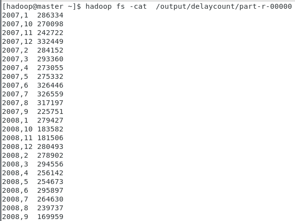

- 도착(arrival)이 지연된 항공기의 수가 결과로 도출되었다

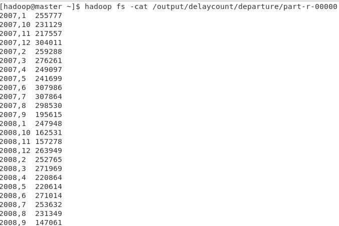

- 출발(departure) 지연된 항공기의 수


## 분산 컴퓨팅

### 필요조건

- 장애 허용 : 클러스터 노드 중 하나가 문제가 생겨도, 메인 컴퓨팅프로세스에 부정적인 영향을 주면 안됨 (프로세스가 실패하여도, 장애가 발생해서는 안됨)
- 복구 능력 : 분산 클러스터 노드에서 수행 중인 작업이 실패하더라도, 작업으로부터 어떤 데이터도 손실 되어서는 안됨.
- 선형적 확장성 : 컴퓨팅, 스토리지 확장성, 성능은 **선형적**으로 증가


### 아키텍쳐

- HDFS, Yarn, MapReduce, API


### 클러스터

- 하둡분산파일시스템(HDFS) 와 클러스터 리소스 매니저(yarn)를 기반으로 하는 하둡 소프트웨어를 사용하는 **컴퓨터**들의 집합
- 하둡 2.0부터 <u>마스터 노드</u> 2개 이상 구성하여 **[고가용성]([https://ko.wikipedia.org/wiki/%EA%B3%A0%EA%B0%80%EC%9A%A9%EC%84%B1](https://ko.wikipedia.org/wiki/고가용성))** 을 지원


- HDFS는 하둡의 HDFS상의 스토리지를 관리하는 역할
   - NameNode 는 HDFS 스토리지 관련 메타정보(시스템 디렉토리 트리, 파일 위치등)을 관리
   - SecondaryNameNode : HDFS 스토리지 메타 정보 업데이트(기본 1시간 간격으로, fsimage 파일과 editlog파일을 merge함)
   - DataNode : 마스터 노드에 접속을 유지하면서 3초 간격으로 , heartbit, block report를 주기적으로 전송하고, 마스터 노드의 요청 또한 처리하는 역할(block저장, 삭제)
   - WORM(write-once-read-many) 일단 HDFS에 파일을 작성하면 내용을 수정할 수 없음.


- Yarn
   - resorce manager : 마스터노드에서 실행되며, 클러스트의 리소스를 나눠주는 역할
   - TaskTracker들의 Task 스케쥴링(예전에 TaskTracker가 하던 역할)
   - node manager : 워크 노드에서 실행되고 Task를 실행시키고 관리, resorce manager와의 연결을 유지하면서 태스크 상태, 노드 상태를 관리함
   - application manager : cluster상에서 메인 프로세스. 클러스트 상에서의 마스터 프로세스


### 하이브

- SQL인터페이스를 이용, 맵리듀스 없이도, HDFS데이터를 처리할 수 있도록 도와주는인터페이스

- SQL가 유사한 것을 사용