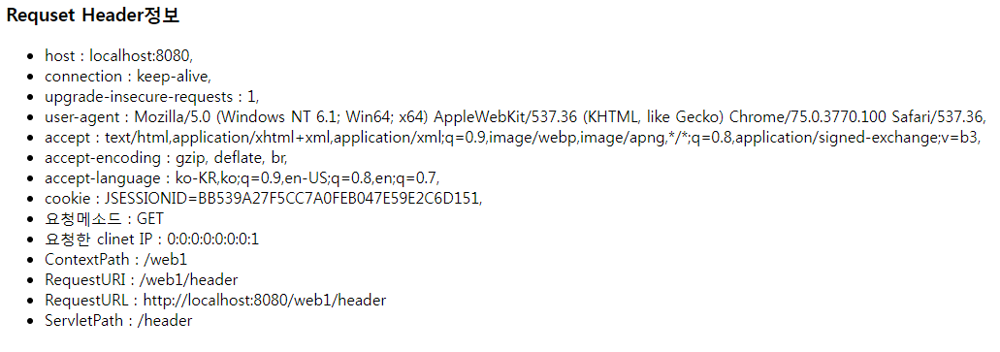
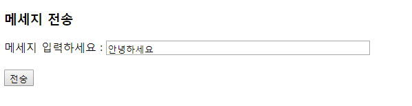
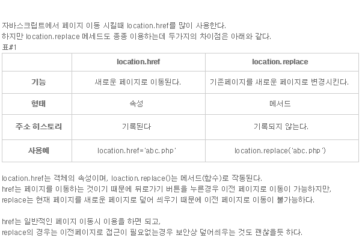
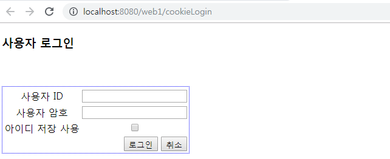
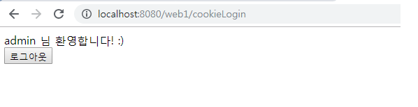
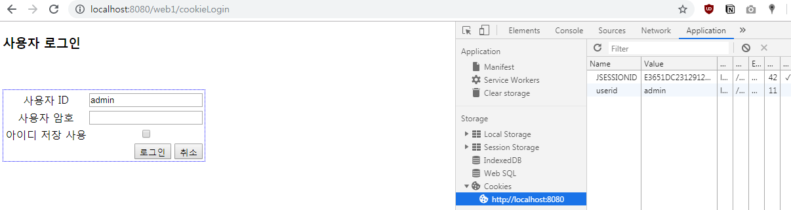
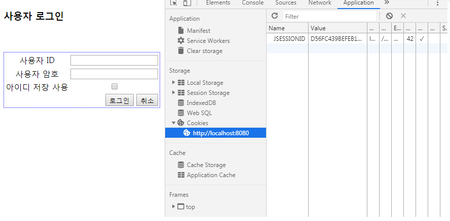
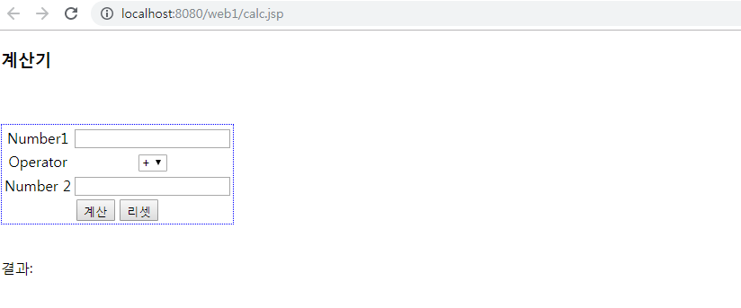
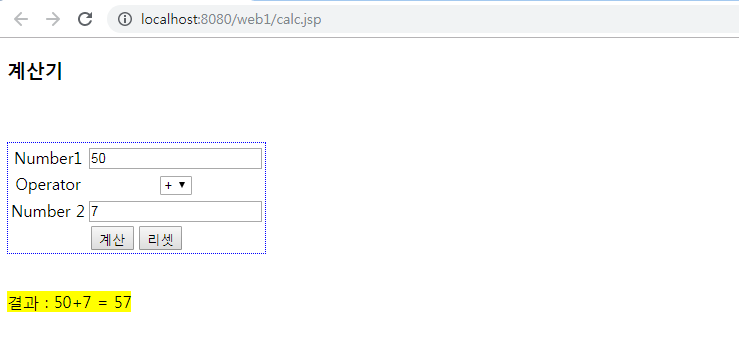
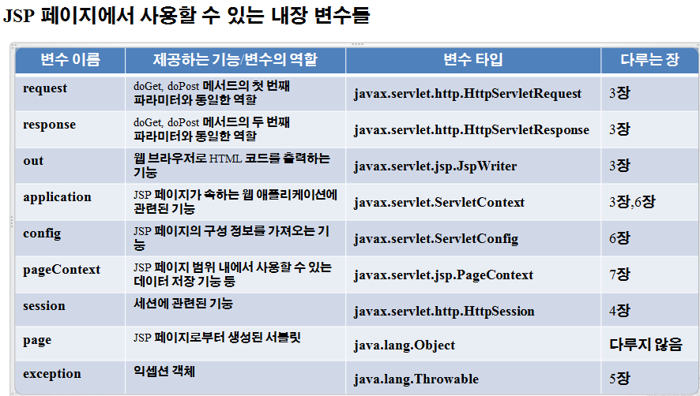

# `Servlet, JSP

### 참고

- [한권으로 끝내는..](https://www.aladin.co.kr/shop/wproduct.aspx?ItemId=178972777) -> 주교재


### 목록


----

## Servlet

- 톰켓(WAS) 위에서 java를 이용하여 동작하는 프로그램

- 웹에서의 요청을 받아서, 처리한다음에 처리 결과를 동적으로 응답페이지(html)를 생성하고 응답해주는것

  

- WAS? : web server + Application server

  ​			(http listener, http daemon) + webcontainer

  

- 기본 servlet 작성코드

```java
package lab.web.controller;

import java.io.IOException;
import java.io.PrintWriter;

import javax.servlet.http.HttpServlet;//웹서버에서 수행되는 servlet이 상속받는
import javax.servlet.http.HttpServletRequest;
import javax.servlet.http.HttpServletResponse;

public class HelloServlet extends HttpServlet{
    public void init(){//override 하지 않으면 부모의 init()수행
        //서블릿이 요청되어서 컨테이너 메모리에 생성될때 1번만 수행됨
        System.out.println("init(): 초기화");
    }
    public void service(HttpServletRequest req, HttpServletResponse res) throws ServletException, IOException{//requset 요청시 필요한 객체, response응답시 필요한 객체
        //서블릿 요청시마다 반복적으로 수행됨.
        res.setContentType("text/html;charset=utf-8");
        PrintWriter out = res.getWriter();
        out.print("<html>");
        out.print("<head><title>HelloServlet</title></head>");
        out.print("<body>");
        out.print("Hello 요청에 대한 Servlet 응답 <br>");
        out.print("안녕하세요? 서블릿입니다 ^^");
        out.print("</body></html>");
    }
    public void destory(){
        //override하지 않으면 부모의 destory()가 수행되고,
        //서블릿이 컨테이너로부터 소멸될때 1번만 수행됨.
        System.out.println("destroy(): 컨테이너 종료 또는 GC될때 수행");
    }
}
```

- 이클립스 이용하고, **URL mapping** 명을 따로 지정할 수 있네
- 한글이 포함된 HTML 응답처리는 `HttpServletResponse` 객체의 `getWriter()` 메서드 호출 전에 HttpSeveltResponse 객체의 `setContentType("text/html;charset=utf-8")` 필수적
- `JAVA` 안에 `HTML` 태그가 있음
- Servlet이 수정되면, 매번 java 코드를 컴파일~ .class파일 생성 한 후에 동적인 페이지를 처리하기 때문에 번거로움.
- DB와 통신하는데 유리함. 즉 데이터를 읽고 확인하는 작업에 유리함
- HTML태그를 넣기에 불편해...
- 병렬쓰레드..


1. **기본적인 동작 과정**
   - `web.xml` 확인하고 적절한 Servlet실행
   - Servlet 파일 컴파일 = .class파일 생성, Servlet 객체를 메모리에 올리고,
   - Servlet객체 초기화 = `Init()` 메서드 실행
   - WAS에서 Request가 올때마다, thread 생성(병렬로..)
   - 각 thread는 단일 객체에 대해 `service()` 메서드를 실행..

2. **Servlet Life Cycle**

   

   - `init, destroy`는 한번만 수행.

   - `service()` 

     HTTP Method에 대해 적절한 메서드를 구현해야함.

     (GET,POST, PUT,DELETE)....(doGet,doPost,doPut....)

   - `destroy()`

     메모리에 올라간 Servlet객체를 제거하는 역할이고.

     Web Application갱신 or WAS가 종료될때

3. **Servlet 준수사항**

   - 패키지 선언

   - public class로 선언

   - `httpServlet` 상속을 받아야함

   - `life cycle` 메서드를 `override`해줘야하고

     반드시 `override`해줘야하는 메서드는? `service(), doSet(), doGet(), doPost(), doPut()` 왜? 요청처리및 응답을 위해서는 반드시 해야되는 메서드.

   - `service(httpServletRequest, requset, HttpServletResponse response) throws ServletException, IOExeception` 예외처리 꼭해줘야함.

4. **Servlet 장점**

   - 자바 기반 (자바 API 모두 사용 가능)
   - 운영체제, 하드웨어 영향을 받지 않음
   - 쓰레드 기반.. 운영에 효율적


#### Q1) Servlet을 통해 HTTP 헤더구조 가져오기.

예<u>)http://ip:poart/web1/header</u> 로 요청하면.. ? -----> @webServlet("/header") 선언된 서블릿에서 처리하게 됨.

```java
package lab.web.controller;

import java.io.IOException;
import java.io.PrintWriter;
import java.util.Enumeration;

import javax.servlet.ServletException;
import javax.servlet.annotation.WebServlet;
import javax.servlet.http.HttpServlet;
import javax.servlet.http.HttpServletRequest;
import javax.servlet.http.HttpServletResponse;

/**
 * Servlet implementation class HeaderInfo
 */
@WebServlet("/header")
public class HeaderInfo extends HttpServlet {
	private static final long serialVersionUID = 1L;
       
    /**
     * @see HttpServlet#HttpServlet()
     */
    public HeaderInfo() {
        super();
    }

	/**
	 * @see HttpServlet#doGet(HttpServletRequest request, HttpServletResponse response)
	 */
	protected void doGet(HttpServletRequest request, HttpServletResponse response) throws ServletException, IOException {
		response.setContentType("text/html;charset=utf-8");
		PrintWriter out = response.getWriter();
		out.print("<html>");
		out.print("<head><title>Request Header 정보</title></head>");
		out.print("<body>");
		out.print("<h3>Requset Header정보</h3>");
		out.print("<ul>");
        //httpsServletRequest객체에 getheaderName()이라는 메서드를 통해
		Enumeration<String> headerName = request.getHeaderNames();
		while(headerName.hasMoreElements()) {
			String name = headerName.nextElement();
			out.print("<li>"+name+" : ");
            
			Enumeration<String> values = request.getHeaders(name);
			while(values.hasMoreElements()) {//return type boolean
				out.print(values.nextElement()+", ");
			}
			out.print("</li>");
		}
		out.print("<li> 요청메소드 : "+request.getMethod()+"</li>");
		out.print("<li> 요청한 clinet IP : "+request.getRemoteAddr()+"</li>");
		out.print("<li> ContextPath : "+request.getContextPath()+"</li>");
		out.print("<li> RequestURI : "+request.getRequestURI()+"</li>");
		out.print("<li> RequestURL : "+request.getRequestURL()+"</li>");
		out.print("<li> ServletPath : "+request.getServletPath()+"</li>");
		out.print("</ui></body></html>");
	}
}
```

- `HttpsServletRequest.getHeader()` : header이름으로 저장된 value를 반환(String)
- `HttpServeltRequest.getHeaders()` : header이름으로 저장된 value가 하나 이상이면 사용
- `HttpServletRequest.getRemotheAddr()` : http요청 메세지를 전송한 클라이언트 ip 정보 추출
- `request.getMethod()` : http 요청 메세지 전송 방식 정보 추출.
- 결과



#### Q2) 체크박스 전송

1. **Join.html**

```html
<!DOCTYPE html>
<html lang="en">
<head>
    <meta charset="UTF-8">
    <meta name="viewport" content="width=device-width, initial-scale=1.0">
    <meta http-equiv="X-UA-Compatible" content="ie=edge">
    <title>Document</title>
</head>
<body>
    <h3>회원 가입 페이지</h3>
    <form id="f1" method="post" action="join" >
        userid : <input type="text" name="userid"><br>
        password : <input type="password" name="userpwd"><br>
        
        관심사항 : <input type="checkbox" name="interest" value="영화">영화
                    <input type="checkbox" name="interest" value="운동">운동
                    <input type="checkbox" name="interest" value="여행">여행
                    <input type="checkbox" name="interest" value="공부">공부
                    <input type="checkbox" name="interest" value="음악감상">음악감상<br>
                    
        <input type="hidden" name="address" value="서울"><br>            
        <input type="submit" value="회원가입">
        <input type="reset" value="취소">
    </form>
</body>
</html>
```


2. **join.java**

```java
package lab.web.controller;

import java.io.IOException;
import java.io.PrintWriter;
import java.util.Enumeration;

import javax.servlet.ServletException;
import javax.servlet.annotation.WebServlet;
import javax.servlet.http.HttpServlet;
import javax.servlet.http.HttpServletRequest;
import javax.servlet.http.HttpServletResponse;


@WebServlet("/join")
public class Join extends HttpServlet {
	private static final long serialVersionUID = 1L;       

	protected void doPost(HttpServletRequest request, HttpServletResponse response) throws ServletException, IOException {
		request.setCharacterEncoding("utf-8");
		response.setContentType("text/html;charset=utf-8");
		PrintWriter out = response.getWriter();
		out.print("<html>");
		out.print("<head><title>Request 파라미터 처리</title></head>");
		out.print("<body>");
		out.print("<h3>Requset 파라미터 처리</h3>");
		out.print("<ul>");
		out.print("<li> userid "+request.getParameter("userid")+"</li>");
		out.print("<li> password : "+request.getParameter("userpwd")+"</li>");
		out.print("<li> address : "+request.getParameter("address")+"</li>");
		String interest[] =request.getParameterValues("interest");
		out.print("<li> 관심사항 : ");
		for(String inter : interest) {
			out.print(inter +", ");
		}
		out.print("</ui></body></html>");
	}
}
```

- checkbox는? (여러개 체크하여 보내는..)

  checked 요소의 value들을 String[] 값으로 반환받고, 이걸 Sevlet에서는 어떤방식으로 처리해아할까?

  `HttpServletRequset.getParameterValues("input요소의 name속성값")` 을 통해..


3. **결과**


#### Q3) Servlet을 통해 Multiple한 파일 업로드 웹페이지 만들기

1. **html**

```html
<!DOCTYPE html>
<html>
<head>
<meta charset="UTF-8">
<title>Fileupload 실습</title>
<style>
	input{
		margin: 2px;
	}
</style>

</head>
<body>
	<h2>fileupload 실습</h2>
	<form action="upload" method="post" enctype="multipart/form-data">
	작성자 이름 : <input type="text" name="theAuthor"><br>
	작성자 나이 :  <input type="text" name="theAge"><br>
	업로드 파일 : <input type="file" name="theFile" multiple/><br>
	<input type="submit" value="전송"/>
	</form>
</body>
</html>
```

2. **java_servlet**

```java
package lab.web.controller;

//import java.io.File;
import java.io.IOException;
import java.io.PrintWriter;
import java.util.Collection;
import javax.servlet.ServletException;
import javax.servlet.annotation.MultipartConfig;
import javax.servlet.annotation.WebServlet;
import javax.servlet.http.HttpServlet;
import javax.servlet.http.HttpServletRequest;
import javax.servlet.http.HttpServletResponse;
import javax.servlet.http.Part;

@WebServlet("/upload")//html action에 따른 주소
@MultipartConfig (location = "c:/uploadtest", maxFileSize = 1024*1024*5, maxRequestSize = 1024*1024*5*5)//업로드 되는파일사이즈 5mb, 요청데이터사이즈25mb
public class UploadServlet extends HttpServlet {
	private static final long serialVersionUID = 1L;

	protected void doPost(HttpServletRequest request, HttpServletResponse response) throws ServletException, IOException {
		request.setCharacterEncoding("utf-8");
		response.setContentType("text/html;charset=utf-8");
		PrintWriter out = response.getWriter();
//		String path = "C:/uploadtest";		
//		File isDir = new File(path);
//		if(!isDir.isDirectory()) {
//			isDir.mkdir();
//		} 해당 주소에 폴더가 없으면 생성할 수 있는 코드
        
		Collection<Part> parts = request.getParts();
		for(Part part : parts) {
			if(part.getContentType() !=null) { // upload된 파일은 여기로
				String fileName = part.getSubmittedFileName();
				if(fileName != null) {
					part.write(fileName.substring(0,fileName.lastIndexOf("."))+"_"+System.currentTimeMillis() + fileName.substring(fileName.lastIndexOf(".")));
					out.print("<br>업로한 파일 이름 : "+fileName);
					out.print("<br>크기 : "+part.getSize());
					}
			}else{ //폼 파일은 여기로
				String partName = part.getName();
				String fieldValue = request.getParameter(partName);
				out.print("<br>"+partName + " : "+fieldValue);
			}
		}
			out.close();
	}
}
```

- 클라이언트가 form태그내에 data를 서버 웹 컴포넌트로 전송, 서버 웹 컴포넌트에서 클라이언트가 보낸 form 데이터 추출하려면?? `HttpSevletRequest.getParameter("input 요소의 name속성값")`
- `@MultipartConfig ` 파일이 저장될 장소가 추가됨을 잊지 말 것.
- `Collection<Part> parts = request.getParts();`  업로드된 파일의 메타정보, 스트림들을 추출하기 위한 반환 객체

3. **결과**


#### Q4)  Resquest Dispatcher

- 요청을 통일한 웹 콘텍스트의 다른 `Servlet` 또는 `jsp` 에 전송하기위해!

- `ServletContext sctx = requset.getServletContext();` // 요청 웹 콘텍스트 객체 반환

- `RequestDispatcher rd = sctx.getRequestDispatcher`("/다른 servlet 또는 jsp "); // 요청을 전송할 다른 서블릿 jsp의 경로에 해당하는 객체

  `/` 의미는 현재 웹콘텍스트 아래.. 라는 의미

- `rd.forward(request, response)` 현재 요청하는 request를 넘길때..

  추가적인 정보를 넘기고 싶다? `requset.setAttribute("키",객체);` **map**구조

  가져올때는? `requset.getAttribute("키") ` 반환이 object로 되므로 , 실제 저장한 타입으로 downcasting으로 해야함.
  
- requsetDispatcher 방식 vs redirect 방식

  1. `requsetDispatcher` 

     - 동일한 웹 콘텍스트의 `JSP` 나 `Servlet` 에게 요청 재지정 가능
     - url 주소 표현은 **처음 요청한** Servlet이나 jsp

     ```java
     ServletContext sc = request.getServletContext();
     RequestDispatcher rd = sc.getRequsetDispatcher;("/요청 재지정 자원경로")//반드시 '/'로 시작
     requset.setAttribute(key,value); //추가적인 정보를 설정할때
     rd.forward(request, response); //전송.
     //즉 동일한 웹 컨텍스트의 JSP나 Servlet에게 request를 이용해서 정보 공유 가능
     ```

   2. `rediret `

      - 동일한 웹 콘텍스트의 `JSP` 나 `Servlet` 에게 요청 재지정 가능
      - 다른 웹 콘텍스트의 `JSP` 나 `Servlet` 에게 요청 재지정 가능
      - 다른 웹 서버로 요청 재지정 가능
      - URL주소 표현은 **최종 표현이 전달된** Servlet이나 jsp또는 웹서버의 주소
      
      ```java
      response.sendRedirect("url의 path형식"); // http://~로 시작  , ./ 상대경로 ,  root conntext로부터 시작하는 /~ 절대경로 방식
      ```
      
      - 최초 요청시에 컨테이너가 생성한 request와 response는 소멸되고, 새로운 request와 response객체가 redirect된 자원으로 `get` 방식으로 전달. **(requsetDispatcher와 다른점!)**
      
      - 그럼 동일한 웹서버내 동일한 웹콘텍스트에 클라이언트의 상태정보를 보존하여 전달하려고 하면 어떻게 해야할까?
      
        *Session*을 이용한다
      
        `HttpSession.setAttribute(key, value)` 또는 `ServletContext.setAttriute(key, value)`를 사용
      
        
  
     
  
     

1. **Message.jsp**

```jsp
<%@ page language="java" contentType="text/html; charset=UTF-8"
    pageEncoding="UTF-8"%>
<!DOCTYPE html>
<html>
<head>
<meta charset="UTF-8">
<title>message.jsp</title>
</head>
<body>
<h3>메세지 전송</h3>
	<form action = "./message" method="post">
		메세지 입력하세요 : <input type="text" name = "msg" size= 50><br>
		<br>
		<input type="submit" value="전송">	
	</form>

</body>
</html>
```

- `/view` 폴더 안에 있어서 정상적으로 접근 불가함.

2. **result.jsp**

```jsp
<%@ page language="java" contentType="text/html; charset=UTF-8"
	pageEncoding="UTF-8"%>
<!DOCTYPE html>
<html>
<head>
<meta charset="UTF-8">
<style>
#blue {
	color: blue;
}

#green {
	color: green;
}
</style>
<title>result.jsp</title>
</head>
<body>
	<h3>메세지 전송 결과</h3>
	message.jsp에서 보낸 파라미터 메세지 :
	<p id="blue">
	<%
	out.println(request.getParameter("msg")+"<br>");
	%>
	</p>

	<p id="green">
	<%
	String msg2 = (String)request.getAttribute("msg2");
	out.println(msg2+"<br>");
	%>	
	</p>
</body>
</html>
```

3. **ForwadServlet.java**

```java
package lab.web.controller;

import java.io.IOException;

import javax.servlet.RequestDispatcher;
import javax.servlet.ServletContext;
import javax.servlet.ServletException;
import javax.servlet.annotation.WebServlet;
import javax.servlet.http.HttpServlet;
import javax.servlet.http.HttpServletRequest;
import javax.servlet.http.HttpServletResponse;

@WebServlet("/message")
public class ForwardServlet extends HttpServlet {
	private static final long serialVersionUID = 1L;
	ServletContext sctx;
	RequestDispatcher rd;

	protected void doGet(HttpServletRequest request, HttpServletResponse response) throws ServletException, IOException {
			sctx = request.getServletContext();
			rd = sctx.getRequestDispatcher("/WEB-INF/view/message.jsp");
			rd.forward(request, response);
	}//일반적인 get으로 접근했을 때는 message.jsp로 가게 해주고


	protected void doPost(HttpServletRequest request, HttpServletResponse response) throws ServletException, IOException {
		request.setCharacterEncoding("utf-8");
		response.setContentType("text/html;charset=utf-8");
		
		request.setAttribute("msg2", "email.hi@gmail.com");
		sctx = request.getServletContext();
		rd = sctx.getRequestDispatcher("/WEB-INF/view/result.jsp");
		rd.forward(request, response);
	}//post
}
```

- 일반적인 `get`으로 접근했을 때는 `message.jsp`로 가게 해주고
- `post`방식으로 접근했을 때는, `msg2` 에 새로운 속성을 추가한다음 그 결과를 `result.jsp` 에 넘겨준다.

- WAS가 서비스하는 웹콘텍스트를 생성하면 이를 추상화한 객체(ServletContext)를 생성하는 데 이는 하나만 생성됨. 이를 얻기 위해서는 ? --> `request.getServletContext();` 

  


4. **결과**

- 전송전



- 전송후


#### Q5) Cookies 활용하여, 아이디 저장칸 만들기

- 접속시 웹 컨테이너에서 생성된 `Jsession id`, 로그인 정보,쇼핑 카트에 저장된 상품정보등 상태정보를 유지하는 방법

- Http 특성은 요청시 Connection 되며, 응답이 전송되면 disconnect됨. => *비연결형 protocool*

  계속 연결되어 있는 것이 아님

  매번 누구인지 알려면 귀찮으니까..

  상태정보를 저장하게 해줌. 4가지 방법

  1. 클라이언트 브라우저에 저장*(key =value)* : **Cookie**

     유효기간 설정할 수 있음. `setMaxAge()`

     ```java
     //쿠키 객체 생성
     Cookie c = new Cookie(key, value);
     
     //쿠키 전송, 요청
     HttpServletResponse.addCookie(); //클라이언트에게 전송
     HttpServletRequset.getCookies(); //클라이언트 요청으로부터 쿠키를 가져오기
     //쿠키 유효기간 설정
     setMaxAge(); //초단위
     setMaxAge(0); // 쿠키 정보 삭제하는 방법    
     ```

     

  2. url의 쿼리 스트링으로 요청시마다 전송하는 방법

     `http://ip:port/웹콘텍스트/xxx.jsp?jsessionid=......`

  3. 요청을 전송하는 페이지 `<input type='hidden' name='' value=''>` 이용

  

  4. 웹 콘테이너의 메모리에 객체로 저장함 : **Session**

     유효기간은 클라이언트의 브라우저가 종료되는 순간까지.

     객체명 ? `HttpSession` 

     요청시에 생성된 `Session` 을 받아오려면 `HttpServlet.getSession();`

     추가적인 정보를 저장하려면? `setAttribute(key,value)`

     특정 정보를 삭제하려면? `removeAttribute(key)`

     웹콘테이너가 생성한 Jsessionid를 받아오는 메소드? `getId()`

     세션이 요청한 마지막 시간을 받아오는 메소드? `getLastAcessTime()`

     클라이언트 요청이 없어도, httpSession을 웹 콘테이너의 메모리에 유지하는 시간을 설정? `setMaxInactiveInterval(초단위)`

     혹은 `web.xml` 에서 아래와 같은 코드를 추가

     ```xml
     <session-config>
     	<session-timeout>30</session-timeout> <!--분단위-->
     </session-config>
     ```

     세션에 저장된 상태정보를 삭제하고 세션 객체를 만료시키려면? `invalidate()`

     

     

  

- 쿠키가 저장되어있다면, 자동으로 로그인 id에 작성되도록 만들어보자

- 흐름

```
1. http://ip:port/web1/cookieLogin 요청 (GET방식)
2. @WebServet("/cookieLogin") 서블릿의 doGet() 요청 처리
    - 쿠키 정보 추출 request.getCookies(), userid키로 저장된 값 검색
    - 추출한 쿠키 정보를 request.setAttribute("userid" 쿠키값);
    - RequestDispatcher를 사용해서 "/cookie_login.jsp"로 전달
3. form태그 전송 ( action="cookieLogin" method="post")
4.  @WebServet("/cookieLogin") 서블릿의 doPost() 요청 처리
    - 로그인 처리
    - 아이디 저장 checkbox 선택된 경우 userid를 쿠키로 저장
    - RequestDispatcher를 사용해서 "/main.jsp"로 전달
5. main.jsp에서 로그아웃(/cookieLogout) 요청 (GET 방식)
6. @WebServet("/cookieLogout") 서블릿  의 doGet() 요청 처리
    -쿠키 정보 삭제  request.getCookies(), 쿠키 정보 추출해서 cookie.setMaxAge(0)으로 삭제
    - RequestDispatcher를 사용해서 다시 로그인 페이지로 전송       
```


1. **login, logout.jsp**

```jsp
<%@ page language="java" contentType="text/html; charset=UTF-8"
    pageEncoding="UTF-8"%>
<!DOCTYPE html>
<html>
<head>
<meta charset="utf-8">
<title>사용자 로그인</title>
</head>
	<body>
	<h3 id='header'>사용자 로그인</h3>
	<div id='main' style='text-align:center'>
		<br><br> 
		<form method=post action="cookieLogin" >
		<table style='border:1px #0000FF dotted;text-align:center'>
		<tr><td>사용자 ID </td>
		     <%
		     if(request.getAttribute("userid")==null){
		   	 %>
		   	 <td><input type=text name=userid></td></tr>
		   	 <%}else{
		   		String uid = (String)request.getAttribute("userid");
		   		 %>
		   		 <td><input type=text name=userid value="<%=uid%>"></td></tr>
		   	 <%} %>		    
		  <tr><td>사용자 암호 </td>
		    <td><input type=password name=passwd></td></tr>
		  <tr><td>아이디 저장 사용 </td>
		    <td><input type=checkbox name=cookie></td></tr>			
		  <tr><td colspan=2 style='text-align:right'>
			<input type=submit value='로그인'>
			<input type=reset value='취소'></td></tr>
	</table>
</form></div></body></html>

<%@ page language="java" contentType="text/html; charset=UTF-8"
    pageEncoding="UTF-8"%>
<!DOCTYPE html>
<html>
<head>
<meta charset="UTF-8">
<title>logout.jsp</title>
</head>
<body>
	<script>
		alert("로그아웃되었습니다.\n 쿠키 정보 삭제되었습니다");
		location.href ="./login.jsp"; 
	
	</script>

</body>
</html>
```


2. **main.jsp**

```jsp
<%@ page language="java" contentType="text/html; charset=UTF-8"
    pageEncoding="UTF-8"%>
<!DOCTYPE html>
<html>
<head>
<meta charset="UTF-8">
<title>main.jsp</title>
</head>
<body>
<%=request.getAttribute("userid") %> 님 환영합니다! :) <br>
<a href="cookieLogout"><button>로그아웃</button></a><br> 
</body>
</html>
```

- `login` 에 성공하였을 때 보여줄 페이지. 로그아웃 선택하면 `cookieLogout` servlet을 실행하도록 만들었음
- `<a href ='.xxx?paraName=paraValue&.....'>` get방식으로 요청이 전달됨


3. **CookieLogin , Logout servlet**

```java
package lab.web.controller;

import java.io.IOException;
import java.io.PrintWriter;

import javax.servlet.RequestDispatcher;
import javax.servlet.ServletContext;
import javax.servlet.ServletException;
import javax.servlet.annotation.WebServlet;
import javax.servlet.http.Cookie;
import javax.servlet.http.HttpServlet;
import javax.servlet.http.HttpServletRequest;
import javax.servlet.http.HttpServletResponse;

@WebServlet("/cookieLogin")
public class CookieLoginServlet extends HttpServlet {
	private static final long serialVersionUID = 1L;
	String uid = null, passwd = null;
	ServletContext sctx = null;
	RequestDispatcher rd = null;

	protected void doPost(HttpServletRequest request, HttpServletResponse response) throws ServletException, IOException {
		request.setCharacterEncoding("utf-8");
		response.setContentType("text/html;charset=utf-8");
		PrintWriter out = response.getWriter();
		uid = request.getParameter("userid"); //파라미터,name속성을 받고.
		passwd = request.getParameter("passwd");
		String userCookie = request.getParameter("cookie");
		
		if(userCookie != null) {
			Cookie uidCookie = new Cookie("userid", uid);
			uidCookie.setMaxAge(60*60*24*365); //1년간 저장한다.
			response.addCookie(uidCookie);
		}
		if(uid.equals("admin") && passwd.equals("1234")) {
			request.setAttribute("userid", uid);
			sctx = request.getServletContext();
			rd = sctx.getRequestDispatcher("/main.jsp");
			rd.forward(request, response);
		}
		else {
			out.println("<script>");
			out.println("alert(\'아이디 또는 비밀번호 오류입니다.\')");
			out.println("location.href=\"./login.jsp\"");
			out.println("</script>");
		}

	}
	protected void doGet(HttpServletRequest request, HttpServletResponse response) throws ServletException, IOException {
		request.setCharacterEncoding("utf-8");
		response.setContentType("text/html;charset=utf-8");
//		PrintWriter out = response.getWriter();
		
		Cookie cookies[] = request.getCookies(); //쿠키를 얻기위한 메서드
		if(cookies!=null) {
			for(int i =0; i < cookies.length; i++) {
				String name = cookies[i].getName();
				if(name.equals("userid")){
					uid = cookies[i].getValue();
					//System.out.println(uid); 아이디가 정상적으로 들어오는지 확인
				}
			}
			request.setAttribute("userid", uid);
		}
		sctx = request.getServletContext();
		rd = sctx.getRequestDispatcher("/login.jsp");
		rd.forward(request, response);
	}
}
```

- **location.href vs location.replace**
  - [출처](https://blog.naver.com/yiuse78/50100213667)




```java
package lab.web.controller;

import java.io.IOException;
//import java.io.PrintWriter;

import javax.servlet.RequestDispatcher;
import javax.servlet.ServletContext;
import javax.servlet.ServletException;
import javax.servlet.annotation.WebServlet;
import javax.servlet.http.Cookie;
import javax.servlet.http.HttpServlet;
import javax.servlet.http.HttpServletRequest;
import javax.servlet.http.HttpServletResponse;

@WebServlet("/cookieLogout")
public class CookieLogoutServlet extends HttpServlet {
	private static final long serialVersionUID = 1L;  
	ServletContext sctx = null;
	RequestDispatcher rd = null;

	protected void doGet(HttpServletRequest request, HttpServletResponse response) throws ServletException, IOException {
		request.setCharacterEncoding("utf-8");
		response.setContentType("text/html;charset=utf-8");
		//PrintWriter out = response.getWriter();
		Cookie[] cookies = request.getCookies();
		if(cookies!=null) {
			for(int i =0; i<cookies.length; i++) {
				if(cookies[i].getName().equals("userid")){
					cookies[i].setMaxAge(0);
					response.addCookie(cookies[i]);//쿠키를 응답해주는 메서드
				}
			}
		}
		sctx = request.getServletContext();
		rd = sctx.getRequestDispatcher("/logout.jsp");
		rd.forward(request, response);
	}
}
```


4. **결과**

- **cookieloginservlet을 실행하여 확인한다.**

- login



- login_success



- cookies_add



- cookies_delete



- 쿠키삭제는 개발자 도구 - > application -> cookies에서 확인..


#### Q6) Ajax이용한 계산기 만들기

1. **calc.jsp**

```jsp
<%@ page language="java" contentType="text/html; charset=UTF-8"
    pageEncoding="UTF-8"%>
<!DOCTYPE html>
<html>
<head>
<meta charset="utf-8">
<title>사용자 로그인</title>
<script src="https://ajax.googleapis.com/ajax/libs/jquery/3.4.1/jquery.min.js"></script>
<script>
	$(document).ready(function(){
		$("#f1").submit(function(event){
			event.preventDefault();
			var n1 = $("#num1").val();
			var n2 = $("#num2").val();
			var op = $("#operator option:selected").val();
			$.ajax({
				url : "./calc",
				data : {"num1": n1, "num2":n2, "operator":op},
				success : function(data){
					console.log(data);
					$("#result").html("<mark>결과 : "+n1+op+n2+" = "+data+"</mark>")
				}
			})
		})
	})
</script>
</head>
	<body>
	<h3 id='header'>계산기</h3>
	<div id='main' style='text-align:center'>
		<br><br> 
		<form id="f1">
		<table style='border:1px #0000FF dotted;text-align:center' id="table">
		<tr><td>Number1 </td>
			<td><input type="text" name=num1 id="num1"></td></tr>
		  <tr><td>Operator </td>
		    <td><select name="operator" id="operator">
				<option value="+">+</option>
				<option value="-">-</option>
				<option value="*">*</option>
				<option value="/">/</option>
			</select></td></tr>
		  <tr><td>Number 2 </td>
		    <td><input type="text" name=num2 id="num2"></td></tr>			
		  <tr><td colspan=2 style='text-align:mid'>
			<input type=submit value='계산'>
			<input type=reset value='리셋'></td></tr>
	</table>
	<br>
</form>
</div>
<p id="result">결과: </p>
</body>
</html>
```

2. **calcServlet.java**

```java
package lab.web.controller;

import java.io.IOException;
import java.io.PrintWriter;

import javax.servlet.ServletException;
import javax.servlet.annotation.WebServlet;
import javax.servlet.http.HttpServlet;
import javax.servlet.http.HttpServletRequest;
import javax.servlet.http.HttpServletResponse;

/**
 * Servlet implementation class CalcServlet
 */
@WebServlet("/calc")
public class CalcServlet extends HttpServlet {
	private static final long serialVersionUID = 1L;
	int num1 =0;
	int num2 =0;
	String operator = null;
	int result = 0;
       
     public CalcServlet() {
        super();
    }

	protected void doGet(HttpServletRequest request, HttpServletResponse response) throws ServletException, IOException {
		request.setCharacterEncoding("utf-8");
		response.setContentType("text/html;charset=utf-8");
		num1 = Integer.parseInt(request.getParameter("num1"));
		num2 = Integer.parseInt(request.getParameter("num2"));
		operator = request.getParameter("operator");
		PrintWriter out = response.getWriter();
		
		if(operator.equals("*")) {
			result = (num1 * num2);
		}else if(operator.equals("+")) {
			result = (num1 + num2);
		}else if(operator.equals("/")) {
			result = (num1 / num2);
		}else {
			result = (num1 - num2);
		}
		out.print(result);
		//SevletContext sc = requset.getServletContext();
		//RequestDispatcher rd = sc.getRequestDispatcher("/...jsp");
		//requset.setAttribute = ("result",result);
		//rd.forward(request, response);
	}

}
```

3. **결과**

- jsp



- 계산




## JSP

- 참고

  1.[https://gmlwjd9405.github.io/2018/10/28/servlet.html](https://gmlwjd9405.github.io/2018/10/28/servlet.html)

  2.[https://technet.tmaxsoft.com/upload/download/online/jeus/pver-20150722-000001/web-engine/chapter_context_web_application.html](https://technet.tmaxsoft.com/upload/download/online/jeus/pver-20150722-000001/web-engine/chapter_context_web_application.html)
  
- Java server page

  Html 또는 XML 기반의 동적인 웹 콘텐츠를 개발하는 스크립트

  MVC 중 View의 역할

  자바 코드 로직을 가능한 포함하지 않고, 태그 el로만 콘텐츠를 생성하는 것을 권장함.
#### 1. 웹 콘텍스트 표준 구조


- WEB-INF(보안폴더)

  ​	 lib(외부 자바 library)

  ​	 web.xml(웹콘텍스트의 환경설정파일, 컨텍스트의 파라미터,리스너,웰컴페이지..)

  

- 웹페이지 콘텐츠의 **정적인 내용**은 `HTML` or `XML` 기술로 작성하고 **동적인 내용**은 `JSP,스크립트` 코드로 작성하는 기술.

  정적? 클라이언트가 서버에 요청하면, **미리** 준비된 문서를 전달하는 방식.

  동적? 클라이언트가 서버에 요청하면, **가공처리후 생성된**   문서를 전달하는 방식.


#### 2. JSP 컴파일 순서


- 직접 실행되지 못함. JSP 코드에 해당되는 *Servlet 파일을 만들어서*, 그 서블릿이 실행되는 방식임.

  서블릿은 매번 생성되는 건 아니고, 컴파일된 class 파일이 없는 경우만 생성.

- **서블릿 컨테이너 Servlet Contatiner** = **WAS(web application server)**

```jsp
<%@ page import ="java.util.Date" %>
<%@ page language="java" contentType="text/html; charset=UTF-8"pageEncoding="UTF-8"%>
<!DOCTYPE html>
<html>
<head>
<meta charset="UTF-8">
<title>hello.jsp</title>
</head>
<body>
	이클립스에서 만든 hello.jsp 페이지 입니당<br>
	<%//자바코드삽입
	Date now = new Date();
	out.println(now);	
	%>
</body>
</html>
```

- 이클립스를 이용해서 JSP를 생성한다.
- `HTML` 내부에 자바 코드가 삽입됨
- 접속은? `http://localhost:8080/../hello.jsp`
- 가능한 인코딩은 `utf-8`로..
- 알아둬야할 표현
  1. 지시자 `<%@...%>`
  2. 스트립틀릿 `<% 자바코드..%>`
  3. 선언문 `<%!.... %>`
  4. 표현식` <%=....%>`
- 수정된 경우 WAS가 알아서 처리함. 쉽게 배포됨.


#### 3. **JSP MVC**

[https://gmlwjd9405.github.io/2018/11/05/mvc-architecture.html](https://gmlwjd9405.github.io/2018/11/05/mvc-architecture.html)


#### 4. JSP 기초문법

​	**JSP 준수사항**

- 정적페이지 선언 `<%@ page .....%>` 
- view 페이지는 jsp
- Controller는 Servlet
- data영속성과 비즈니스 로직은 javaobject로


- 기본요소

  자바코드를 직접적으로 넣는 것을 권장하지 않는다.

##### 4.1 정적 지시자 

  ```
  <%@ page 
  text/html : html를 응답해주고 싶을때, text/plain, image/jpeg. text/json...
  application/vnd.ms... ppt등으로 응답해주고 싶을때
  session
  buffer
  isThreadSafe
  errorPage
  isErrorPage
  info
  language //default가 java임
  import // package클래스 
  extends
  isELIgored
  defferedSyntaxAllowedAsLiteral %>
  
  ${}
  #{} 템플릿 컨텐츠. JSF 지원하는 것
  ```

  ```
#jsp페이지 내에 다른 jsp 페이지를 포함시키려고 할때 사용하는 것
<%@ include 
file=""  //경로%>
포함될 JSP페에서 <html>,<head>,<body>제외하고 <body>태그의 내용의 콘텐츠만 작성해야함
  ```

  ```
<%@ taglib  prefix="" uri="http://java.sun.com/jsp/jstl/~" %>
 JSP페이지내에 HTML 이 아닌 태그를 만나면 태그에 매핑된 Java class를 실행시켜서 실행 결과를 페이지의 컨텐츠로 처리
 JSTL(Java Standard Tag Library)을 사용하기 위한 선언 , core, sql, xml, 국제화 format처리 라이브러리등을 사용하기 위해 선언
  ```

  

##### 4.2 동적 지시자

 <jsp:include ~></jsp:include>

<jsp:useBean, setProperty..

- 최초 JSP 요청 -> 컨테이너가 변환된 서블릿 java파일을 검색 -> 존재하지 않으면 서블릿 java파일 변환 -> 컴파일 -> 클래스를 메모리 로딩 -> 서블릿 객체 생성 -> lifecycle 메서드 호출

```jsp
declare scriptlet <%!
public void method(){

문장;
}%>

scriptlet <% 자바실행문장; %> 
세미콜론과 함께! _jspService()메서드의 문장으로 포함
//자바 주석 사용

expression <%= 출력내용 %> 
변수, 연산식, 값을 리턴. 세미콜론 쓰면 안됨 실제 웹페이지에 출력할 내용
<% out.println(출력내용) %> , ${출력내용}

주석?
<%-- 주석 --%>
```

```jsp
<%@ page language="java" contentType="text/html; charset=UTF-8"
    pageEncoding="UTF-8"%>
 <%! 
    //delcare scriptlet
 	int global = 100;
 	public int method(int num){
 		int local = num;
 		return local + global;
 	}
 
 %>
<!DOCTYPE html>
<html>
<head>
<meta charset="UTF-8">
<title>Insert title here</title>
</head>
<body>
    <!--expression-->
<%= 3+4 %><br>
<%="jdk"+8 %><br>
global 변수 값 : <%=global %> <br>
method(3)호출 결과 : <%=method(3) %> <br>
<hr>
<%
    //scriptlet
	out.print((3+4)+"<br>");
	out.print("jdk"+8+"<br>");
	out.print("global 변수 값 :"+global+"<br>");
	out.print("method(3)호출 결과 :"+method(3)+"<br>"); //scriptlet은
%>

</body>
</html>
```

- 현재 이 방법은 권장하지 않는다.
- [https://doublesprogramming.tistory.com/64](https://doublesprogramming.tistory.com/64)

#### 5. JSP 내장객체

- 동적인 요청을 처리하는 JSP 요청과 응답을 처리하기 위해서 JSP 컨테이너가 서블릿으로 변환하면서 내장 객체들을 생성해서 `_jspService()`로 전달 추가.

​    

- `exception` 이라는 객체는 JSP 선언자에 `isErrorPage="true"` 로 작성되어 있어야 사용할 수 있음.

- 위의 10가지 정도는 변수타입까지 기억하자(웹에서 사용하는 주객체)

- 내장 객체들의 유효 범위 - 콘테이너 메모리에 유지되는 범위를 의미함

  page는 요청된 JSP가 수행되는 동안만

  request 요청이 종료 될때 까지

  session 세션 만료 될때까지 또는 inactive상태에서는 30분동안

  application 웹 콘텍스트가 웹 콘테이너로부터 삭제될때 까지 또는 웹 컨테이너가 종료될때 까지

- page,request, session, application에 정보를 저장, 삭제 반환 메서드

  `set,get,remove+Attribute()`

  `getAttributeNames()`

  


```jsp
<%@page import="java.util.Enumeration"%>
<%@ page language="java" contentType="text/html; charset=UTF-8"
    pageEncoding="UTF-8"%>

<%
	Enumeration<String> headers = request.getHeaderNames();

	while(headers.hasMoreElements()){
		String name = headers.nextElement();
		out.print("<li>"+name+ " : ");
		Enumeration<String> values = request.getHeaders(name);
		while(values.hasMoreElements()){
			out.print(values.nextElement() +", ");
		}
		out.print("</li> ");
	}

%>
<br>
<li>요청 메소드 : <%= request.getMethod() %></li>
<li>요청 클라이언트 IP : <%= request.getRemoteAddr() %></li>
<li>ContextPath : <%= request.getContextPath() %></li>
<li>RequestURI : <%= request.getRequestURI() %></li>
<li>RequestURL : <%= request.getRequestURL() %></li>
<li>ServletPath : <%= request.getServletPath() %></li>
```

- `request` 객체를 이용하여 headerinfo 받아오기


- 자주 구현하는 기능을 태그로 정의

1. 표준 액션 태그 
2. 커스텀 액션 태그


#### 6. EL


#### Q)1 Ajax 이용하여 ID vaild check

1. **member.html**

```html
<!DOCTYPE html>
<html lang="en">
 <head>
  <meta charset="UTF-8">
  <style>
   h3 { width: 740px; 
       text-align : center; }
      
  </style>
  <script src="https://ajax.googleapis.com/ajax/libs/jquery/3.4.1/jquery.min.js"></script>
  <script>
  $(document).ready(function(){	  
	  $("#idCheck").click(function(e){
		  if(e === undefined) {
			  window.event.cancelBubble = true;
		  } else {
			  e.stopPropagation();
			  e.preventDefault(); 
		  }
		  
	          var n1 = $("[name='userid']").val();
	          console.log(n1);
	          $.ajax({            
	            url : "idCheck.jsp",	          
	            data : {"userid" : n1},
	            success : function(data){
	               $("#result").html(data);
	            }
	          });
	        });
  });
	
  
  </script>
  <title>회원 가입</title>
 </head>
 <body>
 <h3> 회원가입 정보 입력</h3>
 <form name="write_form_member" method="post">
   <table width="740" style="padding:5px 0 5px 0; ">
      <tr height="2" bgcolor="#FFC8C3"><td colspan="2"></td></tr>
      <tr>
         <th> 이름</th>
         <td><input type="text" name="mbname"></td>
      </tr>
      <tr>
         <th>주민등록번호</th>
         <td><input type="text" name="jumin_1"> -
        <input type="password" name="jumin_2"></td>
       </tr>
       <tr>
         <th>아이디</th>
         <td>
         <input type="text" name="userid"> <button id="idCheck">중복ID체크</button><span id="result"></span>
          
         </td>
       </tr>
       <tr>
         <th>비밀번호</th>
         <td><input type="password" name="mbpw"> 영문/숫자포함 6자 이상</td>
       </tr>
       <tr>
         <th>비밀번호 확인</th>
         <td><input type="password" name="mbpw_re"></td>
       </tr>
       <tr>
          <th>비밀번호 힌트/답변</th>
          <td><select name='pwhint' size='1' class='select'>
          <option value=''>선택하세요</option>
          <option value='30'>졸업한 초등학교 이름은?</option>
          <option value='31'>제일 친한 친구의 핸드폰 번호는?</option>
          <option value='32'>아버지 성함은?</option>
          <option value='33'>어머니 성함은?</option>
          <option value='34'>어릴 적 내 별명은?</option>
          <option value='35'>가장 아끼는 물건은?</option>
          <option value='36'>좋아하는 동물은?</option>
          <option value='37'>좋아하는 색깔은?</option>
          <option value='38'>좋아하는 음식은?</option>
        </select>
        </tr>
        <tr>
        </td>
           <th>답변</th>
           <td><input type='text' name='pwhintans'></td>
        </tr>
        <tr>
          <th>이메일</th>
          <td>
            <input type='text' name="email">@
            <input type='text' name="email_dns">
              <select name="emailaddr">
                 <option value="">직접입력</option>
                 <option value="daum.net">daum.net</option>
                 <option value="empal.com">empal.com</option>
                 <option value="gmail.com">gmail.com</option>
                 <option value="hanmail.net">hanmail.net</option>
                 <option value="msn.com">msn.com</option>
                 <option value="naver.com">naver.com</option>
                 <option value="nate.com">nate.com</option>
              </select>
            </td>
         </tr>
         <tr>
           <th>주소</th>
           <td>
             <input type="text" name="zip_h_1"> - 
             <input type="text" name="zip_h_2">
             <input type="text" name="addr_h1"><br>
             <input type="text" name="addr_h2">
           </td>
         </tr>
         <tr>
         <th>전화번호</th>
           <td><input type="text"name="cel1"> -
               <input type="text" name="cel2_1" title="전화번호"> -
               <input type="text" name="cel2_2">
            </td>
        </tr>
        <tr>
          <th>핸드폰 번호</th>
           <td><input type="text"name="tel_h1"> -
               <input type="text" name="tel_h2_1"> -
               <input type="text" name="tel_h2_2">
           </td>
          </tr>
         <tr>
           <th>직업</th>
           <td>
           <select name='job' size='1'>
                 <option value=''>선택하세요</option>
                 <option value='39'>학생</option>
                 <option value='40'>컴퓨터/인터넷</option>
                 <option value='41'>언론</option>
                 <option value='42'>공무원</option>
                 <option value='43'>군인</option>
                 <option value='44'>서비스업</option>
                 <option value='45'>교육</option>
                 <option value='46'>금융/증권/보험업</option>
                 <option value='47'>유통업</option>
                 <option value='48'>예술</option>
                 <option value='49'>의료</option>
           </select>
          </td>
        </tr>
       <tr>
         <th>메일/sns 정보 수신</th>
           <td class="s">
               <input type="radio" name="chk_mail" checked> 수신
               <input type="radio" name="chk_mail" value="4"> 수신거부
            </td>
         </tr>
         <tr>
           <th> 관심분야 </th>
           <td>
              <input type='checkbox' name='interest[]' value='17'> 생두
              <input type='checkbox' name='interest[]' value='18'> 원두
              <input type='checkbox' name='interest[]' value='19'> 로스팅
              <input type='checkbox' name='interest[]' value='20'> 핸드드립
              <input type='checkbox' name='interest[]' value='21'> 에스프레소
              <input type='checkbox' name='interest[]' value='22'> 창업
            </td>
         </tr>
         <tr>
           <th>가입경로</th>
           <td>
             <select name='location' size='1'>
                 <option value=''>선택하세요</option>
                 <option value='23'>네이버검색</option>
                 <option value='24'>다음검색</option>
                 <option value='25'>기타검색엔진</option>
                 <option value='26'>카페or동호회를 통해</option>
                 <option value='27'>지인의소개</option>
                 <option value='28'>기타</option>
             </select>
           </td>
         </tr>
 
         <tr>
           <th>정보공개여부</th>
           <td>
           <select name='chk_open' size='0'>
                 <option value=''>선택하세요</option>
                 <option value='5'>모두공개</option>
                 <option value='6'>비공개</option>
                 <option value='7'>1단계공개</option>
                 <option value='8'>2단계공개</option>
             </select>
            </td>
           </tr>
 
           <tr height="2" bgcolor="#FFC8C3"><td colspan="2"></td></tr>
           <tr>
             <td colspan="2" align="center">
               <input type="submit" value="회원가입">
               <input type="reset" value="취소">
            </td>
           </tr>
           </table>
          </td>
          </tr>
          </form>
 </body>
</html>
 
```

2. **idCheck.jsp**

```jsp
<%@ page contentType="text/plain;charset=utf-8"%>
<%
  String[] ids = new String[]{"test", "admin", "guest"};
  String uid = request.getParameter("userid");
  String result = "valid";
  for(int i=0;i<ids.length;i++){
	  if(ids[i].equals(uid)){
		  result ="invalid"; 
		  break;
	  }
  }
  out.println(result); 
%>
```

#### Q2) MVC 구조를 이용한 login page

- oracle db 이용
- login,loginfail,loginsuccess.jsp + LoginDAO,LoginServlet.java로 구성되어있음.

1. **Jsp**

```jsp
<%@ page language="java" contentType="text/html; charset=UTF-8"
    pageEncoding="UTF-8"%>
<!DOCTYPE html>
<html>
<head>
<meta charset="UTF-8">
<title>MVC구조 login</title>
</head>
	<body>
	<h3 id='header'>MVC구조 login</h3>
	<div id='main' style='text-align:center'>
		<br><br> 
		<form method=post action="Login" >
		<table style='border:1px #0000FF dotted;text-align:center'>
		<tr><td>사용자 ID </td>		  
		   	 <td><input type=text name="userid" id="userid"></td></tr>		  
		  <tr><td>사용자 암호 </td>
		    <td><input type=password name="userpwd" id="userpwd"></td></tr>
		  <tr><td colspan=2 style='text-align:right'>
			<input type=submit value='로그인'>
			<input type=reset value='취소'></td></tr>
		</table>
	</form>
	</div>
</body>
</html>

<%@ page language="java" contentType="text/html; charset=UTF-8"
    pageEncoding="UTF-8"%>
<!DOCTYPE html>
<html>
<head>
<meta charset="UTF-8">
<Style>
	p{color : red;}
</Style>
<title>loginFail.jsp</title>
</head>
<body>
<p>아이디가 존재하지 않거나 비밀번호가 일치하지 않습니다.</p>
<a href="./login.jsp">다시 로그인하기</a><br>

</body>
</html>

<%@ page language="java" contentType="text/html; charset=UTF-8"
    pageEncoding="UTF-8"%>
<!DOCTYPE html>
<html>
<head>
<style>
	p {color:blue;}
</style>
<meta charset="UTF-8">
<title>loginSucess.jsp</title>
</head>
<body>
<p>${userid}님 환영합니다!!</p>
<br>

</body>
</html>
```


2. **java**

```java
package lab.web.model;

import java.io.FileInputStream;
import java.sql.Connection;
import java.sql.DriverManager;
import java.sql.PreparedStatement;
import java.sql.ResultSet;
import java.sql.Statement;
import java.util.Properties;

public class LoginDAO {
	public Connection dbCon() {
		Connection con = null;
		try {
			Properties prop = new Properties();
			prop.load(new FileInputStream("C:/workspace2/web2/WebContent/WEB-INF/dbinfo.properties"));
			Class.forName(prop.getProperty(("driver")));
			con = DriverManager.getConnection(prop.getProperty("url"),prop.getProperty("user"),prop.getProperty("pwd"));
			
		}catch (Exception e) {
			e.printStackTrace();
		}
		return con;
	}
	public void dbClose(Connection con, Statement stat,ResultSet rs) {
		try {
			if(rs!=null) rs.close();
			if(stat!=null) stat.close();
			if(con!=null) con.close();
		}catch (Exception e) {
			e.printStackTrace();
		}

	}
	public boolean loginProc(String uid, String upwd) {
		boolean success = false;
		Connection con = null;
		PreparedStatement stat = null;
		String sql = "select * from userinfo where userid=? and userpwd =?";
		ResultSet rs = null;
		try {
			con = dbCon();
			stat = con.prepareStatement(sql);
			stat.setString(1, uid);
			stat.setString(2, upwd);
			rs = stat.executeQuery();
			if(rs.next()) {
				success = true;
				
			}
		}catch (Exception e) {
				e.printStackTrace();
		}finally{
				dbClose(con, stat, rs);
		}
		return success;	
	}
}

package lab.web.model;

import java.io.IOException;
import javax.servlet.RequestDispatcher;
import javax.servlet.ServletContext;
import javax.servlet.ServletException;
import javax.servlet.annotation.WebServlet;
import javax.servlet.http.HttpServlet;
import javax.servlet.http.HttpServletRequest;
import javax.servlet.http.HttpServletResponse;


@WebServlet("/Login")
public class LoginServlet extends HttpServlet {
	private static final long serialVersionUID = 1L;
    
	protected void doGet(HttpServletRequest request, HttpServletResponse response) throws ServletException, IOException {
		response.setContentType("text/htmll;charset=utf-8");
		response.sendRedirect("./login.jsp");
	}

	protected void doPost(HttpServletRequest request, HttpServletResponse response) throws ServletException, IOException {
		response.setContentType("text/htmll;charset=utf-8");	
		String uid = request.getParameter("userid");
		String upwd = request.getParameter("userpwd");
		LoginDAO dao = new LoginDAO();
		ServletContext sc = request.getServletContext();
		RequestDispatcher rd = null;
		
		if(dao.loginProc(uid, upwd)) {
			rd = sc.getRequestDispatcher("/loginSucess.jsp");
			request.setAttribute("userid",uid);
			rd.forward(request, response);
		}else {
			rd = sc.getRequestDispatcher("/loginFail.jsp");
			rd.forward(request, response);
		}
	}
}
```


**3.properties**

```
driver=oracle.jdbc.OracleDriver
url=jdbc:oracle:thin:@localhost:1521:orcl
user=hr
pwd=oracle
```


#### Q3) Q2번 지시자를 이용하여 개선하기

#### Q4) 지시자를 이용하여 기본 페이지 만들기

1. **content.jsp**

```JSP
<%@ page language="java" contentType="text/html; charset=UTF-8"
    pageEncoding="UTF-8"%>
<!DOCTYPE html>
<html>
<head>
<meta charset="UTF-8">
<title>Insert title here</title>
</head>
<body>
	<h3>include 지시자 예제</h3>
	<table border="1">
		<tr>
		<td colspan="2" align="center">
		<jsp:include page="header.jsp">
			<jsp:param name="company" value="PUBG" />
		</jsp:include>
		</td></tr>
		
		<tr>
		<td>
		<jsp:include page="menu.jsp" />		
		<td width="400"></td>
		</tr>
		<tr>
		<td colspan="3" align = "center">
		<jsp:include page="footer.jsp">
		<jsp:param name ="address" value="서울 광화문" />
		</jsp:include>
		</td></tr>
	</table>

</body>
</html>
```

2. **header,footer, menu.jsp**

```jsp
<%@ page language="java" contentType="text/html; charset=UTF-8"
    pageEncoding="UTF-8"%>
<% request.setCharacterEncoding("utf-8"); %>
<style>
h3 {text-align:center;}
</style>
<h3> ${param.company} </h3>

<%@ page language="java" contentType="text/html; charset=UTF-8"
    pageEncoding="UTF-8"%>
 <% request.setCharacterEncoding("utf-8"); %>
<style>
h5 {text-align: center;}
</style>
<h5>copywrite | 연락처 | help@help.com </h5>
<h5>${param.address}</h5>

<%@ page language="java" contentType="text/html; charset=UTF-8"
    pageEncoding="UTF-8"%>
<% request.setCharacterEncoding("utf-8"); %>
<style>
p {text-align:center;}
</style>
<p>1. 로그인</p>
<p>2. 로그아웃</p>
```


#### Q5) 기본 회원가입 페이지

1.member.html

```html
<!DOCTYPE html>
<html lang="kor">
 <head>
  <meta charset="UTF-8">
  <style>
   h3 { width: 740px; 
       text-align : center; }
      
  </style>
  <title>회원 가입</title>
 </head>
 <body>
 <h3> 회원가입 정보 입력</h3>
 <form name="write_form_member" method="post" action="Join">
   <table width="740" style="padding:5px 0 5px 0; ">
      <tr height="2" bgcolor="#FFC8C3"><td colspan="2"></td></tr>
      <tr>
         <th> 아이디 </th>
         <td><input type="text" name="userid"></td>
      </tr>
      <tr>
         <th>이 름</th>
         <td><input type="text" name="username">  </td>
       </tr>        
       <tr>
         <th>비밀번호</th>
         <td><input type="password" name="userpwd"> 영문/숫자포함 6자 이상</td>
       </tr>   
      
        <tr>
        </td>
           <th>연락처</th>
           <td><input type='text' name='phone'></td>
        </tr>
        <tr>
          <th>이메일</th>
          <td>
            <input type='text' name="email">@
            <input type='text' name="email_dns">
              <select name="emailaddr">
                 <option value="">직접입력</option>
                 <option value="daum.net">daum.net</option>
                 <option value="empal.com">empal.com</option>
                 <option value="gmail.com">gmail.com</option>
                 <option value="hanmail.net">hanmail.net</option>
                 <option value="msn.com">msn.com</option>
                 <option value="naver.com">naver.com</option>
                 <option value="nate.com">nate.com</option>
              </select>
            </td>
         </tr>
         
         <tr>
           <th>직업</th>
           <td>
           <select name='job' size='1'>
                 <option value=''>선택하세요</option>
                 <option value='39'>학생</option>
                 <option value='40'>컴퓨터/인터넷</option>
                 <option value='41'>언론</option>
                 <option value='42'>공무원</option>
                 <option value='43'>군인</option>
                 <option value='44'>서비스업</option>
                 <option value='45'>교육</option>
                 <option value='46'>금융/증권/보험업</option>
                 <option value='47'>유통업</option>
                 <option value='48'>예술</option>
                 <option value='49'>의료</option>
           </select>
          </td>
        </tr>
       <tr>
         <th>주소 </th>
           <td class="s">
               <input type="text" name="address"  >  
            </td>
         </tr>
         
 
           <tr height="2" bgcolor="#FFC8C3"><td colspan="2"></td></tr>
           <tr>
             <td colspan="2" align="center">
               <input type="submit" value="회원가입">
               <input type="reset" value="취소">
            </td>
           </tr>
           </table>
          </td>
          </tr>
          </form>
 </body>
</html>
 
```


2. memberok.jsp

```jsp
<%@ page language="java" contentType="text/html; charset=UTF-8"
    pageEncoding="UTF-8"%>
<% request.setCharacterEncoding("utf-8"); %>
<!DOCTYPE html>
<html>
<head>
<meta charset="UTF-8">
<title>memeberOk3.jsp</title>
</head>
<body>


 
 ${user.userid } <br>
 ${user.job } <br>
 ${user.address } 
 


</body>
</html>
```


3. joinsevlet.java

```java
package lab.web.model;

import java.io.IOException;
import java.io.PrintWriter;
import java.util.HashMap;

import javax.servlet.RequestDispatcher;
import javax.servlet.ServletContext;
import javax.servlet.ServletException;
import javax.servlet.annotation.WebServlet;
import javax.servlet.http.HttpServlet;
import javax.servlet.http.HttpServletRequest;
import javax.servlet.http.HttpServletResponse;

@WebServlet("/Join")
public class joinServlet extends HttpServlet {
	private static final long serialVersionUID = 1L;

    public joinServlet() {
        super();
    
    }


	protected void doPost(HttpServletRequest request, HttpServletResponse response) throws ServletException, IOException {
		response.setContentType("text/html;charset=utf-8");
		request.setCharacterEncoding("utf-8");		
		PrintWriter out = response.getWriter();	
		
		HashMap<String, String> jobs = new HashMap<String, String>();
		jobs.put("39", "학생");
		jobs.put("40", "컴퓨터/인터넷");
		jobs.put("41", "언론");
		jobs.put("42", "공무원");
		jobs.put("43", "군인");
		jobs.put("44", "서비스업");
		jobs.put("45", "교육");
		jobs.put("46", "금융/증권/보험업");
		jobs.put("47", "유통업");
		jobs.put("48", "예술");
		jobs.put("49", "의료");
		
		
		String uid = request.getParameter("userid");
		String uname = request.getParameter("username");
		String upwd = request.getParameter("userpwd");
		String phone = request.getParameter("phone");
		
		
		String email = request.getParameter("email");
	
		String job_re = jobs.get(request.getParameter("job"));
		
		System.out.println(request.getParameter("job"));
		System.out.println(job_re);
		
		String address = request.getParameter("address");
		
		UserVO user = new UserVO();
		user.setUserid(uid);
		user.setUsername(uname);
		user.setUserpwd(upwd);
		user.setPhone(phone);
		user.setEmail(email);
		user.setJob(job_re);
		user.setAddress(address);
		
		LoginDAO dao = new LoginDAO();
		
		ServletContext sc = request.getServletContext();
		RequestDispatcher rd = null;
		
		if(dao.joinProc(user) > 0) {
			rd = sc.getRequestDispatcher("/memberOK3.jsp");
			request.setAttribute("user", user);
			rd.forward(request, response);
		}else {
			out.println("<script>");
			out.println("alert(\'회원가입 실패.\')");
			out.println("location.href=\"./member2.html\"");
			out.println("</script>");
		}

	}

}

```


4. LoginDAO

```JAVA
package lab.web.model;

import java.io.FileInputStream;
import java.sql.Connection;
import java.sql.DriverManager;
import java.sql.PreparedStatement;
import java.sql.ResultSet;
import java.sql.Statement;
import java.util.Properties;

public class LoginDAO {
	public Connection dbCon() {
		Connection con = null;
		try {
			Properties prop = new Properties();
			prop.load(new FileInputStream("C:/workspace2/web2/WebContent/WEB-INF/dbinfo.properties"));
			Class.forName(prop.getProperty(("driver")));
			con = DriverManager.getConnection(prop.getProperty("url"),prop.getProperty("user"),prop.getProperty("pwd"));
			
		}catch (Exception e) {
			e.printStackTrace();
		}
		return con;
	}
	public void dbClose(Connection con, Statement stat,ResultSet rs) {
		try {
			if(rs!=null) rs.close();
			if(stat!=null) stat.close();
			if(con!=null) con.close();
		}catch (Exception e) {
			e.printStackTrace();
		}
			
		
	}
	public boolean loginProc(String uid, String upwd) {
		boolean success = false;
		Connection con = null;
		PreparedStatement stat = null;
		String sql = "select * from userinfo where userid=? and userpwd =?";
		ResultSet rs = null;
		try {
			con = dbCon();
			stat = con.prepareStatement(sql);
			stat.setString(1, uid);
			stat.setString(2, upwd);
			rs = stat.executeQuery();
			if(rs.next()) {
				success = true;
				
			}
		}catch (Exception e) {
				e.printStackTrace();
		}finally{
				dbClose(con, stat, rs);
		}
		return success;	
	}
	public int joinProc(UserVO user) {
		int rows = 0;
		Connection con = null;
		PreparedStatement stat = null;
		String sql = "insert into userinfo (userid, userpwd, username, phone, email, address,job) values(?,?,?,?,?,?,?)";
		ResultSet rs = null;
		
		
		try {
			con = dbCon();
			stat = con.prepareStatement(sql);
			stat.setString(1, user.getUserid());
			stat.setString(2, user.getUserpwd());
			stat.setString(3, user.getUsername());
			stat.setString(4, user.getPhone());
			stat.setString(5, user.getEmail());
			stat.setString(6, user.getAddress());			
			stat.setString(7, user.getJob());			
			rows = stat.executeUpdate();
		}catch (Exception e) {
				e.printStackTrace();
		}finally{
				dbClose(con, stat, rs);
		}

		return rows;
	}
}
```

5. userVO

```JAVA
package lab.web.model;

public class UserVO {	
	private String userid;
	private String userpwd;
	private String username;
	private String phone;
	private String email;
	private String address;	
	private String job;	
	

	public UserVO() {
		super();
	}

	public String getJob() {
		return job;
	}

	public void setJob(String job_re) {
		this.job = job_re;
	}

	public void setUserpwd(String userpwd) {
		this.userpwd = userpwd;
	}

	public String getUserid() {
		return userid;
	}
	public void setUserid(String userid) {
		this.userid = userid;
	}
	public String getUserpwd() {
		return userpwd;
	}

	public String getUsername() {
		return username;
	}
	public void setUsername(String username) {
		this.username = username;
	}
	public String getPhone() {
		return phone;
	}
	public void setPhone(String phone) {
		this.phone = phone;
	}
	public String getEmail() {
		return email;
	}
	public void setEmail(String email) {
		this.email = email;
	}
	public String getAddress() {
		return address;
	}
	public void setAddress(String address) {
		this.address = address;
	}	
}
```


## JSP vs Servlet

- [https://gmlwjd9405.github.io/2018/11/04/servlet-vs-jsp.html](https://gmlwjd9405.github.io/2018/11/04/servlet-vs-jsp.html)

- [https://anster.tistory.com/128](https://anster.tistory.com/128)