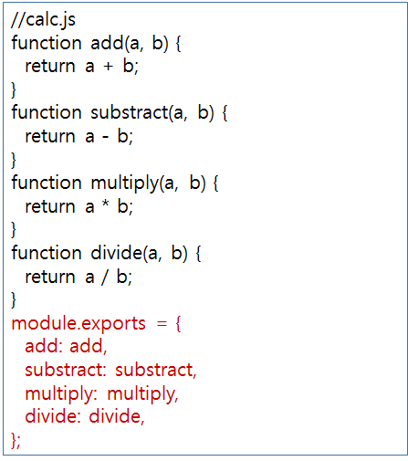

## 참고

- <https://www.w3schools.com/nodejs/>
- <https://thebook.io/>


## 목록

## 개요

- `javascript` 를 이용하여, 서버 애플리케이션을 실행하는데 많이 사용하고 있음
- 특성
  1. 비동기 입출력(Non-Blocking IO)
  2. 콜백함수(Callback Function)
  3. 이벤트 기반 입출력(Event drivenI I/O) 모델
  4. 기본적으로 모듈 단위, 패키지
  5. C/C++ 기반임..


- Single Thread 방식

  https://thebook.io/img/006982/030.jpg

  

- 노드가 실행되면 좋은 분야?

  1. 입출력이 잦은 어플리케이션
  2. 데이터 스트리밍 어플리케이션
  3. 데이터를 실시간으로 다루는 어플리케이션
  4. `Json API` 기반 어플리케이션

- 단 CPU사용률이 높은 어플리케이션은 적절하지 않음.

  이미지, 비디오, 대규모 데이터처리에는..

  즉 이런 처리는 나눠서(병렬) 처리해야함


## 용어

- 서버 

  네트워크를 통해 클라이언트에 정보, 서비스를 제공해주는 컴퓨터, 프로그램

- 서버유형

  채팅, 위치기반, 모바일, JSON-RPC

- 웹 서버의 기능

  조회, 파일업로드/다운로드, 로그인/회원가입

- 런타임

  특정 언어로 실행될 수 있는 환경을 만들어주는 것

- REPL

  읽고, 평가하고, 출력하고, 평가한다.

  READ, EVAL, PRINT, LOOP

  read: 읽어서, javascript 구조로 메모리에 저장

  eval : 데이터를 처리(evalutate)

  print : 결과값을 출력

  Loop : ctrl + c 두번 눌러 종료할때 까지 반복한다.

  ![](data:image/png;base64,iVBORw0KGgoAAAANSUhEUgAAARoAAACzCAMAAABhCSMaAAABBVBMVEXY2NgAAABOTk7Z2dnV1dVwcHBLS0uUMTHc3NwUFBQNBAT////g4ODh4eGTLi7MzMy2trabm5sfHx/ExMQ3NzeSKCg9PT0ZGRmhoaGvr6++vr6Ojo6RJCRZWVmIiIgrKytERESQHx9kZGR/f3+qqqokJCQuLi46Ojpubm7Is7PRx8elXl6bRESmZGR5eXkQDAyYOzutdXWgVFTLurq/n5+PGRm6lJSygIC3jo4lGxsbEhKrb28hCgqaQkKeTU1WVlY5ExN1JCRNNzeVgIBpMjJbDAxXGhrDqKiAGxt6NjaHbGwyFxeFLCyQRERGFhYTGhp9RUVHJydiRkatl5dbMzMrCwtsJyeQZUWaAAATdklEQVR4nO2dZ2PiPBKAjWVAJMY2LYBpxpSEDoFN2WzC7TXeu8v18v9/ykkjuVE2yRsJSJb5sIsdNz0ezUiyNKOcM9GtlqueRHVbls6RKPBvuq46icShH+sYJJFw1Ho6QGM7Duw9CeiH49gemgwF46juVfynlytXBRgZhsZ2qMZUbFM7iWbaFao5VG+U8zQh48RNHZ0ERDfjlEiaoKk7aiJuYuUkXLAZT6hO/VxJL0l1OpEJCzZJlVqmFctRnYp+6Kc5LtErBIqltAghGx36YY5LkE1qUktxEwnXPKGJCDIpFWVJjLB2QhMRpBFDvFTUE5oNATTqCc0WOaHZKSc0O+WEZqec0OyUE5qo8N4l/DyhCQvScqZp5gDFB0ejhwXjd5cAVzrdbrdRoh3tj40mnYr5UnTGpXePHegtuFbmE6DJxiKSL72zDJ8XDSnU+0ZWPjOa2PvGDz4dmnilPlY9tQnMDcJMwuXy9q2ZbMR3fTo0lo71tDWB3y2vRiFdK2cq9UqmjHwMGOfaGdiZKWt6UF6MyKGVkql/PjRQEhd+j7nWYLPSYLAmlxleNJzp+jVw0m35dQ9bDhzaqeD6Z0TDXzjXGmzlQwZoqQEw3IqYJYez0dv+rvFn1Bqk1EK2BltR43wJFNbQxLrQI8C8KjJl+mxodIw09uonCrTxTaYzFxkrcwG/rqgy4XGs61bKtpWpMQTQ6tUTHFQtUeSAjg8N69oxZ+H38n4kHI3basWdWFBYhZsMl1xI15jvypGLoXYb63D5NNOqKxQoWF3X07nLI0QDQLR+f06l1yP/9Pt9DRj94Kz1ds1lmRlhvUu3OjnKQWdFr0NpMcK6jjRNw9DF6JIy81rm0hth+7jQABVzdXP7MHiaJo1CtdlsVgvJ6ePTaHa3mivrbZCQrKFxNWaDUQ4KniiDsJpWo8VDWMuM3dpSVZdwRMpESKsF6oa05dGgodWn31s8TCmNgmEYSV/IhlEgnKpPd6v+Du3Z6EPlWH1qxzbkghhibMbX9hI03CyxD5R6/EjQIKz0V6MhIRBCsiHkz9Pr27m2RXc4GtVdMmPL/TEubaLpUgqX63vpzg78YqU/jiYfqfUmVRcPC9URqEzNL1++0DpF1KjA1Yj8rUrobNQsz0OldcQMb+wqrWzXmqKJeLmJlxqPx0UfTZf/AjTjw6MhtX4+KnB1oSUvDAcPt3erHrW/mtaf91aLu9noaVr18RSq07t+FE7QrkFpzoa2cbjTWZZDYmlcaSZtapz5mdTWMN/NDDh2D42GPNBqYBR4kY3p02wx75so8NrchVOXdTeYJrlmGdXhrI9Cw1XhJh+3GS5p2CAF9l+afl9Sp9e1Ya9D+04IeRVKwcy8QCsa5TqHRUM0ZjFsMn0pNB9vV30dkGxDiGjLpHczKlRBeYjqPKx0H064o4AzgdrozOu00kCa+Ot2jeiHBV7JSdNJV+MADTsvS9qN2Nt9KDQEzONwyApKzSt6aUiX4FHMm9G0CjQLhdHcwxjpXmK2scRB++TKzplmzqp3oerkmF7VyS7PUxE0CDGzk61b7VrskGgw7l2TMg6pAgxW2iuHusmrR/MbD07ylrurMBoFV2K+1UBeb6nh5D2romBe8saFP6RMja93XkgOgQbh+YBVJVKRSD16yy2J8qyI5Wbm6Q760hE0SGMePKHTwZrxWmmpfuSCfqR74aNBKDg2fzAzjLWbJHvxw5v+y12kLefPH5IMzmBOuKYnvp4ogbUBtUHtixCYrktLh8sNvn2ldHw0lAHf7eQO1K5BuD+iVYJUpXUv/PpL4B5Tu0LyjtjNDJUKH3dBCmxmuB/G7braSKUaztgf0sNmJZFNXcbLGJfgUFZmpJfH3VSnltF0C3bbe/5Eh5QFe+PJ2a8EA0Kq1TUArhLFiQ7zegO//pbfDgiOYDvoZcJnwqF0EwW794cGoQdonhSe5r+iKoUFmzfAuDBdvYgYKetH7Lr5xu69ocH9QRWMxI3y7unJSO+PaK0ymjfvpPzDu+wJDZ4P4UVfz9//YZpeTrubggrO5D31ntDoK+qZjC+3mqAZ7Qj3KOvn7yNRV9y8xV7Q6DdgOJMLXdw9sDIqGM9//9tf+5LY7AUNXlADbDz2hBYCabeF5/viX/4hSW/2gUYHMoWh6NeL8M0vf7m/n/wrJ4XNHtDgBe00V0fiF84gvPrn/f3910ZJhqOSjwb3QGcGMkwCwldfv34lcFoSFixJQhOMvuD5FMjIMQh6vfj17Ozr/dd8WUijICxy0CDT5g07pF0XZOmMQnuU2c4ZZdPpjEUrjhw0uBxz26xLMiNkjKksB4vLxcbkjMJpZB1LYNNAkYaGfmEvVmyM75qUzFxas8xMNYqcTacoVnFkoUkRiTXcf4OhWUhb1IlQsVFMAZtJp5FNWAItjkw0KaI6//3fc+FWuIUMBF02sqnUGbDJNjqdljhzLxUNeZ2x2NnfrG0fHkXdqdbJppjanKWKQhVHLhr2NifLDMKy7PC400lxNpNUiihOoyWIjSw0xYAMMTqxydiSA4d671SITbHRmKhiFtjKROM9LpjkotqWwQaXOo1AQWmV6qi2mEvLRMOeNuWxkYOm3GikfLUpNjrZirAhIUloslGlSXlTX0QLsvONIlebyf19p5YTZvIldRR8NB6ZSzlkSJvP4WgmpJv57c8Cu2qC0fDZicjORi3NUlooD12l3pvY38598Z/PT315Tb71OC5vu5pm27mcbSJkdyYhSwMzOySJ7oL3Jl67+z/S8L6RpjVoPf7P2y6Wi00mk1gFe2iY0sSkDju3iPcmLjtVsw2DdNfEhVOJovEmtgWSe9MH+xycA2gCpaHbwp53Q0jDhjTzst0S1m/o8Ie48ed1NPkomey70FClmaSkkqEN70aj49oYof6jkSzcCruZbDSTWEkqGXLPbLabgaY2fiiQGiUs1swLaF6sUBFD7aPB1j3vInTKkqNMIbMbNxl93Gsmk1VhIyBb0WQrGS4lOlM9NPsgNJMA8VnyKOg6htB8AzSxbll2lCmklT33hzRSo4yRVDSNnB4sw9NgJkrbG+oFYhad4tTOtNyE4yzjGW8cIEDzbzDCsprA0RIEFRbfkRr1KKppswNN6Or4iu7qMP/LZ+QS+5EL+bKJw07w0egDqjUxdc8x23CPfiRdSelDbWgNrTBsNiVTGzaHv6uRRl1ofVUsVrRhipdvhp8JGolN4J2FmRIfdScTTbZS4kJnbmFYanQVWoLV0jmwTr7LV1d1gSJHo69++XYWc8UO8L9G9AExNkOZaAKhq4j47EGYJ9j23BZxz7U2zMotq75WeWjSd798i/1HYHfmtYLvqslkU1Db+wU0FZji3mH2xZvFXaPTwEyv0ukKHNkKocGz569/FOYp3lKaOWkQNwUZm1egIT04AILJwTEPEvhs07aI2A3GK0CjXT9/L8wOgaY/NJJVQcbmNWiYW8raiFctxJo1bfeiGByp0tM9NFPS9BLYB35DaQa0ryARTadtc+FTjhPMurK1eGNYA2I6UYhOCE2ftEqb0r5Y/kigr/AgZghkh/PGkfEaNos/n4aST8KrqonbLhY30KyIMaweJG4mviVormV8UdjW5IODmGMCQqoSNHYmmTKxNd11NNAoPcgqV3xTpZMP9oeGG+KW4xthvlavDKuFN7QGXt1h0NAepjHfS4XiNQraM1naAJ5AkXXWe6AIed8hjGZG0AwOggbNaedbIpqUe8XFtfh0fX+ZyDjUYYiV0thbUR9Ck3kgbuJBxNO9vTjMA8hDE5ISX25f93ZYkZXUbsUtbniozIigmR1CaUgBvghzjq9Eg0y+nfcGJxrBMRtmeCB0IPJNxVEoGjHjw69E4wXO8eMtYdtbpFe0Lta15nBoFEzQVMX0FNbRLC8vwtL1PlTjUp5sXjq+78K2S1f30S+pNXLOpQto6EH50ugTolGQvib+TTDbDgqM9Fy7VM6lkRL8hZ2eBlsj4uneLEiTVaHeeO6OGCH66LAeSorzFiPQkRnJ+5b7o1vPZTX5xAidK3yo1vCKoEnK6CiIERjYnx4GzUJWH0qMwKtrHrDnfbxoWGtd7Lqw196amDlRHkAOmqkh8APrW+5sXssa5RMjyHwS94BvuzO8FEFDr3Lm8lHvPTiA98bzqrihVyloxH57ftONCZovUr5DCRLcK5A26QHssE5MjXF9zPOGEaJLffZvbMDUSPrmLUrg7Q3Twq73SsErumRPlLZKmm1+UxXWy3uDINrgexJVDkmzzec0FIYozX71XWEOyYOcWVmiBCkD+v723FdgHRRRM49krfOm3by99xXQiFi4R0kzQIUJMun05oe9ZtJEdLG9tHnD4gTRMRtBowOvFHwLtv/Il6XSer/vpg3S6BqFJ1lrFMQJUp4omz2OZ9HeidD+vrRIJJjOJNmj2kBLWOiwqzQ0SKMt4v31McHSNEUOEsmLXwOtjMJsT06KKc2TyIEQiaF9MA2cK6xH89LNHgqig1fIRLOgnT1hXZof34uqqDEUOnomMyAUvMnqPiwxTIoVraEy0bD6Ly94TSAQQEj0DASpYcRgbEKsbdx+HxinSQougNwIa3gAXSnJbPDcELnYxxPJaCC8muSJ58hkL0B0bD7JcfmY5xD+QsOC8EiOJ5QdspCOSUqMsEaH6OkHFiMp/g7S0UBcPuNJGhtY+C7lM7L0QJeoD11wSXqD4KNcsiljGHoPMUCZ/5CjN9DiJiZYxrPvI3Jsj0aoLlxLsAakNkFQWkm2QH68YdybQoxq0c1iGouZkpGiM/tBw+PqGq+I7f+mq2qzKkSSl/Tge4ptzqK+V0XGdcT9J0pGUm1S9oWG16lkdSbK4CC0egSvPZP2HXBveRT6Q9D+YU9MHgVlVmB6+GL3AEUykLxB9pd9Q5vRKb1Gc2a+Gw7CK0hYQaxX2ovwsDPfiNmmqeh+hW7tMWeLdmuwnC29V6cm8ZPSRcW70uPv2lzKtqmhrVdli/xS1u7CRYLQRB54f5l+MDMPRnM0f124CS1n27Zl0YynbRrhAjIeVSr13//hj9+TxpdZJB1YJ741SjVDU7R2vg3UrpNrZjb/vtfUWVh7YMn2jNlrUrcgrZYqFiEg4YRGbgvJb54Lw4W+nvmztWVg6GU0sIz0YvPLx36ziiFlwVI6Fqa3/ZdtI27HUmsyoUHtYt+eqwNy/kZS1PomAL5qdneFQrCM1Dk0GppYbGawjGnNEbE5L/iXdCLKhsVBPDv75Ylmf+FoOvl83lMpFkaHrzRmgSU1CHMQxGNUwj/oT4YmvRGgce8ZDBGaDwyeiHCw6P84gHVUbTwwsT/dQdAgjiZjEimx9Y5x+vIh1iKx35qZM71CwX88CCPCZo78hWmYpkGFcvBGgMZD5L1EqyeeELSafFho+u6aRZNIh2sSI/PnPs8sV+LLQ2mOTxYJJEHKbS1rtdpSwxmHeCYb2yrZdGFh5Jj8ZVlJ58YdYn1clnJWrcGq2myNio0iNz9EtlQvSyPNumxc38z721sm5M1bsQgWSmbsOSIfDT2UZYnNm4jvNWvc/IKtoYEwkAJRQ+J+bmJy4pq5ikTKO1D6Yaz1RkHmXGP4cNfrE32ONl8Q0fb+b2NhLmeTUKjVLWgufTRQTXw0RUAD8ZnyfmSZRg6t5XA+BjRUc/q3Qy9jtUGscrPw9HB3s1isVr3earVaLG5mg2Gh+T3MZZKKJYLH9NDotEJV/AoVUYRNNCGp4GNEQ2+NtPns2gjSnNOk7yxHNSSA59m8fxPzwNCq1Q21+DmECrHCOZ4NlJhhH81VyS659iaaVMnUGEhHR5ppMjOsUWMescMHzgKPzd7t8Iufs3ubfI8F4Xkn2fB79Zx3t9v1nbfv0oky0SgpaBNNhWoZWKJsmj7D0TjvNYGk1Ku70WOhSQFRYTXMAM2pNo3r3wYOPBaJm7m9ycf3xrnb89Ag39ZQW8WCzBQhftORNPm2CoKc5j1iW56Gj49TQmZK5HF4PbpdEOtc9tGw0F2+rKOZtOh7DxtnJdxR4GhUCoGjAQN+zGgUheU0xzqkfZ/3evN5v9/XdDbakHY4m8BtM4mi6Yxt+DPf6zVRNrTmikLA9Q+Dxn8cnhI3HFcdlzmZq7Un5BBapGtu5ajnD+8119D4WhP/oGi2CULQJI7l1x/Qd96RBuPPhEaBJjFx2+vd6jWrEt27jgbtQsM81OXxeajXCI10N8lujri8Cc1OrcEsIlqOtmsiBD4CGprabh0A7BaDho8Vdi/zbqRWfQg0SlqtbJl/LAaNH+tqfajvY6BB5raH88ZrfjWaFIsWV//IaLanbv8hGn8My4vt6qGBEKasFhW5uy9fdWEkLPER0eyQ7clT1nYGm+xwtPaTDq5pkW0mHxvN9ow7a3uDTRQZEw4ftC15z8dGI1VOaHbKCc1OOaHZKRzN8oRmQwDNUnETCfcgcb+OWJBJqSgtojr2CU1EkE3MTEuxHNXZ1k35mUWvECiWkl4SQvvOPnPcgk1Sk5Zp5bzuEEN8YhMINokRdurnynnaUVUnburreS9/VtHNOCWSJmjObfIrkajY5nrmy59RTLuSINXJsc8pmvMMYaM6qnsV/+nlylUBRuacoSF6Q7cTJ0lQjVEdqjMczXm6rjqw96eXRMJR6+nzAM35uW613EM/1jGI27J0juT/WxEQBjaG4sYAAAAASUVORK5CYII=)

  - REPL 커맨드

    출처 : <https://velopert.com/235>

    


## 설치

- <https://nodejs.org/ko/> 

  LTS 버젼

- `npm install -g npm` g? global로 사용될수 있도록

  즉 모두 적용될수 있도록

  지정된 해당 폴더에만

- cmd에서 `node` 를 치면, 바로 노드를 사용할 수 있음


## JavaScript

### 선언자

- var - 함수 스코프, 블록에 관계없이 접근 가능
- const, let, 블록 스코프를 가지므로, 블록 밖에서는 접근 불가
- const - 상수, 초기화 값을 대입하지 않으면 에러발생


## 모듈

- 독립적인 하나의 소프트웨어
- 특정한 기능을하는 함수, 변수 들의 집합.
- 모듈은 재사용 가능함.
- 보통 파일 하나가 모듈. 즉 파일별로 모듈화되기 때문에 관리하기가 편하다.


### 모듈 생성방법


-  `module.exports`를 이용


- 다른 곳에서 불러올 때는 `require` 을 사용함


- `exports` 는 여러개의 객체를 따로 `export` 할 때 사용함.


### 모듈 활용




- `require` 하기 되면, **객체를 통째로** 가져오게됨.

  즉 특정 함수만 사용하기 위해서는? `.000` 을 사용

- 아래 사진은

  add라는 변수에, `calc.js` 에서 비롯된, add function만을 사용한다는 의미

### ES2015(ES6) 모듈

- `PYTHON` 과 비슷하게 바뀌었다.
- 여기서 모듈 확장자는, `mjs` 로 저장한다. (그전까지는 js였음)
- require, module.export가 import, export default로 바뀌었음


## node 내장 객체

### global 객체

- 브라우저 window와 같은 **전역** 객체
- 모든 파일에서 접근가능하구
- 전역객체는 간단한 데이터를 파일끼리 공유할때 사용함


### console 객체

```javascript
const string ='abc';
const number = 1;
const boolean = true;
const obj = {
  outside: {
    inside: {
      key:'value',
    },
  },
};
console.time('전체 시간');
console.log('평범한 로그입니다 쉼표로 구분해 여러 값을 찍을 수 있습니다');
console.log(string, number, boolean);
console.error('에러 메시지는 console.error에 담아주세요');

console.dir(obj, { colors: false, depth: 2 });
console.dir(obj, { colors: true, depth: 1 });

console.time('시간 측정');
for (let i = 0; i < 100000; i++) {
  continue;
}
console.timeEnd('시간 측정');

function b() {
  console.trace('에러 위치 추적');
}
function a() {
  b();
}
a();

console.timeEnd('전체 시간');

```

- ms? mile per sec, 0.001초를 의미함
- 결과


### 타이머

- setTimeout, setInterval, setImmediate는 window 대신 global객체 안에 포함되어 있음.
- **밀리초** 기준
- setImmediate(콜백)과 setTimeout(콜백, 0)에 담긴 콜백 함수는 이벤트 루프를 거친 뒤 즉시 실행
- 파일 시스템 접근, 네트워킹 같은 I/O 작업의 콜백 함수 안에서 타이머를 호출하는 경우 setImmediate는 setTimeout(콜백, 0)보다 먼저 실행

```javascript
const timeout = setTimeout(() => {
    console.log('1.5초 후 실행');
  }, 1500);
  
  const interval = setInterval(() => {
    console.log('1초마다 실행');
  }, 1000);
  
  const timeout2 = setTimeout(() => {
    console.log('실행되지 않습니다');
  }, 3000);
  
  setTimeout(() => {
    clearTimeout(timeout2);
    clearInterval(interval);
  }, 2500); 
   
  const immediate = setImmediate(() => {
    console.log('즉시 실행');
  });
  
  const immediate2 = setImmediate(() => {
    console.log('실행되지 않습니다');
  });
  
  clearImmediate(immediate2);
    
```

- 결과

  즉시실행

  1초 마다 실행

  1.5초 마다 실행

  1초 마다 실행

### _filename, _dirname

- 경로에 대한 정보를 제공해줄 때
- `__filename` , `__dirname` 언더바(_) 가 두개임을 주의하자


### Process 객체

- 현재 실행되고 있는 노드 프로세스에 대한 정보
- 운영체제나 실행별로 **다른 동작을 하고 싶을 때** 사용
- `Node.js` 에만 *존재하는 객체*


1. **Property**

- argv : 실행 매개 변수를 나타냅니다.-

- env : 컴퓨터 환경과 관련된 정보를 나타냅니다.

- version : Node.js 버전을 나타냅니다.

- versions : Node.js와 종속된 프로그램 버전을 나타냅니다.

- arch : 프로세서의 아키텍처를 나타냅니다.

- platform : 플랫폼을 나타냅니다.

- pid - 현재 프로세스의 아이디 

- execpath - 노드의 경로


2. **Method**

- exit([exitCode = 0]) : 프로그램을 종료합니다. (매개변수 생략가능)
- memoryUsage() : 메모리 사용 정보 객체를 리턴합니다.
- uptime() : 현재 프로그램이 실행된 시간을 리턴합니다.
- cwd() - 현재 프로세스가 실행되는 위치
- cpuUsage() - 현재 cpu 사용량


> process.nextTick(콜백)


- 이벤트 루프가, 다른 콜백보다, `nextTick` 콜백 함수를 우선적으로 처리하도록 만드는 방법

  process.nextTick, resolve된 Promise는 다른 이벤트 루프에서 대기하는 콜백함수보다 먼저 실행됨을 잊지 말자.

- 단 Microtask를 재귀 함수로 호출하면, 다른 콜백함수보다 Microtask를 우선적으로 처리하여 다른 콜백함수가 실행되지 않을 수도 있다.

- 그럼 Microtask > process.nextTick + resovle 된 Promise > other callback function


> process.exit(코드)

- 실행 중인 노드 프로세스를 종료
- 서버에 이 함수를 실행하면, **서버가 멈춘다**, 주의할 것!!
- **1** return 하면 비정상 종료 (0이면 정상 종료)


## Node 내장 모듈 

### 기본 내장 Module - os


### 기본 내장 Module - path


### Url 모듈


- 인터넷 주소를 쉽게 조작할 수 있도록 도와줌.
- http://nodejs.org/api/url.html
- url.parse(주소) : 해당 주소를 분해함.
- url.format(객체)  : 분해되었던 url객체를 다시 원래 상태로 조립함

### searchParams 객체

- search 부분을 조작하는 다양한 메서드를 지원
- getall, get, has, keys, values, append...등


### crypto

- 암호화를 도와주는 모듈

- 비밀번호는 단방향 암호화(<u>복호화 할 수 없는 암호방식</u>) 을 통해 암호화함

- createHash(알고리즘) 

  md5, sha1, sha256, sha512.. but **md5, sha1** 는 취약점이 발견되어 사용을 권장하지 않음


- digest(인코딩)

  base64가 결과 문자열이 가장 짦아서 애용되고, 결과물을 문자열로 반환함.


- 양방향 암호화, 복호화

```javascript
const crypto = require('crypto');

const cipher = crypto.createCipher('aes-256-cbc','열쇠');
let result = cipher.update('암호화할 문장','utf8','base64');
result += cipher.final('base64');
console.log('암호화:', result);

const decipher = crypto.createDecipher('aes-256-cbc','열쇠');
let result2 = decipher.update(result,'base64','utf8');
result2 += decipher.final('utf8');
console.log('복호화:', result2);
```


### util

- 보조적인 유용한 기능들을 모아둔 모듈

- http://nodejs.org/api/util.html

1. util.format(format, [...]) - console.log() 메소드와 비슷한 기능 차이점? console.log()는 화면에 출력하는 역할을 하지만

2. util.format은 문자열로 반환

3. util.debug(string)

4. util.error([...])

5. util.puts([...])

6. util.print([...])

7. util.log(string)

8. util.inspect(object, [options])

9. Customizing util.inspect colors

10. util.isArray(object)

11. util.isRegExp(object)

12. util.isDate(object)

13. util.isError(object)

14. util.pump(readableStream, writableStream, [callback])

15. util.inherits(constructor, superConstructor)

16. util.deprecate: 함수가 deprecated 처리되었음을 알려줌 

    첫 번째 인자로 넣은 함수를 사용했을 때 경고 메시지가 출력됩니다. 

    두 번째 인자로 경고 메시지 내용을 넣으면 됩니다. 함수가 조만간 사라지거나 변경될 때 알려줄 수 있어 유용합니다.

17. util.promisify: 콜백 패턴을 프로미스 패턴으로 바꿔줍니다. 바꿀 함수를 인자로 제공하면 됩니다. 이렇게 바꾸어두면 async/await 패턴까지 사용할 수 있어 좋습니다.

- 이정도만 어떻게 돌아가는 지 알아보자


### fs

- 파일 시스템에 접근하는 모듈

- 파일 생성, 삭제, 읽기, 쓰기 가능

- 폴더 생성, 삭제 가능

- `readFile`은 결과물이 버퍼 형식으로 제공됨.

  버퍼는 `toString` 을 통해 변환 되고,,


- Create File

```javascript
//1 
var fs = require('fs');
fs.appendFile('mynewfile1.txt', 'Hello content!', function (err) {
  if (err) throw err;
  console.log('Saved!');
});

//2
var fs = require('fs');
fs.open('mynewfile2.txt', 'w', function (err, file) {
  if (err) throw err;
  console.log('Saved!');
});

//3
var fs = require('fs');
fs.writeFile('mynewfile3.txt', 'Hello content!', function (err) {
  if (err) throw err;
  console.log('Saved!');
});

```

- 1,2,3 모두 같은 일을 함. 파일을 생성하는 것


- Update File , Delete File

```javascript
//1
var fs = require('fs');
fs.appendFile('mynewfile1.txt', ' This is my text.', function (err) {
  if (err) throw err;
  console.log('Updated!');
});

//2 
var fs = require('fs');
fs.writeFile('mynewfile3.txt', 'This is my text', function (err) {
  if (err) throw err;
  console.log('Replaced!');
});

//3 Delete
var fs = require('fs');
fs.unlink('mynewfile2.txt', function (err) {
  if (err) throw err;
  console.log('File deleted!');
});
```

