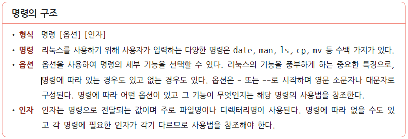
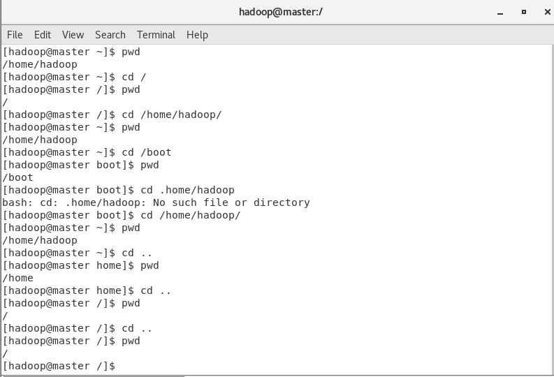
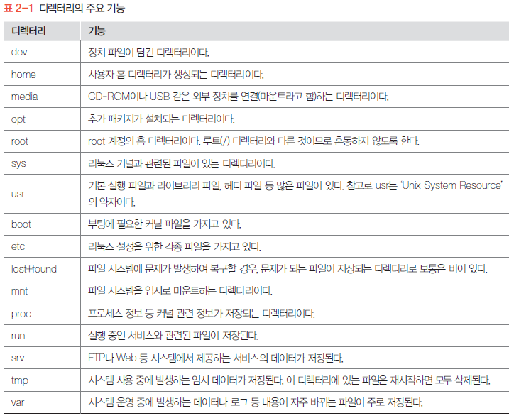
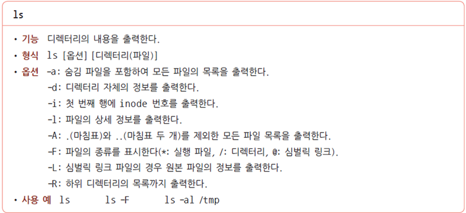
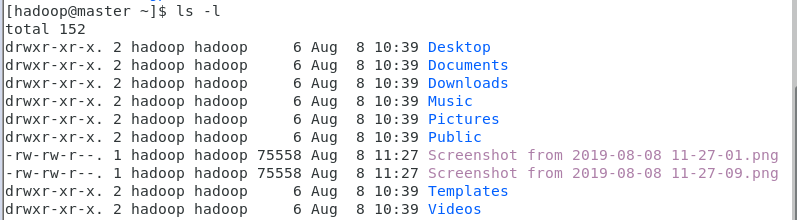
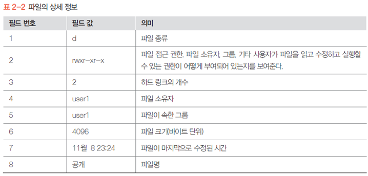
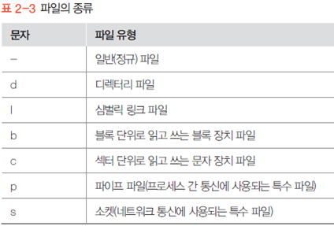
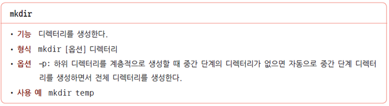

## 설치

- [VMWare-workstation](https://www.vmware.com/kr/products/workstation-player/workstation-player-evaluation.html)
- Centos OS 7

- 참고
  - 기본 언어는 영어, 추가 지원 언어를 한국어로 작성
  - 용량 및 램2G, 코어2, Single file로 설정
  - 이너넷 연결해놓을 것(안그러면 매번 연결해줘야함)
- 

## 명령어

- 리눅스는 대소문자 구별함

- 문자 지우기 =  백스페이스, delete..
- 단어 지우기 = Ctrl + w
- 문장 지우기 = Ctrl + u

- 구조

- 기초 명령어

  - man 명령어? -- 해당 명령어에 대해 알아보고 싶을때

  - passwd

    *변경시 *이 나오지 않으므로 주의할 것*

  - **exit 종료 = Ctrl + d**

  - `su - ` 루트 계정으로 바꿀 때

## 경로

- 구분자로 / 를 사용

- 경로명 제일 앞에 있는 / 는 루트 디렉터리

  경로명 중간에 있으면? / 는 구분자 역할

### 절대경로명

- **항상 루트 디렉터리부터 시작**

  즉 반드시 / 으로 시작한다는말

- 루트 디렉터리 부터 시작하여, 특정파일, 디렉터리까지 가면서 거치는 모든 중간 과정을 표시함

- 특정 위치를 가리키는 절대 경로명은 항상 동일하다

### 상대 경로명

- **현재 디렉터리 기준**

  / 이외의 문자로 시작한다

- 현재 디렉터리 기준으로 상위 디렉터리로 가려면? ..(마침표 두개를 추가한다)

- 상대 경로명은 현재 디렉터리에 따라 달라짐

- 참고

## 디렉터리,파일

- 리눅스에서는 디렉터리(Directory) 도 파일로 취급함

- 파일 종류 확인 `file 파일명` 

### 디렉터리 주요 기능

### pwd

- 현재 위치 확인. 

  즉 현재 디렉터리의 **절대경로** 명을 출력한다.

### ls

- 현재 디렉토리 내용확인

- 기억해야할 옵션은?

  a,d,l,r..정도

- `ls -a` 숨김 파일 확인

- `ls -F` 파일 종류를 구분하여 확인

  / : 디렉터리

  @ : 심벌릭 링크 

  `*` :  실행 파일

  표시 없음 : 일반 파일

- `ls -l` 파일들의 상세정보 확인

  

  

  

  

- `ls -d` 디렉터리의 상세정보 확인

- `ls -r` 하위 디렉터리의 목록까지 출력

### cd

- 디렉터리 이동하기
- `cd/home/user1` 절대경로명을 이용하여 이동
- `cd ../../home/user1` 상대경로명을 사용하여 홈 디렉터리로 이동
- `cd ~` 홈 디렉터리로 이동
- `cd ` 목적지를 지정하지 않고 , `cd` 명령만 사용하면 해당 계정 홈 디렉터리로 이동

### mkdir

- 디렉터리 생성

 