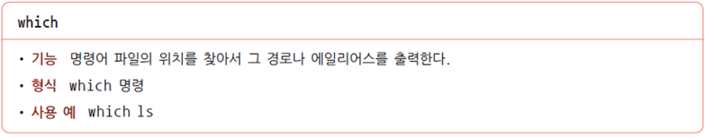

## 참고

- [이것이 리눅스다](http://www.yes24.com/Product/Goods/18740289)

## 설치

- [VMWare-workstation](https://www.vmware.com/kr/products/workstation-player/workstation-player-evaluation.html)
- Centos OS 7

- 참고
  - 기본 언어는 영어, 추가 지원 언어를 한국어로 작성
  - 용량 및 램2G, 코어2, Single file로 설정
  - 이너넷 연결해놓을 것(안그러면 매번 연결해줘야함)
  
  

## 00. 기본 명령어

- 리눅스는 대소문자 구별함

- 문자 지우기 =  백스페이스, delete..
- 단어 지우기 = Ctrl + w
- 문장 지우기 = Ctrl + u

- 구조

- 기초 명령어

  - man 명령어? -- 해당 명령어에 대해 알아보고 싶을때

  - passwd

    *변경시 *이 나오지 않으므로 주의할 것*

  - **exit 종료 = Ctrl + d**

  - `su - ` 루트 계정으로 바꿀 때

## 01. 경로

- 구분자로 / 를 사용

- 경로명 제일 앞에 있는 / 는 루트 디렉터리

  경로명 중간에 있으면? / 는 구분자 역할

### 절대경로명

- **항상 루트 디렉터리부터 시작**

  즉 반드시 / 으로 시작한다는말

- 루트 디렉터리 부터 시작하여, 특정파일, 디렉터리까지 가면서 거치는 모든 중간 과정을 표시함

- 특정 위치를 가리키는 절대 경로명은 항상 동일하다

### 상대 경로명

- **현재 디렉터리 기준**

  / 이외의 문자로 시작한다

- 현재 디렉터리 기준으로 상위 디렉터리로 가려면? ..(마침표 두개를 추가한다)

- 상대 경로명은 현재 디렉터리에 따라 달라짐

- 참고

## 02. 디렉터리

- 리눅스에서는 디렉터리(Directory) 도 파일로 취급함

- 파일 종류 확인 `file 파일명` 

### 디렉터리 주요 기능

### pwd

- 현재 위치 확인. 

  즉 현재 디렉터리의 **절대경로** 명을 출력한다.

### ls

- 현재 디렉토리 내용확인

- 기억해야할 옵션은?

  a,d,l,r..정도

- `ls -a` <u>숨김 파일</u> 확인

- `ls -F` 파일 종류를 구분하여 확인

  / : 디렉터리

  @ : 심벌릭 링크 

  `*` :  실행 파일

  표시 없음 : 일반 파일

- `ls -l` 파일들의 상세정보 확인

  

  

  

  

- `ls -d` 디렉터리의 상세정보 확인

- `ls -r` 하위 디렉터리의 목록까지 출력

### cd

- 디렉터리 이동하기
- `cd/home/user1` 절대경로명을 이용하여 이동
- `cd ../../home/user1` 상대경로명을 사용하여 홈 디렉터리로 이동
- `cd ~` **홈 디렉터리**로 이동
- `cd ` 목적지를 지정하지 않고 , `cd` 명령만 사용하면 해당 계정 **홈 디렉터리**로 이동

### mkdir

- 디렉터리 생성

- `mkdir -p` 중간 디렉토리 자동으로 생성하게 만들어주는 옵션

### rmdir, rmdir -p

- 디렉토리 삭제하는 명령어

## 03. 파일

### cat

- 파일의 내용을 확인할 때 사용

### more, less

- 파일의 내용을 화면 단위로 출력함.. more [파일명] 이런식으로

- 개선된, 지나간 내용도 출력해줄수 있는

### tail

- 파일 뒷부분 확인

### cp

- 파일 복사

- 디렉토리 복사 할때  `-r`

### mv

- 파일 이동 할때 사용

### rm

- 파일 삭제

### 파일 링크

- 하드 링크 : 기존 파일에 새로운 파일명을 추가로 생성(inode 값이 동일하고)
- 심볼링 링크 : 원본 파일을 *가리키는* 새로운 파일을 생성

-  **inode?**

  파일에 대한 정보를 가지고 있는 특별한 구조체 (파일의 종류, 크기, 소유자, 파일 변경 시간, 파일 상세 정보, 파일데이터 블록)

  리눅스의 파일은 파일명 + **inode** + 데이터블록으로 구성되어있음.

  파일명의 `inode` 는 `is -i` 명령어로 확인가능하다.

  

- 파일명 앞에 있는 것들이 `inode` 
- 파일이름이 달라도, `inode` 가 같으면 같은 파일이다.

#### ln

- 하드링크 만들기

- 파일에 여러개의 이름을 붙일 수 있는데, 이 때 붙이는 파일명을 **하드링크** 라 함.

- 링크ln 과 복사cp의 차이점은?

- cp복사한 파일에서 변경할 경우에, 원본파일 data1이 바뀌지 않음을 알 수 있다. 왜? inode값이 다르다..

#### -s 

- 심벌링 링크 만들기

- 원본 파일과 inode값이 다르다.

- `ls -l` 명령어를 통해, **원본파일**이 무엇인지 알 수 있게 해줌

#### 심볼릭, 하드링크 차이

- 하드링크는 파일 개수가 증가하지 않음. 즉 파일 이름만 추가되는 것

  심볼릭은 파일이 추가되는 것이고

- 심볼릭 링크 파일의 내용은 원본 파일의 경로

- 심볼릭 링크에서의 <u>원본파일이 삭제되면</u>, 심볼릭 링크로 연결할 수 없음

  당연한 내용?

### touch

- 빈 파일 생성

### grep

- 파일 내용 검색

### find

- 파일 찾기

### whereis

- 명령위치 찾기

  /bin,/usr/bin,/etc, /usr/etc, /sbin, /usr/sbin, /usr/share/man 등 정해진 디렉터리를 검색하여 명령의 위치검색

### which

## 04. 문서 편집기

- 모드형, 비모드형

  모드형은 입력, 명령모드가 구분되고,

  입력모드는 텍스트 입력

  명령모드는,  텍스트 수정, 삭제, 붙이는 편집모드

  **vi** 는 모드형 편집기

  

  비모드형은

  한글, 워드같은 , 입력모드와 편집모드가 구분되어있지 않은.

  

### vi 작동법

- 시작? === **vi**

- 저장 및 종료

### 입력모드

### 명령모드

#### 커서 이동

- 커서를 한행 앞으로 : -, k

- 커서를 한행 뒤로 : +, j

- 저장 : wq, ZZ

- 저장안하고 vi 중료 : q, :q!

- 특정 행으로 이동? 행번호 G

- 커서에 위치한 한 글자 삭제 : x

  한 단어 삭제 dw

  한 라인 삭제 dd

- 커서에 위치한 한행 복사 yy

  행 아래 붙여 넣기 p

  한 행 잘라내기 dd

- 커서에 위치한 행에서 특정 문자열을 다른 문자열로 바꾸기

  :s/문자열1/문자열2

- 파일 내용중 특정 문자열을 다른 문자열로 바꾸기

  :%s/문자열1/문자열2/g

- 커서가 위치한 행 아래 다른 파일을 읽어들여서 삽입

  :r 대상파일

- 다른 지정한 파일로 전환?

  :w

  :e 지정 파일

- vi test1.text test2.text test3.text...

  편집 후 다음 파일로 전환하려면 명령모드에서 :w :n

- 편집기 사용중 셀 명령 실행

  :!셀명령어

- 편집기 사용중 셀 명령 실행, vi편집시 빠져나오고, `:sh` 셀 명령어 수행 후 vi 편집기로 돌아오려면 `exit`

## 05. 셀

## 06. 프롬프트

- **프롬프트 설정 변수**: PS1

## 07 환경 설정파일

- 사용자가 로그인 할 때마다, 자동으로 실행되는 명령을 저장한 것이, 환경 설정 파일

- `etc/profile` 에 저장, 이 안에 있는 파일들은 안 바꾸는 것이 좋음 왜? 시작 환경에 대해 설정해놓은 것이니까

## 08 파일 접근권한

- 접근 권한의 표기 방법

-  그 예

### chmod

- 접근 권한의 변경 명령

- 소유자의 쓰기 권한을 제거할때는?

  

### 숫자를 이용한 파일 권한 변경

- 파일명 앞에 있는 , 문자들이 권한을 나타내는 글자였음을 알 수 있음.

- chmod 에다가 숫자를 통해서, 권한을 변경해줄 수 있음.

- 보통 755를 많이 사용함, 소유자는 모든 권한을 주고, 소유자가 속한 그룹원들에게는 읽고 쓰고 실행하는 정도

- 기본 접근 권한 설정
  - 일반 파일 : 소유자는 <u>읽기, 쓰기</u> 권한이 설정, 그룹 + 기타는 <u>읽기</u> 권한만
  - 디렉터리 : 소유자는 <u>읽기, 쓰기</u>, 그룹 + 기타 사용자는 <u>읽기, 실행권한</u>만

### umask

- 기본 접근 권한 확인, 변경

- 마스크 값의 의미

### 특수 접근 권한

- setUID

- 스티키 비트

## 09 프로세스

- GC 프로세스 종료되면 자동 종료

- 데몬 프로세서

- 좀비 프로세서

  프로그램 잘못만들면, 좀비프로세서가 만들어지고, 자원을 까먹게됨.

### PS

- 현재 실행 중인 프로세스의 목록을 보는 명령어

- a 옵션 의미

- a 옵션 + u 옵션

### pgrep

- 특정 프로세스 검색하기

### 시그널(signal)

- 주요 사용하는 시그널

### 포그라운드,백그라운드

- 포그라운드 : 명령이 실행되면, 결과가 실행될 때까지 기다려야하는 (다른작업못하고)
- 백그라운드 : 명령이 실행되면, 결과가 실행될 때 까지 다른 작업을 하면서 기다릴 수 있음

### jobs

- 작업들 목록 확인할 때

- 작업 전환에 사용할 때

