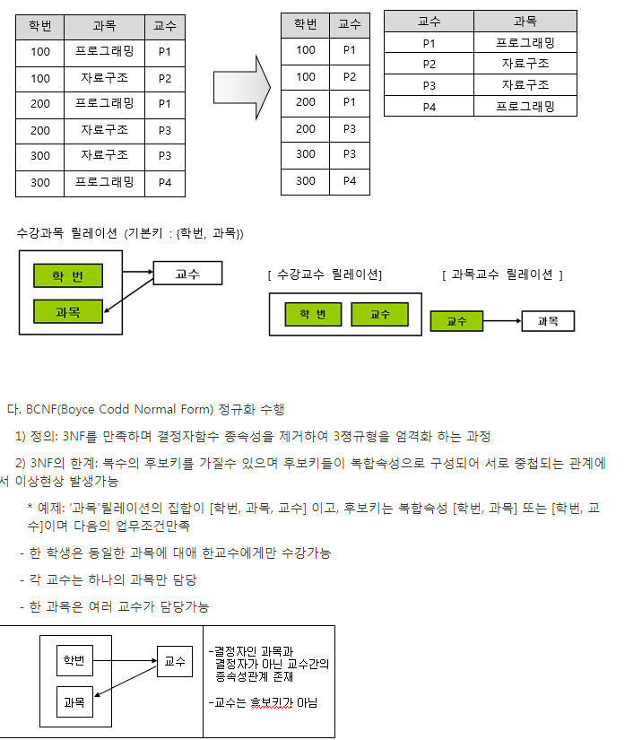
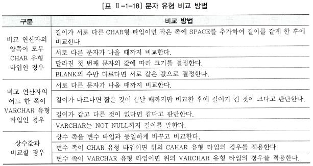
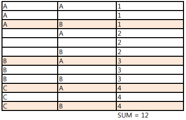

## SQLD 1,2,3

https://wikidocs.net/1207

### 1

- 데이터 모델링
  
  - 주의할점
    - 중복 : 같은 정보를 저장하지 않도록
    - 비유연성 : 데이터 정의, 사용프로세스를 분리함으로써 작은 변화가 데이터베이스에 중대한 변화를 일으킬 수 있는 가능성을 줄인다
    - 비일관성 : 데이터간 상호연관성을 명확하게 정의하여 사전에 예방할 수 있도록
  - 논리 모델링의 외래키는 물리 모델에 반드시 구현되지 않음
  - 실제 데이터베이스를 구축할 때 참고하는 모델은 개념적 모델링
  - 개념적 - 논리 - 물리적
  
     
  
- 3단계 구조
  1. 외부 스키마 : 사용자 응용프로그래머 관점에서,
  2. 개념 스키마 : 모든 사용자 관점을 통합한 조직 전체 관점의 통합적 표현
  3. 내부 스키마 : 시스템 개발자 관점

- ERD

  1. 엔티티 도출
  2. 엔티티 배치
  3. 관계 설정
  4. 관계 기술

  - 피터첸


- 엔티티

  - 반드시 해당 업무에서 필요하고 ,관리하고자 하는 정보여어
  - 유일한 식별자에 의해 식별이 가능
  - 2개 이상 인스턴스 집합
  - 반드시 속성이 있어야함
  - 최소 1개 이상 다른 엔티티와의 관계가 설정되어야 함

- 엔티티 종류

  

  1. 기본(키) 부모엔티티가 존재 하지 않음, 상품 조직 사원 부서
  2. 중심(메인) 부모엔티티, 자식 엔티티 모두 존재 주문상품
  3. 행위 주문내역, 계약진행
  4. 개념

  - 엔티티이름을 명명할 때는 가능한 약어를 쓰지 않는다.

- 속성

  - 더 이상 분리되지 않는 최소의 데이터 단위
  - **한 개의 속성은 한 개의 속성값**을 가짐
  - **하나의 엔티티는 2개 이상 속성**을 가짐

  1. 기본 : 업무로 부터 추출한 모든 속성
  2. 파생 : 데이터를 조회할 때 빠른 성능을 할 수 있도록 하기 위해 원래 속성값을 계산하여 저장할 수 있도록 만든 속성
  3. 설계 : 데이터 모델링을 위해 업무 규칙화하기 위해 속성을 새로 만들거나 변형하여 정의하는 속성
  
  - 명명규칙
     - 해당 업무에서 사용하는 이름을
     - 서술식은 사용하지 않음
     - 약어사용은 가급적 제한
     - 유일성을 확보할 필요가 있음


- 도메인
  
  - 엔티티내에서 속성에 대한 데이터 타입, 크기 그리고 제약조건을 지정하는 것
    
  - 각 속성이 가질 수 있는 범위를 일컫는 말
  
  - 데이터 모델링에서는 존재적 관계, 행위에 의한 관계를 구분하는 표기법 없음
  
    UML에서는 연관관계, 의존관계에 대한 다른 표기법을 가지고 표현하게 되어있음.


- 관계
  - 존재적, 행위에 의한으로 나뉨
  - 표기법은 관계명, 관계차수, 선택성 3가지 개념을 사용
  - 동사는 관계를 서술하는 업무기술서의 가장 중요한 사항
  - 관계체크 사항
     - 두 개의엔티티 사이에서 연관규칙?
     - 정보의 조합?
     - 업무기술서 ,장표에 관계 연결에 대한 규칙 서술?
     - 연결이 가능케 하는 동사??
- 주식별자
  - 지정되면 반드시 값이 있어야 하고,
  - 주식별자에 의해 모든 인스턴스들이 명확하게 구분되어야함
  - 유일성, 유일하게 구분할 수 있어야하고
  - 최소성, 구성하는 속성의 수가 최소이어야 하고,
  - 불변성, 변하면 안되고
  - 존재성 , null안되고


- 식별자 종류
  1. 대표성 ? 주식별자, 보조 식별자
  
     **보조 식별자는 대표성**을 띌수 없음
  
  2. 스스로 생성? 내부식별자(엔티티 내부에서 스스로 만들어지는), 외부식별자(타 엔티티와의 관계에서 비롯되는 타 엔티티로부터 받아오는)
  
  3. 단일 속성으로 식별이 되는가? 단일 식별자, 복합식별자
  
  4. 원래 있었던 것을 대체? 본질 식별자, 인조 식별자
     - 사번은 본질식별자, 업무에 의해 만들어짐
     - 인조식별자는, 업무에 의해 만들어지지 않지만 시스템적으로 일부러 만들어서 부여하는


- 성능데이터베이스 모델은, 성능향상을 목적으로 설계된것

- 반정규화

  1. 정규화를 시행하고
  2. 데이터베이스 용량산정을 수행하고
  3. 트랜잭션 유형을 파악하고
  4. 용량, 트랜잭션 유형에 따라 반 정규화를 실행하고
  5. 이력모델 조정, pk/fk 조정, 슈퍼/서브 타입 조정하고
  6. 성능관점에서 데이터 모델을 검증함

  - 데이터 무결성이 깨질 수 있는 위험을 무릎쓰고, 데이터를 중복하여 반정규화를 실행함
  - 왜? 데이터를 조회할 때 데이터 I/O량이 너무 많아서..

- 반정규화 기법

  - 테이블의 반정규화 , 수직수평분할 1:1,m 관계 테이블 병합, 중복통계이력부분 테이블 추가..등..
  - 칼럼의 반정규화, 중복칼럼 추가, 파생칼럼,pk에 대한 칼럼 추가등등

- 정규화는 중복된 데이터를 제거하는 과정임 

  1차 정규화 : 각 로우(가로) 마다 하나의 속성값을 갖도록 설정

  2차 정규화 : 모든 컬럼이 완전 함수적 종속을 만족하도록, 부분적 종속이 없어지도록 정규화 하는 것, 테이블을 분리한다.

  3차 정규화 : 이행적 함수 종속이 없어지도록 하는 것, pk에 의존하지 않고, 일반 칼럼에 의존하는 컬럼들을 분리하는 것

  BCNF : 3차 정규화에 좀더 강화된 버젼.

  

- 파티셔닝
   - 데이터 엑세스 성능을 향상시키기 위한 방법
   - 논리적으로는 하나의 테이블이지만, 물리적으로 여러개의 테이블로 분리하는 방법
   
- 논리테이터모델
   - 슈퍼, 서브 타입
   
   
   
      
   
   - 트랜잭션은 항상 전체를 통합,분석처리하는데, 테이블이 하나로 통합되어 있으면 데이터 집적으로 성능 향상(조인 감소)
   
- union all vs union
   - union = union distinct, 중복제거함
   - union all  중복제거하지 않음
   
- 상수값으로 equal 조건이 조회되는 컬럼은 가장 먼저 순서로 인덱스를 생성하는 것이 좋다

- 엔티티 간에 논리관계에 있을 때는, 상호조인이 발생한다는 의미고, 이럴경우 DBMS에서 FKㅏ생성과 상관 없이 조인 성능을 향상시키키 위해 인덱스를 생성하는 것이 좋다.

- GSI는 통합데이터베이스를 의미한다. 분산 데이터 베이스 시스템 기반이 아니다.


### 2

- DML 데이터 조작어
   - Select, insert, delete, update
   - oralce의 경우 dml후 자동으로 commit 됨
- DDL 데이터 정의어
   - Create, alter, drop, rename
- DCL 데이터 제어어
   - Grant, Revoke
- TCL 트랜잭션 제어어
   - Commit, Rollback


- 절차적 조작어 : how , 어떻게 데이터를 접근해야 하는지 PL/SQL(오라클) , T-SQL(SQL-Server)
- 비절차적 조작어 
   - As-ls 사용자가 무슨 데이터를 원하는지
   - To-be 사용자가 무슨 데이터를 원하는지 

- PK조건 생성(oracle 기준)

   ```sql
   constraint PRODUCT_PK primary key(product_id)
   ```

   

- NULL

   - 모르는 값

   - 값의 부재

   - NULL과의 모든 비교는 Unknown을 반환한다.

   - 집계함수(count..)는 null을 체크하지 않는다.

   - 널이 아닌 경우를 찾는 방법? where column is not null 

      혹은 널인 경우 찾을 때는 is null

   

- 제약조건 종류
   1. PRIMARY KEY 기본키 : UNIQUE + NOT NULL, 테이블당 1개만 생성
   2. UNIQUE KEY 고유키 : 유일하지만 NULL값은 입력할 수 있음
   3. NOT NULL
   4. CHECK : 데이터 무결성을 유지하기위해, 특정 컬럼에 설정하는 제약
   5. FOREIGN KEY 외래키 : 테이블당 여러개 생성 가능, null값을 가질 수 있다
- 참조무결성 제약조건
   - 데이터 무결성, 일관성
   - 다른 관계 변수의 외래 키에 의해 참조되는 쌍(dupe 행)을 제거하는 것은 참조 무결성을 파괴해 버리게 되기 때문에 [관계 데이터베이스 관리 시스템](https://ko.wikipedia.org/wiki/관계_데이터베이스_관리_시스템)(RDBMS) 참조 무결성을 유지하도록 일반적으로 삭제를 방지


- ALTER TABLE EMP Drop Column COMM;

- RENAME STADIUM TO STADIUM_JSC;

- 참조동작
   - RESTRICT : child 테이블 pk값 없는 경우에만 master 삭제를 허용
   - AUTOMATIC : Master table pk없으면 자동생성
   - DEPENDENT : Master table PK 존재할 경우에만 Child 입력을 허용

- TRUNCATE
   - 모두 삭제 + 용량 초기화
   - 로그를 남기지 않고 테이블을 초기화(삭제)
   - DELETE 보다 빠르다 왜? 로그를 남기지 않으므로
   - AUTO COMMIT
- DROP
   - 로그를 남기지 않고, 테이블을 삭제
   - 모두 삭제 + 용량 초기화 + 스키마 삭제
   - 테이블 정의 자체를 삭제
   - AUTO COMMIT
- DELETE
   - 모두 삭제만
   - 로그를 남기고 테이블을 삭제
   - 사용자 COMMIT

- DISTINCT
   - Select에서 겹치는 것을 한번만 가져오기 위해서 distinct 조건을 주면됨


- 트랜잭션 특징
   - 원자성 : all or nothing. 실행되던지 아니던지
   - 일관성 : 트랜잭션 실행 전 데이터베이스가 잘못되어있지 않으면, 실행 후 에도 잘못되서는 안됨
   - 고립성 : 트랜잭션 실행 중에는 다른 트랜잭션의 영향을 받아 잘못된 결과를 만들어서는 안됨
   - 지속성 : 트랜잭션이 수행되면 갱신한 데이터베이스는 영구적으로 저장

- Dirty read : 트랜잭션이 수행되었지만 아직 커밋되지 않은 데이터를 읽음
- non-repeadtable read : 한 트랜잭션 내에서 같은 쿼리를 두번 수행해는데, 그 사이에 다른 트랜잭션이 값을 수정 삭제하여서 두 쿼리 결과가 다르게 나옴
- phanthom read 한 트랜잭션 내에서 같은 쿼리를 두번 수행했는데 첫번째 쿼리에서는 없었던 유령 레코드가 두번째 쿼리에서 나타나는 현상


- Oracle - DDL (데이터 정의어 create, alter... drop rename) - 자동 커밋

- SQL -DDL - 자동커밋이 아님

- Oracle sql에서는 '' 라고 입력시 null로 들어감 조회할 때는 ''가 아닌 null로 해야함

   SQL server에서는 '' 라고 입력시 공백으로 들어가고 , 조회도 가능함. 다만 데이터는 조회되지 않음


- 내장함수 or 사용자 함수
   - 내장 함수 --- 단일행 함수 or 다중행 함수
      - 다중행함수 --- 집계 함수 or 그룹 함수 or 윈도우 함수

- 다중행 함수는 단일 값만 반환
- 단일행 함수는 select, where, order by , update의 set절에 사용이 가능


- 1/24/60 = 1분을 의미 1/24/(60/10) 10분


- 서브쿼리

   select절에 있으면? 스칼라 서브쿼리

   from절에 있으면? 인라인 뷰

   where절에 있으면? 서브쿼리

- 스칼라 서브쿼리
  
   - select문에 사용하는 서브쿼리로, 1행만 반환하는 특징을 가졌음
     - 다중행이 반환되면 안된다..
- 상호 연관 서브쿼리 (correlated subquery)
  
- 메인쿼리의 값을 서브쿼리가 사용하고, 서브쿼리의 값을 받아서 메인쿼리가 계산하는 구조
  
- 단일행 NULL관련
   - NVL(표현식 1, 표현식2),ISNULL(표현식1, 표현식2  
      - 표현식 1 결과값이  NULL이면 표현식 2의 값을 출력
      - 단 표현식1, 표현식2 데이터 타입이 같아야함
   - NULLIF(표현식1, 표현식2) 
      - 표현식1, 2가 같으면 NULL을 같지 않으면 표현식1을 리턴함
   - COALESCE(표현식1,표현식2...)
      - 임의의 개수 표현식에서, NULL이 아닌 최초의 값을 나타낸다 
      - 모든 표현식이 NULL이면 NULL을 리턴
- GROUP BY 절에는 alias 사용 불가,
  
   - GROUP BY절에 사용된 함수는 SELECT절에 사용되어서는 안됨
- WHERE 절에는 집계함수가 올 수 없음
- HAVING은 GROUP BY 절에 와야함,  HAVING 단독으로도 올 수 있음
- 일자가 가장 빠르다? MIN함수
- 기본 정렬은 오름차순
- **Oracle에서는 NULL값을 가장 큰 값**으로 간주
  
- 반면 **SQL server에서는 NULL값을 가장 작은 값**으로 간주
  
- SELECT 문장 실행 순서
   - F W G H S O
   - From Where Group by Having Select Order by
- FROM절에는 ALIAS를 쓰기 위핸 AS키워드 사용불가
  
- 동일한 순위 출력?
  
   - with ties...
- 상위 몇명?
  
- top(...)
  
- 최소 필요한 join 조건?
  
- 테이블 갯수 -1
  
- 조인

   - 일반적으로 조인은 pk, fk값의 연관성에 의해 성립됨
   - DBMS 옵티마이저는 FROM 절에 나열된 테이블들을 항상 2개정도로 묶어서 JOIN처리함
   - EQUI 조인은 = 연산자에 의해서 수행됨. 그 이외의 비교 연산자를 사용하는 경우는 모두 non equi 조인

   - 대부분 non equi 조인 수행할 수 있지만 때로는 설계상의 이유로 수행 불가능경우도 있음


- 순수 관계 연산자?
   - select, project, join, division


- using 조건절을 이용한 equi 조인에서도 natural join과 마찬가지로  join컬럼에 대해서는 alias나 테이블 이름 같은 접두사를 붙일 수 없음. **using t.stadium_id = s.stadium_id** 는 못씀
- 카타시안 곱? 테이블 간 join조건이 없는 경우, 생길 수 있는 모든 데이터의 조합을 말함


- full outer join = left outer join + right outer join
- not exist = 제외하고


- 집합연산자
   - union all , 중복도 포함
   - union = union distinct
   - intersect = 교집합
   - except = 차집합.. not in, not exist를 통해 처리
- orderby 1, 2 =  첫번째 칼럼 기준 오름차순, 그리고 그 값이 같다면, 두번 째 컬럼을 오름차순으로 정렬 기본이 오름차순이니까


- 루트 노드값은 1


- 서브쿼리는 단일행, 혹은 복수행 비교연산자와 사용할 수 있음
   - 그리고 select, from, having ,order 절등에서 사용할 수 있고
   - 연관 서비그쿼리는 서브쿼리가 메인쿼리 컬럼을 포함하고 있는 서브쿼리이다
      - 서브쿼리는 orderby를 사용하지 못함 그러나 orderby에서는 서브쿼리를 사용할 수 있음

- 단일행 서브쿼리 비교 연산자 =, < <=, > , >= , <>
- 다중행 서브쿼리 비교 연산자 in, all
   - 다중행 서브쿼리 비교 연산자는 단일행에 사용할 수 있지만, 그 반대는 안됨

- inline view = from 절에 오는 subquery


- 뷰 사용 장점

   - 독립성 : 테이블구조가 변경되어도 응용프로그램은 변경하지 않아도됨
   - 편리성 : 복잡한 질의를 뷰로 생성, 간편하게 단순하게
   - 보안성 : 해당칼럼정보는 빼고 생성할 수 있음

- ROLLUP

   - 소그룹간의 소계

   - 해당컬럼이 N개면 N+1개의 SUBTOTAL이 만들어짐

   - GROUP BY ROLLUP(DNAME,JOB)

      - GB(DNAME,JOB)UNION ALL  GB(DNAME), UNION ALL GB(모든 집합 결과)

      

- CUBE

   - 모든 그룹 케이의 간의 소계

   - N개면 2^N개가 만들어짐

   - GB CUBE(DNAME,JOB)

      - GB(DNAME,JOB) UNION ALL GB(DNAME) UNION ALL GB(JOB) UNION ALL (모든 집합결과)

      

- GROUPING SET

   - GB GROUPING SET(DNAME, DJOB)
      - GB(DNAME) UNION ALL GB(JOB)
   - 특정항목에 대한 소계
   - UNION ALL과 같음


- Rank Over() : 그룹별로 랭크를 부여하는 방법
- dense_rank : 중복 rank와 무관하게 랭크함  1등,2등,2등,3등이런식으로

- ROW_NUMBER() 동일한 값이라도 고유의 순위를 부야함

- LAG : 이전값
- LEAD : 이후 값


- 절차형 모듈
   - 저장형 프로시져는 SQL을 로직과 함께 데이터 베이스내에 저장해 놓은 명령문 집합을의미
   - 저장형 함수(사용자 정의함수) 단독적 실행보다는 <u>다른 SQL문을 통해 호출되고, 보조적인 역할</u>을 함
   - 트리거는 특정한 테이블 INSERT, UPDATE, DELETE와 같은 DML문이 수행되었을 때 데이터베이스에서 자동으로 동작하도록 작성된 프로그램
   - 트리거는 데이터의 무결과 일관성을 위해 사용자 정의 함수를 사용한다.

- 트리거는 테이블과 뷰 데이터베이스 작업을 대상으로 정의할 수 있음. 
   - TCL사용할 수 없음
- 프로시저는 CREATE 문법사용, EXECUTE 명령어 사용, COMMIT ROLLBACK 실행가능


테이블의 전체 데이터를 읽는 경우는 인덱스를 사용하지 않는 FTS를 사용한다

인덱스는 조회마을 위한 오브젝트, 삽입 삭제, 갱신의 경우 오히려 부하를 가중

Balance tree 관계형 데이터베이스는 가장 많이 사용되는 인덱스

인덱스가 존재하는 상황에서 데이터를 입력하면, 매번 인덱스 정렬이 일어나므로, 대량의 데이터를 삽입할 때는, 모든 인덱스 제거하고, 데이터 삽입이 끝난 후 인덱스를 다시 생성하는 것이 좋다


규칙기반 옵티마이저는 규칙에 따라 적절한 인덱스가 존재하면, <u>전체 테이블 스캔보다는 항상 인덱스를 사용하려고 한다</u>.


b-tree 인덱스는 일치 및 범위 검색에 적절한 구조

인덱스 목적은 조회 성능을 최적화 하는 것


NL조인은 데이터를 집계하는 업무보다, OTLP 목록 처리 업무에 많이 사용

DW등의 데이터 집계 업무에 많이 사용하는 조인은 Hash 나 Sort Merge


- hash join
   - sort merge join 하기에 두 테이블이 너무 커서 sort 부하가 심한 경우에 유용한 조인
   - 테이블간 = 동등조건이 없으면 절대 조인 못함
   - 조인 컬럼에 적당한 인덱스가 없어서 자연조인이 비효율적일 때
   - <u>Random access 부하</u>가 심할때, 
   - 행의 수가 작은 테이블을 선행테이블로 하는 것이 유리
- 데이터 집계업무
  
- NL 조인 nested loop join
   - 적당한 인덱스가 있어서 NATURAL JOIN 이 효율적일 때 유용
   - DRIVING 테이블의 조인 데이터 양이 큰영향을 주는
   - 유니크 인덱스를 활용하여 수행시간이 적게 걸리는 <u>소량 테이블의 온라인 조회</u>하는 경우 유용
   - <u>선택도가 낮은(결과 행의 수가 적은) 테이블이 선행테이블</u>로 되는 것이 일반적으로 유리
   - 중첩된 반복문과 유사한 방식으로 조인
- OLTP 목록 처리업무
  
- Sort merge join
   - <u>nl조인이 비효율적일때 즉 조인컬럼에 적당한 인덱스가없을 때 사용</u>
   - driving table이 중요하지 않음
   - 조인 조건의 인덱스 유무에 영향을 받지 않음
   - 데이터 집계 업무


- 로우체이닝
   - 로우 길이가 너무 길어서 데이블록 하나에 모두 저장되지 않고, **두개 이상의 블록에 하나의 로우**가 저장되는 형태
- 로우 마이그레이션
   - 데이터블록에서 수정이 발생하면 수정된 데이터를 해당 **데이터 블록에 저장하지 못하고** <u>다른 블록의 빈 공간</u>을 찾아 저장하는 방식



- 스페이스를 추가하여 길이를 맞춰 비교하는 방법은 char타입
   - char(10) 이면 오라클은 10 빈공간도 1이라 인식, sql server는 1이라 인식


- TRUNC(3.46) = 3, 내림
   FLOOR(3.46) = 3 최소정수값
   ROUND(3.46)=3 반올림
   CEIL(3.46) = 4 올림

   ROUND(3.8) = 4

- trim() 빈칸 제거

- COUNT(*) 인 경우 공집합일때 0 을 반환하고 다른 집계함수의 경우는 NULL 을 반환함

- ROWNUM < 4 = TOP(3)


- Non Equal Join
   의 경우는 조인 조건을 제외한 Cross 조인 후
   조인
   조건을 필터 조건으로 처리하는 것이 좋음

- 

- DBA 권한은 SYSTEM,SYS 등의 상위 유저와 그에 해당하는 권한을 가진 경우 부여 가능


- LIst 파티셔닝
  - 데이터양이 매우 많은 대용량 테이블이다
  - 데이터의 생성 일자를 구분짓는 특정 컬럼이 없는 상태이다

- Orderby count() 가능, order by 3 불가능


- PERCENT_RANK() 제일 먼저 나오는 것을 0으로, 제일 늦게 나오는 것을 1로 하여 값이 아닌 행의 순서별 백분율을 구하는


- Range partition 범위
- list partiton 특정값 지정
- hash partition 해쉬 적용


