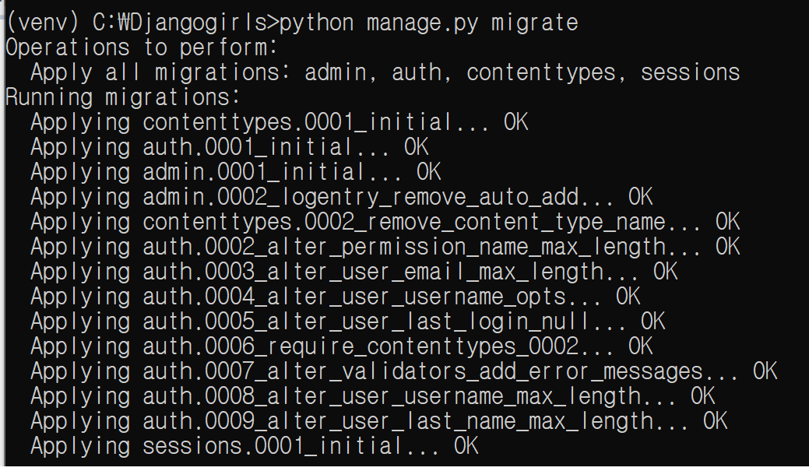
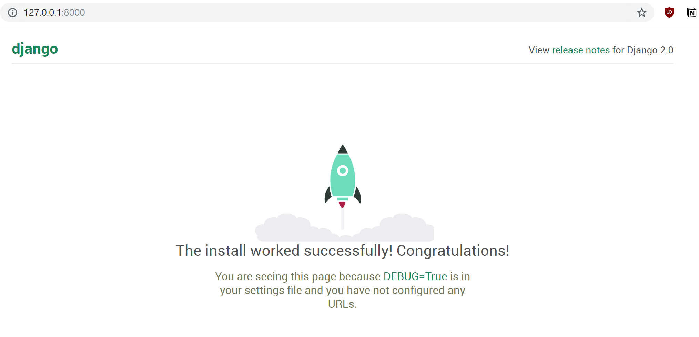

- [Django_docs](<https://docs.djangoproject.com/ko/2.2/intro/tutorial01/>)

- [Djangogirls_tutorial](<https://tutorial.djangogirls.org/ko/>)


### 1. 설치


1. django

```python
djangogirls
├───manage.py
└───mysite
        settings.py
        urls.py
        wsgi.py
        __init__.py
```

- `manage.py` 사이트관리 역할, 설치작업 없이  웹서버를 시작하게 해주는
- `setting.py` 웹사이트 설정


2. python virtualenv설치(window)

- [https://dgkim5360.tistory.com/entry/python-virtualenv-on-linux-ubuntu-and-windows](https://dgkim5360.tistory.com/entry/python-virtualenv-on-linux-ubuntu-and-windows)

```
 pip install virtualenv 
 virtualenv venv
 //가상환경 설치
```

```
call venv/scripts/activate
//가상환경 실행
```


3. 장고 설치하기

- pip upgrade

```
python -m pip install --upgrade pip
```

- django

```
pip install django~=2.0.0
```


### 2. 프로젝트 만들기

2.1 기본 프로젝트 만들기

```
django-admin startproject mysite .
```

- [오류참고](https://stackoverflow.com/questions/53736391/unable-to-create-a-project-in-django)

- .py를 빼고 실행했더니 된다..


2.2 설정 변경

- `Setting.py`

  ```python
  #시간설정
  TIME_ZONE = 'Asia/Seoul'
  
  #정적 호스트 설정
  STATIC_URL = '/static/'
  STATIC_ROOT = os.path.join(BASE_DIR, 'static')
  
  #application 배포 호스트 설정
  ALLOWED_HOSTS = ['127.0.0.1', '.pythonanywhere.com'] 
  
  #데이터베이스 설정
  DATABASES = {
      'default': {
          'ENGINE': 'django.db.backends.sqlite3',
          'NAME': os.path.join(BASE_DIR, 'db.sqlite3'),
      }
  }
  ```

- 블로그에 데이터 베이스 설정 `python manage.py migrate`



- 서버 작동 확인 `python manage.py runserver`



- 작동되는 웹서버를 중지하려면? `ctrl+c`


### 3. 블로그 Post 저장

#### 3.1 Post객체와 속성.

```
Post(게시글)
--------
title(제목)
text(내용)
author(글쓴이)
created_date(작성일)
published_date(게시일)
```


- SQLlite데이터를 사용하여 데이터벵베이스를 조작, 저장할 예정.


#### 3.2 내부 어플리케이션 만들기

- `python manage.py startapp blog` 

  블로그 객체 생성

- 이 객체가 장고에 연결될 수 있도록 `setting.py` 를 수정해줘야함.

  ```python
  INSTALLED_APPS = [
      'django.contrib.admin',
      'django.contrib.auth',
      'django.contrib.contenttypes',
      'django.contrib.sessions',
      'django.contrib.messages',
      'django.contrib.staticfiles',
      'blog',#이부분
  ]
  ```

  

#### 3.3 블로그 글 모델을 만들자.

- 모델이라는 객체를 선언해서, 

- `blog/models.py`

  ```python
  from django.db import models
  from django.utils import timezone
  
  
  class Post(models.Model):
      author = models.ForeignKey('auth.User', on_delete=models.CASCADE)
      #저자는 외래키로
      title = models.CharField(max_length=200)
      #제목은 200자 이내
      text = models.TextField()
      #내용
      created_date = models.DateTimeField(
              default=timezone.now)
      #작성시간
      published_date = models.DateTimeField(
              blank=True, null=True)
      #출판시간? 
  
      def publish(self):
          self.published_date = timezone.now()
          self.save()
  
      def __str__(self):
          return self.title
  ```

- 게시판 포스팅에 대한 객체. 속성을 정의하고.


#### 3.4 데이터베이스 테이블 생성.

- 초기 블로그 포스팅 파일 만들기 `python manage.py makemigrations blog`
- 데이터베이스에 해당 파일 반영하기 `python manage.py migrate blog`

### 

### 4. 관리자 설정

- `settings.py`

  `LANGUAGE_CODE = 'ko'` 로 설정. 한국어로!


#### 4.1 블로그 관리자 추가

- `blog/admin.py`

  ```python
  from django.contrib import admin
  from .models import Post #post객체 가져오고
  
  admin.site.register(Post)#관리자 페이지에서 해당 모델을 보려면? 등록을 해줘야 한다.
  ```

  

- 슈퍼사용자 설정

  `python manage.py createsuperuser`

  ```
  Username: admin
  Email address: admin@admin.com
  Password:
  Password (again):
  Superuser created successfully.
  ```

- 패스워드는 공백으로 나옴!

- 이메일은 본인 이메일을 쓰자.

