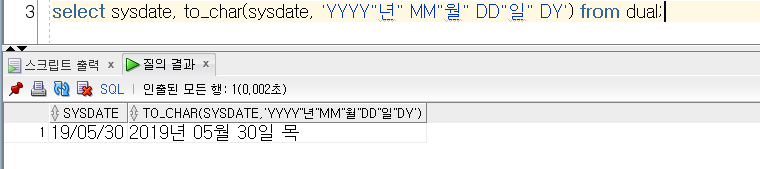
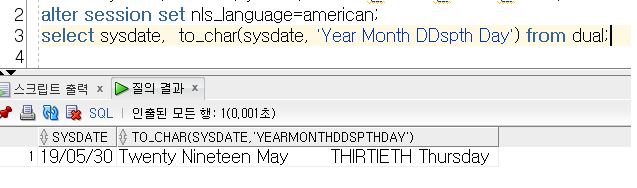
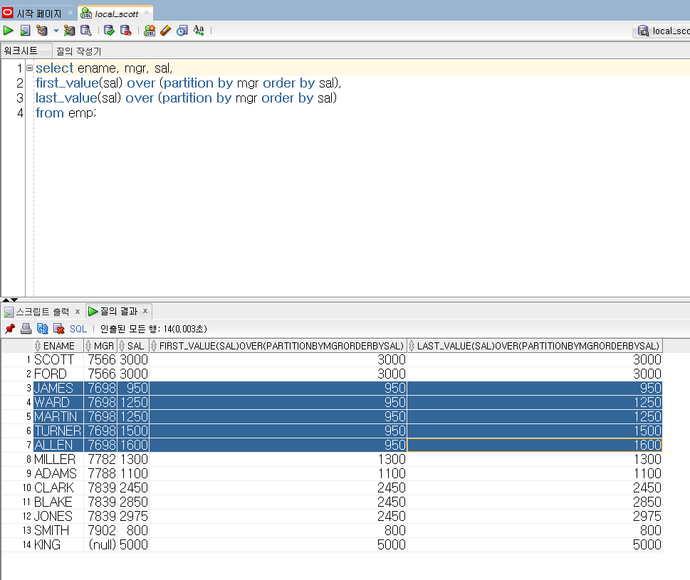
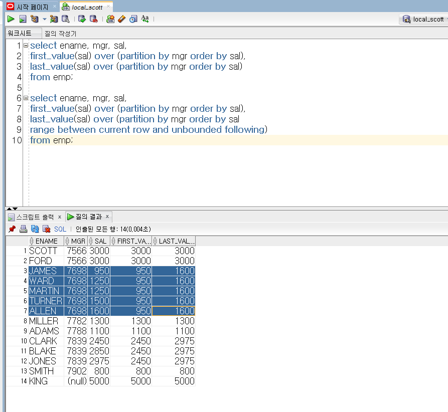

# Oracle_database

### 참고사항

- [DoIt오라클로 배우는 데이터베이스입문](<http://www.yes24.com/Product/goods/65849798>)
- [데이터베이스첫걸음](<https://www.aladin.co.kr/shop/wproduct.aspx?ItemId=94059951>)

### Database 시작

- **통합**? 데이터 중복을 최소화여 중복으로 인한 데이터 불일치를 최소화함.
- **저장**? 파일 형태로 컴퓨터 저장창치에 저장.
- **공용**? 동시적으로 공유할 수 있고,
- **운영**? 업무를 위한 검색을 할 목적으로 데이터를 이용하고,
- **실시간**으로 데이터를 볼 수 있는 접근성.
- **업데이트** 지속적으로 데이터가 변화하고,
- File -> Database -> DBMS(databaseManagementSystem)

  - 데이터베이스는 물리적인 것이고, DBMS는 소프트웨어(MySQL등)


|             |         =         |                           |
| :---------: | :---------------: | :------------------------ |
|    Table    |      Entity       | Record집합                |
|     Row     |      Record       | Tuple(속성값 모음)        |
|   Column    |     Attribute     | 속성                      |
| Primary key | not null + unique | 값이 없진 않고, 유일한 키 |
| Foreign key |        //         | 외래키,                   |

- row 가로

- SQL ? Structured Query Language
- DML, DDL , DCL ? 
- DBMS가 제공하는 보안적 기능
  1. 인증
  2. 권한

- RDBMS 주요 목적
  - Transaction? 분리되어서 실행될 수 없는 작업 단위. (unique of work) 
    원자성을 가짐. 즉 쪼개서 실행될 수 없다는 말이구. 
  
  

------


> ***앞으로 배울 것은 필수적인 SQL명령어, Transcation  에 대해!*** 


### 1. 설치

- [오라클](<https://www.oracle.com/technetwork/database/enterprise-edition/downloads/112010-win64soft-094461.html>)

- 1,2 압축풀고, 2에 들어있는 stage 폴더가  잘 들어가있는 지 확인. 없으면 설치시 오류남.

- 비밀번호 (8자 이상, 대소문자, 특수문자 포함여부)  가 충족이 되지 않으면 경고가 뜨긴 하지만 그냥 진행해도 무관함.

- 데스크탑 클라이언트 선택.

- 제거는?

  ```
  오라클11g DB를 깨끗하게 지우려면....
  1. 제어판>관리도구>서비스 (services.msc)에러 Oralce~ 서비스 시작되어 있는 것 모두 중시시킴
  2. 레지스트리에서 Oracle관련 정보 삭제
     - Window실행에서 regedit입력
     - HKEY_LOCAL_MACHINE > SOFTWARE > Oracle 디렉토리 삭제
     - HKEY_LOCAL_MACHINE > System > CurrentControlSet > services > Oracle 디렉토리들 삭제
     - HKEY_LOCAL_MACHINE > System > CurrentControlSet > services > eventlog > Application Oracle 디렉토리들 삭제
  3. 탐색기 C:\Program Files 아래 Oracle 디렉토리 삭제
  4. 윈도우 프로그램 메뉴 Oracle 메뉴 디렉토리 삭제
  5. C:\app\사용자명폴더~~~~~~ 에 오라클 관련 파일들이 있습니다.
     C:\app 디렉토리 삭제합니다. 만약 xxx.dll파일 때문에 삭제가 안되면 reboot 해서 삭제합니다.
  ```

  

### 2. 실행

- 보통은 공부할 목적이면 좀 더 가벼운 xe버젼 사용.

- cmd창에서 ```sqlplus / sysdba``` //db 실행

  - 원래 ```sqlplus / 계정명/비밀번호 / sysdba``` 를 해야하는데 만약 보안프로그램이 설정되어 있으면 계정명/비밀번호를 해야하고, 그렇지 않으면 스킵해도 괜찮음.

    ```sql
    sqlplus scott / oracle -- cmd에서, sqlplus실행 scott계정으로 들어감. 비번 oracle
    ```

    

- 실행된 후 일반 cmd창으로 빠져 나오려면? 명령어 : ```host```

  - host 창에서 다시 sql창으로? ```exit```

- ```select user from dual;``` : 현재 접속되어있는 유저 확인

  ```
  alter user scott // 유저 선언 scott은 oracle내부에 있는 데이터임.
  identified by oracle // 오라클에서 인증되었고 
  account unlock; //그러니까 유저의 언락해라
  ```

- Soft passing, Hard parsing 

  <https://jeong-pro.tistory.com/157> // SQL 내부 처리방식 참고할 것.

  - Soft parsing : SQL 실행계획이 캐시에 있으면 바로 실행되고,
  - had parsing : 캐시에 없으면 **최적화** 과정을 거친 후 , 실행되도록 하는 방식

- Symantic checking

- 엔티티관계모델

  <https://victorydntmd.tistory.com/126> // 참고

- SQL Developer 를 이용해서 접속하면 cmd보다 좀 더 가독성있는 접근이 가능함

  접속이름 : 맘대루

  사용자 이름 : 현재 DB에 있는 사용자 ex) scott

  비밀번호 : 처음 오라클에 설정한 비밀번호

  SID : orcl로 설정
  
- 오라클 로컬 호스트 접속 https://localhost:1158/em

### 3. 기본

- 변수 사용하지 못함 (MySQL은 가능

- 반복처리는 table의 행단위로 반복처리되고 있음. 명시적인 `for`이나 `while`은 없음.

- `exception`처리 안해도됨.

- 문법

- DBMS

  - 계층형 - 망형 - 관계형 -객체관계형 - 클러스터로 구성되고.

  - 구성요소

    - Table = Column(속성) + Row(record)

    - Primary key ? Not null + unique 항상 있고, 유일하고

    - Foreign key는 다른 테이블에 있는 것을 참조하는 것. 

      다른 테이블에서는 기본키. 비밀키와는 다르고. 왜? 유닉크하지 않음.

  - null? 아직 값이 할당되지 않음! 0이 아니고, " " 도 다름. 

    산술연산, 비교연산결과는 null이 나오고 `nvl`을 통해서 변환 후 처리해야함.

- SQL?

  - 선언적, 결과를 기술하는 언어

  - DML - `select, update, insert, delete`

    <u>데이터 조작어, 데이터 조회, 수정, 삽입, 삭제</u>

  

  - DDL - `create, alter, drop, truncate, rename,  comment`

    <u>데이터 정의어, 데이터 구조를 생성, 변경, 삭제 이름변경</u>

  

  - DCL - `grant,  revoke`

    <u>데이터 제어어, 데이터에 접근하는 객체의 권한을 변경하는</u>

  

  - TCL - `commit, rollback, savepoint`

    <u>트랜젝션 제어어, DML에의해 조작된 결과를 작업단위(트랜젝션) 별로 제어하는 것.</u>


- 검색 구문

  ```
  select * | [distinct] column,,, | expression  [as] Alias from 테이블 명 
  [where] 조건..
  [order by 정렬기준 컬럼(숫자도가능) asc|dec(오름,내림)]
  ```


- 기타 구문

  - 테이블 구조 확인 ? `desc, describe`

  - 컬럼타입은 뭐가 있을까?

    - char(size)
    - varchar2(size)
    - number(p,s
    - date
    - timestamp
    - timestamp withe timezone
    - intervarl year to month
    - interval day to second
    - rowid

    

### 4. 기초 문법

- *sqlplus 툴은* sql을 실행하고 결과를 보여주는 환경을 제공해주고

- *sqlplus 툴* 명령어가 있는데, 세미콜론(;) 없이 사용이 가능하고 명령어는 축약이 가능하다.

- sql문은 명령어가 축약이 불가하고, 반드시 세미콜론으로 끝나야함.

- **sql문장의 키워드와 테이블명, 컬럼명등은 대소문자 구별안함.**
  
  - <u>**단 컬럼값은 대소문자 구별함.</u>**
  
- 주석은 단일`--주석문`, 멀티 `/* */` 

- `select` 행단위로 조회

  


#### 4.1 변수

- ```VARCHAR2(10)``` 가변길이로 char타입 데이터를 저장할 수 있음.

    - ```VARCHAR2(10)``` 은 10개의 문자 내에 문자가 저장될 수 있음.

- ```CHAR(10)``` 은 반드시 10개의 문자가 들어가야하고, 길이가 10이지만

- default 1, 4000byte까지 저장됨.

- ```NUMBER``` 은 binary형식으로 정수, 실수

- ```date``` 는 7byte를 사용해서 수치값으로 저장하는데 `__`시 `__` 분 `__`초 ...이런식으로 


#### 4.2 시간

- `select sysdate from dual` 시간 알아보는 것 근데 19/05/30이런식으로 나옴. 왜? 

  시스템 형식이 위의 방식으로 저장(default)되어있기 때문에 그래서 이것을 바꾸려면?

  `alter session set nls_date_format = 'YYYY/MM/DD HH24:MI:SS';` -> 2019/05/30 11:25:16으로

  그렇지만 세션을 종료한 다음에 다시 시작하면 default값으로 변경되어 나옴.


#### 4.3 테이블

- column 열을 뜻함

- `oracle data dictionary view` meta정보가 저장된 것을 보는 방법.

- user_tables : 특정 user 소유의 테이블 목록을 확인하고
- all_tables : 특정 user 소유와 권한을 받은 테이블 목록을 확인하는 방법
- dba_tables : db의 모든 테이블 목록을 확인(단 dba권한으로만 확인가능)
- ```select * from emp;``` emp에서 모든 값 출력
  ```select ename, sal, job, deptno from emp;``` 해당하는 컬럼만 출력, 이 컬럼의 순서는 테이블에 정의된 컬럼 순서를 맞추치 않아도 됨.

- ```select distinct deptno,  job from emp; --?``` 

  `distinct` 는 모든 컬럼 앞에만 쓴다는 것. 중복을 제거해주는 방법 hashing방법으로


#### 4.4 연산자

- `number`타입
  
  - 산술연산 : `+,-,*,/`
  
- `char/varchar2` 타입
  
  - 문자열 연결은?  `||`
  
- `date` 타입
  
  - ```date- date, date+-n```
  
- `where` 타입
  - `in` 여러값의 리스트에서 값들을 비교하할때는 `=,or`
  - `like ` 문자 패턴을 비교, `_ ,%` 만능문자를 함께 사용
  - `between ~ and ~` 범위연산자로, 하한값, 상한값을 포함해서 범위를 비교하는 연산자
  
- `is null`, `is not null` 연산자 
  
  - null은 논리연산, 비교연산이 안되니까 위의 연산자를 사용하고.
  
  
  
- 논리 연산자 `and`, `or` ,`not`
  
  - ***논리 연산자 우선 순위는 NOT, AND, OR순위임***
  
  
  
- `order by` 

  - 컬럼, 표현식, 별칭, column position(숫자) 가 올 수 있음.


	- null은 값이 없다는 의미. 0도 아니고 ``도 아님.
	- null을 산술연산 한다면 ? 값은 null
	- null은 비교연산 논리연산 진행시 모두 null값을 결과함
	- null을 포함하는 컬럼들은 null아닌 값으로 변환 후에, 산술연산을 수행해야 됨.

  - 모든 DBMS는 <u>NULL 아닌 값으로 변환해주는 내장함수</u>가 존재한다!
  - `nvl(column, null일때 리턴값)`


- **문자, 날짜 데이터는 반드시 ' ' 를 사용해서 표현하고 처리**해야한다.
- 날짜 데이터는 세션에 설정된 포맷형식하고 일치해야 한다.


#### 4.5 출력

- `selelct~from` 절은 필수적

- 단순 계산 결과, 함수 결과, 문자 데이터 출력들은 `dual` 테이블을 사용.

- Q) 'A' 를 출력하려면?

  ```
  select '''A''' from dual; //가독성 너무 떨어짐. 그래서..
  select q'['A']' from dual; // 현재 이 방식 지원하고 있음
  ```
  
- Q) `select 10||10 from dual;`

  `||` concanate 문자열간의 연결하는 것. 즉 10,10이 문자열로 취급되고 그러면 1010이 나오겠네?>

- Q) `select '10'+' 10' from dual;`

  `+` 산술연산자, 그럼 '10', ' 10' 문자열을 정수로 자동적으로 현변환 시켜서 답이 20이 나옴.

- Q) ```select sysdate+1, sysdate-1 from dual;``` +1,-1이 무엇을 의미하니?

  날짜와 산술연산하는 정수는 day임 즉 일단위로 바뀜

- Q)` select sysdate-hiredate from emp;`

  기간이 리턴되는데, 일 단위로.

- Q)`select sysdate_hiredate from emp;`

  에러 _은 부적합한 식별자.

- ```alter session set nls_date_format = 'YYYY-MM-DD HH24:MI:SS';```

  날짜형식 설정.

  ```select sysdate, sysdate+1/24, sysdate+5/1440 from dual;```


#### 4.6 조건 검색 예제

- `select` ,`검색 컬럼 리스트`, `표현식`, `from 테이블` `where 조건`

  조건? 컬럼 비교 연산자 값 (>, < , >= , <> ,!=, = ,<=)

1. 부서 번호가 30번인 사원 검색하는 SQL문

   ```select ename, deptno from emp where deptno = 30;```

2. 직무가 ANALYST인 사원

   `select ename,job from emp where job = 'ANALYST';`

3. 급여가 3000이상인 사원은

   `select ename, salary from emp where salary >= 3000;`


​	Q. 87년 1월 1일 이후에 입사한 사원 이름 검색은? (단 session set이 'RR/MM/DD'로 설정)

​		1. `select ename, hiredate from emp where hiredate > '87/01/01';`

​			87/01/01로 조건을 해서 검색하면 오류뜸. 양식에 맞지 않는다고. 

​			그럼 ' ' 안에 넣어서 세션과 똑같이 해주면 자동으로 conversion해줌

​	 Q. 커미션을 받는 사원은?

​		1. `select ename, comm from emp where comm != 0;`

​		2. `select ename, comm from emp where comm != null;` 

​		오류 왜? null값은 논리연산자와 쓸 수 없음.

​		그래서 `is not null` 을 씀 null이 아닌 것. `is null` 널 인것.

​	 Q. 연봉 3000이상 5000이하인 사람은?

​		1. `select ename, sal from emp where sal >= 3000 and sal <=5000;`

​			이대신에 `between 하한값 and 상한값`을 사용해도됨.

​	 Q. 직무가 clerk 또는 analyst인 사원을 검색?

​		1.`select ename, job from emp where job = 'clerk' or job =' analyst';`

​			-`error` 왜? clerk , analyst로 검색했기 때문. 대소문자 컬럼값은 대소문자 구별하니까?

​		2.`select ename, job from emp where job in ('CLERK','ANALYST');`

​		***in 리스트 연산자 : in (값1, 값2, 값....)**

​	

  * character pattern matching 연산자 : `like '%, _'`
    		* % 문자 종류는 모든 문자, 갯수는 0~m개!
        		* _ 는 문자 종류는 모든 문자, 개수는 1개!

1. 사원 이름 중에서 두번째 문자가 'D' 인 사원만 검색할때는?

   `select ename from emp where ename like '_D%';`


​	Q. 사원 이름 중에서 첫번째 문자가 'S' 시작하는 사원

​	`select ename from emp where ename like 'S%';`

​	Q. 사원 이름 중에서 문자가 'N' 으로 끝나는 사원

​	`select ename from emp where ename like '%N';`

​	Q. 81년도에 입사한 사원을 검색?

```
select ename from emp where hiredate like '81%';
select ename from emp where hiredate between '81/01/01' and '81/12/31';
select ename from emp where hiredate  > '80/12/31' and hiredate < '82/01/31';
```


​	Q. 업무가 PRESIDENT이고 급여가 1500이상이거나 / 업무가 SALESMAN인 사원의 사원번호 이름 업무 급여를 출력

​	`select deptno, ename, job, sal from emp where (job = 'PRESIDENT' and sal >=1500) or job = 'SALESMAN'`

​	Q. 업무가 PRESIDENT 급여가 1500이상이고 업무가 SALESMAN 이거나 PRESIDENT인 사원의 사원번호 이름 업무 급여를 출력

```sql
select deptno, ename, job, sal from emp where  sal >=1500 and job in ('PRESIDENT','SALESMAN');`

select deptno, ename, job, sal from emp where  sal >=1500 and job = 'PRESIDENT' or job = 'SALESMAN';`
```


#### 4.7 정렬

- `select~from [where 필터조건] [group by 컬럼] [having 조건] [order by 정렬기준컬럼 정렬방식]`

  - [] 는 선택조건. 넣어도 되고 안해도 되고.
  - 정렬방식 `asc`  오름차순, `default, desc` 내림차순, *적질않았을 경우 오름차순으로 됨.*

  Q. 월급의 오름차순으로 사원정보 출력

  `select ename, job, sal from emp order by sal;`

  내림차순?  `select ename, job, sal from emp order by sal desc; `

   Q. 사원들의 사번, 이름 부서번호,월급, 커미션,연봉(SAL+COMM*12)의 결과 출력은 연봉 내리차순으로?

  `select deptno, ename, mgr, sal, comm, 연봉(sal+comm*12) from emp order by 연봉;`

  - **컬럼명을 추가해줄때는 해당 SQL명령어 뒤에 적어주는 구나**

  ```sql
  select empno, ename, deptno, sal, comm, (sal+nvl(comm,0)*12) from emp order by (sal+nvl(comm,0)*12) desc;
  
  select empno, ename, deptno, sal, comm, (sal+nvl(comm,0)*12) "연봉" from emp order by "연봉" desc; 
  
  select empno, ename, deptno, sal, comm, (sal+nvl(comm,0)*12) "연봉" from emp order by 6 desc; 
  ```

  

  Q. 사원들의 사번, 이름 부서번호,월급, 커미션,연봉(SAL+COMM*12)의 결과 출력은 부서번호 오름 차순 정렬하고 연봉의 내림차순

  ```sql
  select empno, ename, deptno, sal, comm, (sal+nvl(comm,0)*12) "연봉" from emp order by deptno asc, "연봉" desc; 
  
  select empno, ename, deptno, sal, comm, (sal+nvl(comm,0)*12) "연봉" from emp order by 3 asc, 6 desc;  --숫자는 컬럼번호
  ```

  

#### 4.8 연습문제

```
[연습문제]
문제1)  EMP Table의 모든 자료를 출력하여라.
문제2)  EMP Table에서 사원 번호, 이름, 급여, 담당업무를 출력하여라.
문제3) 모든 사원의 급여를 $300 증가시키기 위해 덧셈 연산자를 사용하고 결과에 SAL+300을 조회한다  
문제4) EMP 테이블에서 사원번호, 이름, 급여보너스를 출력하여라.
문제5) EMP 테이블에서 ENAME를 NAME로 SAL을 SALARY로 출력하여라.
문제6) EMP 테이블에서 ENAME를 Name로 SAL*12를 Annual Salary 로 출력하여라.
문제7) EMP 테이블에서 ENAME를 '성 명'으로, SAL를 ‘급 여'로  출력하여라.
문제8) EMP 테이블에서 이름과 업무를 연결하여 출력하여라.
문제9) EMP 테이블에서 이름과 업무를 "King is a PRESIDENT" 형식으로 출력하여라.
문제10) EMP 테이블에서 이름과 연봉을 "KING: 1 Year salary = 60000" 


문제11) EMP 테이블에서 JOB을 모두 출력하여라.
문제12) EMP 테이블에서 담당하고 있는 업무의 종류를 출력하여라.
문제13) EMP 테이블이 부서번호를 중복 값을 제거해서 조회하라
문제14) 부서별로 담당하는 업무를 한번씩 출력하여라.
문제15) EMP 테이블에서 사원번호, 이름, rowid를 조회하라.
문제17) EMP 테이블에서 급여가 3000 이상인 사원의 사원번호, 이름, 담당업무, 급여를 출력하라.
문제18) EMP 테이블에서 담당업무가 Manager인 사원의 정보를 사원정보, 성명, 담당업무, 급여, 부서번호를 출력하라.
문제19) EMP 테이블에서 1982년 1월 1일 이후에 입사한 사원의 사원번호, 성명, 담당업무, 급여, 입사일자, 부서번호를 출력하라.
문제20) EMP 테이블에서 급여가 1300에서 1700사이의 사원의 성명, 담당업무, 급여, 부서 번호를 출력하여라.

문제21) EMP 테이블에서 사원업호가 7902, 7788, 7566인 사원의 사원번호, 성명, 담당업무, 급여, 입사일자를 출력하여라.
문제22) EMP 테이블에서 입사일자가 82년도에 입사한 사원의 사번, 성명, 당당업무, 급여, 입사일자, 부서번호를 출력하여라.
문제23) EMP 테이블 이름의 첫 글자가 'M'인 사원의 이름, 급여 조회하라
문제24) EMP 테이블 이름의  두 번째 글자가 ‘L'인 사원의 이름,업무를  조회하라
문제25) EMP 테이블에서 보너스가 NULL인 사원의 사원번호, 성명, 담당업무, 급여, 입사일자, 부서번호를 출력하여라.
문제26) EMP 테이블에서 급여가 1100 이상이고 JOB이 Manager인 사원의 사원번호, 성명, 담당업무, 급여, 입사일자, 부서번호를 출력하여라.
```

```sql
1.select * from emp;
2.select empno, ename, sal, job from emp;
3.select sal+300 from emp;
4.select empno, ename, comm from emp;
5.select ename"NAME", sal"SALARY" from emp;
6.select ename"Name", sal*12"Annal Salary" from emp;
7.select ename"성 명", sal"급 여" from emp;
8.select ename || job from emp;
9.select ename ||  ' is a ' || job from emp;
10.select ename ||  ': 1 Year salary =  ' || sal from emp;

11.select job from emp;
12.--무슨말이여
13.select distinct job from emp;
14.select distinct deptno, job from emp;
15.select empno, ename, ROWID from emp;
16.select empno, ename, job, sal from emp where sal >=3000;
17.select empno, ename, job, deptno from emp where job ='MANAGER';
	//where에서 비교하는 데이터가 문자열일 경우 작은따옴표로 묶어줘야함.
	
18.select empno, ename, job, sal, hiredate, deptno from emp where hiredate > '82/01/01';
19.select ename, job, sal, deptno from emp where sal between 1300 and 1700;
20.select empno, ename, job, sal, hiredate from emp where empno in ('7902','7788','7566');

21.select empno, ename, job, sal, hiredate, deptno from emp where hiredate like '82%';
22.select ename, sal from emp where ename like 'M%';
23.select ename, job from emp where ename like '_L%';
24.select empno, ename, job, sal, deptno from emp where comm is null;
25.select deptno, ename, job, sal from emp where  sal >=1500 and job in ('MANAGER');
```


#### 4.9. 형 변환

##### 	4.91. Number <=> Character

- `character` to `number` ? `to_number`

  - `to_number('기존 문자열', '변환할 format형식')` 
    - 형식은 문자열과 똑같이 지정을 해줘야힘 $23,000.00? $99,999.00이런식으로

- `number` to `character ` ? `to_char`

- `to_char(기존 number, '변환할 문자열 format형식')` 

- `tonumber`은 두개다 ' '로 감싸져있지만, `tochar`은 변환형식만

  ```
  select to_char(123456.789, '$9,999,999.9999') from dual;
  -- 전자 숫자와 후자 포멧형식이 일치하지 않지만 변환을 해준다.
  
  select to_number('$1,234,567.999', '99,999,999.999') from dual;
  --에러. 왜? 숫자의 갯수의 문제가 아닌, '$'가 없기 때문임.
  ```


##### 	4.92. Character <=> Date

- `to_date('기존 문자열', '변환할 날짜format 형식')`

- `to_char('기존 날짜','변환한 문자format 형식')`

  

  

  - 영어형식으로 날짜가 출력됨.

  

  ```
  alter session set nls_language=english;
  
  select '2019-05-30 5:43 PM' 
         , to_date('2019-05-30 5:43 PM' 'HH12:MI AM YYYY-MM-DD')
  from dual;  --error?
  
  
  select '2019-05-30 5:43 PM' 
         , to_date('2019-05-30 5:43 PM', 'YYYY-MM-DD HH12:MI PM')
  from dual; 
  ```

  


### 5. 기본 함수

- 함수 분류

  - predefine -> DB벤더에 `nvl, sysdate, user`등 _ 미리정의되어있음.
  - custom -> (PL/SQL)

  

  - 단일행 함수 `Input`이 함수처리에 들어가서 `outputdata`가 **1개** 나오는 것.

    - 프로그램에서의 함수는 반드시 하나의 값을 리턴해야되는 것은 아니지만, SQL에서의 함수는 반드시 하나의 값을 리턴해야한다.
    - DB의  단일행 함수는 반드시 **1개**의 결과를 리턴해줘야함.
    - `Character, Number, Date, Null처리, Conversion , 기타`

    

  - 복수행 함수 `allrow,gropingrow`가 `inpu`t으로 들어가서 `함수처리`를 지나 `outputdata`가 **1개** 나오는 것.

  

  - 분석함수(window 함수라고 함)
    - 엑셀 피벗테이블 그룹화 느낌. 이렇게 그룹화 되는 것을 window처럼 보임.
    - 분석함수는 비율, 순위등을 구해주는 것.

  


- [Database SQL Language Reference](<https://docs.oracle.com/cd/E11882_01/server.112/e41084/toc.htm>)
  - `Function` 으로 들어가면 함수에 대한 reference를 볼 수 있음.
  - `chr`


  - `n`정수값이 들어가면 이걸 이용해서.... char


#### 5.1 문자함수 lower등, length, cocat

- [참고](<https://mine-it-record.tistory.com/57>)

```sql
select initcap(ename), lower(ename), upper(ename) from emp; 
-- ename을 받아서, 소문자, 대문자
select length('korea') length('대한민국') from dual;
--길이
select lengthb('korea') lengthb('대한민국') from dual;
--?
select concat(concat(ename, ' is '), job) from emp;
--concat 합치는 거지. ename과 is를 먼저 합치고 그리고 job과 또 합치고
```


#### 5.2 substr, instr

```sql
select substr('today is 2015년 4월 26일', 1, 5),
       substr('today is 2015년 4월 26일', 10, 5), - 10부터 15까지 추출
       substr('today is 2015년 4월 26일', 15), - 15부터 나머지 모두
       substr('today is 2015년 4월 26일', -3, 2) - 맨뒤? -1, -3부터 -1까지
from dual;
--substr 부분추출. 1부터 5까지. 여기 index시작은 1부터됨.

select instr('korea is wonderful', 'o'),
       instr('korea is wonderful', 'o', 1, 2),
       instr('korea is wonderful', 'o', 9),
       instr('korea is wonderful', 'x')
from dual;
-- instr 찾는 거지, '문자' 가 어디있는지.
```


#### 5.3 lpad, rpad

```sql
select ename, sal, lpad(sal, 10, '*')
from emp;
-- 문자열 변환, 문자열 전체 길이내에 왼쪽 공백에 특정문달을 padding
-- sal컬럼에 값들을 10자리 값으로 만들고, 그 왼쪽에 빈값들을 해당 문자로 채워넣음

select ename, sal, rpad(sal, 10, '*')
from emp;
-- r? rigtht 오른쪽으로 채워나가는 것.
```


#### 5.4 trim, ltrim, replace

- 공백제거하는 함수 `trim`
  - 문자중간에 공백을 제거할 수 는 없음.
- 변환 `replace`

```sql
select length('  hello  '),  length(trim('  hello  '))
from dual;
--공백을 제거하지 않으면 그 공백의 길이까지 측정.

select trim('H' from 'Hello wonderful'), trim('l' from 'Hello wonderful')
from dual;
-- 'H' 제거하고 나머지 반환, 마지막나오는 L WPRJGKRH QKSGHKS

select ltrim('Hello wonderful', 'He' ), rtrim( 'Hello wonderful' , 'ful')
from dual;
-- 후자 'He' 제거하고 나머지 반환

select replace('Jack AND Jue', 'J', 'BL')
from dual;
--'J'를 'BL'로 바꿔라,, BLack ADN BLue 반환됨.
```


#### 5.5 숫자함수 numberic 

- `round(n1,n2)` n1에서 0아래 n2자리수까지 보존하면서 반올림.
- `trunc 절사, mod 나머지, ceil 올림, power 지승`

```sql
select round(12.345, 2), round(12.345, 0), round(12.345, -1)
from dual;
-- 0? 1의자리까지, -1? 10의자리까지

select trunc(12.345, 2), trunc(12.345), trunc(12.345, -1)
from dual;
-- 버림느낌.

select mod(99, 4)
from dual;

select ceil(12.345), floor(12.345) from dual;
-- 올림함수, 내림함수

select power(3, 2), power(5, 2)
from dual;
-- 3^2
```

Q. 사원번호중 홀수인 사원들만 출력

​	`select empno, ename from emp where mod(empno, 2) =1;`


#### 5.6 날짜 함수 date function

- RR날짜 형식

  

  - YY포맷을 주고, 1995년도 입사한 고객을 찾으면? 1917로 검색하게 되고.

- `timestamp` 컬럽타임은 ? `(YYYY/MM/DD HH24:MI:SS.SSSSSSSSS)`

  ```sql
  select sessiontimezone from dual;
  alter session set time_zone='+3:00';
  select sessiontimezone from dual;
  ```

- `sysdate` 시스템의 현재 리턴

- current_date ? 세션의 timezone을 기반으로 현재시간을 date타입으로 리턴함

- current_timestamp? 세션의 timezone을 기반으로 현재시간을 timestamp타입으로 리턴함

  ```sql
  select sysdate, current_date, current_timestamp from dual;
  ```

- `add_months(date, n)` - 개월 수를 더한 날짜가 리턴

- `months_between(date, date) `- 기간이 리턴

	```sql
	select add_months(sysdate, 6) from dual;

	select hiredate, add_months(hiredate, 6) from emp;

	select months_between(sysdate, hiredate) from emp;
	```

- `next_day(date, '요일명')` 

  ```sql
  select next_day(sysdate, '목') from emp; --다음 목요일이 오는 날짜는 언제인가?
  ```

- 요일을 기준 올림,반올림,절사등..

  ```sql
  select trunc(to_date('14/02/14'), 'MONTH'),  --MONTH 면 일기준으로 행해지고
         trunc(to_date('14/02/14'), 'YEAR')	--YEAR이면 월기준으로 함수가 행해짐
  from dual;
  
  select round(to_date('14/02/14'), 'MONTH'), 
         round(to_date('14/02/14'), 'YEAR')
  from dual;
  ```

  - 하기전에 꼭 `alter session set nls_date_format = 'RR/MM/DD';` 를 설정해줘야하고,
  - 2월 14일, 14일을 기준으로 월 변화를 보면 2월 1일로 변화됨 , 15일도 `round` 함수에 의하면 내림이 되고

- `last_day(date)` 

  - 언제가 마지막 날인지 찾는 함수.

  ```sql
  select last_day(to_date('14/02/14')), last_day(to_date('2000/02/14'))
         , last_day(to_date('2100/02/14'))
  from dual;
  ```

  

  Q. 각 사원들의 입사날짜로 부터 6개월후로 날짜로부터 다음 금요일이 연봉 조정일이면 , 사원들의 연봉 조절 면담날짜는?

  ​	`select ename, hiredate, next_day(add_months(hiredate,6), '금')"연봉조절날짜" from emp;`


###  6. 기타 함수


#### 6.1 단일행 함수

- `nvl(column, expression)` 두가지 인자가 동일한 타입이어야 함.

- `nvl2(column, expression1, expression2)` expression의 두가지 인자가 동일한 타입이어야함

- `coalesce(column, ex1,ex2.....) ` 함수의 파라미터값에서 null이 아닌 최초의 값을 리턴하고 함수는 종료합니다.

- `nullif(expression1, expression2)` : expression1과  expression2 동일한 타입이어야 함 동일한 타입이 아니면 에러.

  expression1과 expression2의 **값**이 동일하면 null을 리턴하고, **값**이 다르면 expression1을 리턴
  
##### 6.11 연습문제

1. 사원들 중 커미션을 받지 않는 사원들은 -1로 출력 (이름, 급여)

   ```sql
   select ename, sal, nvl(sal, -1) from emp;
   ```

   

2. 사원들중 커미션을 받는 사원은 급여 + 커미션으로 출력하고 커미션을 받지 않으면 'No commison' 으로 출력 (이름,  급여, 커미션, 비고)

   ```sql
   select ename, sal, comm, nvl2(comm, to_char(sal+comm), 'No Commission') from emp 
   ```

 

3. 결과를 확인하자

   ```sql
   select coalesce(1, null, null, null, null) from dual;   --1 , null값이 아닌 최초값을 리턴
   
   select coalesce( null, null, 3, null, null) from dual;  --3
   
   select coalesce( null, null, null, null, null, 'a') from dual;  --a
   
   select nullif(100, '100')
   from dual;  --error? 왜? 서로 동일한 타입이 아니여서
   
   select nullif('A', 'A'), nullif('A', 'a')
   from dual; null, --'A' 서로 같은 타입에 값도 같으니 null, 값이 다르니 첫번째꺼.
   ```


<<<<<<< HEAD
#### 6.2 조건처리 함수

- `decode`(column, 표현식1, 리턴값1, 표현식2, 리턴값 2......)
=======
  

  


- 조건처리 표현식, 표준 sql3에서 : case [표현식] when [값|조건표현식]  then 값

  ```sql
  문> 사원들의 부서번호가 10번이면 월급을 5%인상
      부서번호가 20번이면 월급을 10%인상
      부서번호가 30번이면 월급을 3%인상 
      그 외의 부서는 월급 100인상합니다.
      현재의 월급과 인상된 월급을 출력합니다.
      
  select ename, deptno, sal, decode(deptno, 10 , sal*1.05,
  										  20 , sal*1.1,
                                            30 , sal*1.3, 
                                                 sal+100) "Increase"
  from emp;
  -- 싱글로우 함수, 하나 만족하면 거기서 끝남. 
  
  위와 같음
  
  select ename, deptno, sal,
  	case deptno when 10 then sal*1.05,
  				when 20 then sal*1.1,
  				when 30 then sal*1.3,
  				else sal+100 end "Increase"
  from emp;				
  ```

##### 6.21 연습문제

```
문> 월급에 대한 세금 출력하시오
    월급이 1000미만이면 0,  
    2000미만이면 월급의 5%, 
    3000미만이면 월급의10%
    4000미만이면 월급의15%, 
    4000이상이면 월급의 20%
```

```sql
select ename, deptno, sal, 
       decode(trunc(sal/1000) , 0, 0 --1000으로 나눠 절사함. 구 몫이
                              , 1, sal*0.05
                              , 2, sal*0.1
                              , 3, sal*0.15 
                              , sal*0.2) "Tax"
from emp;	

select ename, deptno, sal, 
       case when sal< 1000 then 0
            when sal< 2000 then sal*0.05
            when sal< 3000 then sal*0.1
            when sal< 4000 then sal*0.15
            else sal*0.2 end  "Tax"
from emp;
```

- [참고](<https://jyosssss.tistory.com/17>)


- Q) 연습문제1

```sql
1.select last_name, salary from employees;
2.select last_name, department_id  from employees where employee_id ='176';
3.select last_name, salary  from employees where salary < 5000 or salary > 12000;
4.select last_name, job_id, hire_date  from employees where last_name in ('Matos','Taylor') order by hire_date asc;
5.select last_name, department_id  from employees where department_id  in ('50', '20') order by last_name asc;
6.select last_name"Employee",salary"Monthly Salary"  from employees where salary between 5000 and 12000 and department_id  in ('50', '20');
7.

8.select last_name,job_id 
from employees
where manager_id is null;
9.

10
select last_name, salary
from employees
where salary > &vnum1;

11
select employee_id, last_name, salary, department_id
from employees
where manager_id = 103
order by &column;


```


#### 6.3 그룹 함수

- 그루핑된 **행 집합**, 테이블 전체 행 집합의 커럼이 함수의 인수로 전달되고 결과는 **반드시 1개**를 리턴하는 함수
- `sum(number타입|expression)`
- `avg(number타입|expression)`
- `stddev(number타입|expression)` 표준편차
- `variance(number타입|expression)` 분산
- `max, min(numbe,char, date 컬럼타입|expression)`
- `count([distinct] number, char, date 컬럼타입 | expression)` 
  - `count(*)` 테이블의 전체 행수를 리턴, 내부적으로는 `not null` 또는 `PK` 제약조건이 선언되어있는 컬럼을 가지고 카운트를 함.
  - `distinct`를 인수로 사용 할 수 있음. 즉 보통적으로는 중복된 값도 모두 카운트한다는 말이겠네?
- `group by` 
  - `group by `절에는 column명만 선언할 수 있음.
  - 그룹함수에 대한 조건은 `having` 절에만 선언할 수 있다.

- *그룹함수는 `null` 값을 연산에 포함시키지 않습니당.*

- 그룹함수를 적용한 컬럼과, 그룹함수를 적용하지 않은 컬럼이 select절에 있을 경우?

  group by절에 그룹함수를 적용하지 않은 컬럼을 반드시 선언해줘야함.

- 그룹함수에 조건은? `having` 절에

```sql
select --컬럼, 그룹함수 컬럼 5번
from -- 1번
where -- 필터조건 2번
group by -- 컬럼 3번
having -- 4번
order by -- 정렬 방식 6번
```


##### 6.31 연습문제

```sql
문1 전체 사원 급여 합계, 평균, 최대값, 최소값 결과 출력?

문2 전체 emp테이블의 행수는?
select count(*), count(empno) from empl --PK 컬럼을 인수로 사용해도되고.

문3 전체 사원들 중에 가장 빠른 입사 날자와 가장 최근 입사 날짜?
select max(hiredate), min(hiredate) from emp;

문4 전체 사원들중에 이름 순서가 가장 빠른 사원의 이름과 이름 순서가 가장 늦은 사원은?
select man(ename), min(ename) from emp;

문5 사원들의 소속된 부서의 종류의 수 출력?
select count(distinct deptno) from emp;

문6 커미션을 받는 사원수는?	
select count(comm) from emp;  --null은 count되지 않는다.

문7 전체 사원들의 커미션 평균?
select sum(comm)/count(*), avg(comm) from emp;

- 두개가 같지 않음. 왜? 모든 그룹함수는 null을 함수 연산에 포함하지 않음. 그러니까 avg를 계산할때null값을 가진 것은 뛰어넘는다.
- 그러므로 avg(nvl(comm,0)) 으로 null값에 대한 리턴값을 정해줘야함

문8 부서번호와 부서의 평균급여를 함께 출력
select deptno, avg(sal) from emp;` --에러 왜? deptno는 그룹함수 사용하지 않고, avg 를 그룹함수 사용
-> select deptno, avg(sal) from emp group by deptno;
= select avg(sal) from emp group by deptno;

둘 다 그룹함수이여야만 만들어줘야 결과를 볼 수 있음 그래서 그룹함수를 사용하지 않은 곳에 그룹함수 선언
group by 절에 작성된 것이 select다음에 꼭 들어가야 하는 건 아님.
group by 절에는 column명만 선언할 수 있음.

문9 부서와 직무별 급여 평균 출력
select deptno, job, avg(sal) from emp group by deptno, job;
```


```sql
문>각 부서별로 인원수, 급여의 평균, 최저 급여, 최고 급여, 급여의 합을 
구하여  급여의 합이 많은 순으로 출력하여라.

select count(ename), avg(sal), max(sal), min(sal), sum(sal) 
from emp 
group by max(sal);


문> EMP 테이블에서 부서 인원이 4명보다 많은 부서의 부서번호, 인원수, 
급여의 합을 출력하여라

select deptno, count(*), sum(sal)
from emp --1
group by deptno --2, 컬럼명만 쓸 수 있음. , 를 이용해서 여러 컬럼을 그룹할 수 있고.
Having count(deptno) >4; --3

```


```sql
문> EMP 테이블에서 급여가 최대 2900 이상인 부서에 대해서 부서번호, 평균 급여, 
급여의 합을 구하여 출력하여라.

select deptno, avg(sal), sum(sal) 
from emp
group by deptno
having max(sal) > 2900;

문> EMP 테이블에서 업무별 급여의 평균이 3000 이상인 업무에 대해서 업무면, 
평균 급여, 급여의 합을 구하여 출력하여라.

select job, avg(sal), sum(sal)
from emp
group by job
having avg(sal) >3000;
```


- from exercise2

```sql
select max(salary), min(salary), sum(salary),avg(salary)
from employees;

select job_id, max(salary), min(salary), sum(salary),avg(salary)
from employees
group by job_id;

select job_id, count(job_id)
from employees
group by job_id;

select count(distinct manager_id)
from employees;

select max(salary) - min(salary)"DIFFERENCE"
from employees;

select count(*) "Total", --이문제 다시 풀어봐야함
       sum(decode(to_char(hire_date, 'YYYY'), '1995', 1)) "1995",
       count(case to_char(hire_date, 'YYYY') when '1996' then 1 end) "1996",
       count(case to_char(hire_date, 'YYYY') when '1997' then 1 end) "1997",
       sum(decode(to_char(hire_date, 'YYYY'), '1998', 1)) "1998"
from employees;


```


### 7. 검색방법 - projection, selection, join


#### 7.1 Join 조인

- 하나 이상의 테이블에서 동일한 속성의 컬럼값이 일치할 때 테이블 테이블의 row(가로) 결합해서 결과집합으로 생성

- `from`절은 테이블 여러개 선언해서 가져올 수 있음. `from table1,table2...`
- 조인 조건을 잘못 정의하거나, 조인 조건을 누락하면  *cartesian product* 현상이 일어남
  
- *catesian product*? 두테이블의 모든 row가 한번씩 조인되는 경우, 조심해야함.
  
- `equi join`  = `(inner join)`

  - 사용하는 열의 일치여부를 기준으로 테이블을 조인함.

  ```sql
  --문 copy_emp와 dept테이블에서 사번,이름,부서번호,부서명 출력
  select a.empno, a.ename, b.deptno, b.dname
  from copy_emp a join dept b on a.deptid = b.deptno;
  
  drop table copy_emp purge;  --테이블 삭제
  
  select a.empno, a.ename, b.deptno, b.dname
  from emp a  inner join  dept b  on a.deptno = b.deptno;
  ```

  

  동일한 조건의 속성이 없으면 `equi join`을 쓰지 못한다.


- `non-equi join`

  - 사용하는 열이 일치하지 않을 때, 사용하는 방법

  - 등가조건 이외의 방식.

  ```sql
  -- 문> 사원이름, 급여, 급여의 등급을 조회 출력 -- non-equi join으로 해결해야함.
  
  select a.ename, a.sal, b.grade
  from emp a, salgrade b
  where a.sal between b.losal and b.hisal;
  
  --또는
  
  select a.ename, a.sal, b.grade
  from emp a join salgrade b on a.sal between b.losal and b.hisal;
  ```

  

- `self - join` (자기참조가 가능한 테이블에서만)

  - 하나의 테이블에 2개 row에서 조인
- 자기 테이블내에서 참조를 할때

- 2개이상 테이블에서의 조인

  ```SQL
  ※ n개의 테이블을 조인할때 최소 조인 조건은  n-1개 
  문> 사원이름 , 소속 부서이름, 부서가 위치한 도시를 조회 출력
  select a.last_name, b.department_name, c.city
  from employees a, departments b, locations c
  where a.department_id = b.department_id
  and b.location_id = c.location_id;
  
  select a.last_name, b.department_name, c.city
  from employees a join  departments b on a.department_id = b.department_id
  join locations c  on   b.location_id = c.location_id;
  ```

  

- `outer-join` 

  - 일치하는 컬럼값이 없거나, 조인 컬럼값이 null인 경우, 그 row도 조인결과로 생성하려면?
  - outer연산자를 어디다가 줘야하나? *join할 row가 없는 쪽*에다가

  ```sql
  --문> 부서번호가 없는 사원을 포함해서 사원들의 부서이름를 함께 출력
  select a.empno, a.ename, a.deptno, b.dname
  from emp a, dept b
  where a.deptno = b.deptno;   --8000번 hong사원 누락됨
  
  select a.empno, a.ename, a.deptno, b.dname
  from emp a, dept b
  where a.deptno = b.deptno(+); ----8000번 hong사원 포함?
  
  --sql1999
  from emp a left outer join dept d on a.emp = d.deptno; --  위와 같음.
  
  select a.empno, a.ename, a.deptno, b.dname
  from emp a left outer join dept b on a.deptno = b.deptno; --기준절이 왼쪽이기 때문에 오른쪽에서 + 해서 넣어주고
  
  --문> 부서정보를 기준으로 부서의 소속 사원을 출력하고,
  --소속 사원이 없는 부서도 출력합니다.
  select b.deptno, b.dname, a.empno, a.ename, 
  from emp a, dept b
  where a.deptno = b.deptno
  order by  b.deptno;   ---40번 부서정보 누락?
  
  
  select b.deptno, b.dname, a.empno, a.ename, 
  from emp a, dept b
  where a.deptno(+) = b.deptno
  order by  b.deptno;  ------40번 부서정보 포함?
  	
  select b.deptno, b.dname, a.empno, a.ename, 
  from emp a right outer join dept b on a.deptno = b.deptno
  order by b.deptno --기준이 오른쪽 이기 떄문에 왼쪽에서 + 만들어서 넣어주고
  
  ```

  ```sql
  
  --문>  부서번호가 없는 사원을 포함하고, 소속 사원이 없는 부서도
  -- 사원들의 사번, 이름, 부서번호, 부서이름를 함께 출력합니다.
  
  select b.deptno, b.dname, a.empno, a.ename, 
  from emp a, dept b
  where a.deptno(+) = b.deptno(+)
  order by  b.deptno;  -- 아웃터 연산자는 둘다 못씀.
  
  
  -- 그래서 아래와같이 써야함., sql1999
  
  select b.deptno, b.dname, a.empno, a.ename, 
  from emp a full outer join dept b on a.deptno  = b.deptno
  order by  b.deptno; 
  ```

  

- `natural join` 

  - 조인할 테이블에서 동일한 이름의 컬럼으로 자동 equi 방식 조인을 수행
  
  - 조인할 테이블에서 동일한 이름의 컬럼 앞에 소유자 테이블명 또는 별칭(alias)를 선언하지 않음

  - natual join 은 동일한 속성이지만, 설계할때 부모와 자식 테이블에서 이름을 다르게 정의하면 조인 수행 안됨
  
  - 동일한 이름인데, 속성이 서로 다르다? 그러면 `natural join`이 일어나지 않음.
  
- `equi 조인`과 차이?
  
    -   EQUI JOIN에서 JOIN 조건이 '='일 때 동일한 속성이 두 번 나타나게 되는데, 이 중 중복을 제거하여 같은 속성을 한번만 표기하는 방식이 natural 조인 이다.
    
    출처: <https://all-record.tistory.com/160> [세상의 모든 기록]  
    
  ```sql
    select last_name, department_id, department_name
  from employees, departments; 
    --? 애매모호한 컬럼. 왜? 겹치는게 있음. 가지고 오려는 자산이 누구의 소유인지 확실히
  
    select e.last_name, e.department_id, d.department_name
    from employees e, departments d; 
    -- 조인 조건 누락. 그래서 107*27에 해당하는 row가 만들어짐.catesian product
  
    select e.last_name, e.department_id, d.department_name
    from employees e, departments d
    where a.deparetmentI_id = d.department_id;
    
    select b.last_name, a.department_id, b.department_name
    from employees a natural join department b;
    
    from employees a join department b on a.department_id = d.department_id;
  ```
  
    

#### 7.2 연습문제

- exercise3

```sql
--1
select a.location_id, a.street_address, a.city, a.state_province, b.country_name
from locations a natural join countries b;

--2
select a.last_name, a.department_id, b.department_name
from employees a inner join departments b on a.department_id = b.department_id;

--3
select a.last_name, a.job_id,a.department_id, b.department_name
from employees a join departments b on a.department_id = b.department_id
join locations c on b.location_id = c.location_id
where c.city ='Toronto';

--4
select a.last_name, a.employee_id,b.last_name, a.manager_id
from employees a , employees b
where a.manager_id = b.employee_id;

--5
select a.last_name, a.employee_id,b.last_name, a.manager_id
from employees a , employees b
where a.manager_id = b.employee_id(+);

--6?? 질문
select a.department_id, a.last_name, b.last_name
from employees a , employees b
where a.department_id = b.department_id
order by a.department_id asc;

--7
select a.last_name, a.job_id, c.department_name, a.salary, b.grade_level
from employees a inner join departments c on a.department_id = c.department_id, job_grades b
where a.salary between b.lowest_sal and b.highest_sal;

--8
select last_name, hire_date
from employees
where hire_date > (select hire_date
                            from employees
                            where last_name ='Davies');

--9


```


### 8. 서브쿼리

- SQL 내부에 사용하는 SELECT문. 왜? SQL문을 실행하는데 필요한 데이터를 추가적으로 조회하기 위해서.

- 싱글로우 오퍼레이터, 멀티블 컬럼 서브쿼리, 페어와이즈
  
  - 단일행, 다중행, 다중 컬럼 서브쿼리 명칭은 결과에 따라 명칭이 갈리고 있고.
  
  - 단일행 서브쿼리에서는 단일행 비교 연산자인` =, <> <,>`등의 연산자를 사용할 수 있음,
  
  - 다중행 서브쿼리는 
  
    ```
    IN : 같은 값을 찾음
    > ANY : 최솟값을 반환
    < ALL : 최솟값을 반환
    < ANY : 최댓값을 반환
    > ALL : 최댓값을 반환
    EXIST : 서브쿼리 값이 있을 경우 반환
    ```
  
    `in` 연산자는 단일행 비교 연산자 '='와 비슷한 용도로 사용되고 있고,
  
    
  
- 서브쿼리는 먼저 수행됨을 잊지 말자.

- `rownum` 은 결과행에 순차적인 번호를 발행하는 내장 컬럼이고, orderby 전에 발행되므로, orderby후에 발행하려먼 subquery를 사용


- 서브쿼리는 어디에 올 수 있는가?

  - select, from, where, having, order by절에 올 수 있음.

    ​    \- SELECT문에 있는 서브쿼리 : *스칼라 서브쿼리*

    ​    \- FROM절에 있는 서브쿼리 : *인라인 뷰*

    ​    \- WHERE절에 있는 서브쿼리 : *서브쿼리*

- [참고](https://ttend.tistory.com/620)

#### 8.1 연습문제

  ```SQL
  -- 문> ADAMS 보다 급여를 많이 받는 사원
  select ename, sal
  from emp
  where sal > (select sal
              from emp
              where ename ='ADAMS');
  -- 문> 사원번호 7839번과 동일한 직무를 담당하는 사원정보 검색
  select ename, sal, job
  from emp
  where job = (select job
              from emp
              where empno = 7839);
              
  --문> emp 테이블에서 최소 월급을 받는 사원 정보 검색
select ename, sal
from emp
where sal = (select min(sal)
             from emp);

 -- 문> emp 테이블에서 전체 사원 평균 월급보다 급여가 적게 받는 사원 검색
 select ename, sal
 from emp
 where sal < (select avg(sal)
              from emp);
              
/*문>EMP 테이블에서 사원번호가 7521인 사원과 업무가 같고 
급여가 7934인 사원보다 많은 사원의 사원번호, 이름, 담당업무, 입사일자, 급여를 조회하라. */

select empno, ename, job, hiredate, sal
from emp
where sal > (select sal
            from emp
            where empno = 7934) and
            job = (select job
                    from emp
                    where empno = 7521);	
   
	  
  
/*문> EMP 테이블에서 부서별 최소 급여가 20번 부서의 최소 급여보다 많은 부서번호와 부서의 최소급여를 
조회하라.*/
select depno, min(sal)
from emp
group by deptno
having min(sal) > (select min(sal)
            from emp
            where deptno = 20);
            

--문> 10번부서 사원의 월급과 동일한 월급을 받는 다른 부서의 사원을 검색하시오
-- mutiple row subquery
select deptno, ename, sal
from emp
where deptno <> 10 and sal in (select sal
                       from emp
                       where deptno = 10);

--문>부서별로 가장 급여를 많이 받는 사원의  사원번호 , 이름, 급여, 부서번호를 조회하라
-- pair wise비교, subquery 결과가 3줄이상이면 =,,로 비교 못함. in 써야함.
select empno, ename, sal, deptno
from emp
where (deptno,sal) in (select deptno, max(sal)
              			from emp
              			group by deptno);

-- 문>업무가 SALESMAN인 최소 한명 이상의 사원보다 급여를 많이 받는 사원의 이름,  급여, 업무를 조회하라
select ename, sal, job
from emp
where sal = ANY (select sal
                 from emp
                 where job = 'SALESMAN') and job <> 'SALESMAN';
--문>업무가 SALESMAN인 모든 사원이 받는 급여보다 급여를 많이 받는 사원의 이름,  급여, 업무를 조회하라
select ename, sal, job
from emp
where sal >all (select sal
                from emp
                where job = 'SALESMAN')
and job <> 'SALESMAN';

--문> 직무별 평균 급여중에서/ 직무별 평균급여가 가장 작은 직무를 조회하시오  (직무, 평균월급)
select job, avg(sal)
from emp
group by job
having avg(sal) = (select min(avg(sal))
                from emp
                group by job);

  
--문> 사원들중에서 월급이 높은 3사람을 조회하시오
select rownum, ename, sal
from emp
order by sal desc; -- 이러면 rownum이 생성된 후에 sal기반으로 정렬됨. 그럼 뒤죽박죽

--그래서
select rownum, ename, sal
from (select ename, sal
     from emp
     order by sal desc) -- from 절의 subquery를 inline view라고 부름.
where rownum <4; 

select rownum, employee_id, department_id, last_name, salary
from (select employee_id, department_id, last_name, salary
        from employees
        where department_id = 80
        order by salary desc )
where rownum <4;


--문>subquery를 사용해서 관리자인 사원들만 검색
select empno, ename
from emp
where empno in (select mgr from emp);

-- in? =, or

  
--문>subquery를 사용해서 관리자가 아닌 사원들만 검색
select empno, ename
from emp
where empno not in (select mgr 
                    from emp
                    where mgt is not null);
-- subquery의 모든 값을 비교해야 하는 연산에서는 null이 포함되어 있는지 여부를 먼저 체크해서 null을 처리하거나 제외시켜야함.
-- not in ? !=, and

--문> 각 부서별로 평균급여보다 급여를 많이 받는 사원 검색 (이름, 부서, 급여)  
select a.ename, a.deptno, a.sal
from emp a, (select deptno, avg(sal)avgsal
            from emp
            group by deptno) b 
where a.deptno = b.deptno and a.sal> b.avgsal;

-- corelated subquery,
-- 위의 조인보다 쿼리 구분이 간결, 직관적임.
select a.ename, a.deptno, a.sal
from emp a
where a.sal> (select avg(sal)
            from emp b
            where a.deptno = b.deptno);
            
/* conn hr/oracle
desc employees  --현재 근무부서와 직무
desc job_history --과거 근무했었던 부서, 직무, 기간 
문> 사원들 중에서 2번이상 부서 또는 직무를 변경한 이력이 있는 사원의 사번, 이름(last_name) 출력
*/


-- join
select a.employee_id, a.last_name
from employees a, (select employee_id, count(employee_id) cnt
            from job_history
            group by employee_id) b
where a.employee_Id = b.employee_id and b.cnt >= 2;

-- corelative 
select a.employee_id, a.last_name
from employees a 
where 2 <= (select count(employee_id)
            from job_history
            where a.employee_id = employee_id);
  ```

   

- `co-related subquery`

  where exist  연산자

  ```sql
  --문>subquery를 사용해서 관리자인 사원들만 검색
  -- in? =, or
  
  select empno, ename
  from emp
  where empno in (select mgr from emp);
  
  select empno, ename
  from emp a
  where exists (select '1'
                       from emp
                      where a.empno = mgr);
  
  
    
  --문>subquery를 사용해서 관리자가 아닌 사원들만 검색
  select empno, ename
  from emp
  where empno not in (select mgr 
                      from emp
                      where mgt is not null);
                      
  select empno, ename
  from emp a
  where not exists (select '1'
                      from emp
                      where a.empno = mgr);
  ```

  

- `with절`

  - 굉장히 복잡한 서브쿼리에서 반복적으로 사용하고 싶은 절이 있을 경우 사용함.

  - `as` 뒤에 `subquery` 명칭을 정리하여...
  
    ```sql
    --부서별 총 급여가 전체 부서의 평균급여보다 큰 부서번호와 총급열르 출력.
    
    with
    dept_sum as (select department_id , sum(salary) sum_sal
                        from employees
                        group by department_id),
    emp_avg as (select avg(sum_sal) total_avg
                        from dept_sum)
    select a.department_id, a.sum_sal
    from dept_sum a, emp_avg b
  where a.sum_sal > b.total_avg;
    ```
  
    

### 9. 집합 연산자

- 서로 다른 `select`의 결과를 단일 결과집합으로 만들기 위해  사용하는 연산자
- 집합연산자를 진행할때는 컬럼타입과, 컬럼갯수가 일치해야 진행할 수 있음.
- 결과는 첫번째 컬럼값 기준으로 리턴됨. 다른 컬럼으로 정렬하려면 order by절을 사용해야하는데, 반드시 마지막 `select` 문에만 사용해야함.


#### 9.1 union, union all , minus, intersect

- 합집합 `union`, `union all` 후자는 중복을 허용하는 차이점이 있음, 
- 차집합 `minus`  각 select의 결과 행에서 중복된 행만 결과로 생성하기 위해 sorting비교
- 교집합 `intersect ` 첫번째 select의 결과에만 속한 행을 선택하기 위해 sorting비교


 ```sql
--문> 20명 사원의 현재와 과거의 모든 부서, 직무 이력을 출력 (동일한 직무와 부서 근무 이력은 중복 데이터로 출력합니다.)
select department_id,job_id,department_id from employees
	UNION ALL
select department_id,job_id,department_id  from job_history;
  
--문> 20명 사원의 현재와 과거의 모든 부서, 직무 이력을 출력 (동일한 직무와 부서 근무 이력은 한번만 결과 데이터로 출력합니다.)

select department_id,job_id,department_id  from employees
	UNION
select department_id,job_id,department_id  from job_history;

--문> 20명 사원중 의 현재 직무와 부서를 과거에 동일한 부서와 직무를 담당한 사원 조회 (사원번호, 직무, 부서번호)

select employee_id,job_Id,department_id from employees
	INTERSECT
select employee_id,job_Id,department_id from job_history;

--문> 입사한 이후에 한번도 직무나 부서를 변경한 적이 없는 사원번호 출력

select employee_id,job_Id,department_id from employees
	MINUS
select employee_id,job_Id,department_id from job_history;

/*문> 전체 사원들의 급여 평균과
    부서별 사원들의 급여 평균과 
    부서와 직무별 사원들의 급여 평균을 단일 결과 집합으로 출력합니다.*/
select to_char(null),to_number(null),avg(salary) from employees
    UNION ALL
select to_char(null),department_id,avg(salary) from employees group by department_id
    UNION ALL
select job_id,department_id,avg(salary) from employees group by department_id, job_id;

-- rollup 을 사용해라
select deptno, job, avg(sal)
from emp
group by rollup (deptno, job);   


-- 직무별 사원들의 급여 평균과 , cube
select deptno, job, avg(sal)
from emp
group by cube (deptno, job);
 ```


#### 9.2 rollup,cube

- 여기 다시한번 어떻게 사용되는지 알아볼것

- `rollup` group by절에 의해 그룹지어진 집합결과에 대해서 좀 더 상세한 정보를 반환하는 기능.


  ```sql
select deptno, job, avg(sal)
from emp
group by cube (deptno, job);


select deptno, job, mgr, avg(sal)
from emp
group by grouping sets ((deptno, mgr), (mgr), (job), ());
  ```


### 10. DML (데이터 조작어)

- Data Manipulation Language


#### 10.1 데이터 추가

  - 새로운 데이터를 추가하려면 대상 테이블에 `insert` 권한 또는 테이블의 소유자

    ```sql
    insert into 테이블명 (컬럼명, 컬럼명..)
    values (컬럼리스트의 순서대로 값)
    ```

    - 새로 추가되는 행의 데이터로 일부 컬럼값만 정의할 경우, 필수 컬럼은 반드시 

    

```sql
insert into dept (deptno, dname)
values(50,'IT');
select *from dept;

insert into dept
values(55,'ERP',null);
select *from dept;

insert into dept
VALUES(150,'HR',null); --에러 왜? 컬럼size가 초과했음.

insert into dept
values(50,'HR', null); --에러 왜? deptno(pk)에 중복값이 들어가기때문 무결성 제약조건!

insert into emp( empno, ename, deptno)
values(9000,'kim',70);-- 무결성 제약조건 위반, 부모키가 없음!

insert into emp(empno, ename, deptno, hiredate)
values(9000,'kim',50,sysdate); -- 함수 사용가능하니까 sysdate사용할수 있음.

insert into emp(empno, ename, deptno, hiredate)
values(9001,'lee',50,'19년3월2일'); -- 오류 리터럴이 형식 문자열과 일치하지 않음
-- 세션에 맞는 날짜 포맷을 사용하면 되지만, 이렇게 해도 안들어가면? coversion해야함. to_date()함수를 사용

insert into emp(empno, ename, deptno, hiredate)
values(9001,'lee',50,'19/03/02'); 
```


#### 10.2 데이터 복사

```sql
create table emp10
as select *
from emp
where 1=2;  -- 테이블 구조복사

desc emp10
select *from emp10; --테이블 구조를 보고

insert into emp10
select *from emp where deptno = 10; --values절 대신 subquery를 선언하면 그결만큼 행수가 추가됨.

select *from emp10;

insert into emp10 (empno, ename, deptno, sal)
select empno, job,hiredate, mgr
from emp where deptno = 20; --에러 왜? subquery에서 insert에 선언한 컬럼개수랑 타입이 일치하지 않기 때문에
```


#### 10.3 데이터 수정

- 테이블에 이미 존재하는 행 데이터를 수정할때, 컬럼(세로)단위로 수정함.

- `drop table 테이블명 purge; --테이블 삭제`

  ```sql
  update 테이블명
  set 컬럼명 = new 컬럼값 [, 컬럼명 = new 컬럼값, ....];
  
  select empno, ename, deptno, sal from emp10;
  update emp10
  set sal = 1;
  select empno, ename, deptno, sal from emp10;
  rollback; -- 테이블 생성까지 롤백됨
  select empno, ename, deptno, sal from emp10;
  ```

  ```sql
  update dept
  set deptno = 100
  where dname = 'IT'; --에러 지정된 숫자보다 큰값
  
  update dept
  set deptno = 40
  where dname = 'IT'; -- 40번이 있음. 
  
  update emp
  set deptno = 60
  where empno = 7788; -- 참조무결성 제약 조건 위반 ,부모키가 없음, deptno60번이 있어야 업데이트할 수 있음.
  ```


- 문) SMITH사원의 급여를 KING사원의 급여와 동일하도록.

```sql
update emp
set sal = (select sal
                from emp
                where ename = 'KING')
where ename = 'SMITH';
select * from emp
```

- `set` 절에도 `subquery` 를 사용할 수 있음! 단! `scalar subquery`문만, 즉 하나의 행만 리턴하는 서브쿼리만
- 문)  KING사원의 동일 한 부서에 근무하는 king제외한 다른 사원의 급여를 20%인상

```sql
update emp
set sal =  (select sal
                from emp
                where ename <> 'KING') *1.2
where deptno = (select deptno
               from emp
               where ename = 'KING')
               
               --틀림
               
update emp
set sal = sal*1.2
where deptno = (select deptno from emp where ename ='KING')
and ename <> 'KING'

```


#### 10.4 데이터 삭제

- `delete from 테이블명;` 전체 행 삭제
- `delete 테이블 명;` 오라클에서 from절 생략가능함. 삭제할떄
- `delete from 테이블명 where 조건;` 조건을 만족하는 행만 삭제하고
- `delete from 테이블명 where 컬럼 연산자(subquery)` 

```sql
delete from dept; -- 참조무결성 조건 때문에 삭제되지 않음. 즉 참조하고 있는 컬럼이 있으니까.. 부모레코드는 삭제가 불가함
```


- 문) ADAMS 사원과 동일한 직무를 담당하는 사원을 삭제(ADAMS사원은 제외)

```SQL
delete from emp 
where job = (select job from emp where ename = 'ADAMS') and ename <> 'ADAMS';
```


#### 10.5 Merge

- ETL 작업에서 많이 사용. 한꺼번에 `insert, update,delete` 를 한꺼번에 실행하는 문장

- 잘못될 경우 `rollback` 을 통해 돌릴 수 있음.

  ```sql
  merge into 대상 테이블 t
  using 소스테이블 s
  on t.pk컬럼 = s.pk컬럼
  when matched then
  update set t.컬럼 = s.컬럼...
  [delete where 조건]
  when not matched then
  insert (t.컬럼1, t.컬럼2)
  values (s.컬럼1, s.컬럼2)
  ```

- 문> emp테이블로부터 30번 부서 사원정보를 emp30 테이블로 복제하시오
  30번부서 사원은 직무와 급여를 update하고
  급여가 2500이상이면 삭제하시오
  20, 10번부서 사원은 사원번호와 이름과 부서번호만 입력하시오


``` sql
--emp 30에 대한 설정
create table emp30 (empno, ename, deptno, job, sal)
as select empno, ename, deptno, '  ' job, 0 sal
from emp
where deptno = 30;

desc emp30
select * from emp30; 

update emp30
set sal=null;

alter table emp30 modify (job  varchar2(15), sal number(8,2));

select * from emp30;

-- emp30,emp merge

merge into emp30 t
using emp s
on (t.empno = s.empno)
when matched then
update set t.job = s.job, t.sal = s.sal
delete where t.sal > 2500
when not matched then
insert (t.empno, t.ename,t.deptno)
values (s.empno, s.ename,s.deptno);

select * from emp30;
```


### 11. 트랜잭션

- 트랜잭션이란? 분리되어 수행될 수 없는 작업단위. *Trasaction - unit of work* 

- 속성? ACID(원장성, 일관성, 격리성, 영속성)

  - DB관점에서 Transaction은.. select에서는 포함되지 않고, 변경(DML,DDL,DCL)이 실행되면  Transaction이라 보면됨.

- 트랜잭션 단위

  - 1개 이상의 DML들로 구성 - 명시적으로 `commit`하거나 `rollback`해서 트랜잭션을 종료시켜야함
    - 수행중인 DML 트랜잭션의 세션이 비정상적으로 종료하면(그냥 x클릭 눌러서 닫음) oracle 서버는 rollback을 수행함.
    - 정상종료 하면(exit; 명령어를 통해) 오라클 서비는 commit함.
  - 1개의 DDL -  `AutoCommit` 명시적으로 할필요없이 자동적으로 오라클서버가 `commit`해버림
  - 1개의 DCL - `AutoCommit`

  

#### 11.1 읽기 일관성

- select하는 user들이 변경 중에 user작업이 종료될때 까지 기다리지 않고, 

  변경 작업하려는 유저들은 select하는 유저들이 검색을 종료할때 까지 기다리지 않고,

- **변경 작업중인 유저**들은 변경중인 값을 조회결과로 볼 수 있고

- **변경 작업중이 아닌 유저**들은 DB에 저장된(COMMIT된) 데이터 값을 조회 결과로 볼 수 있는 것.

  - 즉 트랜젹신이 완료(COMIT,ROLLBACK) 되기 전까지 조작 전 데이터 내용이 일관적으로 조회,출력,검색되는 특성이 **읽기 일관성**임.

- 오라클 서버는 읽기 일관성을 위해서 `Lock, undo,segment`등을 지원

```sql
create table test(num number(2));
insert into test values (1);
insert into test values (2);
savepoint a;
insert into test values (3);
insert into test values (4);
savepoint b;
insert into test values (5);
insert into test values (6);
select * from test;
rollback -- 모두 롤백해서 남아있는 숫자가 없음
rollback to savepoint b; -- b까지만 롤백해라 그럼 1,2,3,4,는 남아있음
```

- `savepoint`없이 그 전 변경전 데이터를 보는 방법? `flashback qusery... `

  - [참고](<http://www.gurubee.net/lecture/1876>) oracle에서만 지원하는 기능..

  

### 12. DDL (데이터 정의어)

#### 12.1 테이블 생성

#### 12.2 테이블 변경

#### 12.3 테이블 이름 변경

#### 12.4 테이블 데이터 삭제

#### 12.5 테이블 삭제

- `drop table 테이블명;`

  data -> undo 생성없이 물리적으로 삭제됨.

  구조가 삭제

  만약 복구하려면?

  휴지통에 들어가있으니까, log recycle bin...으로 찾아볼 수 있음

  그런데 `drop table 테이블명 purge; `로 삭제를 하면 휴지통에서 찾아볼 수 없이 바로 삭제됨.

  윈도우에서 `shift` + `delete`  키로 삭제한 것과 같음,

```sql
create table copy_dept
as select * from dept;
desc copy_dept
select * from copy_dept;

drop table copy_dept;
desc copy_dept;

select*from copy_dept;

select tname from tab;
select *from "BIN$M6CHI0ADSvaajo1KNmkUFQ==$0"; -- BIN~이름은 각각다를 수 있음. 휴지통에 있는

FLASHBACK table copy_dept to before drop; --flashback oralce에서만, 

select*from copy_dept;
```


### 13. 객체 종류

- **Table(객체)** = row + column

  물리적으로 data를 저장하고

  heap, IOT, partition..

- **View(객체)** , table의 data에 대한 windwo

  물리적인 data가 없고, 논리적인 table이라 말함.

  select문으로 정의.

  *목적? 보안, 복잡한 쿼리문을 간결하게 사용하기 위해서*

- **index(객체)** 눈으로 보이지는 않지만,,, 검색을 빨리 하기 위해서 오라클 서버 자체가 만드는 객체임.

- **sequence(객체)**


### 14. 분석 함수

**[window** 함수의 종류]

- 윈도우를 근간, 정렬된 로우들의 집합 각각의 로우들에 대한 집계값을 반환
- 윈도우 함수는 기본적으로 over절과 같이, 필요하면 `partitionby`, `orderby`절과 같이 씀
  - `partition by` 전체 집합을 기준에 의해 소그룹으로 나눔.

**1.** **그룹내 순위 함수 :** RANK, DENSE_RANK, ROW_NUMBER

**2.** **그룹내 집계관련 함수 :** SUM, MAX, MIN, AVG, COUNT

**3.** **그룹내 행 순서 관련 함수 :** FIRST_VALUE, LAST_VALUE, LAG, LEAD

**4.** **그룹내 비율 관련 함수 :** CUME_DIST, PERCENT_RANK, NTILE, RATIO_TO_REPORT


#### 14.1 그룹 내 순위함수

- **RANK**

Q) emp 테이블에서 사원이름, 직무, 급여 데이터와 전체 사원의 급여가 높은 순서와 JOB별로 급여가 높은 순서 출력

```sql
select ename, job, sal, 
	rank() over(order by sal desc) sal_rank --급여로 내림차순
	, rank() over (partition by job order by sal desc) job_rank
from emp;

--emp사원 테이블에서 사원이름, 직무, 급여 데이터와 전체 사원의 급여를 높은 순서로 출력하되,동일한 순위를 하나의 등수로 간주하여 출력하시오

select ename, job, sal, 
	dense_rank() over(order by sal desc) sal_rank 
	, rank() over (order by sal desc) sal_rank2
from emp;
```

- `dense_rank`와 그냥 `rank`의 차이

  전자는 순위를 구하는 함수에서, 동일한 순위가 나온 것 다음 순위는 동일 순위와 상관없이 1 증가된 값을 돌려줌. 그냥 rank는 동일한 순위 갯수 만큼 그다음 순위가 더해져서 나오지만.


- **ROW_NUMBER**
  - 순위를 붙이는 데, 동일한 순위여도, 고유한 순위를 부여함. 즉 같은 순위가 두번 나올 수 없음. 그리고 이러한 순위는 rowid가 적은 행부터 붙여짐.

Q)emp사원 테이블에서 사원이름, 직무, 급여 데이터와  전체 사원의 급여가 높은 순서와 동일한 순위에 대하여 고유한 순위 같이 출력

```SQL
select ename, job, sal, 
	dense_rank() over(order by sal desc) sal_rank 
	, rank() over (order by sal desc) sal_rank2
	, row_number() over (order by sal desc, ename desc) sal_rank2
from emp;
```


#### 14.2 그룹 내 집계함수

- **SUM**

Q사원들의 급여와 같은 매니저를두고 있는 사원들의  salary 합을구하여 출력한다.

```sql
select ename, mgr, sal, sum(sal) over (partition by mgr order by sal)
from emp;
```


#### 14.3 그룹 내 행 순서 관련

-  Range unbonded precsding
  - 현재 행을 기준으로, 파티션내 첫번째 행까지 범위를 지정하는 것.

Q) emp사원 테이블에서 사원이름, 관리자, 급여 데이터와 사원들의 급여와같은 매니저를 두고 있는 사원들의 
salary 합을 파티션내에 현재 행을 기준으로 이전행의 salary들의 누적합을 함께 출력한다.

```SQL
select  ename, mgr, sal, 
        sum(sal) over (partition by mgr order by sal
                       range  unbounded preceding) 
from emp;


select  ename, mgr, sal, 
        sum(sal) over (partition by mgr order by sal
                       rows between unbounded preceding and current row)  --파티션 기준 이전행의 salary 누적함
from emp;

select  ename, mgr, sal, 
        sum(sal) over (partition by mgr order by sal
                       rows between 1 preceding and 1 following) --파티션 기준내앞한행,내 뒤 한행
from emp;
```


- **First,Last value**

```sql
select ename, mgr, sal,
first_value(sal) over (partition by mgr order by sal),
last_value(sal) over (partition by mgr order by sal)
from emp;

select ename, mgr, sal,
first_value(sal) over (partition by mgr order by sal),
last_value(sal) over (partition by mgr order by sal
range between current row and unbounded following)
from emp;
```








- **lead,lag**
- LAG와 LEAD 함수는 주어진 그룹과 순서에 따라 다른 로우에 있는 값을 참조할 때 사용되는데 LAG는 선행 로우의 값을, LEAD는 후행 로우의 값을 가져와 반환한다

```sql
select  ename, mgr, sal, 
        lag(sal) over (order by hiredate ) ,
        lag(sal, 2, 0) over (order by hiredate ) 
from emp;


select  ename, mgr, sal, 
        lead(sal) over (order by hiredate ) ,
        lead(sal, 2, 0) over (order by hiredate ) 
from emp;
```


### 15. 제약조건


**table 또는 컬럼 이름 규칙 :**

1. 영문자 또는 _, $, #로 시작해야하고, 두번째 문자부터는 숫자 허용
2. 키워드 안되고 ex)`select`
3. 중복된 이름은 허용안됨.

**schema**  

1. 서로 연관된 테이블, index등의 객체를 그룹핑하는 논리적인 개념일 일컫는말이고
2. 객체 명을 재상용할 수 있는 namespace의 역할을 하고
3. 오라클은 유저명을 schema명으로 사용하고
4. 스키마 내에서 중복된 이름은 사용 불가, 길이제한은 30, db이름 길이제한 8자


**컬럼타입**

1. `char` 고정길이 문자열, ~2000byte
2. `varchar2` 가변길이 문자열 ~4000byte
3. `number(p,s)`
4. `date` -- _세기 _년 _월 _일 _시 _분 _초
5. `timestamp` --data타입 확장, 1/10^9의 정밀한 초값 저장하고
6. `timestamp with timezone`
7. `interval year to month`
8. `interval day to second`
9. `rowid`
10. `CLOB (character large object)` ~4G까지 저장 가능, 2,4000 Byte를 넘어가면
11. `rowtype` -- binary형식의로 값이 저장, 예) 지문, 증명사진 이런거
12. `BLOB(binary large object)` ~4G까지 예)동영상
13. `BFILE` (read only) 가능한 file을 db외부에 운영체제의 폴더에 저장, tx처리

왜 이걸 하나? 컬럼타입을 알아야지 어떤 컬럼 타입으로 정의할지 알 수 있으니까.


- 새롭게 테이블을 생성하고

```sql
desc user_tables

select table_name, tablespace_name from user_tables;

create table 테이블명(
컬럼명 컬럼타입(size)
컬럼명 컬럼타입(size) [default 값].  --컬럽타입에 맞는 값이 들어가야함
컬럼명 컬럼타입(size) [제약조건]. 
)

--CTAS를 이용해서 테이블 구조만 복제, 테이블 구조+데이터 복제가능함. 어떤거?
create table 테이블이름
as(subquery);

create table emp20
as select empno, ename, deptno, sal*12 
from emp
where deptno = 20; -- error 왜? sal*12행때문. 2가지 방법으로 해결할 수 있는데

--1.
create table emp20
as select empno, ename, deptno, sal*12 salary
from emp
where deptno = 20; --alias를 지정하거나

--2.
create table emp20 (empid, name, deptid, salary)
as select empno, ename, deptno, sal*12 
from emp
where deptno = 20;-- 
```


- 제약조건?

제약조건 constraint - table의 DML 수행시 규칙

#### 15. 1 Primary Key 
- 지정된 열이 유일한 값이면서 null을 허용하지 않음.  `pirmary key = not null+ unique`

- 다른 제약 조건은 하나의 테이블에 여러개 선언가능, 그렇지만 pk는 테이블에 *하나만* 지정 가능.

```sql
create table userinfo 
(userid  varchar2(10)  constraint userinfo_pk primary key, --제약 조건 생성하면 인덱스 자동생성 그래서 제약조건 비활성하면, 인덱스 자동삭제되고
 username  varchar2(15)  ,
 age  number(30)
);

desc userinfo
insert into userinfo 
values ('tester1', '테스터1', 20);---?

insert into userinfo  (username, age)
values ( '테스터2', 25);     --에러 왜? PK가 없어서

insert into userinfo 
values ('tester1', '테스터5', 35); --에러 왜? 무결성 제약조건 위만 즉 이미 삽입되었음

select * from userinfo;

select constraint_name, constraint_type
from user_constraints
where table_name = 'USERINFO'; -- 제약조건 확인

select index_name, uniqueness
from user_indexes
where table_name = 'USERINFO'; -- 인덱스조건 확인
```


#### 15.2 not null 
- 지정된 열에 null을 허용하지 않음. null을 제외한 데이터의 중복은 허용

```SQL
create table userinfo(userid varchar2(10) not null,
username varchar2(15) constraint userinfo_nn not null,
age number(30)
);

desc userinfo

insert into userinfo
values('tester1','테스터1' ,20);

insert into userinfo (username, age)
values('테스터1' ,20); --에러 왜? userid는 not null이기 때문에 

select * from userinfo;

select constraint_name, constraint_type
from user_constraints
where table_name ='USERINFO';

insert into userinfo(userid, age)
values('tester2',30); -- 에러

alter table userinfo disable constraint userinfo_nn; --userinfo_nn의 조건을 disable함

insert into userinfo(userid, age) --그러니까 삽입가능
values('tester2',30);

select*from userinfo;
```

```sql
drop table userinfo;
select * from userinfo;
desc userinfo
select constraint_name, constraint_type
from user_constraints
where table_name ='USERINFO'; -- 삭제되어있음 왜? 테이블이 삭제되었기 때문

select * from recyclebin;
flashback table "BIN$foMsDb2VSRi9qZIpkfW3Sg==$0" to before drop;

select constraint_name, constraint_type
from user_constraints
where table_name ='USERINFO'; -- 해보면 constraint네임이 bin~으로 나옴. 버그. 나중에 리네임해야함.
```


#### 15.3 unique
- 지정한 열이 유일한 값을 가져야함. 중복될 수 없고, null값은 중복에서 제외됨.

```sql
create table userinfo 
(userid  varchar2(10)  constraint userinfo_uk  unique,--unique제약조건을 선언
 username  varchar2(15)  ,
 age  number(30)
);

desc userinfo

insert into userinfo 
values ('tester1', '테스터1', 20);

insert into userinfo  (username, age)
values ( '테스터2', 25);   --userid null

insert into userinfo  (username, age)
values ( '테스터3', 30); --userid null

insert into userinfo 
values ('tester1', '테스터5', 35); --에러 무결성제약조건

select * from userinfo;

select constraint_name, constraint_type
from user_constraints
where table_name = 'USERINFO';

select index_name, uniqueness
from user_indexes
where table_name = 'USERINFO'; --unique를 선언했으니까 자동으로 unique index 생성함

alter table userinfo disable constraint userinfo_uk; --userinfo의 조건을 disable함

select index_name, uniqueness
from user_indexes
where table_name = 'USERINFO'; --존재하지 않는다..왜? 조건을 disable해서

alter table userinfo enable constraint userinfo_uk;

select index_name, uniqueness
from user_indexes
where table_name = 'USERINFO'; -- index 다시 자동 생성
```

#### 15.4 foreign key
- 다른 테이블의 열을 참조하여 존재하는 값만

#### 15.5 check
- 설정한 조건식만 만족하는 데이터를 입력

```SQL
create table userinfo(
userid  varchar2(10),
username  varchar2(15),
gender   char(1) constraint userinfo_ck  check (gender in ('F', 'M')),
age  number(2) check (age > 0 and age < 100)
);

select constraint_name, constraint_type, search_condition
from user_constraints
where table_name='USERINFO';

insert into userinfo  values ('a001', 'an', 'f', 20);  --위반 소문자로 되어서
insert into userinfo  values ('a001', 'an', 'w', 20); --위반 소문자로 되어서
insert into userinfo  values ('a001', 'an', null, 20);   --삽입
insert into userinfo  values ('a002', 'choi', 'M', 0); --위반 나이가 0보다 커야함
insert into userinfo  values ('a002', 'choi', 'M', 100); --위반, 지정된 자릿수보다 큰값 100보다 작아야하는데
insert into userinfo  values ('a002', 'choi', 'M', 25);  --삽입

drop table userinfo purge;
```


