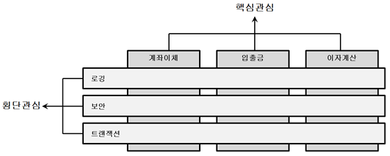

# Spring

참고

- [스프링5...](http://www.yes24.com/Product/Goods/62268795)


## 1. 개론

### 1.1 **스프링 컨테이너**


- Core ? **IoC** 기능 지원(Spring Container 클래스 :  BeanFactory)

- Context ? Core에서 지원하는 기능외에 추가적인 기능을 지원

  ApplicationContext ? Spring Context 클래스, BeanFactory를 상속받아서 국제화 메세지를 처리하는..

- AOP? : 관점지향 프로그래밍을 지원

- DAO? : JDBC보다 쉽고 간결하게 개발할 수 있도록

- ORM? : Hibernate, MyBatis와의 결합 통합을 지원

- WEB? : MVC 패턴이 적용된 Web App 개발지원 , struts, Webwork와 같은 프레임워크와 통합

- WEB MVC? : 다양한 web ui 기술등의 api 지원


### 1.2 스프링 특징

- **제어역행(IoC inversion of Control)**

  1) **Spring**에서는 객체의 생성과 소멸을 개발자가 아닌, *스프링 컨테이너*에서 관리함

  java? Standalone 제어권을 개발자가 가지고 있음. 즉 시작부터 끝까지 개발자가 정함.

  web? 요청이 들어오면 제어권이 web container에 있음.

  2) **의존성 주입**

  의존하고 있는 객체를 생성하면, *콘테이너*(외부)에서 찾아서 **수동적으로 의존성을 주입**받음.

  (자바에서는 객체사이에서 **new** 키워드를 통해 의존관계를 직접작성해야하는 반면에)

  좀 더 편하게 객체를 생성할 수 있다(스프링 핵심, 기술 비침투적, )

  

- **관점지향(AOP - Aspect Oriented Programming)**

  

  **핵심 비즈니스 기능과 공통 기능으로 구분하고, 공통 기능을 개발자 코드 밖에서 필요한 시점에 적용하는 방법**

- **결합도, 유지보수**

  코드끼리 얼마나 강력하게 연결되어있는가?

  결합도가 낮으면, 객체간의 상호의존성이 줄어들면서 객체의 재사용이나 유지보수가 용해짐.

  결합도를 낮추는 한 방법?

  1. `interface`

  2. `Factory 패턴`

     spring ioc는 팩토리패턴이 적용된 친구임


### 1.3  의존객체, Bean


- 의존객체를 생성, 주입 방식

1. 생성자를 통해 주입
2. `setXXXX메서드`를 이용해서 주입

- Bean 설정 방식

1. xml 설정 방식
   
   ```xml
   <bean id="빈이름"
         name="빈이름"
         class="">
         <constructor-arg  ref="빈이름" />
         <property   type="" index="" value="" ref="빈이름" />
   ```
   
2. 자바 클래스와 Annotation 
    @Configuration
    @ 빈을 리턴하는 메서드 선언부에 @Bean 선언, 빈의 이름은 메서드이름

  소스코드에서 빈요청할때  -  `컨테이너객체.getBean("빈이름", 빈타입.class)`

  Spring 컨테이너의 default 빈 Scope는 `singleton`

- [singleton에 대해](https://jeong-pro.tistory.com/86)
- [singleton vs prototype](https://stackoverflow.com/questions/16058365/what-is-difference-between-singleton-and-prototype-bean)


- **Spring xml 설정**

- https://mvnrepository.com/artifact/org.springframework
- `core,context` 모듈의 5.0.2version을 사용 복사하여서 `pom.xml`에 붙여넣는다.

```xml
<project xmlns="http://maven.apache.org/POM/4.0.0" xmlns:xsi="http://www.w3.org/2001/XMLSchema-instance"
  xsi:schemaLocation="http://maven.apache.org/POM/4.0.0 http://maven.apache.org/xsd/maven-4.0.0.xsd">
  <modelVersion>4.0.0</modelVersion>

  <groupId>spring_ioc</groupId>
  <artifactId>spring_ioc</artifactId>
  <version>0.0.1-SNAPSHOT</version>
  <packaging>jar</packaging>

  <name>spring_ioc</name>
  <url>http://maven.apache.org</url>

  <properties>
    <project.build.sourceEncoding>UTF-8</project.build.sourceEncoding>
  </properties>

  <dependencies>
    <dependency>
      <groupId>junit</groupId>
      <artifactId>junit</artifactId>
      <version>3.8.1</version>
      <scope>test</scope>
    </dependency>    

    <!-- https://mvnrepository.com/artifact/org.springframework/spring-core -->
	<dependency>
	    <groupId>org.springframework</groupId>
	    <artifactId>spring-core</artifactId>
	    <version>5.0.2.RELEASE</version>
	</dependency>
    
    <!-- https://mvnrepository.com/artifact/org.springframework/spring-context -->
	<dependency>
	    <groupId>org.springframework</groupId>
	    <artifactId>spring-context</artifactId>
	    <version>5.0.2.RELEASE</version>
	</dependency>    
    

  </dependencies>
</project>
```

- 해당 파일이 설치된 위치는

  `C:\users\사용자명\.m2\repository\org\springframework`


## AOP

- Aspect Oriented Programming


### Proxy

- 왜 나왔을까?

  기존 코드를 수정하지 않고, 코드 중복을 피할 수 있는 방법이 없을까..?


### 


## 0. Maven

### 0.1 Maven Directory


- 자바는 `bulid` 파일 아래 class가 생성되나 Maven은 `target`파일 아래 생성
- `xml` 을 통해서 전반적인 프로젝트를 조절한다. 가장 중요


### 0.2 Life-Cycle

- [참고](https://www.bogotobogo.com/Java/tutorials/Maven/Apache-Maven-Lifecycle.php)


[참고](https://simuing.tistory.com/168)


### Ch9_Spring MVC

- [load-on-startup이란]([https://choong0121.tistory.com/entry/loadonstartup-%EC%9D%B4%EB%9E%80](https://choong0121.tistory.com/entry/loadonstartup-이란))


- web.xml 기본설정


`@ModelAttribute("이름"), 생성될 객체`


1. 생성이 필요한 객체를 생성함.

   단 지정되는 객체는 bean 클래스여야 생성할 수 있음

   그리고 `getter` `setter` 가 만들어져 있어야함

2. 그리고 넘어온 값을 자동으로 바인딩함.

   해당 객체의 `setter` 를 통해서 멤버 변수에 자동으로 binding 됨

3. 이 변수를 자동으로 `Model` 객체 추가해줄 수도, 아니면 다른 방식으로 사용할 수도 있음.


```java
@RequestMapping(value="/add.do", method = RequestMethod.POST)
	public ModelAndView addUser(@ModelAttribute("user") UserVO vo) {
		ModelAndView mav = new ModelAndView();
		if (service.addUser(vo) > 0) {
			mav.setViewName("redirect:/list.do");			
		} else {
			mav.setViewName("redirect:/login.do");
		}
		return mav;
	}
```

- `user_form` 에서 넘어오는 `name` 값이, vo객체의 멤버변수와 같아야 binding이 될 것임
- `@ModelAttribute("user")` 라 작성하는 이유?  `UserVO vo` 객체의 이름을 지정하는 것


- 참고

https://developer-joe.tistory.com/197?category=743305

http://egloos.zum.com/springmvc/v/535572


### ch12 MVC 유효성 검증

