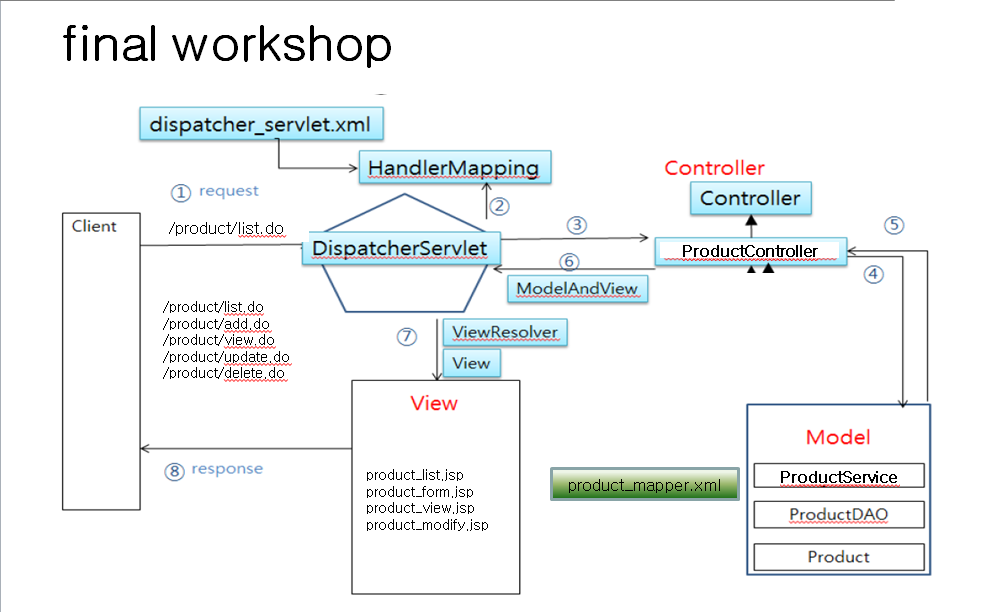
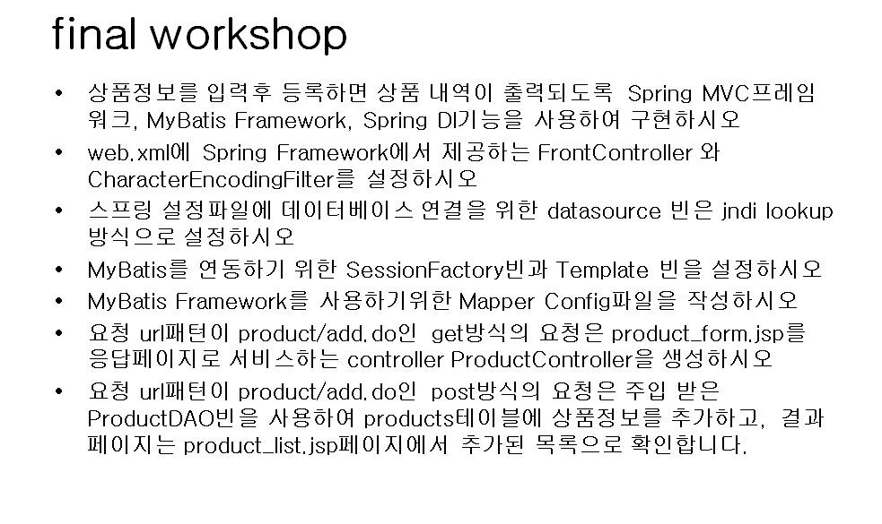
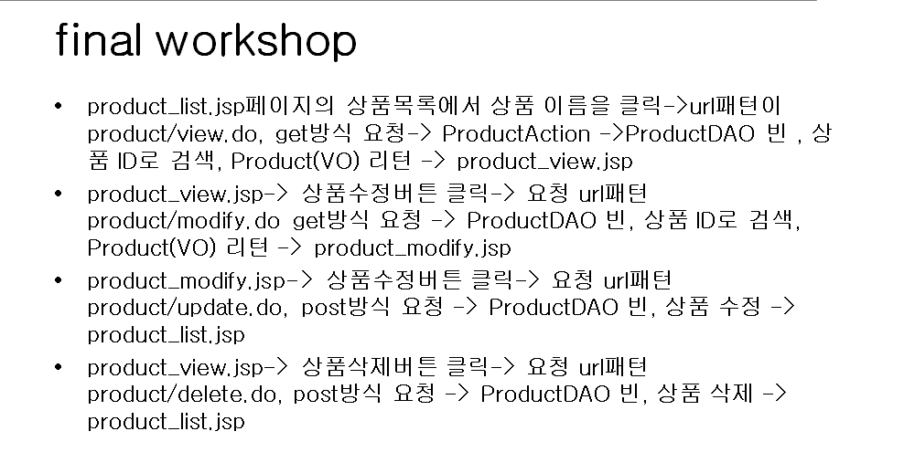

# Spring workshop

## Goal

- 기본적인 `Spring` 구조를 이해하고 있다.
- 기본적인 **JSP, Javascript,java,mybatis** 에 대해 알고 있다.
- `pom.xml, web.xml, ????-servlet.xml` 을 알고 이해할 수 있다.
- `GET, POST Mapping`을 이해한다.
- Maven 폴더 구조를 알고 있다.

## 개요

## 조건

