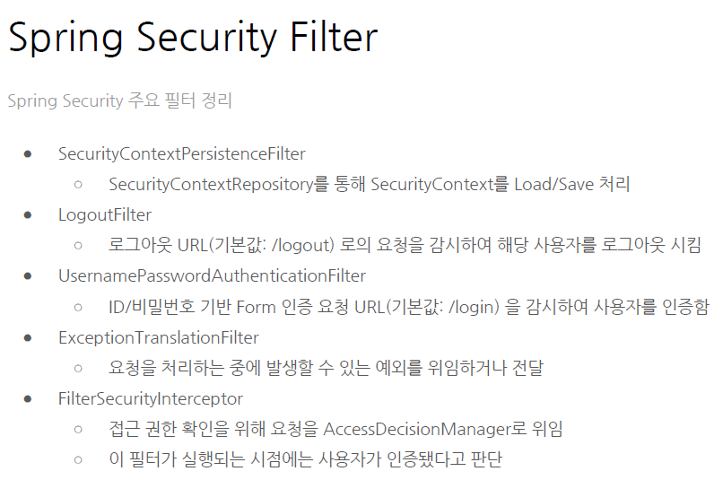

## 참고

- https://programmers.co.kr/learn/courses/10079
- https://github.com/ihoneymon/boot-spring-boot
- https://www.aladin.co.kr/shop/wproduct.aspx?ItemId=154639149


## 목표

- FaceBook 클론 서비스(백엔드)
  - UI는 제공됨


## 1주차

**스프링 주요 프로젝트**

- SPRING BOOT, SPRING FRAMEWORK, SPRING SECURITY.. 이 세가지를 사용


**스프링 프레임워크 주요 기능**

- 의존성 주입(핵심)
- 스프링의 선언적 트랜잭션 관리
- 스프링 MVC 웹 어플리케이션 REST기반
- *토비의 스프링 3.1* volume 1은 봐두자
  - `UserDao` 가 너무 많은 기능을 담당하고 있다.
    - 관심사 분리를 해줘야함!  -> 인터페이스를 도입
    - 하나의 클래스는 하나만을 담당하게 하고, 다른 일이 있으면 다른 클래스를 만들고 그것을 가져오는 방법을 써야함


**제어의 역전(Inversion of control)**

- 스프링의 IOC는 아님. 꼭 스프링이 아니더라도 이런 형식으로 코드를 만들 수 있음
- 어떤 내용인지 다시 정리하자


**어플리케이션 컨텍스트**

- 스프링은 BeanFactory와 ApplicationContext로 IoC컨테이너를 제공.
- 컨텍스트에서 주입에 대한 관리를 함


**스프링 빈**

- 스프링에 의해 ioc를 통해 자동으로 생성됨


- XML으로 Spring bean 설정


- @Configuration으로 bean 설정


- 위 방식을 통해 bean을 등록하는 것이, 직관적으로 간편하다.
- 클래스 기반
- @Configuration 어노테이션
  - 스프링부트가 여기사 bean을 등록하는 클래스 라는 것을 알게 해주는 어노테이션


- 기본 전개 방식


### 스프링 부트 시작

- 스프링 프로젝트를 쉽게 시작
- Auto Configuration
- 쉬운 외부 환경설정.
- embeded tomcat, 실행환경이 편해
  - AWS, DOCKER등으로 말아서 배포함
- springboot-web-starter은 Pom프로젝트로 주요 디펜던시의 묶음에 해당함
- spring boot에서 생각하는 최상의 디펜더시가 들어가는것


**Auto Configuration**

@EnableAutoConfiguration 


### 질문사항

- maven, gradle의 차이?


### 미션

- user entity는 어떤 변수가 final한지 생각할 것, 불변의 중요성
- Builder객체를 통해 객체가 만들어질 수 있도록 
- 생성자를 단순히 getter setter를 통해서 만들지 말고,
- equals, hashCode
- optional null이 아니라, none을 담고 있음


## 1주차 -리뷰


### autowired, constructor injection

```java
private final JdbcTemplate jdbcTemplate;

//생성자주입
public UserRepository(JdbcTemplate jdbcTemplate){
  this.jdbcTemplate = jdbcTemplate;
}
```

- 생성자 주입, 보기가 좋음. 확실히 어디서 주입되는 지 알 수 있을 거니까.


### DTO 

- entitiy , `service` 단, 불변의 객체
- DTO는 데이터를 전달하기 위한 객체, `Controller` 에서만 사용해야됨.
- `UserRepository` User에게 집중.
- `JoinRequestDTO` 클래스 이름에서 어떤 역할을 하는 지 확실히 알 수 있음.
  - message처리를 한글로 작성하기 보다는, 영어로 확실하게 나타낼 수 있도록.


### lamda, interface, repository

- 서비스와 Repository를 분리해야한다.
- 인터페이스를 만들고, 구현체를 작성하는 방식으로 해야함.
- 클래스명, 코드명 생각하자. 누가 봐도 제대로 이해할수 있을까?
- Function-interface?
- Keyholder?


### response

- 제네릭 타입으로 담으면 어떤 점에서 유리한것인가? 어떤 부분에서 잘한건가요?


## 2주차 인증,인가

- 인증 : 사용자 신원을 식별, 아이디 패스워드 확인
- 인가 : 특정 리소스, 관리자 페이지에 접근하는데, 가능한지 아닌지 알려주는것.


#### REST API

- 레퍼런스 많음.
- 일반적인 접근방법.


### 3-Tier 아키텍쳐

- 사용자 접점 - 비즈니스 로직 실행(tomcat.was..) - 데이터레이어(실제 데이터를 조회)

- 다른 계층에 영향을 주지 않고, 개선할 수 있다는 장점.


### 세션

- 세션 문제 발생? 인증된 모든 사용자 유실함.
- 그러면? 해당 서버에서 인증된 사용자들은 다시 로그인부터해야함
- 서비스에 큰 문제 발생!


- 어떻게 문제가 발생함?
  - 세션이 WAS사이에서 공유되지 않기 때문에.
  - 세션은 WAS에 올라가는데, 사용자가 많아지면 메모리 부족 문제. 서버가 죽을 수 있음.
  - 서버가 죽으면 정보가 다 유실될 것이고.
  - 세션기반 인증을하려면,...
    - 세션 클러스터를 만들자.
    - 외부에 세션만을 저장하는 Repository를 사용
      - 이런식으로 만들면 별도의 DB가 필요하고, 이 클러스터가 문제가 생겼을 경우 대규모 장애 발생가능성있음.
      - 그래서 세션클러스터는 3곳 이상을 만들고 있고 --> **관리포인트 증가**

- 이를 극복하기 위해서는?
  - statless 아키텍쳐 + JWT(json web token)
  - HTTP자체는 근본적으로 무상태(stateless) 프로토콜임.
  - JWT : 사용자 정보를 Json형식으로 표시.
    - 위변조 시그니쳐 포함
    - HTTP 포함되어 서버로 전송됨.
    - **사용자에 민감한 정보는 절대로 JWT에 담기면 안됨.**
      - 이메일도 민감함. 
      - 차라리 PK값정도.
- 사용자가 많아지만, 세션클러스트의 난이도가 올라감. 무슨말?
  - 사용자가 많아지면, 세션 클러스트의 메모리 부담이 커짐. 그러다보면 규모가 커지고.
  - 사용자 몇천명 수준이면, 세션클러스터 괜찮음.

### Spring-Security

- ThreadLocal이 무엇인지 알아보기.

- [참고](http://wonwoo.ml/index.php/post/907)

```java
{
    int a = 10;
    ...
   // 블록 내에서 a 변수 사용 가능
}
// 변수 a는 위 코드 블록이 끝나면 더 이상 유효하지 않다. (즉, 수명을 다한다.)
```

- 클로저랑 비슷한가?
- 특정 쓰레드가 실행되는 환경에서 설정된 `local  변수`값을 모두 사용할 수 있음을 의미하는 것.

#### 기본개념

- 접근주체 principal, 보호된 리소스에 접근하는 사용자.
  - Authentication으로 추상화
- 인증 Authentication , 현재 사용자가 누구인지 식별한다.
  - AuthenticationManager, AuthenticationProvider
- 인가 Authorize 현재 사용자가 보호된 리소스에 접근할 권한이 있는지 확인
  - AccessDecisionManage, AccessDecisionVoter
- GrantedAuthority
  - 인증된 사용자의 인증정보(역할, 기본 고객인지 운영자인지 등등) 을 토현
- SecurityContext
  - 접근주체, 인증정보를 담고 있는 context
  - ThredLocal에 보관, SecurityContextHolder를 통해 접근할 수 있음.

#### spring-security 요청처리 절차


#### 주요 필터



## 2주차 리뷰

- 같은 타입의 파라미터를 연속해서 쓰지 말자 
  - 왜? 컴파일시, 오류가 날 수 있음. 순서를 바꿔씀으로써. 가능하면...
- 생성자(모델)에서 인자(파라미터) 유효성 검증을 하는 것이 좋다.

- 파라미터 한두개정도면, 클라이언트에서 넘어올때, `MAP` 으로 처리하는 것도 나쁘지는 않겠당..
- 널이 아니여야하는 부분은, 항상 명시적으로 선언해주자


### Annotation


## 3주차

- REST API 문서 구성방법
- 비즈니스 로직 구현, 테크닉 소개


### Swagger

- 코드를 빌드할 때 마다, 문서가 자동으로 생성됨.
- 호출방법, 결과를 자동으로 만들어줌.
- 실제 `api` 도 호출할 수 있음. 개발자가 빠르게 확인할 수 있음.
- 어노테이션을 통해서, 관리할 수 있음


- 단 변경이력관리는 안됨.
- 코드가 좀 더러워질수도..(어노테이션이 도배됨.)


### 비즈니스로직 개발방법

- 객체모델링 방법!

  1. 시작은 객체 모델을 수정 불가능하도록 Immutable 상태로 (final 키워드를 붙인다, 붙일까 말까 하면 붙인다.)

  2. 객체 모델에 필요한 행동이 뭔가? 점진적으로 immutable 하게

     처음에는 전부다 final하게 그러면서 점점 진행하면서 수정할 수 있으면 final키워드를 지워라

  3. equals, hashcode, toString 구현을 꼼꼼하게

     DTO같은 객체는 equals, hashcode도 꼼꼼하게

  4. 불필요한 생성자는 노출시키지 않게

  5. 생성 인자 갯수가 많다면 빌더패턴을 고려

  6. 모든 사용자 입력은 **유효성 검사해라**

  7. 가능한 서비스 클래스의 모든 메소드는 단위테스트케이스를 작성해주는 것이 좋다.


- 입력값 검증은?
  - 서비스, 컨트롤러, 레파지토리에 있을 수 있음.
  - 엄격하게는 위의 3가지에 있어야함.
  - 그러다보면 코드가 중복됨.
  - 실질적으로 모든 레이어에서는 하지 않고, 서비스나 컨트롤러.
  - 추천은 서비스 레이어에 있는게 좋음.
    - 그 이유는? 컨트롤러에는 다양한 인터페이스(GraphQL, RPC)가 추가될 수 있으니까.. 
  - 가장 좋은 것은, 애초에 모델 생성자에 입력값 검증을 하는 것이 좋다.


## 3주차 리뷰

- 로그를 하는 목적? 디버깅을 원활하게 하기 위해서
- NOT_FOUND 시스템 에러가 아닌, 클라이언트 주소를 잘못써서 그런것이니, 디버거 레벨 혹은 아예 안남겨도 무방함.
- 에러는 프로그램이 멈출것 같은것.
- 즉 문제가 발생할 때, 어떤 측면에서 받을지 생각을 해봐야함.
- SQL 보안관점 생각해봐야할듯.

- N+1 selection problem 성능에 매우 심각한 문제를 미칠 것.


## 4주차

- 예외를 캐치하면 최소하의 정보를 남기자
  - 단 경우에 따라서, 예외 로깅을 제외할 수 있음을 생각하자.
- Stack.trace를 포함해서 로그를 남겨주자.


### 로그파일관리

- 생각없이 로그를 파일에 남기면, 어느 순간 DISK FULL장애를 마주할수 있음.
- 그래서 날짜단위로 혹은 파일 사이즈 단위로 로그파일을 저장할 수 있도록 해야함.


### 고민

- 자신이 하고 있는 일에 대해서 깔끔하게 정리하고, 아키텍쳐 상의 장점 개선사항을 생각해보고 
- 코드 일관적인 예측가능한 코드 컨벤션이 있어야한다.
- 간결하고 이해하기 쉽게 작성되어있는가
- 테스트가 적절하게 작성되어 있는가.
- 개발수기 같은거 블로그에 정리하자.
  - 러닝포인트를 잘 정리하고.

