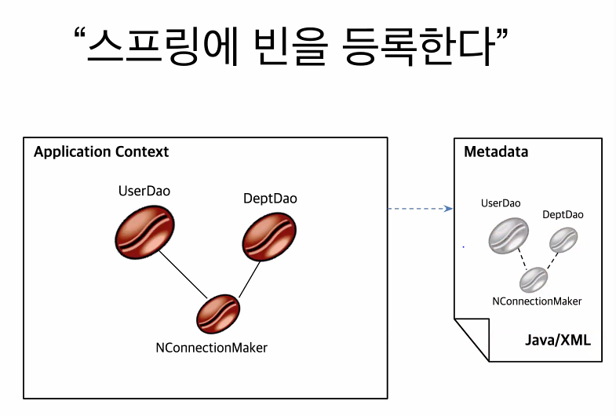
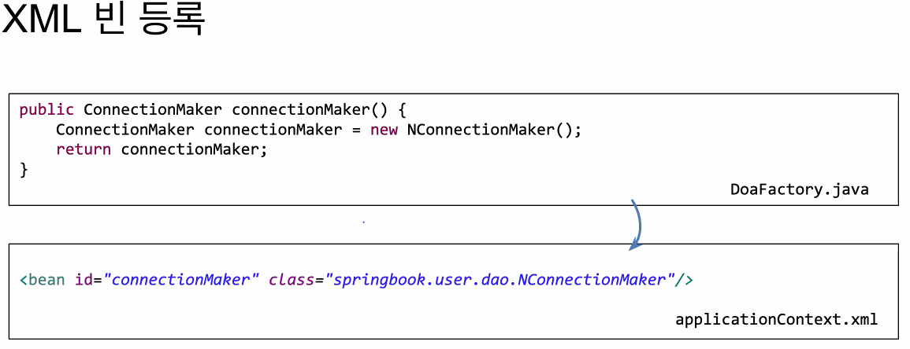
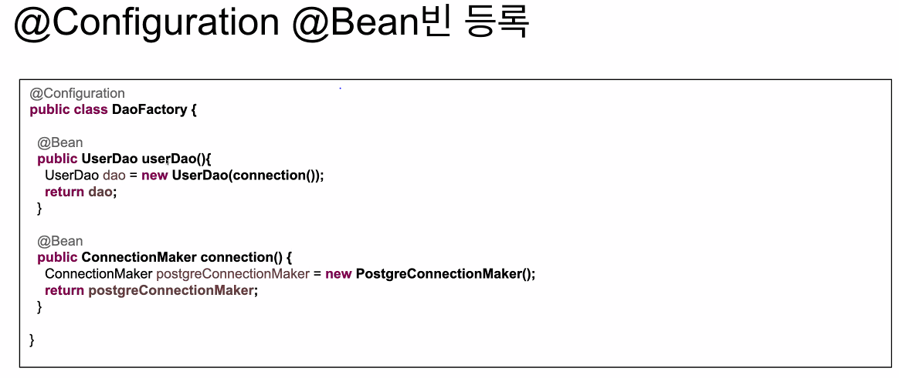
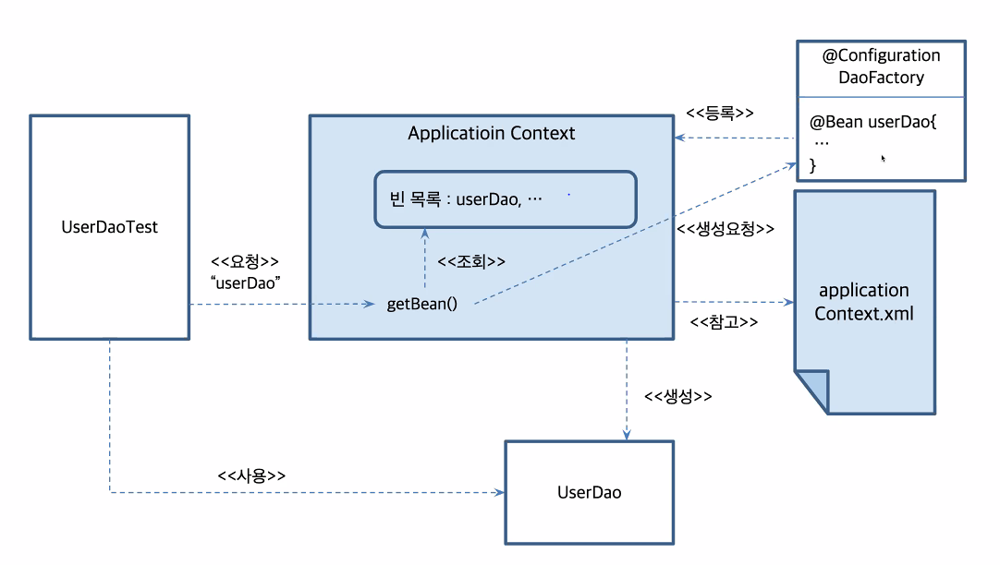

## 참고

- https://programmers.co.kr/learn/courses/10079
- https://github.com/ihoneymon/boot-spring-boot
- https://www.aladin.co.kr/shop/wproduct.aspx?ItemId=154639149

## 목표

- FaceBook 클론 서비스(백엔드)
  - UI는 제공됨

## 1주차

**스프링 주요 프로젝트**

- SPRING BOOT, SPRING FRAMEWORK, SPRING SECURITY.. 이 세가지를 사용

**스프링 프레임워크 주요 기능**

- 의존성 주입(핵심)
- 스프링의 선언적 트랜잭션 관리
- 스프링 MVC 웹 어플리케이션 REST기반
- *토비의 스프링 3.1* volume 1은 봐두자
  - `UserDao` 가 너무 많은 기능을 담당하고 있다.
    - 관심사 분리를 해줘야함!  -> 인터페이스를 도입
    - 하나의 클래스는 하나만을 담당하게 하고, 다른 일이 있으면 다른 클래스를 만들고 그것을 가져오는 방법을 써야함

**제어의 역전(Inversion of control)**

- 스프링의 IOC는 아님. 꼭 스프링이 아니더라도 이런 형식으로 코드를 만들 수 있음
- 어떤 내용인지 다시 정리하자

**어플리케이션 컨텍스트**

- 스프링은 BeanFactory와 ApplicationContext로 IoC컨테이너를 제공.
- 컨텍스트에서 주입에 대한 관리를 함

**스프링 빈**

- 스프링에 의해 ioc를 통해 자동으로 생성됨

- XML으로 Spring bean 설정

- @Configuration으로 bean 설정

- 위 방식을 통해 bean을 등록하는 것이, 직관적으로 간편하다.
- 클래스 기반
- @Configuration 어노테이션
  - 스프링부트가 여기사 bean을 등록하는 클래스 라는 것을 알게 해주는 어노테이션

- 기본 전개 방식

### 스프링 부트 시작

- 스프링 프로젝트를 쉽게 시작
- Auto Configuration
- 쉬운 외부 환경설정.
- embeded tomcat, 실행환경이 편해
  - AWS, DOCKER등으로 말아서 배포함
- springboot-web-starter은 Pom프로젝트로 주요 디펜던시의 묶음에 해당함
- spring boot에서 생각하는 최상의 디펜더시가 들어가는것

**Auto Configuration**

@EnableAutoConfiguration 

### 질문사항

- maven, gradle의 차이?

### 미션

- user entity는 어떤 변수가 final한지 생각할 것, 불변의 중요성
- Builder객체를 통해 객체가 만들어질 수 있도록 
- 생성자를 단순히 getter setter를 통해서 만들지 말고,
- equals, hashCode
- optional null이 아니라, none을 담고 있음