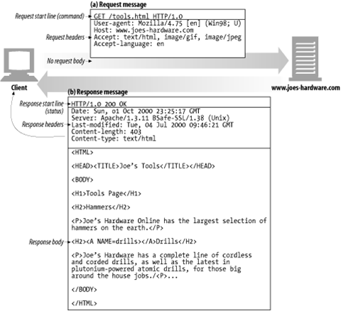
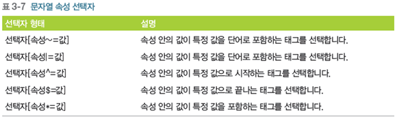
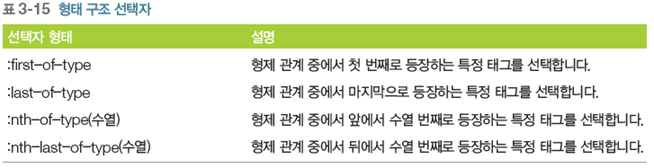
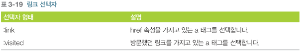
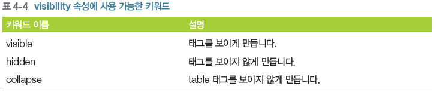

# Web

### 1. WebApp_Arch

#### 1.1 HTTP_Message 예시

- 기본적인 웹 요청, 응답 구조.



- 일반적으로는 헤더 정보를 볼 수 없음. 브라우저의 플러그인을 사용하던가

  혹은, `Java` 등의 프로그램을 통해 긁어와야함.

#### 1.2  HTTP ERROR


- **405** :  `POST` 방식으로 해야하는데 `GET` 방식으로 요청한 경우 발생.
- **404** : favicon없어서 나오는 오류


#### 1.3 GET, POST

- GET? 단순페이지요청, URL에 다 나오니까, 보안이 필요하는 방식에 쓰면 안됨.
- POST? 회원가입,로그인방식에 사용

- 도메인 `/` -? ROOTCONTEXT, `/` .... 


### 2. Front, Back - end

1. 이전 웹 방식의 한계 ? 전체 페이지 갱신방식이어서 응답이 올때 까지 기다리고, 전체 페이지가 다 바뀜. -> `Ajax` 사용, 비동기 요청, 부분 페이지 갱신방법으로 바뀜.


### 3. HTML

```html
<!DOCTYPE html>
<html lang="en" dir="ltr">
  <head>
    <meta charset="utf-8">
    <title></title>
  </head>
  <body>
    
  </body>
</html>
```

-  기본적으로 editor에서 `html`치면됨
- href : hypertext reference

- HTML은 쓸 수 있는 MARKUP이 정해져있음.
  - 반면 XML은 MARKUP을 만들어서 쓸 수 있는 차이가 있음.
- 문서 작성이 웹표준에 잘 맞게 작성되었는가? 
  - validator을통해 판단함.. search ` w3 validator well formed`

#### 3.1 기본 태그

- 태그? 내용에 대한 구조적 명령어라고 보면 되고.
  - **파서**를 통해 나오는 생성결과물이 **DOM TREE** 형태

- `tag` + `내용` = ? `elemnet`

- `h1` 태그들은 block태그, 즉 `br` 을 쓰지 않아도 줄바꿈을 해줌
- `inline` 태그는 `br` 이 안들어간 태그를 의미함.


- [MDN 참고](<https://developer.mozilla.org/ko/docs/Web/HTML/Inline_elements>)

- `ruby`

  ```html
  <ruby>
  	<span>大韓民國</span>
  	<rt>대한민국</rt>
  </ruby>
  ```

  - 大韓民國 상단부에, ''대한민국' 조그맣게 작성됨.

- `ol, ul`

  - ordered list, unordered list
  - 구성은 `li` tag로

- 테이블 태그

  - `table, tr,td`
  
  ```html
  <table border="1">    
        <tr>
          <td>a</td>
          <td>a</td>
          <td>a</td>
        </tr>
  
        <tr>
          <td>a</td>
          <td>a</td>
          <td>a</td>
          <td>a</td>
          <td>a</td>
          <td>a</td>
          <td>a</td>
       </tr>
        
       <tr>
        <td>a</td>
        <td>a</td>
        <td>a</td>
        <td>a</td>
     </tr>
  </table>
  <!--어떤것이 만들어질까?-->
  ```
  
  - `colspan` td태그들이 *가로로* 합쳐지게 하는것이고..
  - `rowspan` td태그들이 *세로로* 합쳐지게 하는것이고..


- `a _blank` , 새로운 페이지로 열림

```html
<a href="https://wwww.facebook.com" target="_blank">페이스북</a>
```


#### 3.2 폼 태그

- 각종 정보 입력시에 사용하고,

```html
    <form method="POST" action="login.jsp"><br>
        아이디 : <input type="text" name="userid" id="userid"><br>
        패스워드 : <input type="password" name="userpwd" id="userpwd"><br>


        url : <input type="url" name="url" id=""><br>
        email :  <input type="email" name="email" id=""><br>
        연락처 : <input type="tel" name="tel" id=""><br>


        <input type="submit" value="로그인">
        <input type="reset" value="취소"><br>
    </form>
```

- `url, email` 의 경우 브라우저에서 타당성 체크를 할 수 있게 그 기능이 있음.

```html
연락처 : <input type="tel" name="tel" id="" pattern="\d{3}-\d{4}-\d{4}" placeholder="000-0000-0000"><br>
```

- 정규표현식을 통해, 지정되는 숫자를 한정하고, `placeholder`를 통해 그 초안을 알려줄 수 있음.

```html
 아이디 : <input type="text" name="userid" id="userid" required><br>
 패스워드 : <input type="password" name="userpwd" id="userpwd" required><br>
```

- `required` 속성을 통해, 꼭 작성해야할 것들을 선정할 수 있음.

```html
number : <input type="number" name="" id="" max="100" min="0" step="5"><br>
```

- `max,min,sept` 을 통해서 작성될 숫자를 우리가 제어할 수 있게함.


#### 3.3 공간 분할 태그

- `div`


#### 3.4 ETC

- `caption` 표와 관련하여 사용하는..

- `cite`인용할 때 사용

- `data`태그를 이용한 value값 설정.

- `dialog` 특정 위치에 커서를 옮겼을 때 , 이미지 텍스트등이 나오는 이벤트를 사용하고자 할때 `javascript` 와 같이 씀.

- `embed` flash등 외부 영역이 들어간 영역은 `embed`로 묶어주면됨

- `iframe` 다른 페이지를 사용할때

  - 단 해당 사이트에서 거부할 수 있음.

- `main` main~article로 구성되어있음.

- `map` 영역을 지정하여, 클릭시 다른 이벤트가 일어나도록

  ```html
  <!DOCTYPE html>
  <html>
  <body>
  
  
  
  <map name="navimap">
    <area shape="rect" coords="0,0,40,35" alt="mail" 
    href="https://mail.naver.com">
    <area shape="rect" coords="40,0,70,35" alt="cafe" 
    href="https://cafe.naver.com">
    <area shape="rect" coords="70,0,115,35" alt="blog" 
    href="https://section.blog.naver.com">
  </map>
  
  </body>
  </html>
  ```

  

- `mark` 문서에 노란색 형광색을 칠할 수 있도록...

- `meta`
  - `viewport` 왜? 각 유저마다 다른 디바이스를 가지고 있기 때문에, 그것에 맞게끔 설정해주는 것(반응형 콘텐츠)
    - [참고](<https://offbyone.tistory.com/110>)
  
- `svg` markup을 이용해서 그림을 지원하는데, 속성값만 잘해주면 브라우저에서 알아서 해줌. 나중에 **d3** 사용할 때 필요한 부분.


### 4. 연습문제

#### 4.1 강아지 소개

```html
<!DOCTYPE html>
<html lang="en">
<head>
    <meta charset="UTF-8">
    <meta name="viewport" content="width=device-width, initial-scale=1.0">
    <meta http-equiv="X-UA-Compatible" content="ie=edge">
    <link rel="stylesheet" href="style.css">
    <title>dog</title>
</head>
<body>
    <header>
        <h1>입양하기 </h1>
        <nav>
            <ul>
                <li>애완견 종류</li>
                <li>입양하기</li>
                <li>건강돌보기</li>
                <li>더불어살기</li>
            </ul>
        </nav>
    </header>

    <section>
            

            <p>강아지 집 강아지가 편히 쉴 수 있는 포근한 집이 필요합니다. 강아지의 집은 강아지가 다 큰 후에도 계속 쓸 수 있는 집으로 구입하세요.집을 구입하실 때는 박음질이 잘 되어 있는지, 세탁이 간편한 제품인지 꼭 확인하시고 고르시는 것이 좋습니다. 강아지 먹이 강아지의 먹이는 꼭 어린 강아지용으로 나와있는 사료를 선택하세요. 강아지들은 사람에 비해 성장속도가 8배정도 빠르답니다. 따라서 강아지에게는 성장속도에 맞는 사료를 급여하셔야 합니다. 사람이 먹는 음식을 먹게 되면 양념과 향신료에 입맛이 익숙해지고, 비만이 될 가능성이 매우 높아집니다. 강아지용 사료는 생후 12개월까지 급여하셔야 합니다. 밥그릇, 물병 밥그릇은 쉽게 넘어지지 않도록 바닥이 넓은 것이 좋습니다.물병은 대롱이 달린 것으로 선택하세요. 밥그릇에 물을 주게 되면 입 주변에 털이 모두 젖기 때문에 비위생적이므로 대롱을 통해서 물을 먹을 수 있는 물병을 마련하시는 것이 좋습니다. 이름표, 목줄 강아지를 잃어버릴 염려가 있으니 산책할 무렵이 되면 이름표를 꼭 목에 걸어주도록 하세요. 그리고 방울이 달린 목걸이를 하고자 하실 때는 신중하셔야 합니다. 움직일 때마다 방울이 딸랑 거리면 신경이 예민한 강아지들에게는 좋지 않은 영향을 끼칠 수 있기 때문입니다.
            </p>


    </section>

    <footer style="color: aliceblue">
        copyright 작성


    </footer>

    
</body>
</html>
```

#### 4.2 가입정보 폼 만들기

- HTML

```html
<!DOCTYPE html>
<html lang="en">
<head>
    <meta charset="UTF-8">
    <meta name="viewport" content="width=device-width, initial-scale=1.0">
    <meta http-equiv="X-UA-Compatible" content="ie=edge">
    <link rel="stylesheet" href="register.css">
    <title>Document</title>
</head>
<body>
    <div id="container">    
        <h1>가입정보</h1>
        <form action="login.jsp"id="reg_form" method="GET">
            <ul>
                <li>
                    <label for="uname">이름</label>
                    <input type="text" id="uname" placeholder="홍길동" autofocus>                
                </li>
                <li>
                    <label for="uemail">email</label>
                    <input type="email" id="uemail" placeholder="abcde@gmail.com">  
                </li>
                <li>
                    <label for="upwd">password</label>
                    <input type="password" id="upwd" required>  
                </li>         
 
                <li>
                    <label for="sex">성별</label>
                    <select id="sex">
                            <option value="man">남자</option>
                            <option value="woman">여자</option>
                    </select>
         
                </li>      

            </ul>

            <div class="centered"> 
                    <input type="submit" value="가입하기">
        
            </div>
        
        </form>
    </div>        
</body>
</html>
```

- CSS

```CSS
@charset "utf-8";

body{
    background: #666;
}
/* #? id지정자 */
#container{ 
    width: 450px;
    margin: 15px auto;
    padding: 10px;
    border: 1px solid #666;
    border-radius: 10px;
    background: white
}

form ul{
    list-style-type: none;
}
form ul li{
    line-height: 25px;
    margin-bottom: 10px;
}
label{
    width: 80px;
    float: left;
    text-align: right;
    padding-right: 5px;
    font-weight: bold;
}

/* .? class지정자 */
.centered{
    text-align: center;
}
```

### 5. CSS

- [MVC 생활코딩 참고](<https://opentutorials.org/course/697/3828>)
- `CSS` 가능한 `html` 문서 안에 같이 쓰지 않도록 한다.
  - HTML 태그 안에 STYLE을 작성하는 것은 LINE형식이라 하는데 가장 권장하지 않음. 

```css
Selector{
    property: value value value;
}
```

#### 5.1 글자 색상,크기, 글꼴

```css
h2{
    color: blue;
    text-shadow: 2px 2px 10px gray;
}

p{
    color: #444444;
    font-size: 18px;
    font-family: '바탕';
    line-height: 150%;
}
span{
    font-weight: bold;
    color: #0e9bdc;
    text-decoration: underline;
}

```

#### 5.2 Link

- ../css/style.css ? 해당 html파일이 있는 바로 윗 폴더에서 css폴더를 찾고, 그 안에 style.css를 찾아라
- ./css/style.css ? 상대적인 경로, 


#### 5.3 선택자

1. 태그 선택자

   ```css
   div p span{...} /* div태그 아래 p 태그 아래 span 태그에 적용함 */
   ```

   

2. id 선택자

   ```css
   #header {...} /* id가 header인 태그에만 해당 스타일을 적용함 */ 
   ```

   - 웹 페이지에서 하나만 존재하는 유일한 특정영역, 유일하게 하나만 존재하는. 그 요소에만 스타일을 적용하겠다

3. 클래스 선택자

   ```css
   .content {....} /* content라는 이름의 클래스 이름을 가진 태그에 해당 스타일을 적용함 */
   ```

   - 두 군대 이상 존재하는 영역을 선택할 시에 사용함.


#### 5.4 박스모델


- `Margin,Padding`순서

  - padding? content와 border 사이의 간격

  ```
  4개 다 쓸 경우 시계 방향으로 [위 오른쪽 아래 왼쪽]
  3개 쓸 경우 [위 오른쪽,왼쪽 아래]
  2개 쓸 경우 [위,아래 오른쪽,왼쪽]
  1개 쓸 경우 [위,오른쪽,아래,왼쪽]
  출처: https://fonch.tistory.com/entry/CSS-margin-pdding-순서 [Fonch의 블로그!]
  ```

  

- boder 스타일
  - solid 실선, double 이중실선, dotted 점선, dashed 줄 선
  - border 속성만 줘도, margin이 자연스럽게 주어짐. 명시적으로 나타나진 않지만 15~16px정도

- `*` 스타일

  - **전체 선택자**

  ```css
  *{
      padding: 0;
      margin: 0;    
  }
  ```

  - 전체적으로 우선 `padding`과 `margin`을 0 으로 초기화 한것.

- box-shadow 순서

#### 5.5 배경이미지

```css
body{
    background : url("anthony-cantin-128670-unsplash.jpg") no-repeat center center fixed;
    -webkit-background-size: cover;
    -moz-background-size: cover;
    -o-background-size: cover;
    background-size: cover;
}
```

- 배경이미지를 브라우저에 꽉 채우기 위한 방법? [참고](<https://knulab.com/archives/1185>)

#### 5.6 테이블

```css
table, th, td{
    border:  solid 1px #000000;

}
table{
    border-collapse: collapse;
}
```

- table, th, td 에다 border을 모두 동일하게 설정하고,
- 테이블의 바깥쪽 테두리 (collapse) 가 `collapse` 로 설정하면, 이중실선이 아닌 하나의 실선으로 나옴.


#### 5.7 레이아웃

- 인라인, 블록의 차이점?

  1. 인라인(수평 방향 레이아웃)

  2. 블록(수직 방향 레이아웃)


#### 5.8 float속성

```html
<!DOCTYPE html>
<html>
<head>
<meta charset='utf-8'>
<style>


* {
    /* 기본적으로 들어가는 margin,padding을 초기화시키기위해 */
    margin:0;
    padding:0;
}
ul {
    list-style-type: none;
}
#main_title {
    /* id선택자 */
    font-family:'맑은고딕';
    margin:10px;
    padding-bottom:6px;
    border-bottom:solid 2px #aaaaaa;
}
.list_item {
    /* class 선택자 */
    clear: both;
    height: 130px;
    margin: 10px;
    border-bottom: solid 1px #cccccc;
}
.image {
    float:left;
    width: 100px;
	height: 100px;
}
.intro {
    float:left;
    width: 300px;
    margin-left:20px;
}
.price {
    float:left;
    width: 150px;
}
.red {
    font-weight: bold;
    color: red;
}
.small {
    font-size: 12px;
    margin-top:5px;
}
.writer {
    float:left;
    width: 100px;
}

.img {
	 width: 100px;
     height: 120px;	 
}
</style>
</head>
<body>
<h3 id='main_title'>판매 도서 목록</h3>
<div class='list_item'>
    <div class='image'></div>
    <div class='intro'>[문학동네]여행의 이유</div>
    <ul class='price'>
        <li class='red'>13,500원</li>
        <li class='small'>배송비 2,500원</li>
    </ul>
    <div class='writer'>김영하 저</div>
</div>
<div class='list_item'>
    <div class='image'></div>
    <div class='intro'>[해냄]천년의 질문</div>
    <ul class='price'>
        <li class='red'>14,800원</li>
        <li class='small'>배송비 2,500원</li>
    </ul>
    <div class='writer'>조정래 저</div>
</div>     
</body>
</html>
```

- [clear속성에 대해](<https://aboooks.tistory.com/79>)

  float속성을 취소할때 사용, `clear: both` 는? float 오른쪽 왼쪽 둘다 취소할 떄

#### 5.9 문자열 속성 선택자



```html
<!DOCTYPE html>
<html lang="en">
<head>
    <meta charset="UTF-8">
    <meta name="viewport" content="width=for, initial-scale=1.0">
    <meta http-equiv="X-UA-Compatible" content="ie=edge">
    <title>Document</title>
    <style>
    input[type=text]{background: red;}
    input[type=password]{background: #f2f3;}

    img[src*=ese]{border: 3px solid red;}
    img[src$=png]{border: 3px solid black;}
    img[src^=ju]{border: 3px solid blue;}
    
    
    </style>
</head>
<body>
    <form action="">
        <input type="text"><br>
        <input type="password">
    </form>


    
    
    

</body>
</html>
```

#### 5.10 후손,자손 선택자

#### 5.11 가상 선택자

```html
<!DOCTYPE html>
<html lang="en">
<head>
    <meta charset="UTF-8">
    <meta name="viewport" content="width=device-width, initial-scale=1.0">
    <meta http-equiv="X-UA-Compatible" content="ie=edge">
    <Style>
        h1:active{background-color:black;}
        h1:hover{color: orange;}

    
    </Style>
    <title>Document</title>
</head>
<body>
    <h1>user action selector</h1>
</body>
</html>
```

- active 이용자가 클릭했을 때
- hover 이용자가 해당 태그에 마우스를 움직였을때


#### 5.12 구조 선택자



​	

#### 5.13 링크 선택자



#### 5.14 visibility 속성



```html
<!DOCTYPE html>
<html>
<head>
<meta charset='utf-8'>
    <title>CSS3 Style Property Basic</title>
    <style>
        table{
            visibility: collapse; /*안보이게됨*/
        }
    </style>
</head>
<body>
     <p>Lorem ipsum dolor sit amet, consectetur adipiscing elit.</p>
     <table>
        <tr><td>Test</td><td>Test</td></tr>
        <tr><td>Test</td><td>Test</td></tr>
        <tr><td>Test</td><td>Test</td></tr>
    </table>
    <p>Lorem ipsum dolor sit amet, consectetur adipiscing elit.</p>
</body>
</html>
```

#### 5.15 vopacity 속성

- 투명도를 조정하는 속성.

- 0~1사이의 값을 입력!

  ```css
    #box{
        background-color: black;
        color: white;
        opacity: 1;
  }
        
  ```

#### 5.16 위치속성

- `position? absolute, relative, fixed`

- `z-index` 큰 값을 입력할수록 위로 올라온다.

  