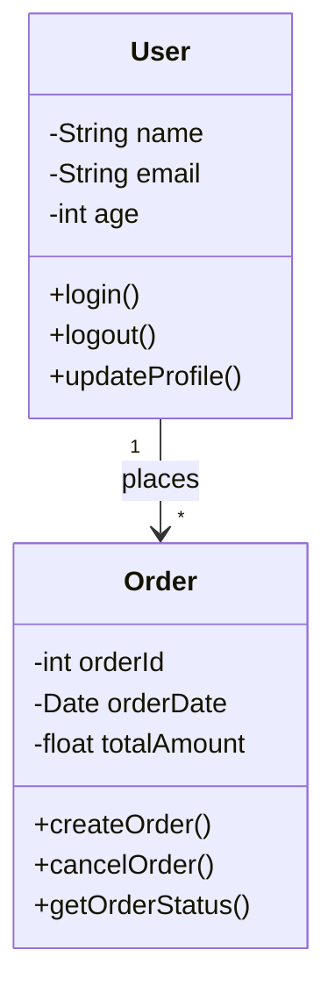
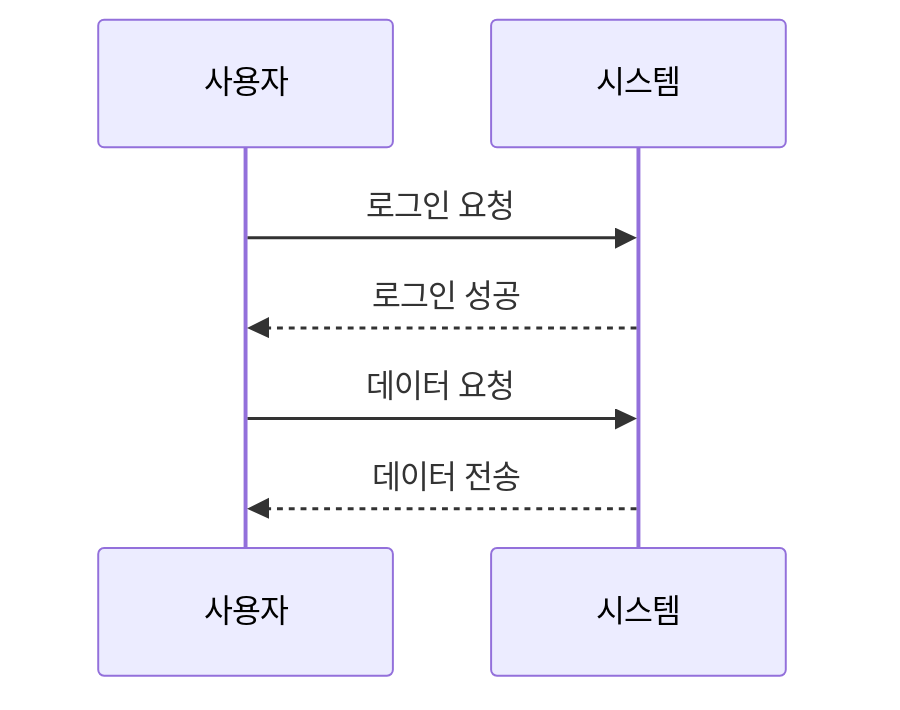

- UML 
- 소프트웨어 시스템을 시각적으로 모델링하고 문서화 하기 위한 표기법
- 설계, 코드, 아키텍쳐, 비즈니스 프로세스 등을 이해하기 위한 목적
- 여러 종류들이 있다.
	- class diagram
	- component diagram
	- sequence diagram
	- ...

> Class Diagram

- 클래스의 구조:
    - 클래스는 3개의 칸
    - 가장 위: 클래스 이름 (예: User, Order)
    - 중간: 속성/필드 (예: name, email, age)
    - 아래: 메서드/함수 (예: login(), logout())
- 접근 제어자:
    - `-` : private (클래스 내부에서만 접근 가능)
    - `+` : public (외부에서 접근 가능)
    - `#` : protected (상속받은 클래스에서만 접근 가능)
- 관계선:
    - `-->` : 연관관계
    - `1` : 한 명의 사용자가
    - `*` : 여러 개의 주문을 할 수 있음을 의미

> Sequence diagram

## 참고
- https://miro.com/ko/diagramming/what-is-a-uml-diagram/
- https://www.visual-paradigm.com/guide/uml-unified-modeling-language/what-is-uml/