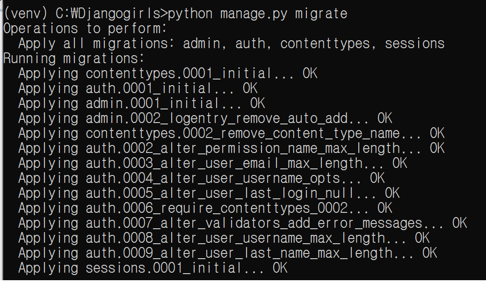
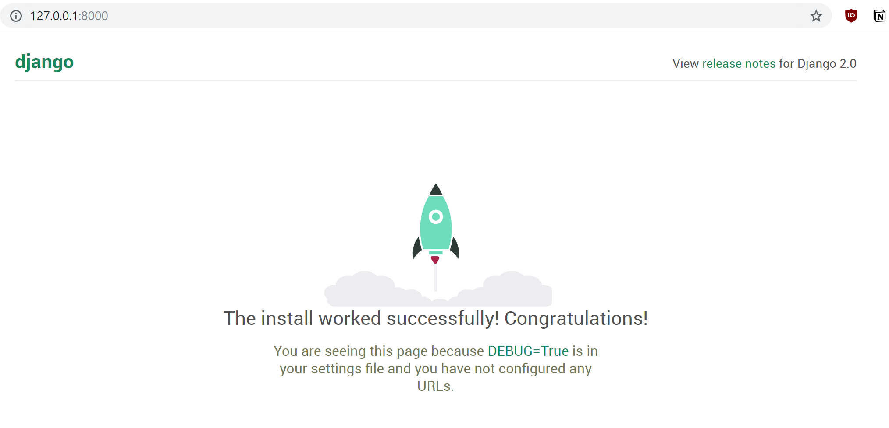
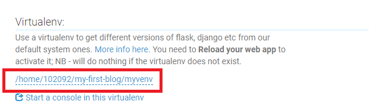

### 0. 참고

- [Django_docs](<https://docs.djangoproject.com/ko/2.2/intro/tutorial01/>)
- [Djangogirls_tutorial](<https://tutorial.djangogirls.org/ko/>)


### 1. 설치


1. django

```python
djangogirls
├───manage.py
└───mysite
        settings.py
        urls.py
        wsgi.py
        __init__.py
```

- `manage.py` 사이트관리 역할, 설치작업 없이  웹서버를 시작하게 해주는
- `setting.py` 웹사이트 설정


2. python virtualenv설치(window)

- [https://dgkim5360.tistory.com/entry/python-virtualenv-on-linux-ubuntu-and-windows](https://dgkim5360.tistory.com/entry/python-virtualenv-on-linux-ubuntu-and-windows)

```
 pip install virtualenv 
 virtualenv venv
 //가상환경 설치
```

```
call venv/scripts/activate
//가상환경 실행
```


3. 장고 설치하기

- pip upgrade

```
python -m pip install --upgrade pip
```

- django

```
pip install django~=2.0.0
```


### 2. 프로젝트 만들기

2.1 기본 프로젝트 만들기

```
django-admin startproject mysite .
```

- [오류참고](https://stackoverflow.com/questions/53736391/unable-to-create-a-project-in-django)

- .py를 빼고 실행했더니 된다..


2.2 설정 변경

- `Setting.py`

  ```python
  #시간설정
  TIME_ZONE = 'Asia/Seoul'
  
  #정적 호스트 설정
  STATIC_URL = '/static/'
  STATIC_ROOT = os.path.join(BASE_DIR, 'static')
  
  #application 배포 호스트 설정
  ALLOWED_HOSTS = ['127.0.0.1', '.pythonanywhere.com'] 
  
  #데이터베이스 설정
  DATABASES = {
      'default': {
          'ENGINE': 'django.db.backends.sqlite3',
          'NAME': os.path.join(BASE_DIR, 'db.sqlite3'),
      }
  }
  ```

- 블로그에 데이터 베이스 설정 `python manage.py migrate`



- 서버 작동 확인 `python manage.py runserver`



- 작동되는 웹서버를 중지하려면? `ctrl+c`


### 3. 블로그 Post 저장

#### 3.1 Post객체와 속성.

```
Post(게시글)
--------
title(제목)
text(내용)
author(글쓴이)
created_date(작성일)
published_date(게시일)
```


- SQLlite데이터를 사용하여 데이터벵베이스를 조작, 저장할 예정.


#### 3.2 내부 어플리케이션 만들기

- `python manage.py startapp blog` 

  블로그 객체 생성

- 이 객체가 장고에 연결될 수 있도록 `setting.py` 를 수정해줘야함.

  ```python
  INSTALLED_APPS = [
      'django.contrib.admin',
      'django.contrib.auth',
      'django.contrib.contenttypes',
      'django.contrib.sessions',
      'django.contrib.messages',
      'django.contrib.staticfiles',
      'blog',#이부분
  ]
  ```

  

#### 3.3 블로그 글 모델을 만들자.

- 모델이라는 객체를 선언해서, 

- `blog/models.py`

  ```python
  from django.db import models
  from django.utils import timezone
  
  
  class Post(models.Model):
      author = models.ForeignKey('auth.User', on_delete=models.CASCADE)
      #저자는 외래키로
      title = models.CharField(max_length=200)
      #제목은 200자 이내
      text = models.TextField()
      #내용
      created_date = models.DateTimeField(
              default=timezone.now)
      #작성시간
      published_date = models.DateTimeField(
              blank=True, null=True)
      #출판시간? 
  
      def publish(self):
          self.published_date = timezone.now()
          self.save()
  
      def __str__(self):
          return self.title
  ```

- 게시판 포스팅에 대한 객체. 속성을 정의하고.


#### 3.4 데이터베이스 테이블 생성.

- 초기 블로그 포스팅 파일 만들기 `python manage.py makemigrations blog`
- 데이터베이스에 해당 파일 반영하기 `python manage.py migrate blog`

### 

### 4. 관리자 설정

- `settings.py`

  `LANGUAGE_CODE = 'ko'` 로 설정. 한국어로!


#### 4.1 블로그 관리자 추가

- `blog/admin.py`

  ```python
  from django.contrib import admin
  from .models import Post #post객체 가져오고
  
  admin.site.register(Post)#관리자 페이지에서 해당 모델을 보려면? 등록을 해줘야 한다.
  ```

  

- 슈퍼사용자 설정

  `python manage.py createsuperuser`

  ```
  Username: admin
  Email address: admin@admin.com
  Password:
  Password (again):
  Superuser created successfully.
  ```

- 패스워드는 공백으로 나옴!

- 이메일은 본인 이메일을 쓰자.

### 5. 배포하기

- git, [pythonanywhere](https://www.pythonanywhere.com/) 이용

#### 5.1 Pythonanywhere

1. 해당 사이트에 프로젝트 폴더 `clone`

2. 가상환경(virtualenv) 생성.

   ```
   cd my-first-blog
   virtualenv --python=python3.6 myvenv
   source myvenv/bin/activate
   pip install django~=2.0 //django 설치
   ```
3. 데이터베이스 생성.

   ```
   python manage.py migrate
   python manage.py createsuperuser
   ```

#### 5.2 Webapp배포

1. 도메인 확정(그냥 next)
2. manual configuration -> Python3.6
3. 가상환경(virtualenv)설정



4. WSGI 파일 설정.

- 장고는 WSGI 프로토콜을 사용하여 작동함. 

- 상단페이지에 없음 

  **WEB** -> Code: ..

  ```python
  import os
  import sys
  
  path = '/home/<your-PythonAnywhere-username>/my-first-blog'
  if path not in sys.path:
      sys.path.append(path)
  
  os.environ['DJANGO_SETTINGS_MODULE'] = 'mysite.settings'
  
  from django.core.wsgi import get_wsgi_application
  from django.contrib.staticfiles.handlers import StaticFilesHandler
  application = StaticFilesHandler(get_wsgi_application())
  ```

  - 띄어쓰기 조심, syntax error..

#### 5.3 페이지 배포

- 완성!  : [http://102092.pythonanywhere.com/](http://102092.pythonanywhere.com/)
- 로컬에서 db에 저장된 내용은 pythonanywhere에 넘어가지 않는듯 싶다


### 6. url 설정

1. `mysite/urls.py`

```python
from django.contrib import admin
from django.urls import path, include

urlpatterns = [
    path('admin/', admin.site.urls),
    path('', include('blog.urls')),
]
```


2. `blog/urls.py`

```python
from django.urls import path
from . import views

urlpatterns = [
    path('', views.post_list, name='post_list'),
]
```

- 위 2가지 수정 후, 서버가 실행되지 않음.
- 아마도 attribute가 없어서 발생하는 문제인듯.


### 7. view 생성


1. `blog/views.py`

```python
from django.shortcuts import render

def post_list(request):
    return render(request, 'blog/post_list.html', {})
```


2. `blog/templates/blog/post_list.html`

```html
<html>
    <head>
        <title>Django Girls blog</title>
    </head>
    <body>
        <div>
            <h1><a href="">Django Girls Blog</a></h1>
        </div>

        <div>
            <p>published: 14.06.2014, 12:14</p>
            <h2><a href="">My first post</a></h2>
            <p>Aenean eu leo quam. Pellentesque ornare sem lacinia quam venenatis vestibulum. Donec id elit non mi porta gravida at eget metus. Fusce dapibus, tellus ac cursus commodo, tortor mauris condimentum nibh, ut fermentum massa justo sit amet risus.</p>
        </div>

        <div>
            <p>published: 14.06.2014, 12:14</p>
            <h2><a href="">My second post</a></h2>
            <p>Aenean eu leo quam. Pellentesque ornare sem lacinia quam venenatis vestibulum. Donec id elit non mi porta gravida at eget metus. Fusce dapibus, tellus ac cursus commodo, tortor mauris condimentum nibh, ut f.</p>
        </div>
    </body>
</html>
```

- `templete` 폴더 안에, `blog` 폴더 하나 더 만들고, 그 안에`html` 파일 생성


### 8. 장고ORM,쿼리셋(query set)

1. shell 실행

```
(myvenv) python manage.py shell
```


2. 모든객체조회하기

```
from blog.models import Post
Post.objects.all()
```


3. 객체 생성하기

```
from django.contrib.auth.models import User
me = User.objects.get(username='admin')
Post.objects.create(author=me, title='Sample title', text='Test')
Post.objects.all()
```


4. 필터링하기

```
Post.objects.filter(author=me)
Post.objects.filter(title__contains='title')

from django.utils import timezone
Post.objects.filter(published_date__lte=timezone.now())
```

- me를 기준으로 필터링..


5. 정렬하기

```
Post.objects.order_by('created_date') //오름차순
Post.objects.order_by('-created_date') //내림차순
```


6. 쿼리셋연결

```
Post.objects.filter(published_date__lte=timezone.now()).order_by('published_date')
```

