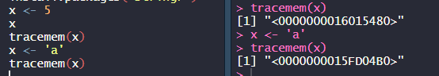

## 참고

- [처음시작하는R데이터분석](http://www.yes24.com/Product/goods/64497252)

## 처음

- R은 객체지향언어
- 통계 분석 언어
- 패키지 다양
- `data` 시각화를 위한 다양한 그래픽 도구 지원.
- 메모리 로딩되어, 고속처리. 재사용도 가능함.

- 다른 데이터분석python에 비해 속도느림. 그래서 대규모 IT서비스에 접목하기 어려움
- Rstudio 패키지 다운 기본 경로와, R에서 패키지 기본다운 경로가 다름.

### 변수 선언

- 첫문자는 영문자로 시작

  - `*` 사용가능하지만, 이러면 뒤에는 숫자가 올 수 없음.

- 두번째 문자부터는 `숫자, _, . `사용가능

- 대소문자는 구분함

- 예약어는 사용하면 안되고

- 한번 생성된 변수의 값은 불변

  

  - 같은 변수에 저장하더라도, 메모리주소를 보면 다름. 덮어쓰여지는 것이 아님.

- 변수를 선언할 때 자료형(type)을 선언하지 않음.

### 데이터 타입

- Scalar 변수 - 단일 값(하나의 값)을 저장하는 변수

- age <- 30

  age변수는 하나의 값을 저장하고 있는 벡터 타입.

- 벡터란?

  하나 이상의 여러 개의 자료를 저장할 수 있는 **1차원의 선형 자료구조**

  하나의 벡터에는 동일한 자료형이 포함되어야함. 다르면 오류!

  ` w <- c(1,2,3, "a","b","c")` 이와 같이 벡터에 문자,숫자를 섞어서 할당하면 모두 **문자** 로 인식함.

  - 연속적인 숫자 만들기.

  `v <- 50:90` 50~90까지 숫자로 이루어진 벡터가 만들어짐.

  - 그외 [참고](https://jjeongil.tistory.com/327?category=691385)

- NA(Not Available) : 데이터값 없음
- NULL : null객체, 변수가 초기화되지 않았음을 의미.
- LIst : hash table, dictionary 같은 느낌. 키 + 값 형태의 배열
- matrix : 행렬, 스칼라 데이터 타입의 2차원 데이터 구조
- array : 배열, 스칼라 데이터 타입의 **N** 차원 데이터 구조

### 자료형 확인

- `is...`

- `is.numberic(변수)` .. 자료형을 확인할 수 있는.
- class(변수는)는 자료구의 Type을 반환

### 자료형 형변환

- `as....`
- `as.logical(변수)`

