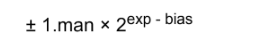

## 참고

- [컴퓨터사이언스...양태환](http://www.yes24.com/Product/goods/58552941)


## 목표

- 기본적인 컴퓨터의 구조,원리를 습득한다.
- 객체지향, 운영체제, 자료구조, 알고리즘에 대해 이해한다.
- Python, C에 대해 알아본다.


## 목록

[1. 변수](#1.-변수)

[2. 정수](#2.-정수)

[3. 실수](#3.-실수)

[4. 문자](#4.-문자와-문자열)

[5. 함수](#5.-함수)

[6. 객체 지향 프로그래밍](#6.-객체-지향-프로그래밍)

[7, 클래스](#7.-클래스)


---


### 1. 변수

- 컴퓨터는 0,1로 이루어진 데이터를 처리. 

  0,1을 표현할 수 있는 데이터의 단위를 `비트(bit)` 

  bit가 8개 모이면? `byte` 

  1byte = 8 bit

#### 1.1 32비트, 64비트 컴퓨터?

- 데이터를 *한 번에 몇 개 보낼 수 있는 지* 에 대한 지표.

  즉 32비트는 비트가 이동하는 통로가 32개 32차선의 느낌

#### 1.2 우편번호

- 메모리 주소 한 개는 메모리에서 1바이트를 가리킴

  즉 우편 번호를 생각해보면 각 동을 가리키는 번호가 있듯이,

  1byte를 가르키는 **메모리 주소** 가 있음.

- 32비트 컴퓨터가 나타낼 수 있는 주소는 2^32(=4,294,967,296)개 =(4x1024x1024x1024 byte)

  1,024 = 1KB... 1024X1024X1024? 1GB

  즉 32비트로는 4GB까지 메모리를 가리킬 수 있다. 다시 말하면 32비트 컴퓨터에서는 4GB 보다 큰 메모리가 무용지물이다.


#### 1.3 변수의 의미

- 변수는 데이터를 저장할 수 있는 메모리 **공간**

  변수는 이름이 아니다. 메모리 공간 자체를 의미한다.

- `int num =5;`

  num이라는 변수에 5라는 값이 담겨있다.	


#### 1.4 파이썬에서 변수 : 이름,값 객체

- 일반적인 변수와는 조금 다르다(C...)

- 파이썬에서 쓰는 변수는 이름, 값 객체로 나뉘어짐.

- `num=5`

  이름? `num` 값? `5`

  num이라는 **이름** 은 5라는 **값 객체** 를 가리킴

  num은 5라는 값을 담고 있는 메모리 공간을 의미하지 않음(일반적인 변수)

  값 객체는 다른 메모리 공간에 있다.

  

### 2. 정수

#### 2.1 컴퓨터와 수

- 10진수 : 0,1,2,3,4,5,6,7,8,9
- 2진수 : 0,1
- 16진수 : 열개의 숫자( 0,1,2,3,4,5,6,7,8,9) + 6개 문자(a,b,c,d,e,f)


#### 2.2 10진수 to 2진수

- 해당 수를 **2의 거듭제곱의 합**으로 쪼개자

  25?

  16+8+1 = 2^4 + 2^3+ 2^0

  중간에 빈 지수는 0을 이용해 표현 : 1 x 2^4 + 1x 2^3 + 0 x 2^2 + 0 x 2^1 + 1 x 2^0

  11001

- `bin(25)` =0b11001 ..python

  0b는 2진수를 의미하는 binary


#### 2.3 2진수 to 10진수

- 11001 ? 43210 이 수를 지수로 바꿔 계산

#### 2.4 16진수 to 2진수

- 16진수는 0부터 15까지 표현할 수 있다.

  a,b,c,d,e,f 는 차례대로 10,11,12,13,14,15를 나타낸다.

- 16진수 한자리는 2진수 4자리까지 표현할 수 있음

  16진수 9 -> 2진수?

  1. 2^3 + 2^0
  2. 1 x  2^3 + 0 x 2^2 + 0 x 2^1 + 1 x 2^0
  3. 0b1001
  
- 2진수 0010 1101 을 16진수로 바꾸면 0x2d이다

- 8비트는 2진수로 표현하면 8자리수가 필요하지만, 16진수로 표현하면 2자리수 간단함

  그래서 메모리 주소를 나타낼 때는 **16진수**를 사용함

#### 2.5 양의 정수

- 컴퓨터는 정수를 1바이트,2바이트,4바이트, 8바이트등 다양한 크기로 저장함.

  <u>아래 설명은 1바이트 기준으로 설명됨</u>

- 양수 음수 부호를 나타내는 데 1비트 사용

- 맨 앞 비트 0이면? **양수**

  1이면? **음수**

- 즉 25를 메모리에 저장할 때, 양수이니까 맨 앞 비트가 0

  00011001

  8bit에 맨앞 0은 양수, 11001은 25를 2진수로 표현한 것, 그 앞 나머지 2자리는 비었으니 0으로 표시

- 1 바이트로 표현 할 수 있는 수의 크기는?

  -128~127

#### 2.6 음의 정수

- 컴퓨터는 음수를 보수 현태로 저장한다.

- **보수(complement)**

  보충해주는 수

  10진수에서 9의 보수를 구한다고 가정하자.

  3의 9의 보수는? 6

  26의 9의 보수는? 73

  

  10의 보수도 구해볼까?

  3의 10의 보수는? 7 (6+1)

  26의 10의 보수는? 74 (73+1)


​		123의 9의 보수는? 876

​		123의 10의 보수는? 877


- 2진수 1010의 1의 보수는?

  0101

  자세히 보면 각 자리 수의 1, 0을 반전한 결과

  1010의 2의 보수는?

  1010의 1의 보수가 0101이므로 여기에서 1을 더하면 됨. 즉 0110


- 음수의 표현

  -4는 어떻게 표현될까?

  1. 우선 2진수로 변환

     0000 0100 (1byte기준)

  2. 1의 보수를 우선 구한다.

     1111 1011

  3. 위의 수에 1을 더하면 2의 보수를 구할 수 있다.

     1111 1100

  즉 컴퓨터는 -4를 1111 1100이라 표현한다.

  이를 메모리에는 16진수로 저장하니, **0xFC**로 저장됨을 알 수 있다


- 그럼 왜? 컴퓨터는 음수를 2의 보수로 저장할까?

  0000 0000 -> +0

  1000 0000 -> - 0

  1. 0을 표현하는 방법이 두가지. 즉 비트 하나를 낭비하는 셈

  2. 컴퓨터는 정수의 뺄셈에서 2의 보수 개념을 활용함.

     0000 1001 - +9

     1111 1100 - -4

     더하면

     10000 0101

     맨 앞 1은 받아올림수이니까 없앰

     0000 0101 - +5

     잘 계산되었음

     즉 컴퓨터 연산의 원활함을 위하여? 인듯함

  

### 3. 실수

```PYTHON
a = 0.01
result = 0.0
for i in range(100):
    result += a
```

- 100 나오길 기대하지만 실제로 계산하면..
- 1.0000000000000007
- 1의 가까운 수지만 1은 확실히 아님.


```python
a = 0.015625
result = 0.0
for i in range(100):
    result += a
```

- 반면 이 과정은 1.5625가 나온다

- 왜?

  

#### 3.1 부동소수점

- 실수는 ANSI/IEEE 754-1985라는 표준에 따라 표현된다.

- 이 표현법을 `부동소수점(floating-point)` 라 부른다.

- 부?는 붕붕 떠다닌다는 뜻

  왜?

  123.456은

  1.23456 x 10^2 

  12.3456 x 10

  1234.56 x 10^-1

  소수점이 *떠다니는* 것 같다. 앞,뒤로 있으니까.


- 단정도, 배정도

  부동소수점의 종류

  **단정도**는 실수를 <u>32비트(4바이트)</u>로 표현하며, **부호 1비트, 지수부 8비트, 가수부 32비트**로 구성

  **배정도**는 실수를 <u>64비트(8바이트)</u>로 표현하며 **부호 1비트, 지수부 11비트, 가수부 52비트**로 구성

  실수를 포현하는데 배정도는 단정보보다 2배 많은 만큼, **정밀도** 가 높다.

  파이썬은 **배정도**를 사용

```python
import sys
sys.float info

sys.float_info(max=1.7976931348623157e+308, max_exp=1024, max_10_exp=308, min=2.2250738585072014e-308, min_exp=-1021, min_10_exp=-307, dig=15, mant_dig=53, epsilon=2.220446049250313e-16, radix=2, rounds=1)
```


- 7.75를 1바이트 부동소수점으로 표현해보자

  

  1. 10진수 실수를 2진수 실수로 바꾸자

     **111.11**

  2. 정규화(normalization)

     소수점 왼쪽에 위치한 가수 부분을, 밑수보다 작은 자연수가 되도록 만드는 것.

     예를 들면 10진수 567.89 - 정규화 - 밑수(10)이므로, 5.6789 x 10^2

     즉 2진수의 밑수는 2.. 2보다 작은 자연수는 1

     **1.1111 x 2^2**

  3. 메모리 구조

      1바이트 부동소수점

     0 | 0000 |  000

     부호 | 지수부 | 가수부

     부호 : 0이면 양수, 1이면 음수

     지수부 : exp값 

     가수부 : man값

     bias : 지수의 부호를 결정하는 데 사용 2^n-1 - 1, n에는 지수부의 비트(4)를 넣는다 = 7

     1.1111 x 2^2  지수 2 = exp-bias . exp=9

     0 | 1001 | 111 = 0x4f

     (가수부는 3비트이니까, 마지막 1생략.. ㅠㅠ)
     
     **실수 7.75는 1바이트 부동소수점으로 나타내면 0x4f이다**

- 1바이트 부동소수점의 표현범위

  지수부가 0001일때

  *cf 지수부 비트가 모두 0일때(2^-7) , 모두 1일때(2^8)은 0.0 정규화 불가능, 무한대 , NaN*

  가장 작은 수 = 1.000 x 2^-6 = 0.015625

  가장 큰 수 = 1.111 x 2^7 = 240

  
  
- 1바이트 부동소수점의 정밀도

  가수부 담을 공간 부족했음.

  즉 0x4f는 7.75를 완벽하게 표현하지 못함


#### 3.2 정밀도에 대한 고찰

- 엡실론

  1.0과 그 다음으로 표현 가능 수 사이의 차이

```python
sys.float_info.epsilon
#2.220446049250313e-16
```


- 엡실론과 정밀도

  어떤 실수가 있을 때, 엡실론을 이용하면 그 실수 다음에 표현할 수 있는 수를 알아낼 수 있다.

  배정도 실수 9.25는 부동소수점으로 1.00101 x 2^3

  지수 부분만 떼어, 엡실론을 곱하면 이 실수와 다음 표현 가능 수 사이의 차이를 구할 수 있음.

  ```python
  ep = sys.float_info.epsilon
  a = 9.25
  diff = (2**3)*ep
  diff #1.7763568394002505e-15
  b = a + diff
  b # 9.250000000000002
  ```

  1. 1.7763568394002505e-15는 지수부분 2^3과 엡실론을 곱한 값, 9.25 와 그 다음 표현 가능 수 사이의 차이
  2. b는 9.25다음에 표현 가능한 수


- 9.25에 `diff` 보다 작은 수를 더하면?

  ```python
  half_diff = diff/2 
  half_diff # 8.881784197001252e-16
  c = a+ half_diff
  a == c # true
  ```

  `diff` 보다 작은 수는 부동소수점 방식에서 표현할 수 없음. 즉 정밀도가 떨어짐 왜? 무언가를 더하긴 했지만 코드 상으로 `true` 로 찍히니까

  다른 예를 들어 얘기하면

  2^53 다음에 표현 가능한 수의 차이는 2^53 *ep = 2.0

  <u>a에 1.0을 더한 값과 a를 비교해도 그 차이를 못 알아차릴 것을 알 수 있음</u>

  

- 다시 생각해보자면

  0.01을 100번 반복해서 더했는데 1이 나오지 않는 이유는?

  수학적으로 실수는 무한대, 이 실수를 표현하기 위해 근사값으로 표현하고,

  1.0 vs 0.01을 100번 반복해서 더한 값의 차이가 엡실론 보다 큰 것이고 그래서 같지 않은것이고

  엡실론보다 작으면 python에서는 같은 값이라 생각할 것이겠지

  즉 **실수를 비교할 때는 조심해야겠다**

### 4. 문자와 문자열

#### 4.1 아스키코드


- 0~127까지 총 128개 코드 포인트에 128 문자가 **매핑** 되어있음

- 최대 7비트가 필요. 왜? 2^7 = 128

- `int` 자료형은 32비트(4바이트)

  `short` 자료형은 16비트(2바이트) 

  이 둘의 자료형으로 아스키 코드를 표현하면 낭비임. 왜? 아스키 코드는 7비트만 가지고 표현 할 수 있으니까.

  그래서 `char` 자료형을 만듬. 작은 수를 표현하기 위해


#### 4.2 유니코드


- 아스키코드(7비트) 한계를 뛰어넘기 위해, **16비트**(유니코드)로 확장
- 16비트를 통해 65,536개 문자를 표현
- 가? AC00


- **유니코드 인코딩 방식**

  옥텟(octet) : 데이터 단위 , 8비트를 의미

  유니코드는 2바이트로 숫자 하나에 문자 하나를 대응하여 문자를 표현

  ```python
  ch = '가'
  ch.encode()
  #b'\xea\xb0\x80'
  ch.encode('utf-8')
  #b'\xea\xb0\x80'
  ch.encode('utf-16')
  #b'\xff\xfe\x00\xac'
  ch.encode('utf-32')
  #b'\xff\xfe\x00\x00\x00\xac\x00\x00'
  ```

  파이썬 기본 encode값은 utf-8임.


#### 4.3 UTF-8

- 유니코드 문자 하나를 1바이트 ~ 4바이트 사이에서 표현

- 가변 길이 인코딩 방식

  왜? 문자에 따라 바이트 수가 달라지니까

  유니코드 포인트 범위에 따라 저장 범위가 달라짐

  U+0000~U+007F 1바이트

  U+0080~U+07FF 2바이트

  U+0800~U+FFFF 3바이트

  나머지 4바이트로 표현됨

  1. 코드 포인트를 2진수로 변환
  2. 포멧에 맞게 재배치
  3. 포멧에 채움


#### 4.4 UTF-16

- 문자 하나를 2바이트 단위로 표현
- 기본 다국어이면 **2바이트**로 인코딩, 그렇지 않으면 **4바이트**로 인코팅


#### 4.5 UTF-32

- 모든 문자를 4바이트로 표현
- 기본 다국어 평면의 문자 뿐만 아니라, 모든 평면에 있는 문자를 한 개 단위로 담을 수 있음.


#### 4.6 파이썬 문자열의 특징

- 파이썬의 문자열은 요소를 변경할 수 없음

  ```PYTHON
  string = "abcde"
  string[2] = "a"
  #변경 불가
  ```

- 변경하려면? 내장함수 `replace()` 를 사용

  ```python
  new_string = string.replace('c','x')
  #string은 변경되지 않았음
  ```

  

### 5. 함수

#### 5.1 전역,지역변수

- 전역변수 : 전체 영역에서 접근할 수 있는 변수

- 지역변수 : 전역 변수와 반대 개념. 즉 특정 지역에서만 접근할 수 있는 변수. 여기서 특정 지역은 함수 내부를 의미함.

  **따라서 함수 안에서 선언한 변수가 지역 변수**

- 지역 변수는 *함수 바깥에서는 접근할 수 없고*, 함수가 호출 될 때, 생성되었다가 *호출이 끝나면 사라짐*.

- 그러면 함수 안에서 전역변수를 변경시키려면 어떻게 해야할까?

  `global` 선언해줘야함.

  ```python
  g_var = 10
  def func():
      global g_var #여기서 전역 변수를 함수 안에서 사용하겠다고 명시함
      g_var = 20 #지역 변수를 선언한 것이 아닌, 전역변수를 변경하는 것을 의미
      
  if __name__=="__main__":
      print("g_var : {} before".format(g_var))
      func()
      print("g_var : {} after".format(g_var))
  ```

#### 5.2 nonlocal

```python
a = 1

def outer():
    b=2
    c=3
    print(a,b,c) #123
    def inner():
        d=4
        e=5
        print(a,b,c,d,e) #12345
    inner()

if__name__="__main__":
    outer()
```

- inner()함수 에서는 전역 변수 뿐만 아니라, outer() 함수 안에 있는 **지역** 변수에게도 접근할 수 있음 
- 그런데 inner()함수 안에서 b,c를 바꾸려 하면, outer()함수 안에 있는 지역 변수를 바꾸는 것이 아닌, 새로운 지역 변수를 생성함. 어떻게 바꿀까?


- **nonlocal 키워드 사용**

```python
def outer():
    a=2
    b=3
    
    def inner():
        nonlocal a
        a = 100        
    inner()
```

- 지역변수가 아님을 선언해서, a는 2에서 100으로 바뀜


#### 5.3 값에 의한 전달(Call by value)

- 함수가 호출 될 때, 메모리에 **'스택 프레임'** 이 생김. 

  스택과 같은 역할 FILO

  스택 프레임은 함수의 메모리 공간. 즉 지역 변수가 존재하는 영역

- 인자를 전달 할때, 값을 복사해 전달하는 경우 = **Call by Value**

- 어느 메모리 공간에 있는지 중요하다.


#### 5.4 참조에 의한 전달(Call by reference)

- 데이터를 저장하고 있는 공간 중 주소값을 전달하는 것
- *인자로 변수의 참조를 전달하는 방식*


#### 5.4 객체 참조(파이썬) 변경 불가능한 객체를 전달할때

```python
def change_value(x, value):
    x =value
	print("x: {} in change_value".format(x)) 
if__name__="__main__":
    x =10
    change_value(x,20) #20
    print("x: {} in main".format(x)) #10
```


- 파이썬 변수는 C 언어 처럼 변수라는 메모리 공간에 값을 직접 저장하지 않는다.

- 상수 객체는 변경 불가능한 객체.

  즉 변수 이름이 가리키는 메모리 공간 값을 바꾸는 것이 나리, 바꾸고자 하는 상수 객체를 참조하게 만드는 것이 핵심


- **레퍼런스 카운트**

  파이썬은 카운팅으로 garbage collection을 구현함

  a라는 변수가 10이라는 상수 객체를 가리키면, 10의 레퍼런스 **카운트는 1**

  b라는 변수도 가리키면, **카운트는 2**

  a,b가 다른 상수 객체를 가리키도록 수정하면,

  상수 객체 10은 **레퍼런스 카운트가 0이 되고** 메모리(heap)에서 해제됨

  `getrefcount()`함수를 이용해 레퍼런스 카운트를 확인할 수 있음.

  하지만 함수 실행에 의한 카운팅을 빼야하므로, 출력값에 1을 빼면 실제 레퍼런스 값이 나올 것.


#### 5.5 객체 참조(파이썬) 변경 가능한 객체를 전달 할때

```python
def fun(li):
    li[0] = ['hi']
    
if__name__="__main__":
    li = [1,2,3,4]
    func(li)
    print(li) #['hi',2,3,4] 바뀜
    
def fun(li):
    li = ['hi',2,3,4]
    
if__name__="__main__":
    li = [1,2,3,4]
    func(li)
    print(li) #[1,2,3,4] 안바뀜
```

- 첫번째 것은 참조된 리스트에 접근해서 변경을 시도했다는 것

  즉 모두 같은 메모리 공간 [, , , ,]을 참조하고 있음
  
- 두번째 것은 다른 메모리 공간에 새로운 리스트를 서로 만들었음

  함수 호출이 끝나면 새로 만들어진 리스트는 삭제됨.


- 파이썬은 객체 참조에 의한 전달(call by reference)

  함수가 실행되면 내부에 선언된 객체들은 사라짐이 핵심인듯


#### 5.6 람다식

- 람다? 이름이 없는 함수

  이름이 없기 때문에, 다음 행으로 넘어가면 다시 사용할 수 없다.

  즉 자주 사용할 함수가 아니다? 그럼 **람다식** 으로 만들어서 사용하자

```python
f = lamda x: x**2
f(2) # 4
```

- 람다식에는 반환하는 `return`이 없음.
- 또한 람다식의 body에는 반드시 식(x**2같은)이 들어가야하고


### 6. 객체 지향 프로그래밍

- 절차 지향 프로그래밍(procedural)
- 함수형 프로그래밍(functioanl)
- 객체 지향 프로그래밍(object-oriented)


#### 6.1 절차 지향 프로그래밍

- procedural ? 함수라는 뜻

  함수는?

  입력을 받아, 일련의 연산과정을 거쳐 출력을 보내는 것

  한번 정의해두면 다시 호출 가능하고, 이름만 봐도 이 함수가 무슨일을 하는지 쉽게 알 수 있음

  절차 지향 프로그래밍이란, 함수를 이용해서 프로그래밍을 하는 것임


- 딕셔너리 컴프리헨션

  딕셔너리를 쉽게 생성할 수 있는 방법. 특히 기존에 있는 데이터에서 딕셔너리를 생성할 때 유용

  ```python
  tu_li = [('a',97),('b',98),('c',99),('d',100)]
  dic = {k : v for k, v in tu_li} #tu_li abcd는 v라 부르고, v는 value 97..을 위해 있음을 알려줌
  ```


#### 6.2 객체 지향 프로그래밍(OOP)

- object-oriented

  핵심은 현실 세계에 존재하는 객체(object)를 컴퓨터에서 어떻게 modeling할것인가?


1. **캡슐화**

- 모든 사물은 저바다 특성이 음. 그 특성을 기준으로 *계층* 을 만들수 있음.
- 모든 사람이 <u>키, 몸무게, 성별, 인종등의 특성</u>을  가지고는 있지만, 그 **값은 사람마다 다름**
- 그리고 사람들은 잠자기, 말하기등 **행동**을 할수 있고.
- 다시 말하면 객체를 나타내기 위해서는 **변수** , **함수**만 있으면 됨

- 이러한 객체를 이용하는 프로그래밍이 **객체지향 프로그래밍**
- **변수(데이터) + 함수를 하나의 단위(클래스) 로 묶는 것이 캡슐화(encapsulation)**


2. **객체**

- 컴퓨터에게 객체는 메모리의 한 단위

- 객체와 인스턴스(instance)는 굉장히 비슷함. 

  객체는 객체 자체에 초점을 맞춘 용어,

  인스턴스는 *이 객체가 어떤 클래스에서 만들어졌는지에 초점*을 맞춘 용어

- OOP에서는 클래스에 묶이는 함수를 행동 = 멤버 함수 = 메서드(method)

  멤버와 메서드를 합쳐 속성(attribute)라함

- 객체가 멤버와 메서드를 가질 수 있는 것 처럼,

  클래스도 멤버와 클래스를 가질 수 있음(클래스 멤버, 클래스 메서드)

  ```python
  class A:
      c_men = 10 #클래스 멤버
      
      @classmethod #클래스메서드
      def cls_f(cls):
          print(cls.c_men)
          
      def __init__(self,num):
          self.i_men = num
          
      def ins_f(self):
          print(self.i_men)
  
  if __name__ = "__main__":
      print(A.c_men) #클래스 멤버에 접근
      A.cls_f() #클래스 메서드에 접근
  ```

  - 객체가 없어도 클래스를 통해 접근하거나 호출할 수 있다.
  - 클래스 멤버, 클래스 메서는 **객체에서도** 접근이 가능하다.

  ```python
  if __name__ = "__main__":
      print(A.c_men) #클래스 멤버에 접근
      A.cls_f() #클래스 메서드에 접근
      
      a = A(20) #객체 생성
      print(a.c_men) # 객체를 통해서 클래스 멤버에 접근
      a.cls_f() #객체를 통해서 클래스 메서드에 접근
  ```


- 클래스 메서드 vs 정적 메서드

  ```python
  Class A:
      @staticmethod
      def f():
          print('static mehod')
      
      @classmethod
      def g(cls):
          print(cls.__name__)
          
  if __name__ == "__main__":
      a = A() 
      a.f() #static method
      a.g() #A
  
  type(A.f) #function
  type(A,g) #method
  ```

  - `def f()` 정적 메서드는 인자로 **클래스, 객체** 를 받지 않음
  - `def g(cls)` 클래스 메서드 인자로, 클래스 A를 받음

  

3. **정보은닉**

- 어떤 멤버와 메서드를 숨겨, 접근할 수 없도록 만드는 것
- 캡슐화는 정보 은닉을 포함하는 개념
- 파이썬에서 기본적으로 정보 은닉을 제공하지는 않음


- 파이썬에서 완벽한 정보은닉은 불가능함.

  하지만..?

  - 숨기려는 멤버 앞에 언더바 두개 (__) 붙이거나
  - 프로퍼티 기법을 사용함


- 멤버 앞에 , 언더바 두개를 붙이면 객체가 생성될 때 이름이 변함 . 어떻게?

  '_클래스 이름' 이 앞에 붙음

### 7. 클래스

- 클래스간의 관계는 IS-A, HAS-A가 있음


#### 7.1 IS-A

- ~은 ~의 한 종류다 라는 의미

- 상속(inheritance)

- 왜 상속?

  상속을 하면 **코드를 재활용** 할 수 있기 때문에 굉장히 편리하다


#### 7.2 HAS-A

- ~이 ~을 가진다 혹은 포함한다

- 합성, 통합

- 경찰은 총을 가지고 있다.(통합) 컴퓨터는 CPU를 가지고 있다(합성)

  컴퓨터의 경우 컴퓨터가 생성될 때 CPU가 같이 생성되고 없어지면 같이 사라짐.

  굉장히 강한 관계를 맺고 있음 = 합성

  경찰의 경우, 총을 가지고 있을 수도 반납할 수도 있음. 

  즉 상대적으로 약한 관계 = 통합


#### 7.3 메서드 오버라이딩, 다형성

- OOP에서 가장 중요한 개념? = **다형성**

- 상속관계 있는 다양한 클래스의 객체에서 같은 이름의 메서드를 호출 했을 때 각 객체가 서로 다르게 구현된 메서드를 호출함으로써, 서로 다른 행동, 기능 결과를 가져오는 것

- **메서드 오버라이딩**

  파생 클래스에서 상속 받은 메서드를 다시 구현하는 것

- 추상 클래스

  어떠한 클래스의 인스턴스를 미리 정하고 싶지 않을 때 사용. 굉장히 큰 설계도 느낌. 진짜 틀만 그리는 역할.

  <u>추상클래스는 독자적으로 인스턴스를 만들 수 없음.</u>

  <u>추상 메서드는 하나 이상 가지고 있어야하고</u>

  ```python
  from abc import *
  
  class Animal(metaclas = ABCMeta):
      @abstractmethod #추상메서드 선언
      def eat(self):
          pass #pass를 통해 함수 본체를 비워둠 추상메서드 선언에서는 꼭 필요
  ```

  - 앞으로 `Animal` 클래스를 상속 받는 모든 파생 클래스는 `eat` 메서드를 **오버라이딩** 해야됨

#### 7.4 연산자 오버로딩

- 클래스 안에서 메서드로, 연산자를 새롭게 구현하는 것. 
- 다형성의 특별한 형태
- `__add()__` 연산자 오버로딩을 하기 위해 예약된 함수


### 8. CPU

- 컴퓨터가 0,1을 인식하는 방법은? **전압 강하** 를 통해, 즉 저항을 만나 전압이 낮아지는 현상을 통해 0,1을 구분한다.
- 트랜지스터는 스위치 역할, 전류가 흐르거나 흐르지 않게 함


- 논리게이트, 세가지에 대해 (OR,NOT,XOR)


#### 조합 논리회로, 가산기

- CPU와 메모리

![](data:image/png;base64,iVBORw0KGgoAAAANSUhEUgAAANwAAACXCAMAAABJG8UcAAAA21BMVEX///8AAAD29vY/Pz/AwMAJCQmWlpbh4eEeHh6ZulZpaWnt8+GjwGb3+vKtx3fq8PdkkMW/TUrCVlNMf7zv1NPQe3mCgoL09PSIiIji4uKAgIDv7+/o6Oifn5/Y2Ni2traoqKjGxsZ2dnZsbGxYWFjW47tQUFDExMSOjo5iYmJ4eHhJSUnE153Pz8+ampqwtbpLbJQzMzMoKCgSEhI5YI3ApKQiKhI+GxrBbGqOPDogCwpQISAtEBCzS0gaDw41GhkTGAowOhx1jkNFUydVZjFmc0p3ik+Zq3SYpnyr7mXjAAAGyElEQVR4nO2daZ+bKByAGUJhkh57eyLgUSOm2M5M2+3e3e75/T/RAibpbOvMqmM2scPzIjFolCcgRH/8EQCHw+GYPZC+X46Pl40xQBEEgRcEeKtA4X7VGjcYC8hWWolXGGMF6/BI2RyJQkhecLT27SdYrPdrEM4WVQJVEQMoG4RQCFfkWNkcy7ookl15scvo2hq0iUMlSi23YuYzLHBq3iZG/8LRalJyboViVMuUBrmwZRLmlRR7N1hfch6tNkYujePYh4WHgB8tpmWDwcXZxJwrW1QBNxVSYaTPNyETwFae2pajkLxQwFbLvJBS4thUy/Rq6pxcgan3ePYAGQF9ym2JQZKlQMVxkrVnViIZ4JIYOUCZJowb3eygB/q7E6KzouWuPDwZ1WUrB3GWZcVCv9QM6AKDpW5QtgWHmLYitkHRzaXeJMvzVk43QJMhrqzc+YRNFVxsSw7YjL9P36D3G1Fp+gfimXpLUg0qiJVbQDAZ5Pywcqi2b8z0eJcr/Sra9HBjj2hNAmmLjs5VjvIdaZseLrjS5aVMtcwaZYhnJ7cOujeKs1VuMH0cNs2lXKWzk4M3/WXcd7J60beA2ckNYx5yzz8bxfNZyL34fBQv5iB39vKrUbw8m4HcJ11yn/Y590m3lk7uY5xcf5zcMJxcN06uP05uGE6uGyfXHyc3DCfXjZPrj5MbhpPrxsn1x8kNw8l14+T64+SG4eS6cXL9cXLDcHLdOLn+OLlhOLlu7rMcpLHqXEFYd3IfOcq9IAXrquEUxHb0K79lKPkh5CAXQlCV85VeTdvRlCYLqU4WDODuEWZ95FSZ46AB+caTBWUL+sHQyY8ycgC5cBHhUqjCyolNoCkrYIbtV9WmAdjr3F0POVo29oB5BaAUbBEeQ64MQbCXsyrVrrQifAc5XrQj77QcyJLjyXm68D6UM+OjV3eRw9uRvHnGRMmOVC2N3KbYtHK5GfKdGbmslLLkd5CrdnIXMkfgBKrlWuZlmUmu01cc+jplvBzatLE4uWeOGy50axyX3U2y5TANSsLlTg5AgHE7PDpvDzRezpc58ymx55zecZbROJH+zdsfQs7Hun1krZyJH6kqX7/pkpM6vV6PlwNhtpEFBlHTfmNVFvKWgjtgJ55qOUAzKeVmo18yavs5juI7yAFIFDG/2PYTY7fGuh1OTkldcpDs2W9a3UFuGIeTixUT3d/jncmzkhuKkxuGk+vGyfXHyQ3jfshB3weMmShVE5BEmU2BgLXHCk0vbBL1ZQuBNtZsTnJJIblIIh+QWiKgGgCjQuahsD2un+SyCtMExJkXYBrYuyAzkqs4gUYO6ouVmhm5WhECxPbvBM/iFDeAVkanDsylx4zkMPPXnpaj+lop4UYu42sa4lbO96QQtZbLOEI0Sky9nJUcFfm/5PIqUbgQZqUfJKROdbWEwkzNwO0145zkdFvSVktO22oZGYW2WsacQRprOV0vPS/K5iaXZFGS2AYlqLltULIoCNbbcw4GpG1CwzqKamkzMCM50/Db1lIvASNnb1bFO7kIEUZ0gakMcd7OvDEjOYNa72bVYLtrLrSdOSTx2rBxam6xVvYW9lzkdtHE0L9xNo+PF2Yh9+2bb0bx5rvvT1/uhy/G8uMM5L4cyU8zkPv51dejePXLDM65e3DJMxwn1x8nNwwn142T64+TG4aT68bJ9cfJDcPJdePk+uPkhuHkunFy/XFyw3By3Ti5/twHuUPM4zxO7lxON8158cDKHWQG7lFyvXj7+vXbnlkB5/22+/Xdu9/6bXmVjpNjl/32//ty2TMnF0Bsek0h/8dy+We/yeajW4ZA30rar+b/tVz+3WvDhoGeTwl4ulw+6/uUgMPybLl8OvEujdzEuxyJkxuGk/tfcHLD+OTlHp8Eh5F79OQkeHQQudNharmHTx6dDE8eTiwHHj88GR5P7eZwOObA9RBQE5LJrk/rAO1V7Y3PtzlhVJIkYYwhoHohEdqARXVdy+1TEkmqNxEm7gXV/xEGe4IwLgpGAwiQRMg+HFHlUbQdZQ8AqgCwcQVBvYqCkbeUjgb3ZKVEZMLoqypIbGx+nUXVVq4pQyMH4kYbd0fUnjCxqAkykx8gqZRiECjs5WXkJW2ARMUjauS450OSz+xxlrAyZWSqpZK6bAIGiPDMAjfnF61CoIiRY1HTVHjs/bJjESIT82GCrOD2QV6kwRi3wR8AGkcbbOCLIj34DbPJaVLT+oM0sFQErPN92A6AXiup19alXTsvklw7JTBmFgIBL3RfEGzlotpGhOi1uvNjZG5lFxPzHM5rCfD6lAr2KZ2084sOh8NxivwDeTcJYg0sZTEAAAAASUVORK5CYII=)

- 코드는 메모리에 저장되었다가, 실행하면 CPU는 한줄씩 읽어드려서, 해석하고 CPU를 이루고 있는 각 파트에게 지시하는 형식으로 진행됨.

- 가산기는 대표적인 조합 논리 회로
- 조합논리회로는 <u>현재 입력에 의해서만 출력이 결정되는 논리 회로</u>를 의미.


##### 가산기(ALU)

- AX,BX를 이용해서..


#### 순차 논리 회로, 레지스터

- 순차논리 회로, <u>현재 출력이 현재 입력과 과거 출력에 따라 정해지는 논리 회로</u>

  입력값이 바뀐다고 해서, 출력이 바로 바뀌는 것이 아닌, 특정 상황이 되었을 때만 바뀌고 이를 통해 이전 출력 값은 유지됨(저장).


#### 클록

- GHz....
- 클록 주파수가 높을 수록, 연산 속도가 빠른 성능 좋은 컴퓨터


#### 시스템 버스

- 레지스터

  IR(Instruction  Register) : 메모리에 있는 명령어를 CPU로 가져와서 저장하는 공간

  PC(Program Counter) : 현재 실행 중인 명령어 다음에 실행될 명령어의 메모리 주소를 담는 공간

  AX,BX : 범용 레지스터, 메모리에서 읽어 들인 데이터를 저장하였다가 ALU가 연산할 때 전달하는, 혹은 연산값을 저장할 때

##### 구성, 특징

1. 데이터 버스 : 양방향, 메모리에서 CPU로 데이터 

2. 제어 버스 : 데이터를 레지스터에서 읽어올지, 아니면 메모리에 쓸지 CPU가 메몰에 전달하는 것

3. 주소 버스 : 단방향, CPU가 메모리에 알려주는 거 뭘?

   메모리에서 레지스터 간의 데이터를 전송할 때 필요한 주소를, 메모리에 알려주는 것.


#### 인스트럭션 세트

- 기계어, CPU가 인식하여 실행할 수 있는

- 인스트럭션 세트는 CPU마다 다름.  그래서 이러한 불편을 없애고자 C언어등 하이레벨 언어등장

  이 CPU가 알아먹을 수 있도록 해줘야함

  

### 9. 메모리

#### 9.1 메모리 계층

![메모리계층](data:image/png;base64,iVBORw0KGgoAAAANSUhEUgAAAPkAAADLCAMAAACbI8UEAAAAeFBMVEX///8AAADS0tKWlpZmZmbi4uKioqJWVlb8/Pzz8/Ovr6/09PTv7++8vLx3d3dFRUXKysqDg4O3t7deXl6YmJjk5OSLi4unp6cNDQ3Z2dlvb29QUFDPz895eXk7OzsfHx8yMjIVFRUsLCxAQEAeHh4mJiZiYmKIiIibWjrdAAAJs0lEQVR4nOWdiXaiMBSGubghoiKyCG5Yp/r+bzhJAEUEJZCVfmdOF0unuYYk98/yYxjycGEp8a9LxAKAhexCSOGIIh/LLoQMYoAtwEF2MSSQwslYw1l2McQzBZgYAYAvuyCimQNs0KcQwJFdFMHcACz8eQcz2UURiwv5WP744q+wg33+FerfpZZEMKXmnTf4P8JLl046+b/C/mUYT+EqrSSC8QDc0rcmgC2tLEKxqun6Kh/hBs+xKtHQW5FIKotQkFKJKi+h29+UUhaxYKVSZQ2/EkoimAggfnvxLyiXBcCx5uU/oFxuDf344JVLo0AZvHK5PJRKlYErl1Fzc0bK5S60LEJxAEaNPxy0ctnDvw8//RmucqkolSrDVS4oPb99vCAZqnJ5UypVhqpcapRKFXuYyuUE6ddrrvDDvRzCqVUqVSYDVC4NSqXKfXjKZdyy34ahKRckSLy2Fw5LuZwblUqVLey4lkQwSKkELS91BqVcUDRh64v99u+S+uyp7uBfWHMriWCWn5VKleEol69KpcpglMsGYE71C+itWnEqi1Am35VKlYEolzZKpcoglIvdRqlUQffJlENZhNJSqVTZ6K9c2iqVKgBb1kURy6GtUqlCmQOox7mcjy1iozzvYDU3ZdM1ZnorlyIHtz3Pmxjm1cArSEvPw/+M+WM5KSratDtF+BPDD+lyfeV4lN6fTve+Ee9J5LYfge9HqPMrrrsUe71XRzuKosCYjjRXLmWl4j8iR5BPj8gnj8nmYz4rgSM3/umrXF56qXLkFhmyisgXEK/zJn/MryeRd+4d5fMcmca38T9/4s3yyA9kximPfInPNezHJLXfwOUCRjy5k4VHbZVLSalAEATzZLvNI5/5ODklkbuQkOiWO7xHDt3tlmWskhMZAxaaKpdyBprVXXG3L1PjFhV1/qhVvPJUtPMoW2zulPnK51RSHVlV55FPcCtHTXjxvknipYer/B/a8FJfcA/DVZxFbpHXrdOiJvI7aueXMzwi11G5vLZRz3Ndd/Ec1fJL8NuwKyivKxWR089qyKeuXzbXb5E38IhcP+Vi1o3Fk/Al8nlz5P4jcdVOufw27HmxGr9pYg8XBuURBsOcWy/lwrS0FCtT8pkxPW76o49yQb3SaTtjxfakj3IB9uihXO4o8WJK1G3+VjgcMs5Wu4vkc+JwJiXVQblwWRNrsYtQOpxmEzRQLpxmkN7ONSoHt/0OyiuXJqXSH8WVC8cTGcGnkyDS4bqXTWnlwvfkVfOJL+lw3rOq8JZY3vuUu+5C4A73velzRZWLgJPUiiqXq4DT8ymk3P8GNUJ276moXASdNft65k08KzFFUk+5xHRK5WAF5cut9nmpp5qB4m+NYUgdlj+dTl3jFJjZ0B8Qt6wP60xvrNVSLq2VimXb3mplrAMzWyiMibSbU2x9U0u5OFROZ9OoT+Rq2ZC0Vyqmf0+Q5Fo7eeQu+UWqyFVSLhRSYhK5yxQ11tjNDnjcifKki1wh5QJUlZCivnl2TcngZMES1z1d5OrYkNA1vCOeml07Mbnb156xtqkjV8VAkU6pHMntkfdwxzGu9og2cjyUqKBcqByKwyzFzSJ3yZg+X1FHXus3JpxO3m6PUS2DOnIVlEs3pXLtGbkomcC+CKFzKE9c0WSvGfJtSCiVSgn6XVIvSFcuP9K6mvVHJybuSHS5kmugKDWlkKpcmqwNxXCRZ0MiWTpI/POyXStvspQLamhuMJFHYErqZgIOG/7okTG07GUHTZCQThBrQ0suUmxIFJnyl2D9rsgyj3jlooJAJgi3fldiUoQg2PpdoSV8scplocjkJ0GocpGrVKoITKIVWuTACCyOQgtbBGFrLh9M2OUgaoJErQVsgqBJsc8m7HIQYv3ee4u9ay0bc4G445E8Ecqlh1IxI0RsgLMh8dkZ5G1c4h+hsi+7JuECbEh6KJVwbNv7qXHOI4dRGIajhIzFywi9B6iDXnY9/cNfufRRKiGq1LAUOXnRfGYhfSLnvwWzi7VhAYk8Mn5fIj8wipy3gWIvpYIjH8EF5u91Ptoi+kXOV7l0tDbMqd7tm819s9mSyPeug+gVOd/t9f0OFZA6f0Z+OMRr3zyQFGSf30l9IudpQ9LahL2ecDbyr8/IEeMiM9jnKVivyDkql3/9lEqMh++4PvLb8bhK0rhX5PwMFBkdGMsiP2HgjD6koWFMTNOMY6dfnXM7LsfKMGRHIp8/cEqZUb/IsXLhcZiP1cFQ3zo29hZez0SMi/W78oeBMTyUC7UJuxw4KJeNGmsq32CvXDqYsMuBuXLpo1TEwli5aGRFydbOpp9SEQxT63dljz/XwlC5aGYzzDDzOOtj0EZgply0sxNnpTD0MmIkMKorusdFqQGT9rnU8Xk4MYM+GSXCu2SsG8mu/zi8kb3JsTM9zdpQLpj4I/3wN33zbS0N1Ak9S66RUqnST7no+qAEQi8DRb2USpUeyqXWhF0feigX3R/f2XmeXDulUqWr4tBQqVTpuB42U8XNoQeXLu1VizWVb3SaTdLucSC1dBiXuVsbioF+1ljHx/7UQr2nSYS1oRhSSGkuH8iDiTEx1d27kO5fwRAq5aLtY/zqoFn5H85D5wkUmQk/E3Y5tFYu7M5GBKS3WH3JnUPenWnb8ycMd5UFKf54JQNqkE0NlsIMj4jEMW7Fveg92pgfZlczeipFS+XCSql4p3UK62tqrMkd5KbuEvMsAiwPrutaz52Qm0e6lV3q/rI6l9PqnJnLSqksnPnCWjhOEfmbDCjS4yLyxdsmpD2ryFvt2GWoVLzTzw1F1zJya+e6lZGXWeRtlAtDpWKnDnqzF8aa3ODu26D6Erll41vtAFNcwGWanneXyw+7OaHv1u8ThicDfnC5NzbuOFx8w11P+f7enHLkC9hkdTLC1T6PA1L5V3azYV+Vy5Xh0/BO+E8lXl7nlpPxbMrVdv7OP4bzgCmkn37M1LvAhUMwhaKdvwNT2/b98EPkLHPoz6euGO+djJNZaGWRL8y4wCz6ERs/NM4+kMhLXkRBdgQA4YEXsYv9+Em58HFXxJFPxquCpOrlhyNfPZ+bmBjuPcwYhRt25fl0urK7teFHrl8mRW6CZjo/GCi2NWGnZPtlVF6JMnRstH6XaG0ohiblQmfCriVhvXJRxiGbI7XKRTHDED7UBinb2lAMNQaKSj39gB/vNiRyfWMF8qZcqEzYtSaFtPytcJc1ebwqF/me4AJ58QhRwAdeHGXlwkmpqEpJucgzYZfDw/p98EqlSqFc/oBSqZKnbTcNz6n05YxT9QOq+tj8W8Q+nghPJR+6kMUZD+x/kuQ/DHqI9dUxXnMAAAAASUVORK5CYII=)

- 메모리는 데이터를 저장하는 공간. 
- 왜? 다른 종류로? 가격이 달라서. 레지스터는 비쌈. 하드디스크는 저렴하고
- 레지스터는 속도는 빠르지만, 용량은 작아지고. 하드디스크는 속도는 느리지만 용량은 큼
- 계층적구조로 구성되어, 데이터가 이동함.
  - 즉 CPU가 하드에 데이터를 요청하면, 메모리 -> 캐시 -> 레지스터로 전달됨.
- 캐시는 L1, L2 로 구성됨. 숫자가 작을수록 속도는 빠르고, 용량은 작음.


#### 9.2 지역성, 캐시히트

- CPU가 데이터를 요청하면, 메인 메모리에 해당 데이터만 가져오는 것이 아닌, 데이터와 함께 근접 데이터로 이루어진 메모리 블럭을 캐시로 가져옴.
- 그리고 캐시에서, CPU가 요청한 데이터만 전달함.
- 이 다음에 CPU가 요청할 때, 요청한 데이터가 있는 지 캐시에서 확인함
  - 이에 요청한 데이터가 있으면 바로 캐시에서 가져오는 데  **캐시 히트(cache hit)**라 함 
  - 없으면 **캐시 미스(cache miss)** 위 과정을 다시 거쳐야 하고.

- 캐시히트면 훨씬 빠르게 작업이 진행 될 수 있지.
- 그런데, 과연 일련의 요청과정에서 관련 데이터블록을 가져올 수 있을까?
  - 매우 높다. 90%이상 필요한 데이터들이 같이 모여 있을 가능성.


##### 지역성의 원리 principle of locality

- 시간적, 공간적 지역성이 있음
- 시간적은 특정 데이터에 한 번 접근했을 때, 곧 다시 그 데이터에 접근할 가능성이 높다.
- 공간적은 이번에 접근한 데이터는 이전에 접근했던 데이터 근처에 있을 확률이 높다.
- 캐시히트를 고려한 코드는 캐시 프렌들리 코드.


### 9.3 가상 주소 공간

- 32비트 운영체제면 최대 4G 메인메모리 할당
  - 이중 2G는 운영체제가 담당, 이를 커널 영역이라 부르고.
  - 나머지는 실제 프로그램이 담당, 유저영역
    - 유저 영역은 code, data, stack, heap이라 부름

- 가장 낮은 주소 부터 스택 - 힙 - 데이터 - 코드


##### 코드 세그먼트

- 클래스 정의코드 실행되면 올라가는 장소. 
- 함수를 호출하면, 이 코드 세그먼트의 주소를 가르킴으로써 실행됨.


##### 데이터 세그먼트

- 전역변수가 저장되는 공간
- 프로세스가 종료되면 소멸함. 프로그램이 실행되는 동안 계속 있으며, 사용자가 소멸시기를 결정할 수 없음.

- 코드 , 데이터 세그먼트은 실행되기 전에 그 크기를 알 수 없음.


##### 스택 세그먼트

- 지역변수가 저장되는 공간.
- 최대로 늘어날 수 있는 크키가 정해져 있음. 기본값은 1MB
- 쌓이다가, 최대 크기를 넘기면? 스택 오버 플로우stack over flow


##### 힙 세그먼트

- 사용자가 자유롭게 메모리를 할당하고 해제할 수 있는 공간.
- 함수 호출이 끝나도, 사용자가 해체하지 않는 한, 할당한 메모리는 남아 있음.
  - 이러한 현상을 메모리 누수라 부름 memory leak
- 힙은 스택과 달리 최대 크기가 정해져 있지 않음.


#### 스택 프레임


- 스택이 어떻게 저장되고, 메모리를 할당하는지에 대해 말함.
- 스택은 위쪽으로 확장. 스텍에 데이터를 쌓는 다는 것은 스택 포인터가 가리키는 주소가 점점 낮아진다.


### 9.4 가상 메모리, 페이징

- 프로세스는 메인 메모리에서 데이터를 가져옴. 이건 빠름.
- 그런데 하드 디스크에서 데이터를 가져올 때는 엄청 느림.
- 하드디스크를 메인 메모리 처럼 쓸 수 있으면, 데이터를 빠르게 가져 올 수 있지 않을까?

- 가상메모리는 메인 메모리를 확장하기 위해, 페이지 파일로 불리는 하드 디스크의 일정 부분을 메인 메모리처럼 사용하는 것.
- 메인메모리 + 하드시스크의 페이지 파일 = 물리 메모리.
- 가상 메모리 관리 기법은?
  - 세그먼테이션, 페이징

##### MMU

- memory management unit
- 프로세스에 주어지는  메모리 공간을 가상 주소 공간이라 함.
- 가상 주소 공간의 메모리 주소를 논리 주소.
- 메인 메모리의 메모리 주소를 물리 주소.
- 프로세스를 실행하려면, 실제로 데이터와 코드를 올릴 물리 메모리가 필요함.
- MMU의 역할은 논리 주소를 물리주소로 바꾸주는 역할.
- CPU 내부에 존재


##### 페이징

- 가상 주소 공간, 메인 메모리를 일정 크기로 나눔.
- 가상 주소 공간을 일정한 크기로 쪼갬. 이 쪼개진 한 부분을 페이지라 부르고.
- 보통 1~8kb, 32비트 컴퓨터에서는 4KB
- 32비트 시스템에서 메모리 주소를 표현하는 것 32비트
  - 페이지 갯수가 2^20 개이니까 페이지 넘버를 나타내는 비트는 20비트, 페이지크기가 2^12이므로, 오프셋은 12비트.
  - 이 둘이 합치면 가상 주소공간에서 하나의 주소값.


##### 페이징 프레임

- 메인메모리의 쪼개진 부분 하나를 페이지 프레임이라 함.


##### 페이지 테이블

- 어떤 프로세스의 페이지 넘버VPN ,상응하는 프레임 넘버PPN 상태등을 저장하는 테이블.
- 모든 프로세스는 저마다 페이지 테이블이 있음.


- 프레임은 메인 메모리에 있음.


##### 요구 페이징

- 필요한 페이지만 메인 메모리에 올려 실행하는 것


##### 페이지 폴트

- CPU가 요청한 페이지가 메인 메모리에 없을 때 발생
- 자주 발생하면 프로그램 성능이 자주 발생
- 이를 줄이기 위해서는 지역성을 고려하면서 프로그래밍해야함.
  - 연결리스트를 자주 사용하면, 페이지 폴트가 빈번히 발생할 수있음


### 10. 프로세스와 스레드

- 프로세스는 더블클릭으로 프로그램을 실행한 상태
  - 하드 디스크에서 메인 메모리로 코드와 데이터를 가져와 현재 실행되고 있는 상태


#### 10.1 프로세스 상태

- 요즘은 대부분 멀티 프로세스 기반.
- CPU는 한번에 하나의 프로세스만 할당할 수 있음.


1. 생성created

   프로세스가 실행가능한 상태가 됨. 우선 순위 비교 후 높으면 실행, 아니면 실행가능한 상태에서 순서를 기다림.

2. 실행가능waiting

3. 실행running

   CPU를 할당받아 실행되고 있는 상태

4. 보류blocked

   I/O(입출력) 작업을 하면 CPU를 해제하고 보류상태로 변경함. 

   실행대기 상태는 언제든지 다시 실행될 수있는 상태이지만, 보류 상태는 I/O작업이 끝나기 전에는 실행이 불가.

5. 소멸terminated

   프로세스 실행이 완료되어 메인 메모리에서 사라짐.


#### 10.2 스케쥴링

- 여러 프로세서의 CPU할당 순서를 결정
- 언제 할당하는 지에 따라서, **선점형, 비선점형**으로 나눠짐


##### 선점형 스케쥴링

- 다른 프로세스 실행 중에도 스케쥴러가 이를 강제로 중지하고, 다른 프로세스를 할당할 수 있음.


##### 비선점형 스케쥴링

- 실행 중인 프로세스가 종료되거나 I/O작업에 들어가거나, 명시적으로 CPU가 반환하기 전까지는 계속 실행됨.


- 최근 운영체제는 멀티태스킹을 위해 **선점형 스케쥴링** 을 함.


##### 스케쥴링 알고리즘

1. 우선 순위

2. 라운드 로빈

   모든 프로세스에 같은 시간을 부여. 

3. FCFS
   비선점형 스케쥴링. 먼저 들어온 실행가능한 프로세스를 먼저 실행

4. SJF
   할당시간이 가장 짦은 프로세스를 먼저실행


#### 10.3 컨텍스트 스위칭

- 프로세스 제어블록process control block : 프로세스의 CPU상태와 프로세스의 상태를 저장해둔 메모리 블록을 말함.
- CPU상태를 컨텍스트라 부름.


- 제어블록에 상태를 저장해두었다가, CPU에 바로 할당할 수 있도록 하는 방법

- 잦은 컨텍스트 스위칭은 시스템 성능을 떨어뜨림.


#### 10.4 쓰레드

- 프로그램 안의 실행흐름의 단위. 스케쥴러에 의해 CPU를 할당 받을 수 있는 인스트럭션의 나열.

- 프로세스는 하나 이상의 스레드로 구성.
- 스레드 제어블록thread control block TCB

- TCB는 PCB와 유사.


#### 10.5 멀티스레드, 멀티프로세스


- 모든 프로세스가 서로 다른 메모리 공간을 가짐.
- 그런데 이를 공유해야, 사용자 명령을 막힘없이 실행할 수 있겠지.


- 멀티 스레드의 구조.
- **여러 스레드가 스택만 서로 다르고, 코드 데이터 힙을 공유**
- 동시성 프로그래밍(동시에 여러 실행흐름이 필요한 프로그래밍)을 위해 멀티 스레딩을 사용

- 경쟁조건
  - 스레드가 공유자원을 동시에 변경하려 할 때 문제가 발생한다.
  - 이를 상호배제를 통해 해결해야함.


##### 상호배제

- 한 스레드가 공유자원에 접근할 때는 다른 스레드가 접근하지 못도록 막아주는 것.


### 11. 프로그래밍 언어


##### C

- 컴파일러


- 내 말 듣고, 정리해서 , 오타확인하고 , 컴퓨터한테 알려주는 방식


##### 파이썬

- 인터프리터.


- 바로 옆에서 내말을 통역해주는 통역사느낌.


### 12. 자료구조1

### 13. 자료구조2

### 14. 이진 탐색 트리

### 15. 알고리즘

